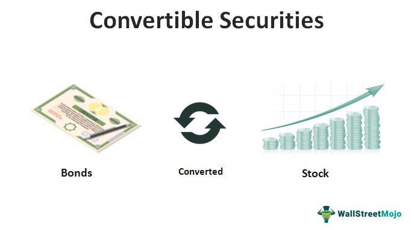

Convertible securities are a distinctive category of financial instruments that merge characteristics of both debt and equity, presenting a flexible investment option with the prospect of substantial returns. These securities grant the holder the ability to convert their investment into common stock, providing a unique opportunity to capitalize on equity appreciation while still benefiting from the stability and income typically associated with fixed-income securities.

The primary types of convertible securities are convertible bonds and convertible preferred shares. Convertible bonds are debt instruments that offer the option to convert the bond into a predetermined number of shares of the issuing company's stock. Similarly, convertible preferred shares allow investors to convert their preferred stock into common shares under specified conditions. This dual nature positions convertible securities as a versatile component of an investment portfolio, offering both regular income through interest or dividends and the potential for capital gains through conversion.



In contemporary financial markets, convertible securities have grown increasingly complex and dynamic, driven in part by advancements in trading technologies, including algorithmic trading. Algorithmic trading, which uses computer programs to execute trades at high speeds and volumes, has significantly altered the landscape for trading convertible securities. It enables more precise pricing, enhanced liquidity, and more efficient execution of trades, thus broadening the appeal and accessibility of these investment instruments.

As we examine convertible securities' role within modern financial systems, it is essential to understand their inherent strengths and limitations, as well as the factors that influence their performance. This discussion is particularly relevant in light of algorithmic trading's impact on financial markets, which has introduced new strategies and opportunities for investors seeking maximum returns with minimal risk.

## Table of Contents

## Understanding Convertible Securities

Convertible securities are financial instruments that combine characteristics of both fixed-income securities and equities. They provide the holder with the option to convert the security into a predetermined number of common stock shares, typically at specific times during the instrument's life and under specified conditions. This conversion feature distinguishes them from traditional bonds and stocks, providing a unique investment vehicle that can benefit from both stable income and potential capital appreciation.

Investors are drawn to convertible securities due to their dual capacity to generate regular income and capitalize on stock price appreciation. These securities typically offer periodic coupon payments, similar to traditional bonds, or dividends in the case of convertible preferred shares. The added potential for conversion into common stock introduces an equity-like upside, particularly advantageous when the underlying stock performs well.

#### Types of Convertible Securities

1. **Vanilla Convertibles**: These are standard convertible bonds or preferred stocks that can be converted into a specific number of common shares. The conversion is optional and can be executed at the discretion of the holder whenever it is financially advantageous, generally after a specified date.

2. **Mandatory Convertibles**: Unlike vanilla convertibles, mandatory convertibles require the holder to convert them into common stock at a specific maturity date. These usually offer higher yields to compensate for the compulsory nature of conversion.

3. **Reversible Convertibles**: These provide the issuer with the right to determine whether conversion occurs, often depending on competing interests such as managing equity dilution or taking advantage of favorable market conditions.

4. **Equity-Linked Convertibles**: These are hybrids that tie the conversion value or the terms of conversion directly to the performance of the underlying stock. They might employ cap or floor values that can correlate conversion terms to stock price fluctuations within pre-established ranges.

Mathematically, the attractiveness of convertible securities can often be modeled using the Black-Scholes option pricing model when valuing the embedded conversion option. The valuation considers the bond's coupon rate, the conversion price, the current stock price, the [volatility](/wiki/volatility-trading-strategies) of the stock price, and the time remaining until conversion. As such, investors are advised to analyze these dimensions to ascertain the financial benefit of holding the convertible security compared to traditional equity or debt holdings. 

The diversity in convertible securities allows investors to tailor their portfolios to desired risk and return profiles, aligning them with specific financial objectives and market outlooks. This flexibility underscores the importance of understanding the various convertible types, as well as the market conditions affecting their valuation and execution strategy.

## Pros of Investing in Convertible Securities

Convertible securities present an appealing investment choice for those seeking both stability and growth potential in their portfolios. One of the main advantages they offer is diversified exposure by combining elements from both the fixed-income and equity markets. This unique mix attracts investors who are interested in managing risk while pursuing higher returns.

A key benefit of convertible securities is the downside protection they provide compared to investors holding stocks alone. Convertibles typically offer regular income through interest payments on bonds or dividends from preferred shares. This income feature is beneficial in times of stock market downturns, as investors continue to receive cash flow, potentially offsetting losses from declining stock prices. The fixed-income component of convertible securities can act as a safety net, cushioning the impact of adverse equity market movements.

Moreover, the potential for capital appreciation is not lost in the prospect of downside protection. When market conditions become favorable and the underlying stock performs well, convertibles offer the advantage of conversion into common stock. This optionality allows investors to participate in price upswings, thus potentially increasing the overall value of their investment. 

Convertible securities align well with investor goals of portfolio diversification and risk management. They enable investors to balance varying levels of risk and return within their portfolios. As they have features of both bonds and stocks, convertible securities can help mitigate portfolio volatility while still offering opportunities for growth.

Additionally, the diversified nature of convertible securities means that they can contribute to a more resilient investment strategy, less prone to significant impact from any single market shock. This aligns with modern investment strategies that emphasize risk-adjusted returns over sheer profit-seeking.

In conclusion, convertible securities provide a multifaceted investment approach by offering both fixed income through regular interest or dividend payments and the possibility of equity gains through conversion features. They serve as an effective tool for investors looking to diversify and manage risk, making them a compelling option for both individual and institutional portfolios.

## Cons of Investing in Convertible Securities

Convertible securities, while offering potential benefits, come with certain drawbacks that investors must consider. One significant disadvantage arises when the underlying stock fails to perform well. In such scenarios, the conversion option may become undesirable, as the potential equity gains diminish. If the stock price remains below the conversion price, investors are unlikely to convert their securities, thus missing out on capital appreciation. This inherent risk can deter investors who are primarily interested in equity-like returns.

Additionally, convertible securities are exposed to [interest rate](/wiki/interest-rate-trading-strategies) volatility, which can adversely affect their market prices. Since these instruments have characteristics of both debt and equity, their valuation is sensitive to changes in interest rates. An increase in interest rates typically leads to a decrease in the market value of fixed-income instruments, including convertibles. This exposure to interest rate risk can lead to potential losses for investors, particularly in a rising interest rate environment.

Another drawback of convertible securities is their relatively lower [liquidity](/wiki/liquidity-risk-premium) compared to traditional stocks and bonds. Liquidity refers to the ease with which an asset can be bought or sold in the market without affecting its price. Convertible securities often have fewer buyers and sellers, which can result in wider bid-ask spreads and more significant price impacts when trades are executed. This lack of liquidity can pose challenges for investors seeking to enter or [exit](/wiki/exit-strategy) positions quickly or at favorable prices.

Overall, while convertible securities offer a hybrid investment option with features of both debt and equity, investors must carefully assess their potential downsides, including the risk of underperforming stock, interest rate sensitivity, and liquidity constraints. Understanding these cons is essential for making informed investment decisions in this complex financial instrument.

## Algorithmic Trading and Convertible Securities

Algorithmic trading has played a pivotal role in enhancing the trading dynamics of convertible securities, primarily by improving market efficiency and transparency. This advancement is largely attributed to the automation of trading processes, which minimizes human intervention and subsequently reduces the likelihood of errors and delays.

The use of algorithms in trading convertible securities has led to better pricing accuracy. Algorithms are capable of processing vast amounts of market data in real-time, allowing traders to more accurately predict price movements and identify mispricings in the market. This is particularly important in the context of convertible securities, where pricing can be complex due to their hybrid nature of possessing characteristics of both debt and equity.

Improved liquidity is another benefit brought about by [algorithmic trading](/wiki/algorithmic-trading). The ability of algorithms to execute trades quickly means that there is a greater [volume](/wiki/volume-trading-strategy) of trading activity, which enhances market depth and allows investors to buy or sell securities more efficiently. This increase in liquidity reduces the bid-ask spread, making transactions less costly for investors.

Despite these benefits, algorithmic trading introduces new complexities that require sophisticated strategies to manage. The development and maintenance of trading algorithms require expertise in both financial markets and computer programming. Furthermore, the dynamic nature of markets means that algorithms must continuously adapt to changing conditions to remain effective.

Quantitative models are crucial in identifying pricing inefficiencies and [arbitrage](/wiki/arbitrage) opportunities within convertible bonds. These models use statistical and mathematical methods to analyze historical data and predict future price movements. For instance, a common practice in convertible bond arbitrage involves the simultaneous purchase of the convertible bond and short selling of the underlying stock. This strategy aims to exploit pricing differentials between the bond's debt-like features and its equity conversion option.

Python, a popular programming language among quantitative analysts, provides tools and libraries such as NumPy and Pandas to perform complex data analysis and modeling. A basic Python code snippet for analyzing convertible bonds might involve calculating their theoretical value based on inputs such as interest rates, dividend yields, and volatility of the underlying stock. Here is an example of a simple Python code snippet that calculates the implied volatility of a convertible bond using the Black-Scholes model:

```python
from scipy.stats import norm
import numpy as np

def black_scholes_call(S, K, T, r, sigma):
    d1 = (np.log(S / K) + (r + 0.5 * sigma ** 2) * T) / (sigma * np.sqrt(T))
    d2 = d1 - sigma * np.sqrt(T)
    call_price = S * norm.cdf(d1) - K * np.exp(-r * T) * norm.cdf(d2)
    return call_price

# Example parameters
S = 100  # Current stock price
K = 100  # Strike price
T = 1    # Time to maturity (in years)
r = 0.05 # Risk-free rate
sigma = 0.2 # Volatility

price = black_scholes_call(S, K, T, r, sigma)
print("Theoretical call price: $", price)
```

In summary, algorithmic trading has revolutionized the convertible securities market by enhancing pricing accuracy and liquidity. However, the ever-evolving market conditions necessitate continuous upgrade and refinement of the trading algorithms and quantitative models employed, ensuring that they effectively leverage market inefficiencies and capitalize on arbitrage possibilities.

## Impact on Corporate Finance

Convertible securities offer a valuable mechanism for companies seeking to raise capital without immediate equity dilution, making them particularly advantageous during periods of high market volatility. The hybrid nature of these financial instruments—bearing elements of both debt and equity—enables corporations to secure financing while maintaining critical control over their capital structure.

One of the primary benefits of utilizing convertible securities is the strategic flexibility they offer in capital structure management. By issuing convertible bonds or preferred shares, companies can access capital without directly issuing new common stock, thus postponing equity dilution. This deferred dilution occurs because conversion rights typically activate at a predetermined price or after a specified period, allowing corporations to defer potentially negative impacts on share value and earnings per share (EPS).

Moreover, convertibles can play a crucial role in influencing voting control and equity positioning post-conversion. Upon conversion, these securities may increase the number of outstanding shares, potentially diluting existing shareholders' voting power. This outcome must be carefully managed by companies, particularly if maintaining stable voting control is a strategic priority. Additionally, the conversion terms can affect the equity positioning of original stakeholders, as the influx of new shareholders may alter the ownership landscape.

The issuance of convertible securities also allows firms to navigate market uncertainty effectively. During volatile periods, traditional equity issuance might be less appealing owing to depressed stock prices. Convertibles provide an alternative that balances the fixed-income characteristics of bonds with the potential upside of equity, thus attracting a broader range of investors. Furthermore, should the company's stock price appreciate substantially, conversion into equity becomes more attractive to investors, transforming a debt obligation into equity capital.

In conclusion, convertible securities offer companies a versatile tool for raising capital, enabling them to manage market volatility and capital structure dynamics strategically. By delaying equity dilution and influencing voting control, convertibles serve as a strategic asset in corporate finance, complementing traditional funding mechanisms while securing long-term growth potential.

## Conclusion

Convertible securities offer a unique combination of investment characteristics that blend the steady income of bonds with the potential growth of stocks. This dual nature makes them an appealing choice for investors seeking both security and upside potential. Notably, convertible securities provide a strategic means for investors to mitigate downside risks while maintaining exposure to equity markets. By combining debt and equity features, they present a flexible alternative to traditional stocks and bonds.

Understanding the intricacies of convertible securities is vital for both investors and issuers. Investors must evaluate not only the potential for regular income through interest or dividends but also the prospect of converting these securities into common stock, which can capitalize on equity market growth. Issuers, on the other hand, benefit from the ability to raise capital without immediate dilution of equity, a crucial consideration in fluctuating market conditions.

The landscape of convertible securities is continuously evolving, particularly with the advent of algorithmic trading. This advancement has injected a new level of efficiency and transparency into the trading of complex instruments. Algorithmic trading algorithms leverage quant models to address pricing inefficiencies, providing improved pricing accuracy and liquidity.

However, the introduction of algorithmic trading also necessitates sophisticated strategies to manage complexities, such as market volatility and liquidity concerns. For market participants, staying abreast of these evolving dynamics is paramount to leveraging the potential benefits while mitigating risks associated with convertible securities. Overall, as financial markets continue to innovate and adapt, convertible securities remain a pivotal tool in diverse investment portfolios.

## References & Further Reading

1. **Books on Convertible Securities and Pricing Strategies:**
   - *Convertible Securities: A Complete Guide to Investment and Corporate Financing Strategies* by T. J. Stack. This book covers the fundamentals and advanced techniques for analyzing and valuing convertible securities, providing detailed insight into both investment and corporate finance perspectives.
   - *Convertible Bond Markets* by Kevin D. Bretley. Focused on the dynamics of the convertible bond market, this book provides a comprehensive overview of market operations, investing strategies, and pricing methodologies.

2. **Articles on Algorithmic Trading and Its Impact on Financial Markets:**
   - "Algorithmic Trading and the Market for Convertible Bonds" by John B. Johnson, published in the *Journal of Financial Markets*. This article examines how algorithmic trading has influenced the efficiency, pricing, and liquidity of the convertible bond markets.
   - "Advancements in Quantitative Trading Models for Convertible Securities" featured in the *Financial Analysts Journal*. This article highlights the role of quantitative models in identifying arbitrage opportunities and inefficiencies in convertible securities trading.

3. **Suggested Reading for Understanding Equity Derivatives and Bond Markets:**
   - *Options, Futures, and Other Derivatives* by John C. Hull. A seminal text in derivatives markets, which provides foundational knowledge that is applicable to the risk management and pricing of convertible securities.
   - *Fixed Income Analysis* by Frank J. Fabozzi. This book offers a deep understanding of bond markets and the various instruments within, providing context useful for exploring the debt features of convertible securities.

4. **Advanced Trading Strategies and Techniques:**
   - "Quantitative Strategies for Convertible Arbitrage" by R. A. Strenk, found in the *Journal of Portfolio Management*. This paper focuses on the complex strategies used by hedge funds and institutional investors to exploit pricing inefficiencies in the convertible securities market.
   - "Python for Finance: Analyze Big Financial Data" by Yves Hilpisch. This book investigates into the application of Python programming for financial data analysis and trading strategy development, particularly useful for those interested in algorithmic trading of convertible securities.

These resources provide comprehensive reading material that spans foundational theories, market operations, and advanced trading techniques relevant to convertible securities and their interaction with modern financial markets.

