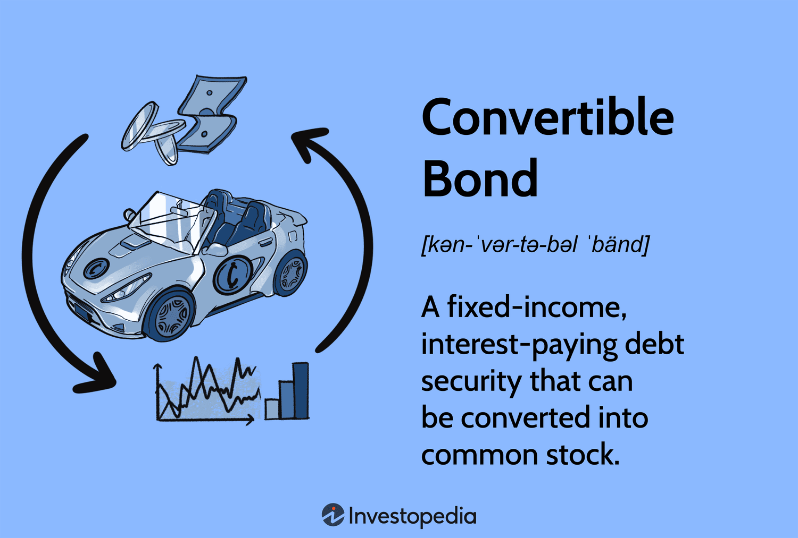

## Table of Contents

## What are convertible securities?

Convertible securities are financial instruments that can be changed into a different type of security, usually common stock. They are a type of investment that gives the holder the option to convert their holding into shares of the issuing company at a set price. This means that if the company's stock price goes up, the investor can convert their security into stock and benefit from the rise in the stock's value.

These securities are popular because they offer a mix of benefits. They can provide a steady income through interest or dividends, similar to bonds or preferred stocks. At the same time, they offer the potential for capital gains if the stock price increases. This makes them attractive to investors who want both income and the chance to profit from a company's growth.

## How do convertible securities work?

Convertible securities are like special tickets that can be turned into company shares. Imagine you have a bond or a preferred stock from a company. These are usually safe investments that give you regular payments. But with convertible securities, you have an extra choice. If the company's stock price goes up a lot, you can swap your bond or preferred stock for shares of the company. This swap happens at a price that was set when you bought the security.

Here's how it works in simple steps: You buy a convertible bond or preferred stock. It pays you interest or dividends regularly, just like a normal bond or stock. But if the company's stock price goes above the set conversion price, you can choose to convert your security into shares. If you do this, you stop getting the regular payments, but now you own part of the company. This can be a good deal if the stock keeps going up because you can sell the shares for a profit. If the stock price doesn't go up enough, you can just keep your bond or preferred stock and keep getting the regular payments.

## What are the different types of convertible securities?

Convertible securities come in different forms, but the most common ones are convertible bonds and convertible preferred stocks. A convertible bond is like a regular bond that pays you interest, but it also gives you the option to turn it into shares of the company's stock if you want. This can be a good choice if you think the company's stock price will go up a lot. On the other hand, a convertible preferred stock works a bit like a regular preferred stock, paying you dividends, but you can also convert it into common stock if the stock price gets high enough.

There's another type called mandatory convertibles. These are a bit different because you have to convert them into common stock at some point, usually after a set time. They don't give you the choice to keep the original security like the other types do. This can be good if you're sure the company will do well, but it's riskier because you can't change your mind later. So, convertible securities give you different ways to invest, depending on how much risk you want to take and what you think will happen with the company's stock price.

## What are the benefits of investing in convertible securities?

Convertible securities are a smart choice for investors because they mix the good parts of bonds and stocks. When you buy a convertible bond or preferred stock, you get regular payments like interest or dividends, which is nice because it's steady money coming in. This is great if you want something safe that gives you income. But if the company's stock price goes up a lot, you can turn your bond or preferred stock into shares of the company. This means you could make more money if the stock keeps going up, which is exciting and could lead to big profits.

Another cool thing about convertible securities is that they can help protect your money if the stock market goes down. If the stock price doesn't go up enough to make converting a good idea, you can just keep your bond or preferred stock and keep getting those regular payments. This way, you're not losing out as much as you might if you just owned the stock. So, convertible securities give you a bit of safety and a chance to make more money, making them a flexible choice for many investors.

## What are the risks associated with convertible securities?

Investing in convertible securities isn't without risks. One big risk is that if the company's stock price doesn't go up enough, you might be stuck with a bond or preferred stock that doesn't convert into shares. This means you miss out on the chance to make more money from the stock going up. Plus, if the company does badly, the value of your bond or preferred stock could go down, and you might lose money.

Another risk is that convertible securities can be complicated. They come with special rules about when and how you can convert them into stock. If you don't understand these rules, you might make a bad choice about whether to convert or not. Also, if the company's stock price goes way up, the company might decide to buy back the convertible securities before you get a chance to convert them. This can limit how much money you can make.

Lastly, there's [interest rate](/wiki/interest-rate-trading-strategies) risk. If interest rates go up, the value of your convertible bond might go down because new bonds will pay higher interest. This can be a problem if you need to sell your bond before it matures. So, while convertible securities can be a good mix of safety and potential profit, they also come with their own set of risks that you need to think about carefully.

## How do you value convertible securities?

Valuing convertible securities can be tricky because they have features of both bonds and stocks. You start by figuring out the value of the bond or preferred stock part. This means looking at the interest or dividends it pays and how safe the company is. If the company is risky, the bond part might be worth less because there's a bigger chance they won't pay you back. Then, you add the value of the option to convert it into stock. This part depends on how likely it is that the stock price will go above the conversion price. If the stock is doing well and looks like it will keep going up, this option can be worth a lot.

To get a full picture, you also need to think about other things. For example, how long you have to wait before you can convert the security can make a difference. If you have to wait a long time, the option to convert might not be worth as much because there's more time for things to go wrong. Also, if the stock price is already above the conversion price, the convertible security will be worth more because you can convert it right away and get the stock. But if the stock price is way below the conversion price, the security might be worth about the same as a regular bond or preferred stock because the chance of converting it into stock is small.

## What is the conversion ratio and how is it determined?

The conversion ratio is like a special number that tells you how many shares of the company's stock you can get for each convertible security you own. It's set when the convertible security is first issued and it helps you figure out if it's a good time to convert your bond or preferred stock into shares. For example, if the conversion ratio is 20, that means for every convertible bond or preferred stock you have, you can get 20 shares of the company's stock.

The conversion ratio is decided by the company when they create the convertible security. They look at the current stock price and decide how many shares they want to give for each bond or preferred stock. It's usually set so that the conversion price (which is the stock price divided by the conversion ratio) is higher than the current stock price. This makes sure the stock has to go up a bit before it's worth it for you to convert. If the stock price goes above this conversion price, then converting can be a good choice because you'll get more value from the shares than from keeping the bond or preferred stock.

## How does the conversion premium affect the value of convertible securities?

The conversion premium is like an extra cost you have to think about when deciding if it's a good idea to turn your convertible security into stock. It's the difference between the price you pay to convert your security into stock and the stock's current price. If the conversion premium is high, it means the stock has to go up a lot more before converting makes sense. This can make the convertible security less valuable because it's harder to make a profit from converting.

On the other hand, if the conversion premium is low, it's easier for the stock price to reach the point where converting is a good choice. This can make the convertible security more valuable because you have a better chance of making money from the stock going up. So, the conversion premium is important because it affects how much you might gain or lose when deciding whether to convert your security into stock.

## What role do convertible securities play in a company's capital structure?

Convertible securities are like special tools that companies use to raise money. When a company wants to grow or needs cash, it can sell convertible bonds or preferred stocks to investors. These securities are attractive because they offer a mix of safety and potential profit. The company gets the money it needs right away, and in return, it promises to pay interest or dividends to the investors. This can be a smart move for the company because it's a way to borrow money without immediately increasing its debt load, which can be important if the company wants to keep its credit rating good.

But there's another side to it. If the company does well and its stock price goes up, the investors might choose to convert their securities into shares. This means the company ends up issuing more stock, which can dilute the ownership of existing shareholders. However, this can also be a good thing for the company because it doesn't have to pay back the money it borrowed if the securities are converted. So, convertible securities help companies balance between getting the cash they need and managing their overall financial health.

## How do market conditions influence the performance of convertible securities?

Market conditions can really change how well convertible securities do. When the stock market is doing great and stock prices are going up, convertible securities can be a good choice. This is because if the company's stock price goes above the conversion price, investors can turn their bonds or preferred stocks into shares and make a profit. Also, when interest rates are low, convertible securities can look even better because the interest they pay might be more than what you can get from regular bonds. So, in a strong market with low interest rates, convertible securities can do well.

But if the market is not doing so well, convertible securities can be riskier. If stock prices are going down, the chance of converting into stock becomes less appealing because the stock might not be worth as much. In this case, investors might just want to keep their bonds or preferred stocks for the steady payments. Also, if interest rates go up, the value of the bond part of convertible securities can go down because new bonds will pay more interest. So, in a weak market or when interest rates are high, convertible securities might not perform as well.

## What are some advanced strategies for trading convertible securities?

One advanced strategy for trading convertible securities is called "convertible [arbitrage](/wiki/arbitrage)." This is when you buy the convertible security and at the same time, you sell short the stock of the same company. The idea is to make money from the difference between the price of the convertible security and the stock. If the stock price goes up, the convertible security goes up too, but you lose money on the short sale of the stock. If the stock price goes down, the convertible security might not go down as much because it still pays interest or dividends, and you make money on the short sale. It's a bit like a balancing act, trying to profit from small differences in prices.

Another strategy is "hedging with convertibles." This means you use convertible securities to protect other investments you have. For example, if you own a lot of a company's stock and you're worried the stock price might go down, you can buy its convertible bonds or preferred stocks. If the stock price does drop, the convertible security still gives you regular payments, which can help cushion the loss. And if the stock price goes up, you can convert the security into more stock and make a profit. It's like having a safety net that also gives you a chance to win big.

A third strategy is "sector rotation" with convertible securities. This involves moving your money into different industries depending on what's happening in the economy. If you think tech companies are going to do well, you might buy their convertible securities. If you think healthcare is the next big thing, you switch to healthcare convertibles. This way, you're not just betting on one company, but on whole sectors. Convertible securities can be a good choice for this because they give you the chance to make money from the stock going up and the safety of regular payments if things don't go as planned.

## How do convertible securities impact a company's financial statements and ratios?

When a company issues convertible securities, it affects its financial statements in a few ways. On the balance sheet, the convertible bond or preferred stock is usually listed as a liability or equity, depending on how it's set up. If it's more like a bond, it goes under liabilities. If it's more like stock, it might be counted as equity. The interest or dividends the company pays on these securities show up on the income statement as an expense, which reduces the company's net income. If the securities are converted into stock, the company's equity goes up because it issues more shares, but its liabilities go down because it doesn't have to pay back the bond or preferred stock.

Convertible securities also change some key financial ratios. For example, if the securities are counted as debt, they can make the company's debt-to-equity ratio higher, which might make the company look riskier to investors. But if they're counted as equity, this ratio might stay lower. The company's earnings per share (EPS) can also be affected. If the securities are converted into stock, more shares are out there, so each share represents a smaller piece of the company's earnings. This can make the EPS go down, which might make the stock less attractive to investors. So, convertible securities can have a big impact on how a company looks on paper.

## References & Further Reading

1. **Books on Convertible Securities and Pricing Strategies:**
   - *Convertible Securities: A Complete Guide to Investment and Corporate Financing Strategies* by T. J. Stack. This book covers the fundamentals and advanced techniques for analyzing and valuing convertible securities, providing detailed insight into both investment and corporate finance perspectives.
   - *Convertible Bond Markets* by Kevin D. Bretley. Focused on the dynamics of the convertible bond market, this book provides a comprehensive overview of market operations, investing strategies, and pricing methodologies.

2. **Articles on Algorithmic Trading and Its Impact on Financial Markets:**
   - "Algorithmic Trading and the Market for Convertible Bonds" by John B. Johnson, published in the *Journal of Financial Markets*. This article examines how algorithmic trading has influenced the efficiency, pricing, and liquidity of the convertible bond markets.
   - "Advancements in Quantitative Trading Models for Convertible Securities" featured in the *Financial Analysts Journal*. This article highlights the role of quantitative models in identifying arbitrage opportunities and inefficiencies in convertible securities trading.

3. **Suggested Reading for Understanding Equity Derivatives and Bond Markets:**
   - *Options, Futures, and Other Derivatives* by John C. Hull. A seminal text in derivatives markets, which provides foundational knowledge that is applicable to the risk management and pricing of convertible securities.
   - *Fixed Income Analysis* by Frank J. Fabozzi. This book offers a deep understanding of bond markets and the various instruments within, providing context useful for exploring the debt features of convertible securities.

4. **Advanced Trading Strategies and Techniques:**
   - "Quantitative Strategies for Convertible Arbitrage" by R. A. Strenk, found in the *Journal of Portfolio Management*. This paper focuses on the complex strategies used by hedge funds and institutional investors to exploit pricing inefficiencies in the convertible securities market.
   - "Python for Finance: Analyze Big Financial Data" by Yves Hilpisch. This book investigates into the application of Python programming for financial data analysis and trading strategy development, particularly useful for those interested in algorithmic trading of convertible securities.

These resources provide comprehensive reading material that spans foundational theories, market operations, and advanced trading techniques relevant to convertible securities and their interaction with modern financial markets.

