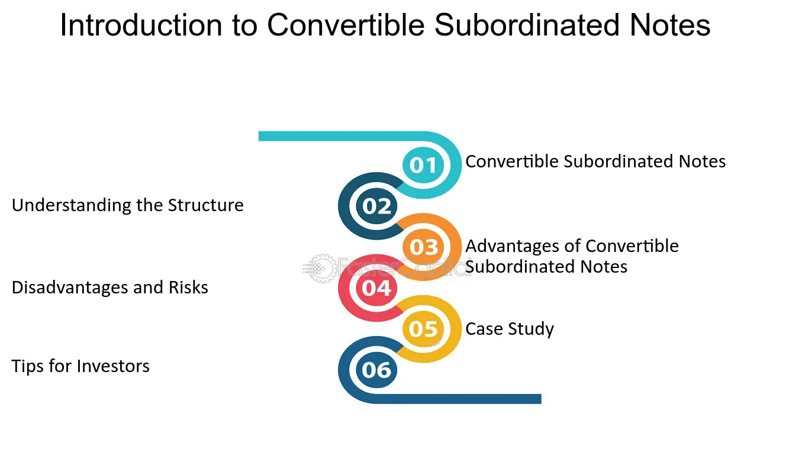

## Table of Contents

## What are Convertible Subordinated Notes?

Convertible Subordinated Notes are a type of debt that companies can issue to raise money. They are called "convertible" because they can be changed into shares of the company's stock at a later date. They are also called "subordinated" because if the company goes bankrupt, these notes get paid back after other debts. This makes them riskier than regular debt, but they often offer a higher interest rate to make up for that risk.

These notes are popular with investors who want to bet on a company's future growth. If the company does well, the investor can convert the notes into stock and benefit from the rising share price. If the company doesn't do well, the investor still gets the interest payments from the notes. This gives them a bit of protection against the company's failure. Overall, Convertible Subordinated Notes are a way for companies to raise money while giving investors a chance to share in the company's success.

## How do Convertible Subordinated Notes differ from regular bonds?

Convertible Subordinated Notes are different from regular bonds in a few important ways. First, they can be changed into the company's stock at a set price. This means if the company does well and the stock price goes up, the investor can turn their notes into stock and make more money. Regular bonds don't have this option; they just pay interest over time and then give the investor their money back at the end.

Second, Convertible Subordinated Notes are "subordinated," which means they get paid back after other debts if the company goes bankrupt. This makes them riskier than regular bonds, which are usually paid back first. Because of this extra risk, Convertible Subordinated Notes often offer a higher [interest rate](/wiki/interest-rate-trading-strategies) to make them more attractive to investors. So, while regular bonds are safer but less exciting, Convertible Subordinated Notes offer more potential reward but also more risk.

## What is the conversion feature of these notes?

The conversion feature of Convertible Subordinated Notes lets the investor turn their notes into shares of the company's stock. This happens at a special price that's decided when the notes are first issued. If the company does well and the stock price goes up a lot, the investor can use this feature to swap their notes for stock. This can be a good deal if the stock price is higher than the special conversion price.

This feature is attractive because it gives investors a chance to make more money if the company grows. If the stock price stays low, the investor can just keep the notes and get the interest payments. It's like having a safety net. The conversion feature makes these notes different from regular bonds, which don't have this option and just pay interest over time.

## Who typically issues Convertible Subordinated Notes?

Convertible Subordinated Notes are usually issued by companies that are growing fast and need money to keep growing. These companies might not be big enough to borrow money from banks easily, or they might want to avoid taking on too much regular debt. By issuing these notes, they can get the money they need without having to pay it back right away. Instead, they can offer investors the chance to turn their notes into stock if the company does well.

These notes are also popular with companies that want to give investors a bit of extra reward for taking on more risk. Since the notes are paid back after other debts if the company goes bankrupt, they are riskier than regular bonds. But they often come with a higher interest rate to make up for that risk. This makes them attractive to investors who believe in the company's future and want to share in its success.

## What are the benefits of investing in Convertible Subordinated Notes?

Investing in Convertible Subordinated Notes can be a good choice for people who want to make more money and are okay with taking some risk. These notes let you turn them into the company's stock if the stock price goes up a lot. This means you can make more money if the company does well. Plus, while you wait to see if the stock price goes up, you get to earn interest on the notes. This gives you a bit of safety because even if the stock price doesn't go up, you still get paid something.

Another benefit is that these notes often come with a higher interest rate than regular bonds. This is because they are riskier; if the company goes bankrupt, these notes get paid back after other debts. But the higher interest rate can make up for that extra risk. So, if you believe in the company and think it will do well, Convertible Subordinated Notes can be a smart way to invest your money and maybe make a bigger profit.

## What are the risks associated with Convertible Subordinated Notes?

Investing in Convertible Subordinated Notes comes with some risks. One big risk is that if the company goes bankrupt, these notes get paid back after other debts. This means you might not get your money back if the company fails. It's riskier than regular bonds because you're lower on the list to get paid.

Another risk is that the stock price might not go up enough for it to be worth turning your notes into stock. If the stock price stays low, you're stuck with the notes and their interest payments. While the interest rate is usually higher than regular bonds, it might not be enough to make up for the risk if the company doesn't do well. So, even though these notes can offer a chance for bigger rewards, they also come with a bigger chance of losing money.

## How does the subordination aspect affect the notes' priority in case of issuer bankruptcy?

When a company goes bankrupt, it has to pay back its debts in a certain order. Convertible Subordinated Notes are at the bottom of this list. This means that if the company doesn't have enough money to pay everyone, the people who own these notes will get paid after everyone else. They are "subordinated" to other debts, which makes them riskier.

Because of this lower priority, if the company goes bankrupt, there might not be any money left to pay back the Convertible Subordinated Notes. This is a big risk for investors. They might lose their investment if the company fails. But, to make up for this risk, these notes often offer a higher interest rate than regular bonds.

## What are the key terms and conditions to look for in Convertible Subordinated Notes?

When you're thinking about investing in Convertible Subordinated Notes, there are some key terms and conditions you should pay attention to. The first one is the conversion price, which is the price at which you can turn your notes into the company's stock. You want to know if this price is good compared to the current stock price. Another important term is the conversion ratio, which tells you how many shares you get for each note you convert. The interest rate is also key because it's what you earn while you wait to see if the stock price goes up enough to convert.

Another thing to look for is the maturity date, which is when the notes will be paid back if you don't convert them. You should also check the call provisions, which let the company buy back the notes before the maturity date. This can affect whether you get to keep [earning](/wiki/earning-announcement) interest or convert them into stock. Finally, understanding the subordination terms is crucial because it tells you where you stand if the company goes bankrupt. These terms and conditions will help you decide if the notes are a good investment for you.

## How is the conversion ratio determined and can it change over time?

The conversion ratio for Convertible Subordinated Notes is set when the notes are first issued. It tells you how many shares of the company's stock you get for each note you convert. This ratio is usually based on the conversion price, which is the price per share at which you can convert your notes. For example, if the conversion price is $10 and each note is worth $1,000, the conversion ratio would be 100 shares per note ($1,000 divided by $10).

The conversion ratio can change over time, but it usually doesn't change a lot. Sometimes, if the company does things like issue more stock or pay dividends, the conversion ratio might be adjusted to keep it fair for investors. But these changes are usually small and follow rules set out in the notes' terms. So, while the conversion ratio can change, it's important to know the starting ratio and any rules about how it might be adjusted when you're thinking about investing in these notes.

## What impact do interest rates have on the valuation of Convertible Subordinated Notes?

Interest rates can have a big impact on how much Convertible Subordinated Notes are worth. When interest rates go up, the value of these notes usually goes down. This is because new notes or bonds that are issued will have higher interest rates, making the older notes with lower rates less attractive to investors. So, if you want to sell your notes, you might have to do it for less money than you paid for them.

On the other hand, when interest rates go down, the value of Convertible Subordinated Notes can go up. This is because the interest rate on your notes is now higher compared to new notes being issued. This makes your notes more valuable to other investors who want to earn a higher interest rate. So, if you decide to sell your notes when interest rates are low, you might be able to get more money for them than you originally paid.

## How do Convertible Subordinated Notes fit into a broader investment strategy?

Convertible Subordinated Notes can be a good part of a broader investment strategy because they give you a mix of safety and the chance to make more money. They work like regular bonds because they pay interest over time, which can be a safe way to earn some money. But they also let you turn them into the company's stock if the stock price goes up a lot. This means you can make more money if the company does well. So, these notes can be a smart choice if you want to balance risk and reward in your investments.

In a bigger investment plan, Convertible Subordinated Notes can help you spread your money around. If you have some money in safer investments like regular bonds and some in riskier ones like stocks, adding these notes can give you a bit of both. They can protect you a little if the stock market goes down because you still get interest payments. But they also let you take part in the company's growth if the stock price goes up. This can make your overall investment strategy stronger and more flexible.

## What are some real-world examples of Convertible Subordinated Notes and their outcomes?

One famous example of Convertible Subordinated Notes is Tesla's 2014 issuance. Tesla needed money to grow, so they issued these notes. Investors could buy them and earn interest, but they also had the chance to turn them into Tesla stock if the stock price went up enough. By 2020, Tesla's stock price had gone up a lot, so many investors chose to convert their notes into stock. This was good for the investors because they made more money than if they had just kept the notes for the interest payments.

Another example is Twitter's 2014 Convertible Subordinated Notes. Twitter issued these notes to raise money for their business. Investors got to earn interest on their money, but they could also convert the notes into Twitter stock if the stock price went up. In 2022, Elon Musk bought Twitter, and the stock price changed a lot. Some investors decided to convert their notes into stock before the buyout, hoping to make more money. But others kept their notes for the interest because they thought the stock price might go down after the buyout.

## What are the characteristics and applications of subordinated debt?

Subordinated debt forms a critical layer in the capital structure of many corporations, especially in the financial industry. It is classified as junior debt, meaning it is repayable only after higher-ranked obligations (senior debt) have been satisfied in the event of a liquidation. As a result of this subordination, it carries higher risk, which is compensated by offering higher yields compared to senior debt. This distinction is crucial in terms of credit risk assessment, as the priority of claims directly influences the likelihood of debt recovery.

The yield on subordinated debt can be quantified using the yield spread over a comparable senior debt instrument. This spread reflects the additional compensation investors demand for assuming the increased risk:

$$
\text{Yield Spread} = \text{Yield}_{\text{Subordinated}} - \text{Yield}_{\text{Senior}}
$$

Subordination plays a key role in risk assessment and is often preferred when a company seeks to optimize its capital structure. Companies might opt to issue subordinated debt to manage leverage without affecting equity stakes, thus offering a strategic financial decision-making tool. From an issuer's perspective, subordinated debt can be less expensive than equity, which involves dividend obligations and potential dilution of ownership.

Investors sometimes prefer subordinated debt for its higher return potential in environments where they are willing to accept the associated risks. There are scenarios wherein subordinated debt might be favored over senior debt. For example, during periods of low-interest rates, investors seeking higher yields might gravitate toward subordinated debt despite its lower recovery prospects in default scenarios.

The impact of subordinated debt on a company's capital structure is multifaceted. It can influence the weighted average cost of capital (WACC), which is a measure of a company’s cost of capital in which each category of capital is proportionately weighted. Subordinated debt can affect the WACC through changes in the cost of debt components, given its typically higher interest rates:

$$
\text{WACC} = \left( \frac{E}{V} \times \text{Re} \right) + \left( \frac{D}{V} \times \text{Rd} \times (1 - \text{Tc}) \right)
$$

Where:
- $E$ is the market value of equity
- $V$ is the total value of equity and debt
- $\text{Re}$ is the cost of equity
- $D$ is the market value of debt
- $\text{Rd}$ is the cost of debt
- $\text{Tc}$ is the corporate tax rate

A practical case study can illustrate the strategic application of subordinated debt. Consider a mid-size company aiming to expand its operations while maintaining control in its hands. Instead of diluting equity by issuing more shares, the company issues subordinated debt. This approach keeps the equity base intact while providing the necessary capital for expansion, albeit at a higher debt cost. The use of subordinated debt in this manner is also indicative of a company's confidence in its cash flow capabilities to meet the higher debt service requirements.

In summary, subordinated debt is a versatile financial instrument that navigates the balance between risk and return, offering both companies and investors distinctive benefits within the broader capital structure framework. Understanding its role and applications allows for informed decision-making in both investment and corporate finance strategies.

## References & Further Reading

[1]: Bergstra, J., Bardenet, R., Bengio, Y., & Kégl, B. (2011). ["Algorithms for Hyper-Parameter Optimization."](https://dl.acm.org/doi/10.5555/2986459.2986743) Advances in Neural Information Processing Systems 24.

[2]: ["Advances in Financial Machine Learning"](https://www.amazon.com/Advances-Financial-Machine-Learning-Marcos/dp/1119482089) by Marcos Lopez de Prado

[3]: ["Evidence-Based Technical Analysis: Applying the Scientific Method and Statistical Inference to Trading Signals"](https://www.amazon.com/Evidence-Based-Technical-Analysis-Scientific-Statistical/dp/0470008741) by David Aronson

[4]: ["Machine Learning for Algorithmic Trading"](https://github.com/stefan-jansen/machine-learning-for-trading) by Stefan Jansen

[5]: ["Quantitative Trading: How to Build Your Own Algorithmic Trading Business"](https://www.amazon.com/Quantitative-Trading-Build-Algorithmic-Business/dp/1119800064) by Ernest P. Chan