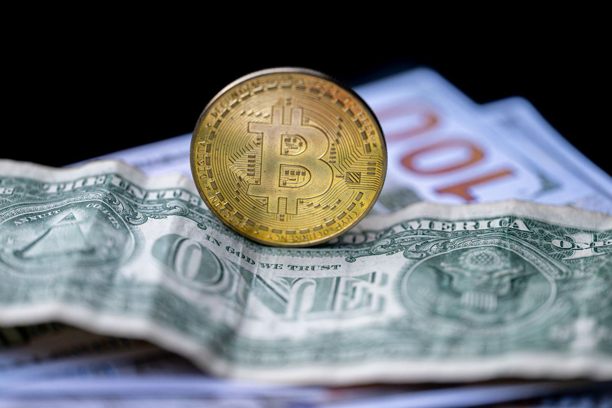

## Table of Contents

## What is a convertible virtual currency?

A convertible virtual currency is a type of digital money that can be exchanged for real money, like dollars or euros. It's different from other virtual currencies because you can trade it for something outside of its own system. For example, Bitcoin is a convertible virtual currency because you can use it to buy things or trade it for regular money.

These currencies are popular because they let people buy things online easily and quickly. But they can also be risky because their value can go up and down a lot. Governments and banks watch them closely to make sure they are used safely and legally.

## How does convertible virtual currency differ from non-convertible virtual currency?

Convertible virtual currency can be traded for real money, like dollars or euros. This means you can use it to buy things outside of its own system. For example, if you have Bitcoin, you can trade it for dollars and then use those dollars to buy a pizza. This makes convertible virtual currencies useful for buying things online and for investing.

Non-convertible virtual currency, on the other hand, can only be used within its own system. You can't trade it for real money. For example, if you have virtual coins in an online game, you can only use them to buy things inside that game. You can't take those coins and turn them into dollars to spend at a store. This limits how you can use non-convertible virtual currencies.

## Can you provide examples of convertible virtual currencies?

Bitcoin is a popular example of a convertible virtual currency. You can use Bitcoin to buy things online or trade it for real money like dollars. For example, if you want to buy a computer, you could use Bitcoin to pay for it. Or, if you think Bitcoin's value will go up, you can buy it with dollars and then sell it later for more dollars.

Another example is Ethereum. Like Bitcoin, Ethereum can be traded for real money. People use Ethereum to buy things or to invest, hoping its value will increase. Ethereum is also used for something called smart contracts, which are like digital agreements that happen automatically when certain conditions are met.

Other convertible virtual currencies include Litecoin and Ripple. Litecoin is similar to Bitcoin but works a bit faster, making it good for quick transactions. Ripple is often used by banks to move money around the world quickly and cheaply. These examples show how convertible virtual currencies can be used in different ways, from buying everyday items to helping with big financial transactions.

## What are the main uses of convertible virtual currency?

Convertible virtual currency is mainly used for buying things online. You can use it to pay for stuff like electronics, clothes, or even food. For example, if you have Bitcoin, you can go to a website that accepts Bitcoin and buy a new phone. This is handy because you don't need to use a credit card or go to a store. Plus, it's fast and can be cheaper because there are no extra fees like you might have with regular money.

Another big use is for investing. People buy convertible virtual currencies like Bitcoin or Ethereum hoping their value will go up. If it does, they can sell the currency for more money than they paid for it. This is like buying a stock or a piece of gold. But it can be risky because the value can go down too. Some people also use these currencies to send money to others around the world quickly and cheaply, which is helpful for people who need to move money across borders.

## How can someone acquire convertible virtual currency?

One way to get convertible virtual currency is by buying it. You can use real money, like dollars, to buy Bitcoin, Ethereum, or other convertible currencies. There are special websites called exchanges where you can do this. You just need to sign up, put in your bank details, and then you can buy the currency you want. It's like trading your dollars for the virtual currency. Some people also use apps on their phones to buy these currencies easily.

Another way to get convertible virtual currency is by earning it. Some people do this through a process called mining. Mining is when you use your computer to solve hard math problems, and when you solve them, you get some of the currency as a reward. It's like getting paid for doing a job. Not everyone can do this because it needs special computers and a lot of electricity. But it's one way to get convertible virtual currency without spending real money.

## What are the risks associated with using convertible virtual currency?

Using convertible virtual currency can be risky because its value can change a lot. One day, a Bitcoin might be worth a lot of money, but the next day, it could be worth much less. This makes it hard to know if you're making a good investment. If you buy a lot of Bitcoin hoping to make money, you could end up losing money if its value goes down. This kind of up-and-down movement is called volatility, and it's something to watch out for.

Another risk is that convertible virtual currency can be used for illegal activities. Because it's easy to move around and hard for banks and governments to track, some people use it to buy things they shouldn't or to hide money. This can make it risky to use because you might accidentally get involved in something illegal. Also, if you lose your virtual wallet or someone steals it, you might lose all your money and not be able to get it back. It's important to be careful and keep your virtual currency safe.

## How is the value of convertible virtual currency determined?

The value of convertible virtual currency, like Bitcoin or Ethereum, is decided by what people think it's worth. It's a bit like trading cards or stamps. If a lot of people want to buy it, the price goes up. If fewer people want it, the price goes down. This is called supply and demand. The more people who want to use or invest in the currency, the higher its value will be.

There are other things that can change the value too. News about the currency, like new laws or big companies starting to use it, can make its value go up or down. Also, how easy it is to use the currency and how safe people think it is can affect its value. If people trust it more, they might be willing to pay more for it. So, the value of convertible virtual currency can change a lot and can be hard to predict.

## What are the regulatory considerations for using convertible virtual currency?

Governments and banks keep a close eye on convertible virtual currencies like Bitcoin because they want to make sure they are used safely and legally. Different countries have different rules. Some places have strict laws that say you need to report if you are using or trading these currencies. They do this to stop people from using the currencies for illegal things like money laundering or buying things they shouldn't. If you use convertible virtual currency, you need to know the rules in your country so you don't break any laws.

Regulations can also affect how easy it is to use convertible virtual currencies. For example, some countries might make it hard to buy or sell these currencies, or they might tax them in a special way. This can make the value of the currency go up or down. It's important to keep up with the news about these rules because they can change and affect how you use or invest in convertible virtual currency.

## How do transactions with convertible virtual currency work?

When you use convertible virtual currency like Bitcoin to buy something, you send the currency from your digital wallet to the seller's digital wallet. This is done through a special network called a blockchain, which keeps track of all the transactions. To send the currency, you usually need to enter a special code or address for the seller's wallet. Once you send it, the transaction is checked by the network to make sure it's valid. If everything is okay, the currency is moved to the seller, and you get whatever you bought.

Sometimes, you might need to pay a small fee for the transaction. This fee helps keep the network running and makes sure your transaction happens quickly. The time it takes for a transaction to go through can vary. It might be just a few minutes or it could take longer, depending on how busy the network is. Once the transaction is complete, it's recorded on the blockchain and can't be changed, making it very secure.

## What are the tax implications of using convertible virtual currency?

When you use convertible virtual currency like Bitcoin, you might have to pay taxes on it. In many countries, the government sees virtual currency as property, not as regular money. So, if you buy something with Bitcoin, it's like trading one kind of property for another. If the value of the Bitcoin you used went up since you got it, you might have to pay a tax on that gain, just like you would if you sold a stock for a profit. It's important to keep track of how much your virtual currency is worth and when you use it, so you can figure out your taxes correctly.

The rules about taxes can be different in each country. Some places might tax you every time you use virtual currency, while others might only tax you when you trade it for real money. It's a good idea to check the tax laws in your country to know what you need to do. If you're not sure, talking to a tax expert can help you understand your responsibilities and make sure you're following the rules.

## How can convertible virtual currency be integrated into existing financial systems?

Convertible virtual currency can be integrated into existing financial systems by working with banks and payment services. For example, some banks now let you buy, sell, and hold virtual currencies like Bitcoin through their apps. This makes it easier for people who already use these banks to start using virtual currency. Payment services like PayPal also let you use virtual currency to buy things online, just like you would use a credit card. This helps more people and businesses start accepting virtual currency because it's connected to systems they already use.

Another way to integrate virtual currency into financial systems is by using technology that helps move money quickly and cheaply. For example, some banks use virtual currency to send money to other countries faster than they could with regular money. This can save time and money, which is good for both the banks and their customers. As more businesses and banks start using these technologies, virtual currency becomes a bigger part of the financial world, making it easier for everyone to use.

## What are the future trends and potential developments in the field of convertible virtual currency?

In the future, we might see more people using convertible virtual currency like Bitcoin for everyday things. More stores and businesses could start accepting it, making it as common as using a credit card. Governments might also create their own virtual currencies, called central bank digital currencies (CBDCs), which would be like digital versions of regular money. This could make virtual currency even more popular and trusted. Also, technology might get better, making virtual currency transactions faster and cheaper, which would help more people want to use it.

Another trend could be more ways to use virtual currency in big financial systems. Banks and big companies might use it more to move money around the world quickly and cheaply. This could change how international trade works. There might also be new rules and laws to make sure virtual currency is safe and used the right way. As more people and businesses use virtual currency, we might see new kinds of investments and ways to save money with it. The future of convertible virtual currency looks like it will keep growing and changing, making it a bigger part of our financial world.

## References & Further Reading

[1]: Nakamoto, S. (2008). ["Bitcoin: A Peer-to-Peer Electronic Cash System."](https://nakamotoinstitute.org/library/bitcoin/)

[2]: Lopez de Prado, M. (2018). ["Advances in Financial Machine Learning."](https://www.amazon.com/Advances-Financial-Machine-Learning-Marcos/dp/1119482089) Wiley.

[3]: Narayanan, A., Bonneau, J., Felten, E., Miller, A., & Goldfeder, S. (2016). ["Bitcoin and Cryptocurrency Technologies."](https://press.princeton.edu/books/hardcover/9780691171692/bitcoin-and-cryptocurrency-technologies) Princeton University Press.

[4]: Jansen, S. (2018). ["Machine Learning for Algorithmic Trading."](https://github.com/stefan-jansen/machine-learning-for-trading) Packt Publishing.

[5]: Gandal, N., & Halaburda, H. (2016). ["Can We Trust Online Marketplaces? A Field Experiment on Blockchain Technology."](https://papers.ssrn.com/sol3/papers.cfm?abstract_id=2832836) American Economic Review.

[6]: Dapp, T. (2014). ["Digital Currencies: The Ultimate Hard Power Tool?"](https://www.degruyter.com/document/doi/10.4159/9780674275980-011/html) Deutsche Bank Research.

[7]: Kharif, O. (April 2021). ["Algorithmic Crypto Trading Is Gorgeous."](https://link.springer.com/article/10.1007/s10614-020-09972-6) Bloomberg.