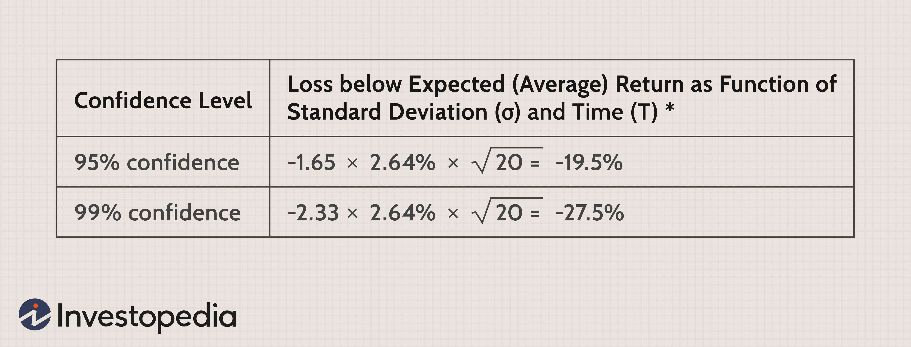

## Table of Contents

## What is Value at Risk (VaR) and why is it important in finance?

Value at Risk, often called VaR, is a way to measure how much money an investment or a portfolio might lose over a certain period of time. It tells you the maximum amount you could lose with a certain level of confidence, usually 95% or 99%. For example, if your VaR is $1 million at a 95% confidence level over one day, it means there's a 5% chance you could lose more than $1 million in a single day.

VaR is important in finance because it helps investors and financial institutions understand and manage the risks they face. By knowing the potential losses, they can make better decisions about how much risk to take on and how to protect themselves. It's like a warning system that helps them prepare for bad times, so they can keep their investments safe and stable.

## How is VaR typically calculated for a single time period?

VaR for a single time period is usually calculated using one of three main methods: the historical method, the variance-covariance method, or the Monte Carlo simulation. The historical method looks at how the value of an investment has changed in the past and uses that information to guess what might happen in the future. For example, if you want to find the VaR for the next day, you would look at how much the investment's value changed each day in the past and find the worst 5% of those changes. The biggest loss in that 5% would be your VaR.

The variance-covariance method, also called the parametric method, uses math formulas to figure out VaR. It assumes that the changes in the value of an investment follow a normal distribution, like a bell curve. By knowing the average change and how spread out the changes are, you can use a formula to calculate the VaR. This method is quick and easy but assumes that the future will be like the past, which isn't always true.

The Monte Carlo simulation method uses a computer to run many different scenarios of what might happen to the value of an investment. It randomly changes the value many times and looks at the results to find the VaR. This method can be very accurate because it can handle complex situations, but it takes a lot of computer power and time. Each of these methods has its own strengths and weaknesses, so people choose the one that fits their needs best.

## What are the common time periods used for VaR calculations?

People often use different time periods for Value at Risk (VaR) calculations, depending on what they need. One of the most common time periods is one day. This is because it helps investors see the risk of losing money in a short amount of time. Banks and other financial institutions often use a one-day VaR to manage their daily risks.

Another common time period is ten days. This is used a lot by banks when they report their risks to regulators. A ten-day VaR gives a longer view of the risk, which is helpful for planning and making sure the bank stays safe over a longer time. Both one-day and ten-day VaRs help people understand and manage their risks better.

## Why might it be necessary to convert VaR across different time periods?

Sometimes, you need to change the VaR from one time period to another. This is because different people or organizations might need to look at risk over different lengths of time. For example, a bank might need to report its risk to the government over ten days, but it might also want to know its risk each day to manage things better. By changing the VaR from one period to another, everyone can use the same numbers to make decisions and stay safe.

Changing VaR across time periods isn't always easy. You can't just multiply the daily VaR by ten to get the ten-day VaR because risk doesn't work that way. Risk can grow faster or slower over time, so you need special math to make the conversion right. This helps make sure that the numbers are correct and useful, no matter what time period you're looking at.

## What is the square root of time rule and how is it applied to VaR conversion?

The square root of time rule is a simple way to change Value at Risk (VaR) from one time period to another. It says that if you want to find the VaR for a longer time, you can take the VaR for a shorter time and multiply it by the square root of how many shorter times fit into the longer time. For example, if you know the daily VaR and you want to find the VaR for 10 days, you multiply the daily VaR by the square root of 10.

This rule works well when the changes in the value of an investment happen in a way that can be predicted, like a normal distribution. But it's not perfect because real life can be more complicated. Sometimes, the risk can grow faster or slower than the square root of time rule says, so people need to be careful and maybe use other methods too to make sure their numbers are right.

## What are the limitations of the square root of time rule in VaR conversion?

The square root of time rule is a quick and easy way to change VaR from one time period to another, but it has some problems. One big problem is that it assumes the risk grows in a very simple way, like a normal distribution. But in real life, the way risk changes can be much more complicated. Sometimes, the risk can grow much faster or slower than the square root of time rule says. This means that if you use this rule, you might not get the right number for your VaR, and that can make it hard to manage your risks well.

Another limitation is that the square root of time rule doesn't work well when there are big changes in the market or when things are very uncertain. During these times, the risk can jump around a lot, and the simple math of the square root of time rule can't keep up. So, if you're trying to figure out your VaR during a time when the market is going crazy, you might need to use a different method to get a better idea of your risk.

## How can historical simulation be used to convert VaR across time periods?

Historical simulation is a way to change VaR from one time period to another by looking at what happened in the past. If you want to find the VaR for a longer time, like 10 days, you can take the changes in value from the past and add them up over 10 days to see what could happen. For example, if you have daily changes in value for the last year, you can add up the changes over every 10-day period to see the worst losses. The biggest loss in the worst 5% of those 10-day periods would be your 10-day VaR.

This method can be more accurate than the square root of time rule because it uses real data from the past. It doesn't assume that the risk grows in a simple way, so it can handle more complicated situations. But it still has its own problems. If the past doesn't match what might happen in the future, your VaR might not be right. Also, it can take a lot of work to do all the calculations, especially if you have a lot of data to look at.

## What role does the scaling factor play in VaR conversion, and how is it determined?

The scaling [factor](/wiki/factor-investing) is a number used to change the VaR from one time period to another. It helps make sure the VaR is right for the new time period. For example, if you want to change the daily VaR to a 10-day VaR, the scaling factor tells you how much to multiply the daily VaR by. The scaling factor is important because it makes sure the VaR stays accurate when you look at different time periods.

To find the scaling factor, people often use the square root of time rule. This rule says the scaling factor is the square root of how many short periods fit into the longer period. For a 10-day VaR from a daily VaR, you would use the square root of 10, which is about 3.16. But this rule is not always perfect. Sometimes, people use other ways to find the scaling factor, like looking at past data or using more complicated math. This can make the VaR more accurate, especially when the risk doesn't grow in a simple way.

## How does the choice of distribution (e.g., normal, t-distribution) affect VaR conversion across time periods?

The choice of distribution can really change how you convert VaR from one time period to another. If you use a normal distribution, you might think that the risk grows in a simple way. This means you could use the square root of time rule to find the scaling factor. But if the real risk doesn't follow a normal distribution, your VaR might not be right. For example, if the risk grows faster than the square root of time rule says, your VaR might be too low, and you could be in for a surprise.

Using a t-distribution can help if the risk has bigger swings than a normal distribution would show. A t-distribution can handle these bigger changes better, so it might give you a more accurate VaR when you convert it across time periods. But it also makes the math more complicated. You might need a different scaling factor than the square root of time rule, and you'll need to do more calculations to get it right. This can make your VaR more accurate, but it takes more work.

## What are the advanced statistical methods used for more accurate VaR conversion across time periods?

Advanced statistical methods can help make VaR conversion across time periods more accurate. One method is using a GARCH (Generalized Autoregressive Conditional Heteroskedasticity) model. This model looks at how the risk changes over time and can handle situations where the risk grows faster or slower than the simple square root of time rule says. By using a GARCH model, you can find a better scaling factor that fits the real data better. This makes your VaR more accurate, especially when the market is going through big changes.

Another method is using a copula approach. Copulas help you understand how different investments move together. When you convert VaR across time periods, knowing how the investments are related can make a big difference. Copulas can show you these relationships in a way that simple methods can't. This can help you find a more accurate VaR for longer time periods, even when the risk doesn't grow in a simple way. Both GARCH models and copulas need more math and computer power, but they can give you a better idea of your risk.

## How can one validate the accuracy of VaR conversion methods across different time periods?

To check if the VaR conversion methods are working well across different time periods, you can use something called [backtesting](/wiki/backtesting). Backtesting means you take the VaR numbers you got from your method and see if they match what really happened in the past. For example, if your 10-day VaR said you had a 5% chance of losing more than $1 million, you would look at the past 10-day periods and see if you lost more than $1 million in 5% of those times. If it's close, your VaR conversion method is probably good. If it's way off, you might need to change how you do it.

Another way to make sure your VaR conversion is accurate is by using stress testing. Stress testing means you look at what would happen if things went really bad, like a big market crash. You take your VaR numbers and see if they still make sense when everything is going wrong. If your VaR still seems right even in these tough times, it's a good sign that your conversion method is working well. Both backtesting and stress testing help you trust your VaR numbers more, so you can manage your risks better.

## What are the industry best practices and regulatory considerations when converting VaR across time periods?

When it comes to converting VaR across time periods, the finance industry follows some best practices to make sure the numbers are right. One big rule is to use backtesting and stress testing to check if the VaR conversion is working well. Backtesting means looking at past data to see if the VaR numbers were right. Stress testing means seeing if the VaR still makes sense during really bad times, like a market crash. It's also important to use the right math, like GARCH models or copulas, to handle complicated situations better. These methods take more work, but they can make your VaR more accurate.

Regulators also have rules about how to convert VaR across time periods. They want to make sure that banks and other financial institutions are managing their risks well. For example, the Basel Committee on Banking Supervision has rules that say banks need to use a 10-day VaR when they report to regulators. This helps make sure everyone is looking at risk the same way. Regulators also want banks to explain how they convert their VaR and to show that their methods are working well. By following these rules, banks can make sure they're being safe and keeping their customers' money secure.

## What is an In-depth Look at Value at Risk (VaR)?

Value at Risk (VaR) is a widely utilized metric in financial analysis, serving the crucial role of quantifying the potential loss in value of a portfolio over a defined period under normal market conditions. It provides a statistical estimate of the maximum potential loss with a given confidence level, typically expressed as a percentage. For instance, a one-day VaR at a 95% confidence level of $1 million implies that there is only a 5% chance that the portfolio will lose more than $1 million over a single trading day.

### Mathematical Framework

VaR can be calculated using different methods, including the historical simulation, the variance-covariance approach, and Monte Carlo simulation. Each of these methods utilizes different mathematical frameworks:

1. **Historical Simulation**: This method involves revaluing the current portfolio using historical market data. The changes in portfolio value define the distribution of potential losses, from which VaR is derived. If historical returns are stored in `returns`, the VaR can be calculated in Python as follows:

   ```python
   import numpy as np

   confidence_level = 0.95
   returns = np.array([...])  # Replace with actual historical return data
   VaR = np.percentile(returns, (1 - confidence_level) * 100)
   ```

2. **Variance-Covariance Approach**: This approach assumes that portfolio returns are normally distributed. VaR is calculated using the mean (`μ`) and standard deviation (`σ`) of portfolio returns:
$$
   \text{VaR} = \mu - z \times \sigma

$$

   where $z$ is the z-score corresponding to the desired confidence level.

3. **Monte Carlo Simulation**: This method uses random sampling and statistical modeling to estimate possible future portfolio returns, requiring intensive computations to simulate a wide range of outcomes.

### Advantages and Limitations

VaR offers several advantages, including its simplicity and ease of communication to stakeholders unfamiliar with statistical models. By providing a summary measure of risk at a given confidence level, it aids in risk management decisions and regulatory compliance.

However, VaR also has notable limitations. It does not specify the extent of losses exceeding the VaR threshold, failing to capture the risk of tail events (i.e., extreme outcomes). This shortcoming is addressed by risk measures like Expected Shortfall (ES) or Conditional VaR (CVaR), which estimate the average loss beyond the VaR threshold, providing a more comprehensive view of risk.

### Comparisons with Other Risk Measurement Tools

While VaR is a popular risk measure, tools such as Expected Shortfall improve upon its limitations by accounting for the magnitude of losses in the tail of the distribution. Expected Shortfall serves as a coherent risk measure, satisfying properties like sub-additivity, which VaR lacks.

### Real-world Applications

VaR is employed across various sectors, including banking, asset management, and insurance, to assess and manage potential losses. Its practical applications range from determining capital reserves required by financial institutions, as per regulatory standards like Basel III, to internal risk management processes for investment portfolios. By integrating VaR into risk assessment frameworks, organizations can better allocate capital and hedge against unfavorable market movements.

## References & Further Reading

[1]: Hull, J. C. (2018). ["Risk Management and Financial Institutions."](https://books.google.com/books/about/Risk_Management_and_Financial_Institutio.html?id=1J1QDwAAQBAJ) Wiley.

[2]: Jorion, P. (2006). ["Value at Risk: The New Benchmark for Managing Financial Risk."](https://books.google.com/books/about/Value_at_Risk_3rd_Ed.html?id=nnblKhI7KP8C) McGraw-Hill.

[3]: Lo, A. W. (2019). ["Adaptive Markets: Financial Evolution at the Speed of Thought."](https://www.amazon.com/Adaptive-Markets-Financial-Evolution-Thought/dp/0691135142) Princeton University Press.

[4]: Aldridge, I. (2013). ["High-Frequency Trading: A Practical Guide to Algorithmic Strategies and Trading Systems."](https://www.ahmetbeyefendi.com/wp-content/uploads/2020/07/High-Frequency-Trading-Irene-Aldridge.pdf) Wiley.

[5]: Tsay, R. S. (2010). ["Analysis of Financial Time Series."](https://onlinelibrary.wiley.com/doi/book/10.1002/9780470644560) Wiley.