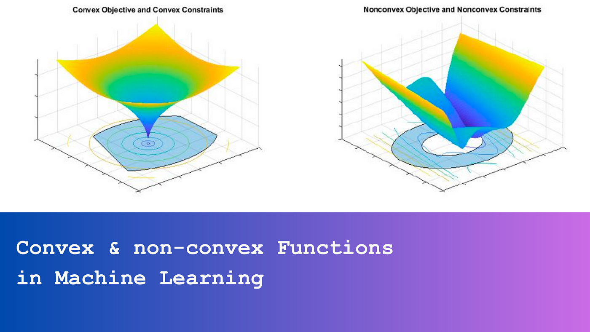

## Table of Contents

## What is a convex function in the context of machine learning?

A convex function is a special type of function that's really useful in machine learning. Imagine you have a bowl that curves upwards. If you roll a marble in it, the marble will always roll down to the bottom, no matter where you start it from. That's kind of what a convex function looks like. Mathematically, a function $$ f $$ is convex if for any two points $$ x $$ and $$ y $$ in its domain, and for any $$ t $$ between 0 and 1, the following inequality holds: $$ f(t x + (1-t) y) \leq t f(x) + (1-t) f(y) $$. This means that the line segment connecting any two points on the graph of the function lies above or on the graph itself.

In machine learning, convex functions are important because they make optimization problems easier to solve. When you're trying to train a model, you often need to minimize a loss function. If the loss function is convex, you can be sure that any local minimum you find is also the global minimum. This makes algorithms like gradient descent more reliable and efficient. For example, when training a linear regression model, the mean squared error loss function is convex, which helps ensure that the optimization process will converge to the best solution.

## Why are convex functions important in machine learning optimization?

Convex functions are important in machine learning optimization because they make the process of finding the best solution easier and more reliable. When you're trying to train a model, you often need to minimize a loss function. If this loss function is convex, any local minimum you find is also the global minimum. This means that optimization algorithms like gradient descent will always lead you to the best solution, no matter where you start. This is crucial because it simplifies the training process and ensures that the model performs as well as possible.

In practical terms, convex functions help avoid getting stuck in local minima, which can happen with non-convex functions. For example, in linear regression, the mean squared error loss function $$ \text{MSE} = \frac{1}{n} \sum_{i=1}^{n} (y_i - \hat{y}_i)^2 $$ is convex. This means that when you use gradient descent to minimize this loss, you're guaranteed to find the best set of parameters for your model. This reliability is a big reason why convex optimization is favored in many machine learning applications, as it makes the training process more efficient and the results more trustworthy.

## How can you identify if a function is convex?

To identify if a function is convex, you can use a few different methods. One simple way is to look at the function's graph. If the graph looks like a bowl that curves upwards, and any line you draw between two points on the graph stays above or touches the graph, then the function is convex. Another way is to check the function's second derivative. If the second derivative is always positive or zero for all points in the function's domain, then the function is convex. This is because a positive second derivative means the function is curving upwards everywhere.

For more technical methods, you can use the definition of convexity directly. A function $$ f $$ is convex if for any two points $$ x $$ and $$ y $$ in its domain, and for any number $$ t $$ between 0 and 1, the following inequality holds: $$ f(t x + (1-t) y) \leq t f(x) + (1-t) f(y) $$. This means that the function value at any point between $$ x $$ and $$ y $$ is less than or equal to the weighted average of the function values at $$ x $$ and $$ y $$. If you can prove this inequality for your function, then it's convex.

In practice, you might use software or libraries to help identify convexity. For example, in Python, you can use libraries like `cvxpy` to model and solve convex optimization problems. Here's a simple example of how you might check if a function is convex using `cvxpy`:

```python
import cvxpy as cp
import numpy as np

# Define the function
def f(x):
    return x**2

# Create a variable
x = cp.Variable()

# Define the function in cvxpy
f_cvx = cp.square(x)

# Check if the function is convex
problem = cp.Problem(cp.Minimize(f_cvx), [x >= -10, x <= 10])
problem.solve()

# If the solver finds a solution, the function is likely convex
if problem.status == cp.OPTIMAL:
    print("The function appears to be convex.")
else:
    print("The function may not be convex.")
```

This code checks if the function $$ f(x) = x^2 $$ is convex by trying to minimize it within a certain range. If the solver finds an optimal solution, it suggests the function is convex.

## What is the difference between convex and non-convex functions?

A convex function is like a bowl that curves upwards. If you take any two points on the graph of a convex function and draw a line between them, that line will always stay above or touch the graph. Mathematically, a function $$ f $$ is convex if for any two points $$ x $$ and $$ y $$ in its domain, and any number $$ t $$ between 0 and 1, the inequality $$ f(t x + (1-t) y) \leq t f(x) + (1-t) f(y) $$ holds. This property makes convex functions really useful in [machine learning](/wiki/machine-learning) because when you're trying to find the lowest point on the graph (which is often what you want to do when training a model), you know that any low point you find is the lowest point there is.

A non-convex function, on the other hand, can have all sorts of shapes. It might have multiple dips and bumps, like a mountain range. If you draw a line between two points on the graph of a non-convex function, that line might go below the graph in some places. This means that when you're trying to find the lowest point on a non-convex function, you might find a low spot that isn't actually the lowest spot overall. This can make training machine learning models trickier because algorithms like gradient descent might get stuck in these "local minima" instead of finding the true "global minimum."

## Can you explain the concept of a convex optimization problem?

A convex optimization problem is a type of math problem where you want to find the best solution to something, like minimizing a cost or maximizing a benefit, but with a special twist. The twist is that the function you're working with is convex, which means it looks like a bowl that curves upwards. If you imagine rolling a marble in this bowl, no matter where you start, the marble will always roll down to the bottom. Mathematically, this means that for any two points $$ x $$ and $$ y $$ in the function's domain, and for any number $$ t $$ between 0 and 1, the function value at the point in between them, $$ f(t x + (1-t) y) $$, is less than or equal to the weighted average of the function values at $$ x $$ and $$ y $$, or $$ t f(x) + (1-t) f(y) $$. This property makes it easier to find the best solution because any low point you find on the function is the lowest point there is.

In the context of machine learning, convex optimization problems are really helpful. When you're training a model, you often want to minimize something called a "loss function," which measures how bad your model's predictions are. If this loss function is convex, it means that when you use algorithms like gradient descent to find the lowest point on the loss function, you're guaranteed to find the best solution. This makes the training process more reliable and efficient. For example, in linear regression, the mean squared error loss function is convex, so when you use gradient descent to minimize it, you'll find the best set of parameters for your model. This reliability is a big reason why convex optimization is favored in many machine learning applications.

## How does convexity affect the convergence of gradient descent?

Convexity makes gradient descent work better and faster. When a function is convex, it looks like a bowl that curves upwards. If you imagine rolling a marble in this bowl, no matter where you start, the marble will always roll down to the bottom. In the same way, when you use gradient descent on a convex function, it will always move towards the lowest point, no matter where you start. This means that you're guaranteed to find the best solution, which is the global minimum of the function. This is really helpful in machine learning because it makes training models more reliable and efficient.

If the function is not convex, it can have multiple dips and bumps, like a mountain range. In this case, gradient descent might get stuck in one of these dips, which are called local minima. A local minimum is a low spot, but it's not the lowest spot overall. This can make it hard to find the best solution because gradient descent might stop at a local minimum instead of finding the global minimum. So, when you're working with a convex function, you don't have to worry about getting stuck in local minima, which makes the optimization process much easier and more predictable.

## What are some common convex functions used in machine learning?

In machine learning, some common convex functions are used to help train models. One of the most common is the mean squared error (MSE) function, which is used in linear regression. The MSE function measures how far off your model's predictions are from the actual values. It's calculated as $$ \text{MSE} = \frac{1}{n} \sum_{i=1}^{n} (y_i - \hat{y}_i)^2 $$, where $$ y_i $$ is the actual value, $$ \hat{y}_i $$ is the predicted value, and $$ n $$ is the number of data points. Because the MSE function is convex, when you use gradient descent to minimize it, you're guaranteed to find the best set of parameters for your model.

Another common convex function is the logistic loss function, which is used in logistic regression for binary classification problems. The logistic loss function is defined as $$ \text{Logistic Loss} = -\frac{1}{n} \sum_{i=1}^{n} [y_i \log(\hat{y}_i) + (1 - y_i) \log(1 - \hat{y}_i)] $$, where $$ y_i $$ is the true label (0 or 1), and $$ \hat{y}_i $$ is the predicted probability of the positive class. Like the MSE function, the logistic loss function is convex, which means that gradient descent will always find the global minimum, making the training process reliable and efficient.

## How do convex functions help in ensuring global optimality in machine learning models?

Convex functions help ensure global optimality in machine learning models because they have a special property: any low point you find on a convex function is the lowest point there is. Imagine you're rolling a marble in a bowl that curves upwards. No matter where you start the marble, it will always roll down to the bottom of the bowl. In the same way, when you use algorithms like gradient descent to find the lowest point on a convex function, you're guaranteed to find the best solution, which is the global minimum. This makes training machine learning models more reliable and efficient because you don't have to worry about getting stuck in local minima, which are low spots that aren't the lowest spot overall.

In machine learning, this property is really helpful when you're trying to minimize a loss function, which measures how bad your model's predictions are. For example, in linear regression, the mean squared error (MSE) loss function $$ \text{MSE} = \frac{1}{n} \sum_{i=1}^{n} (y_i - \hat{y}_i)^2 $$ is convex. When you use gradient descent to minimize this loss function, you know you'll find the best set of parameters for your model. This reliability is a big reason why convex optimization is favored in many machine learning applications, as it makes the training process more efficient and the results more trustworthy.

## Can you discuss any algorithms specifically designed for convex optimization in machine learning?

One common algorithm for convex optimization in machine learning is gradient descent. This method works by taking steps in the direction of the steepest descent of the loss function. Imagine you're trying to get to the bottom of a hill as quickly as possible. You'd want to walk directly downhill, and that's what gradient descent does. It calculates the gradient of the loss function, which tells you the direction to move to reduce the loss the most. For convex functions, like the mean squared error $$ \text{MSE} = \frac{1}{n} \sum_{i=1}^{n} (y_i - \hat{y}_i)^2 $$ used in linear regression, gradient descent is guaranteed to find the global minimum, making it a reliable choice for training models.

Another algorithm specifically designed for convex optimization is the interior-point method. This method is often used to solve more complex convex optimization problems, like those with constraints. Instead of moving directly downhill like gradient descent, the interior-point method navigates through the interior of the feasible region, gradually approaching the optimal solution. It's particularly useful for problems where you need to satisfy certain conditions, such as in support vector machines (SVMs), where you might want to maximize the margin while keeping the data points correctly classified. Both gradient descent and the interior-point method take advantage of the convexity of the functions to ensure they find the best solution efficiently and reliably.

## What challenges arise when dealing with non-convex functions in machine learning?

When dealing with non-convex functions in machine learning, one big challenge is the risk of getting stuck in local minima. Non-convex functions can have many dips and bumps, like a mountain range. If you use algorithms like gradient descent to find the lowest point, you might end up in one of these dips, which is a local minimum, instead of finding the true lowest point, or the global minimum. This can make it hard to train a model that performs as well as possible because you might settle for a solution that's not the best one overall.

Another challenge with non-convex functions is that they can make the optimization process slower and less predictable. Because the function's shape can be complex, algorithms might need to try many different starting points and paths to find the global minimum. This can take a lot of time and computational power. For example, in neural networks, which often use non-convex loss functions like the cross-entropy loss $$ \text{Cross-Entropy Loss} = -\frac{1}{n} \sum_{i=1}^{n} [y_i \log(\hat{y}_i) + (1 - y_i) \log(1 - \hat{y}_i)] $$, you might need to use techniques like stochastic gradient descent with different learning rates or even more advanced methods like simulated annealing to improve your chances of finding the best solution.

## How can regularization techniques be applied to convex functions in machine learning?

Regularization techniques help prevent machine learning models from overfitting by adding a penalty to the loss function. When you're working with convex functions, like in linear regression where the mean squared error (MSE) $$ \text{MSE} = \frac{1}{n} \sum_{i=1}^{n} (y_i - \hat{y}_i)^2 $$ is used, you can add regularization to make the function even more convex. This makes it easier to find the best solution because the function becomes smoother and less likely to fit the noise in the data. For example, in L2 regularization, you add a term to the loss function that's proportional to the square of the model's parameters, which is $$ \text{L2 Regularized Loss} = \text{MSE} + \lambda \sum_{j=1}^{p} \theta_j^2 $$, where $$ \lambda $$ is a hyperparameter that controls the strength of the regularization, and $$ \theta_j $$ are the model's parameters.

In practice, applying regularization to convex functions can be done easily with many machine learning libraries. For instance, in Python using scikit-learn, you can use the `Ridge` class for L2 regularization in linear regression. Here's a simple example of how you might set up a regularized linear regression model:

```python
from sklearn.linear_model import Ridge
from sklearn.datasets import make_regression
from sklearn.model_selection import train_test_split

# Generate some data
X, y = make_regression(n_samples=100, n_features=1, noise=0.1, random_state=42)

# Split the data into training and testing sets
X_train, X_test, y_train, y_test = train_test_split(X, y, test_size=0.2, random_state=42)

# Create and fit the model with L2 regularization
model = Ridge(alpha=1.0)  # alpha is the same as lambda in the formula
model.fit(X_train, y_train)

# Make predictions
y_pred = model.predict(X_test)
```

This code shows how to set up a linear regression model with L2 regularization, which helps keep the model's parameters small and prevents overfitting. By using regularization with convex functions, you can make your machine learning models more robust and reliable.

## What are the advanced mathematical properties of convex functions that impact machine learning applications?

Convex functions have some special properties that make them really useful in machine learning. One important property is that the set of points where a convex function reaches its minimum value, called the "argmin" set, is always convex. This means that if you find two points where the function is at its lowest, any point in between those two points will also be at the lowest value. This property makes optimization easier because you know that once you find a low point, you can be sure it's the lowest point overall. For example, in linear regression, the mean squared error (MSE) function $$ \text{MSE} = \frac{1}{n} \sum_{i=1}^{n} (y_i - \hat{y}_i)^2 $$ is convex, so when you use algorithms like gradient descent to minimize it, you're guaranteed to find the best set of parameters for your model.

Another key property of convex functions is that they are closed under certain operations. This means that if you take two convex functions and add them together, the result is also a convex function. Similarly, if you take a convex function and multiply it by a positive scalar, the result is still convex. This property is helpful in machine learning because it lets you combine different loss functions or add regularization terms without worrying about losing the convexity that makes optimization easier. For instance, adding an L2 regularization term to the MSE loss function, like $$ \text{L2 Regularized Loss} = \text{MSE} + \lambda \sum_{j=1}^{p} \theta_j^2 $$, keeps the function convex, which helps in finding the best model parameters more reliably.

## References & Further Reading

[1]: Boyd, S., & Vandenberghe, L. (2004). ["Convex Optimization."](https://web.stanford.edu/~boyd/cvxbook/) Cambridge University Press.

[2]: Nesterov, Y. (2004). ["Introductory Lectures on Convex Optimization: A Basic Course."](https://link.springer.com/book/10.1007/978-1-4419-8853-9) Springer Science & Business Media.

[3]: Hastie, T., Tibshirani, R., & Friedman, J. (2009). ["The Elements of Statistical Learning: Data Mining, Inference, and Prediction."](https://link.springer.com/book/10.1007/978-0-387-84858-7) Springer.

[4]: Murphy, K. P. (2012). ["Machine Learning: A Probabilistic Perspective."](https://www.cs.ubc.ca/~murphyk/MLbook/pml-toc-1may12.pdf) The MIT Press.

[5]: Rasmussen, C. E., & Williams, C. K. I. (2006). ["Gaussian Processes for Machine Learning."](https://direct.mit.edu/books/monograph/2320/Gaussian-Processes-for-Machine-Learning) MIT Press. 

[6]: Recht, B., Fazel, M., & Parrilo, P. A. (2010). ["Guaranteed Minimum-Rank Solutions of Linear Matrix Equations via Nuclear Norm Minimization."](https://arxiv.org/abs/0706.4138) SIAM Review.

[7]: Boyd, S., Parikh, N., Chu, E., Peleato, B., & Eckstein, J. (2011). ["Distributed Optimization and Statistical Learning via the Alternating Direction Method of Multipliers."](https://web.stanford.edu/~boyd/papers/pdf/admm_distr_stats.pdf) Foundations and Trends in Machine Learning.