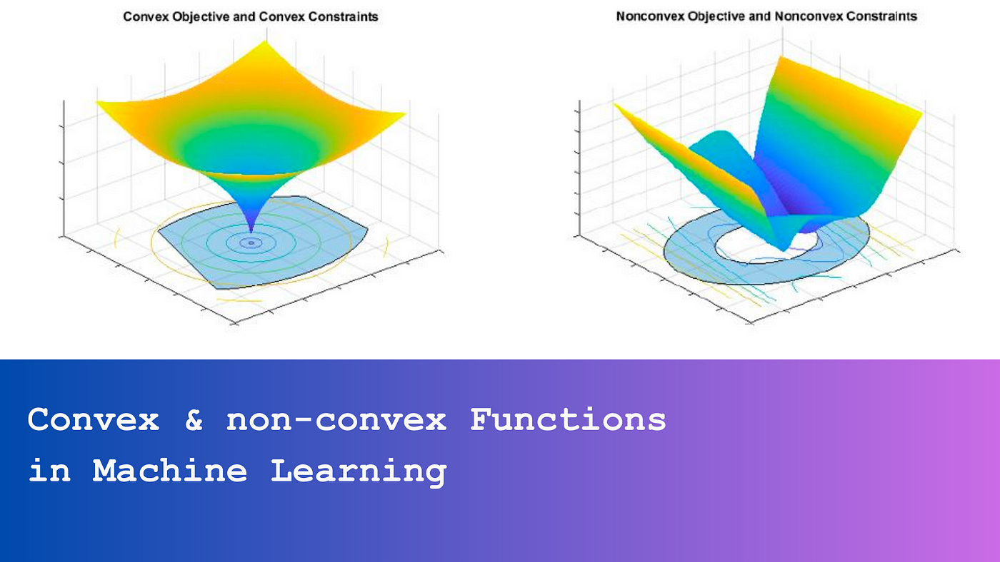

## Table of Contents

## What is a convex set in the context of machine learning?

In machine learning, a convex set is a special type of set where, if you pick any two points inside the set and draw a straight line between them, the entire line will also be inside the set. Think of it like a round bowl; no matter which two points you choose inside the bowl, the line connecting them will not go outside the bowl.

This concept is important in machine learning because many optimization algorithms work better with convex sets. For example, when training a model, we often try to minimize a cost function. If the set of possible solutions forms a convex set, we can be sure that any local minimum we find is also the global minimum, making the optimization process more reliable and efficient.

## How do convex sets relate to optimization problems in machine learning?

Convex sets are really helpful in solving optimization problems in machine learning. When we want to train a model, we often look for the best solution by trying to minimize a cost function. If the set of possible solutions is convex, it means that any straight line connecting two points inside this set will stay inside the set. This property makes optimization easier because if we find a point that seems to be the lowest point (a local minimum) in the cost function, we can be sure it's also the lowest point overall (the global minimum). This is because in a convex set, there are no "valleys" or "hills" that could trap us in a local minimum that isn't the best solution.

For example, when we use gradient descent to minimize a cost function, the path we take to find the minimum is much more straightforward if the function is convex. Imagine you're trying to roll a ball to the lowest point on a surface. If the surface is convex, like the inside of a bowl, the ball will always roll to the very bottom no matter where you start it. But if the surface has bumps and dips, the ball might get stuck in a dip that isn't the lowest point. In machine learning, this means that using convex optimization techniques, like solving $$ \min_{x \in \mathbb{R}^n} f(x) $$ where $$ f $$ is a convex function, can make our algorithms more reliable and efficient in finding the best model parameters.

## Can you explain the concept of convexity and its importance in machine learning algorithms?

Convexity is a key idea in math and [machine learning](/wiki/machine-learning). Imagine you have a set of points, and you draw a straight line between any two points in that set. If the entire line stays inside the set, then that set is called convex. It's like having a round bowl where any line you draw between two points inside the bowl will not go outside the bowl. In machine learning, we often deal with functions that we want to minimize, like a cost function that tells us how well our model is doing. If this function is convex, it means that any local minimum we find is also the global minimum, making it easier to find the best solution.

The importance of convexity in machine learning algorithms cannot be overstated. When we're trying to train a model, we often use optimization techniques like gradient descent to find the lowest point of a function. If the function we're working with is convex, like $$ f(x) $$, then gradient descent will always lead us to the global minimum, no matter where we start. This makes our algorithms more reliable and efficient because we don't have to worry about getting stuck in a local minimum that isn't the best solution. Convex optimization helps us find the best model parameters quickly and confidently, which is crucial for building accurate and effective machine learning models.

## What are some examples of convex functions used in machine learning?

In machine learning, one common example of a convex function is the squared error loss function, often used in linear regression. If you have a model that predicts values and you want to measure how far off these predictions are from the actual values, you can use the squared error. The formula for this is $$ L(y, \hat{y}) = (y - \hat{y})^2 $$, where $$ y $$ is the actual value and $$ \hat{y} $$ is the predicted value. Because this function forms a bowl shape, any line you draw between two points on this function will stay on or above the function, making it convex. This property helps algorithms like gradient descent find the best model parameters efficiently.

Another example is the logistic loss function, used in logistic regression for classification problems. The logistic loss function is given by $$ L(y, \hat{y}) = -y \log(\hat{y}) - (1-y) \log(1-\hat{y}) $$, where $$ y $$ is the true label (0 or 1) and $$ \hat{y} $$ is the predicted probability of the positive class. This function is also convex, meaning that any local minimum found by an optimization algorithm will be the global minimum. This makes it easier to train models that classify data into different categories, like spam or not spam, by finding the best way to separate the data.

These convex functions are crucial because they make the optimization process in machine learning more reliable. When you're trying to find the best model, you want to be sure that the solution you find is the best one possible. Convex functions help ensure that, making them a fundamental part of many machine learning algorithms.

## How does the convexity of a set affect the convergence of optimization algorithms?

Convexity of a set plays a big role in how quickly and reliably optimization algorithms can find the best solution. When the set of possible solutions is convex, it means that if you draw a straight line between any two points in the set, the entire line stays inside the set. This property is helpful because it ensures that any local minimum found by an optimization algorithm, like gradient descent, is also the global minimum. Imagine rolling a ball down a hill; if the hill is shaped like a bowl (convex), the ball will always roll to the very bottom no matter where you start it. This makes the process of finding the best solution much easier and more reliable because you don't have to worry about getting stuck in a spot that isn't the lowest point.

In machine learning, this means that when we're trying to train a model by minimizing a cost function, using a convex function like $$ L(y, \hat{y}) = (y - \hat{y})^2 $$ for linear regression or $$ L(y, \hat{y}) = -y \log(\hat{y}) - (1-y) \log(1-\hat{y}) $$ for logistic regression, the optimization algorithm can find the best model parameters more efficiently. These convex functions form a shape where any line between two points on the function stays on or above the function, ensuring that the algorithm can always find the global minimum. This reliability is crucial for building accurate models because it means that the solution found will be the best one possible, making the training process more effective and trustworthy.

## What is the difference between a convex hull and a convex set in machine learning?

In machine learning, a convex set is a collection of points where any line you draw between two points inside the set stays completely within the set. It's like a round bowl where no matter which two points you pick, the line between them doesn't go outside the bowl. This is important because it helps optimization algorithms find the best solution easily. For example, if we're trying to minimize a cost function like $$ L(y, \hat{y}) = (y - \hat{y})^2 $$ in linear regression, the set of possible solutions is convex, making it easier to find the best model parameters.

A convex hull, on the other hand, is the smallest convex set that can contain a given set of points. Think of it like wrapping a rubber band around a bunch of points; the shape the rubber band makes is the convex hull. In machine learning, the convex hull can be used to find the boundary of a set of data points, which can help in tasks like clustering or classification. For instance, if you have a bunch of data points representing different classes, the convex hull can help you see the overall shape of each class and how they relate to each other.

## How can convex sets be used to understand the decision boundaries in classification problems?

In classification problems, convex sets can help us understand where the decision boundaries are. A decision boundary is like a line or a surface that separates different classes of data. If we have data points representing different classes, we can use the concept of convex sets to find the smallest convex shape that can contain all the points in each class. This shape is called the convex hull. By looking at the convex hulls of different classes, we can see where they overlap or where they are separate, which helps us figure out where to draw the decision boundary.

For example, imagine you have two classes of data points, one for cats and one for dogs. If you draw the convex hull around all the cat points and another around all the dog points, you can see if these hulls overlap or if there's a clear gap between them. If there's a gap, you can draw a decision boundary right in the middle of that gap. If they overlap, you might need to find a more complex way to separate the classes, like using a curved line or a plane. Understanding the convex hulls helps us visualize and decide on the best way to classify new data points accurately.

## What are the challenges of working with non-convex sets in machine learning?

Working with non-convex sets in machine learning can make things tricky. When a set is non-convex, it means that if you draw a line between two points in the set, that line might go outside the set. This can cause problems when we're trying to find the best solution using optimization algorithms like gradient descent. In a non-convex set, there can be many local minimums, which are spots that look like the lowest point but aren't the best overall. This means that if we start our algorithm in the wrong place, we might end up stuck at a local minimum instead of finding the global minimum, which is the best solution we're looking for.

To deal with non-convex sets, we often need to use more advanced optimization techniques. These techniques might involve trying out different starting points to see if we can find a better solution, or using methods that can "jump" out of local minimums to keep searching for the global minimum. For example, algorithms like simulated annealing or genetic algorithms are designed to handle these situations. Even with these advanced methods, working with non-convex sets can still be slower and less reliable than working with convex sets, where finding the best solution is much easier and more straightforward.

## How do convex optimization techniques improve the training of machine learning models?

Convex optimization techniques make training machine learning models easier and more reliable. When we train a model, we often want to minimize a cost function like $$ L(y, \hat{y}) = (y - \hat{y})^2 $$ for linear regression. If this function is convex, it means that any local minimum we find is also the global minimum. Imagine rolling a ball down a hill; if the hill is shaped like a bowl, the ball will always roll to the very bottom no matter where you start it. This makes it simpler for algorithms like gradient descent to find the best model parameters because they don't have to worry about getting stuck in a spot that isn't the lowest point.

However, working with non-convex sets can be tricky because they have many local minimums. These are spots that look like the lowest point but aren't the best overall solution. If we start our algorithm in the wrong place, it might get stuck at a local minimum instead of finding the global minimum. To handle non-convex sets, we need more advanced optimization techniques like simulated annealing or genetic algorithms. These methods can help us escape local minimums and keep searching for the best solution, but they can make the training process slower and less reliable than when working with convex sets.

## Can you discuss the role of convex sets in the theory of support vector machines?

In the theory of support vector machines (SVMs), convex sets play a key role in finding the best way to separate different classes of data. An SVM tries to find the widest possible gap between two classes by drawing a line or a hyperplane. The region around this line where there are no data points is called the margin. The goal is to make this margin as wide as possible because a wider margin usually means better separation and better performance on new data. The set of all possible hyperplanes that can separate the classes forms a convex set, which helps the SVM algorithm find the best hyperplane efficiently. If the set were non-convex, finding the best hyperplane would be much harder because the algorithm could get stuck in a local minimum that isn't the best solution.

To find the best hyperplane, SVMs use a convex optimization problem. This problem is usually formulated as minimizing a function like $$ \frac{1}{2} \|w\|^2 $$ subject to constraints that ensure the hyperplane correctly separates the classes. The function $$ \frac{1}{2} \|w\|^2 $$ is convex, which means that any local minimum found by the optimization algorithm will be the global minimum. This convexity makes the optimization process reliable and efficient, ensuring that the SVM can find the hyperplane with the widest margin. Because of this, SVMs can effectively handle classification tasks, even with complex data, by leveraging the properties of convex sets and optimization.

## What advanced techniques exist for handling non-convex optimization problems in machine learning?

When dealing with non-convex optimization problems in machine learning, we often need to use special techniques because the usual methods like gradient descent can get stuck at local minimums instead of finding the best solution. One way to handle this is by using simulated annealing. This technique starts with a high "temperature" and slowly cools down, allowing the algorithm to explore different solutions and escape local minimums. As the temperature drops, the algorithm focuses more on finding the best solution. Another method is genetic algorithms, which mimic natural selection. They start with a population of solutions, then use operations like crossover and mutation to create new solutions. The best solutions are kept and used to create the next generation, helping to find the global minimum over time.

Stochastic gradient descent (SGD) with [momentum](/wiki/momentum) is another advanced technique. It adds a "momentum" term to the update rule, which helps the algorithm move past local minimums by keeping some memory of past updates. This can help the algorithm climb out of shallow local minimums and continue searching for the global minimum. Additionally, techniques like particle swarm optimization can be used, where a group of "particles" move around the solution space, influenced by their own best-known position and the best-known positions of other particles. This collective movement can help find the global minimum in non-convex spaces. All these methods aim to navigate the challenges of non-convex optimization, making it more likely to find the best solution in machine learning problems.

## How do recent research developments utilize convex sets to enhance deep learning models?

Recent research in [deep learning](/wiki/deep-learning) has found new ways to use convex sets to make models work better. One way is by using convex optimization to help train neural networks. Deep learning models often have lots of layers and parameters, which can make them hard to train because the optimization problem is not convex. But researchers have found that by breaking down the problem into smaller, convex parts, they can use convex optimization techniques to make training faster and more reliable. For example, some methods use a convex surrogate loss function, like $$ L(y, \hat{y}) = (y - \hat{y})^2 $$, to help guide the training process. This can help the model learn better and avoid getting stuck at local minimums.

Another way researchers are using convex sets is to improve the robustness of deep learning models. By adding constraints that form convex sets, they can make sure the model stays within a safe space during training. This can help the model be more stable and less likely to make big mistakes. For example, some methods add a convex regularization term to the loss function to keep the model's parameters from getting too big or too small. This can help the model generalize better to new data and be more reliable in real-world situations. By using convex sets in these ways, researchers are finding new ways to make deep learning models more powerful and easier to train.

## References & Further Reading

[1]: Boyd, S., & Vandenberghe, L. (2004). ["Convex Optimization."](https://web.stanford.edu/~boyd/cvxbook/) Cambridge University Press.

[2]: Nesterov, Y. (2004). ["Introductory Lectures on Convex Optimization: A Basic Course."](https://link.springer.com/book/10.1007/978-1-4419-8853-9) Kluwer Academic Publishers.

[3]: Shalev-Shwartz, S., & Ben-David, S. (2014). ["Understanding Machine Learning: From Theory to Algorithms."](https://assets.cambridge.org/97811070/57135/frontmatter/9781107057135_frontmatter.pdf) Cambridge University Press.

[4]: Hastie, T., Tibshirani, R., & Friedman, J. (2009). ["The Elements of Statistical Learning: Data Mining, Inference, and Prediction."](https://link.springer.com/book/10.1007/978-0-387-84858-7) Springer. 

[5]: Goodfellow, I., Bengio, Y., & Courville, A. (2016). ["Deep Learning."](https://www.deeplearningbook.org/) MIT Press.

[6]: Mangasarian, O. L. (1994). ["Nonlinear Programming."](https://epubs.siam.org/doi/book/10.1137/1.9781611971255) McGraw-Hill. 

[7]: Bubeck, S. (2015). ["Convex Optimization: Algorithms and Complexity."](https://arxiv.org/abs/1405.4980) Foundations and Trends® in Machine Learning, 8(3-4), 231–357.