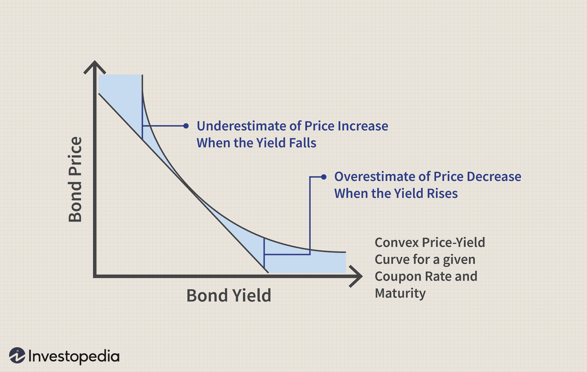

## Table of Contents

## What is convexity in bond pricing?

Convexity in bond pricing is a measure of how the price of a bond changes when interest rates change. It's like a fine-tuning tool that helps investors understand how sensitive a bond's price is to shifts in interest rates. While duration gives a good first guess about how much a bond's price will move, convexity adds more detail. It shows that the relationship between bond prices and interest rates isn't a straight line but more of a curve. This means that as interest rates change, the bond's price doesn't change at a constant rate; it changes more slowly at first and then more quickly.

Think of convexity as a safety net for bond investors. When interest rates go down, the bond's price goes up more than you'd expect just from looking at duration alone. This is good for the investor because it means the bond's value increases more than predicted. On the flip side, when interest rates go up, the bond's price drops, but not as much as you might think from duration alone. This cushioning effect is what convexity provides, making bonds with higher convexity more attractive to investors who want to protect against interest rate changes.

## Why is convexity important for bond investors?

Convexity is important for bond investors because it helps them understand how much a bond's price will change when interest rates move. Imagine you're trying to guess how fast a car will go based on how hard you press the gas pedal. Duration is like a rough guess, but convexity is like knowing the car's engine better. It tells you that the car doesn't speed up or slow down in a straight line; it's more like a curve. So, when interest rates drop, the bond's price goes up more than you'd expect just from duration. And when rates go up, the price doesn't fall as much as you might think.

This matters a lot because it helps investors make better choices. If you know a bond has high convexity, it's like having a safety net. When interest rates fall, your bond's value jumps more than you thought, which is great. And if rates rise, the bond's price doesn't drop as much, which protects your investment. So, bonds with higher convexity are more attractive because they offer this extra protection against interest rate changes. It's like having a bit of insurance that makes your investment safer and potentially more profitable.

## How does convexity relate to bond duration?

Convexity and bond duration are like two pieces of a puzzle that help investors understand how a bond's price will change when interest rates move. Duration is like a quick guess about how much the bond's price will change. It's a straight-line estimate that says if interest rates go up by 1%, the bond's price will drop by the duration percentage. But this guess isn't perfect because it assumes the relationship between bond prices and interest rates is a straight line, which it's not.

Convexity comes in to fix this problem. It shows that the relationship between bond prices and interest rates is actually more like a curve. When interest rates change, the bond's price doesn't change at a constant rate; it changes more slowly at first and then more quickly. Convexity adds this detail to the duration's guess, making it more accurate. So, when interest rates fall, the bond's price goes up more than duration alone would predict, and when rates rise, the price doesn't fall as much. This makes convexity a valuable tool for investors, giving them a fuller picture of how their bond's price might behave.

## What is a convexity adjustment and why is it needed?

A convexity adjustment is like a fine-tuning knob for bond pricing. When you use duration to guess how much a bond's price will change with interest rates, you're making a rough estimate. But this estimate isn't perfect because it assumes the relationship between bond prices and interest rates is a straight line, which it's not. The convexity adjustment fixes this by adding more detail. It shows that the relationship is actually more like a curve, where the bond's price changes more slowly at first and then more quickly as interest rates move.

This adjustment is needed because it makes the prediction of a bond's price change more accurate. Without it, investors would only have a rough guess from duration, which could lead to surprises when interest rates shift. The convexity adjustment helps investors see the full picture, understanding that when interest rates fall, the bond's price will go up more than expected, and when rates rise, the price won't drop as much. This extra detail is crucial for making smarter investment decisions and managing risk better.

## How is convexity calculated for a bond?

Convexity for a bond is calculated using a formula that takes into account the bond's cash flows, the time until those cash flows are received, and the interest rate. The basic idea is to measure how the bond's price changes as interest rates change, not just in a straight line but in a curve. You start by looking at each of the bond's future cash flows, like coupon payments and the final principal payment. Then, you figure out how much each of those cash flows would be worth today if interest rates changed a little bit. You do this for both a small increase and a small decrease in interest rates.

After figuring out those values, you calculate the difference in the bond's price when interest rates go up a bit and when they go down a bit. Then, you use this difference to find the convexity. The formula involves summing up these differences for all the bond's cash flows, weighted by the time until each cash flow is received, and then dividing by the change in interest rates squared. This gives you a number that tells you how much the bond's price will curve as interest rates change. The higher the convexity, the more the bond's price will change, providing a cushion against interest rate movements.

## Can you explain the formula used for convexity adjustment?

Convexity adjustment is a way to make a more accurate guess about how a bond's price will change when interest rates move. The formula for convexity is a bit tricky, but it's all about looking at the bond's future cash flows, like the coupon payments and the final principal payment. You imagine what these cash flows would be worth today if interest rates went up a tiny bit and if they went down a tiny bit. Then, you calculate how much the bond's price would change with these tiny rate changes. The formula sums up these changes for all the bond's cash flows, but it weights them by how far away each cash flow is in time. Finally, you divide this sum by the square of the tiny change in interest rates you imagined.

This calculation gives you a number called convexity. A higher convexity number means the bond's price will change more when interest rates move, but in a good way. It's like the bond's price has a safety net. When interest rates fall, the bond's price goes up more than you'd expect just from looking at duration alone. And when rates rise, the price doesn't drop as much. This makes bonds with higher convexity more attractive because they offer extra protection against interest rate changes. So, the convexity adjustment helps investors see the full picture and make smarter choices about their investments.

## What are the practical applications of convexity adjustments in bond portfolio management?

Convexity adjustments are super helpful for people who manage bond portfolios. They use these adjustments to make smarter choices about which bonds to buy or sell. Imagine you're trying to figure out how much a bond's price will change if interest rates go up or down. Duration gives you a rough idea, but it's like guessing without all the facts. Convexity adjustments add those missing details, showing that the bond's price doesn't move in a straight line but more like a curve. This helps managers see how much the bond's price will really change, making their predictions more accurate and their decisions better.

In practice, managers use convexity adjustments to protect their portfolios from big swings in interest rates. If they know a bond has high convexity, it's like having a safety net. When interest rates fall, the bond's price goes up more than expected, which is great for the portfolio. And when rates rise, the price doesn't drop as much, helping to keep the portfolio's value stable. This makes bonds with higher convexity more attractive because they offer extra protection against interest rate changes. So, managers might choose to hold more of these bonds to keep their portfolios safer and potentially more profitable.

## How does convexity impact the price sensitivity of bonds to interest rate changes?

Convexity helps us understand how much a bond's price will change when interest rates go up or down. It's like a fine-tuning tool that adds more detail to the rough guess we get from duration. Duration tells us that if interest rates change by 1%, the bond's price will move by a certain amount. But this guess assumes the bond's price changes in a straight line, which isn't true. Convexity shows us that the bond's price actually moves in a curve, changing more slowly at first and then more quickly as interest rates shift.

This matters a lot because it helps investors see the full picture of how their bond's price will behave. When interest rates drop, a bond's price goes up more than you'd expect just from looking at duration alone. This is good news for investors because it means their bond's value increases more than predicted. On the other hand, when interest rates rise, the bond's price doesn't fall as much as you might think from duration alone. This cushioning effect is what convexity provides, making bonds with higher convexity more attractive to investors who want to protect against interest rate changes.

## What are the differences between positive and negative convexity, and how do they affect bond pricing?

Positive convexity and negative convexity are two ways to describe how a bond's price reacts when interest rates change. Positive convexity is like a safety net for bond investors. When interest rates go down, the bond's price goes up more than you'd expect just from looking at duration alone. And when interest rates go up, the bond's price doesn't drop as much. This makes bonds with positive convexity more attractive because they offer extra protection against interest rate changes. Most traditional bonds, like government and corporate bonds, have positive convexity.

Negative convexity, on the other hand, is less common and can be a bit trickier. It happens with some special types of bonds, like mortgage-backed securities. With negative convexity, when interest rates go down, the bond's price doesn't go up as much as you might hope. And when interest rates go up, the bond's price can drop more than expected. This happens because these bonds might get paid off early when rates fall, which means investors lose out on future interest payments. So, bonds with negative convexity can be riskier because they don't offer the same protection against interest rate changes as bonds with positive convexity.

## How do convexity adjustments differ for different types of bonds, such as callable or putable bonds?

Convexity adjustments can be different for callable and putable bonds because these bonds have special features that affect how their prices change with interest rates. Callable bonds can be paid off early by the issuer if interest rates fall, which means investors might lose out on future interest payments. This early payoff makes the bond's price behave differently when rates go down. Instead of the price going up a lot like with regular bonds, it might not go up as much because of the risk that the bond will be called away. So, callable bonds often have negative convexity, especially when interest rates are low, because their price doesn't increase as much as you'd expect.

Putable bonds, on the other hand, give the investor the right to sell the bond back to the issuer at a certain price before it matures. This feature can make the bond's price more stable when interest rates go up. If rates rise and the bond's price starts to fall, investors can choose to put the bond back to the issuer, which limits how much the price can drop. This makes putable bonds have positive convexity because their price doesn't fall as much as regular bonds when rates go up. So, the convexity adjustment for putable bonds helps show how this extra protection affects the bond's price sensitivity to interest rate changes.

## What are the limitations and assumptions involved in using convexity adjustments?

Convexity adjustments help us make better guesses about how a bond's price will change when interest rates move, but they have some limitations. One big limitation is that they assume interest rate changes are small and happen smoothly. In real life, interest rates can jump around a lot, and this can make the convexity adjustment less accurate. Another limitation is that the calculations for convexity can be pretty complicated, especially for bonds with special features like callable or putable bonds. This means that even though convexity adjustments give us more detail, they might not capture all the ways a bond's price can change in real-world situations.

Another important thing to know is that convexity adjustments are based on certain assumptions. They assume that the bond's cash flows are fixed and that the bond will be held until it matures. But in reality, people might sell their bonds before they mature, or the cash flows might change if the bond is callable or putable. These assumptions can make the convexity adjustment less reliable for some types of bonds. So, while convexity adjustments are a useful tool for understanding how bond prices move, they're not perfect and should be used carefully, keeping in mind their limitations and the assumptions they're based on.

## How can advanced quantitative models enhance the accuracy of convexity adjustments in complex bond markets?

Advanced quantitative models can make convexity adjustments more accurate by taking into account more details about how interest rates and bond prices move. These models can look at things like how often interest rates change, how big those changes are, and even how interest rates at different times are connected to each other. They can also consider special features of bonds, like if they can be called back early or if investors can sell them back to the issuer. By including all these details, the models can give a better picture of how a bond's price will change, making the convexity adjustment more reliable and useful for investors.

These models are especially helpful in complex bond markets where things can change quickly and unexpectedly. For example, in markets with lots of different types of bonds, like mortgage-backed securities or bonds with options, the models can help predict how these bonds will behave when interest rates go up or down. By using advanced math and computer simulations, these models can test different scenarios and show how sensitive a bond's price is to changes in interest rates. This helps investors make smarter choices and manage their risks better, even in tricky market conditions.

## What is Understanding Bond Pricing?

Bond pricing is a fundamental aspect of fixed-income markets, determining how bonds are valued and traded. Several key factors influence bond prices, primarily interest rates and the creditworthiness of the issuer.

Interest rates play a crucial role in bond pricing. As interest rates rise, bond prices typically fall and vice versa. This inverse relationship occurs because bonds with fixed interest payments become less attractive to investors when new bonds are issued at higher rates. Conversely, when interest rates decline, existing bonds with higher coupon rates become more valuable, driving up their prices. This relationship can be expressed mathematically as follows:

$$
P = \frac{C}{(1 + r)^1} + \frac{C}{(1 + r)^2} + \cdots + \frac{C + F}{(1 + r)^n}
$$

where $P$ represents the bond price, $C$ is the annual coupon payment, $r$ is the yield (interest rate), $F$ is the face value of the bond, and $n$ is the number of years to maturity.

The issuer's creditworthiness also significantly affects bond prices. Bonds issued by entities with high credit ratings are perceived as lower risk and therefore demand higher prices. Conversely, bonds from issuers with lower credit ratings are viewed as riskier and are priced lower to compensate investors for the added risk.

Investors commonly use several methods to value bonds, including present value calculations and yield to maturity (YTM) estimations. The present value (PV) method discounts future cash flows to their present value using the current [interest rate](/wiki/interest-rate-trading-strategies):

$$
PV = \sum_{t=1}^{n} \frac{C}{(1 + i)^t} + \frac{F}{(1 + i)^n}
$$

where $i$ is the discount rate reflecting the bond's risk and market conditions. This method helps investors determine if a bond is priced appropriately relative to market expectations.

Yield to maturity, another vital bond valuation technique, reflects the total return an investor can expect if the bond is held until it matures. YTM accounts for the bond's current price, coupon payments, and time to maturity, providing a comprehensive measure of a bond’s profitability. Calculating YTM often involves solving the following equation:

$$
P = \sum_{t=1}^{n} \frac{C}{(1 + YTM)^t} + \frac{F}{(1 + YTM)^n}
$$

Given the complexity of this calculation, investors often rely on financial calculators or software for precise YTM estimations.

Understanding these fundamental factors and methods equips investors with the necessary tools to navigate the dynamic bond market and make informed decisions.

## What is Convexity Adjustment?

Convexity is a critical concept in bond trading, representing the curvature in the relationship between a bond's price and interest rates. While duration provides a linear approximation of how bond prices are expected to change with interest rate movements, convexity offers a more comprehensive measure, taking into account the degree to which the duration changes as interest rates fluctuate. This second-order measure becomes particularly important when analyzing large interest rate shifts, as it accounts for the nonlinear nature of these changes.

The convexity adjustment provides a refinement to bond pricing models by quantifying this curvature effect. The formula for convexity adjustment is expressed as:

$$
\text{CA} = \text{CV} \times 100 \times (\Delta y)^2
$$

Where:
- $\text{CA}$ is the convexity adjustment.
- $\text{CV}$ is the bond's convexity, a measure of the curvature or bending of the price-yield curve.
- $\Delta y$ is the change in yield, or interest rate.

This formula illustrates how the adjustment supplements the linear duration-based price change with an additional term that captures the effect of convexity. As a bond's price is influenced by changes in interest rates, the convexity adjustment accounts for the amplified or diminished price effects not reflected in simple duration measures.

Incorporating convexity into bond pricing models allows traders and investors to achieve more accurate pricing and valuation. Convexity ensures that the pricing models reflect both small and substantial shifts in interest rates, preventing mispricing in volatile or rapidly changing markets. By including convexity adjustment in bond pricing strategies, investors can gain insights that improve their ability to forecast returns and manage their bond portfolios effectively, thus enhancing their trading strategies.

## What is the role of convexity in interest rate risk?

Convexity is a crucial concept in assessing interest rate risk, serving as a refinement to the more straightforward measure of duration. Duration measures the sensitivity of a bond's price to small changes in interest rates, acting as a first-order approximation. However, duration alone can be insufficient for capturing the nuances of larger or non-linear interest rate movements. This is where convexity comes into play, providing a second-order approximation that accounts for the curvature of the price-yield relationship.

The formula for convexity is:

$$
\text{Convexity} = \frac{1}{P} \times \sum \left( \frac{C_i \times t_i \times (t_i+1)}{(1+y)^{t_i+2}} \right)
$$

where $P$ is the bond price, $C_i$ is the cash flow at time $t_i$, and $y$ is the yield.

Convexity is particularly useful in assessing interest rate risk during substantial shifts in yield. While duration would inaccurately assume a linear change in price, convexity accounts for the fact that the relationship between bond prices and yields is in fact convex. This nonlinear adjustment makes convexity a valuable tool for traders and portfolio managers aiming to minimize pricing errors that could arise from significant changes in interest rates.

High convexity indicates that a bond’s price is more sensitive to interest rate changes but also implies that for a given change in interest rates, the bond's price is likely to increase more with decreasing rates or decrease less with rising rates compared to a low-convexity bond. This characteristic is particularly beneficial in volatile interest environments, where precise pricing and risk management are critical. For instance, in a rising interest rate scenario, bonds with higher convexity tend to decrease less in value than predicted by duration alone, providing a cushion against adverse market movements.

In summary, while duration offers a fundamental snapshot of interest rate risk exposure, convexity allows for a more comprehensive analysis, particularly when anticipating larger shifts in yield curves. The integration of convexity into trading strategies enables the refinement of bond valuation models, ensuring that investors can adjust more accurately to dynamic market conditions.

## References & Further Reading

[1]: Wilmott, P. (2006). [Paul Wilmott Introduces Quantitative Finance](https://www.amazon.com/Paul-Wilmott-Introduces-Quantitative-Finance/dp/0471498629). John Wiley & Sons.

[2]: Hull, J. C. (2018). [Options, Futures, and Other Derivatives](https://www.semanticscholar.org/paper/Options%2C-Futures%2C-and-Other-Derivatives-Hull/89bdee500c8623864fc9eb7a471546aa713acc44). Pearson.

[3]: Black, F., & Scholes, M. (1973). ["The Pricing of Options and Corporate Liabilities."](https://www.cs.princeton.edu/courses/archive/fall09/cos323/papers/black_scholes73.pdf) Journal of Political Economy, 81(3), 637-654.

[4]: Duffie, D. (2001). [Dynamic Asset Pricing Theory](https://archive.org/details/dynamicassetpric0000duff). Princeton University Press.

[5]: James, J., & Webber, N. (2000). [Interest Rate Modelling](https://archive.org/details/interestratemode0000jame). John Wiley & Sons.

[6]: Litterman, R., & Scheinkman, J. (1991). ["Common Factors Affecting Bond Returns."](https://www.pm-research.com/content/iijfixinc/1/1/54) Journal of Fixed Income.

[7]: Jarrow, R., & Turnbull, S. (1995). ["Pricing Derivatives on Financial Securities Subject to Credit Risk."](https://onlinelibrary.wiley.com/doi/abs/10.1111/j.1540-6261.1995.tb05167.x) Journal of Finance.