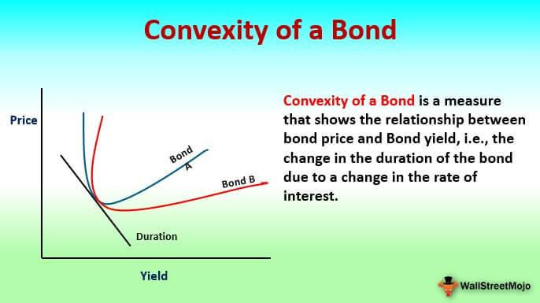

## Table of Contents

## What is convexity in mathematics?

Convexity in mathematics is a concept that applies to shapes, functions, and sets. When we talk about a shape or a set being convex, it means that if you take any two points inside the shape or set, the straight line connecting those points will always stay inside the shape or set. Think of a circle or a square; no matter which two points you pick inside them, the line between those points will never go outside the circle or square. This property makes convex shapes and sets easier to work with in many mathematical problems, like optimization.

Convexity also applies to functions. A function is called convex if the line segment connecting any two points on the graph of the function lies above or on the graph itself. Imagine drawing a straight line between any two points on the curve of a function; if that line never dips below the curve, the function is convex. Convex functions are important in fields like economics and engineering because they often represent systems that are stable and predictable, making them easier to analyze and optimize.

## How is a convex set defined?

A convex set is a collection of points where any straight line connecting two points inside the set stays inside the set. Imagine drawing a line between any two points you pick in the set. If that line never goes outside the set, then the set is convex. This idea is easy to see with shapes like circles or squares. If you pick any two points inside a circle and draw a line between them, the line stays inside the circle. The same goes for a square.

Convex sets are important in math because they make many problems simpler. For example, in optimization, working with convex sets can help find the best solution more easily. This is because convex sets have nice properties that make them predictable and easier to handle. If a set is not convex, it can be trickier to work with because lines connecting points might go outside the set, making calculations more complicated.

## What are some examples of convex sets?

A circle is a simple example of a convex set. If you pick any two points inside a circle and draw a straight line between them, that line will always stay inside the circle. It doesn't matter where you pick the points; the line connecting them will never go outside. This makes circles very predictable and easy to work with in math problems.

Another example is a square. Just like with a circle, if you draw a line between any two points inside a square, the line will stay inside the square. This property is what makes squares convex. Even if you rotate the square or make it bigger or smaller, it will still be a convex set because the line connecting any two points inside it will never leave the square.

A third example is a triangle. If you take any two points inside a triangle and draw a line between them, that line will always be inside the triangle. Triangles are convex because no matter where you pick the points, the line connecting them won't go outside the triangle. This makes triangles another good example of a convex set.

## What is the difference between convex and non-convex sets?

A convex set is like a shape where if you pick any two points inside it and draw a straight line between them, that line stays inside the shape. Think of a circle or a square. No matter which two points you choose, the line connecting them will never go outside. This makes convex sets easy to work with in math because they're predictable and simple.

On the other hand, a non-convex set is a shape where the line between two points inside it can go outside the shape. Imagine a crescent moon shape. If you pick two points on different ends of the crescent, the line between them might go outside the moon shape. Non-convex sets are trickier to work with in math because they can be less predictable and more complicated.

Understanding the difference between convex and non-convex sets is important in fields like optimization and geometry. Convex sets make solving problems easier because they follow simple rules, while non-convex sets can make things more challenging due to their complex nature.

## How do you prove that a set is convex?

To prove that a set is convex, you need to show that any straight line connecting two points inside the set stays inside the set. Imagine [picking](/wiki/asset-class-picking) any two points in the set and drawing a line between them. If that line never goes outside the set, no matter which two points you pick, then the set is convex. This is like checking every possible pair of points to make sure the line between them stays inside.

A good way to do this is to use math. If you have a set defined by some rules or equations, you can use those rules to show that the line between any two points in the set satisfies those rules. For example, if you have a set of points defined by an inequality, you can show that the line between any two points in the set also satisfies that inequality. This proves that the set is convex because the line stays inside the set according to its rules.

## What is the significance of convex functions?

Convex functions are important because they are easy to work with in math problems. Imagine you have a graph of a function. If you can draw a straight line between any two points on the graph and that line stays above or on the graph, then the function is convex. This property makes convex functions predictable and simple. They are often used in fields like economics and engineering because they represent systems that are stable and easier to understand. When you're trying to find the best solution to a problem, like minimizing cost or maximizing profit, working with convex functions can make the process easier because you know the solution will be reliable.

Convex functions also help in optimization problems. In optimization, you want to find the best or optimal solution. Convex functions have a special property: they have only one minimum point. This means that if you're trying to find the lowest point on a graph, you'll find it easily with a convex function because there's only one place to look. This makes solving optimization problems faster and more efficient. Because of these reasons, convex functions are very useful in many areas of math and science where finding the best solution is important.

## How are convex functions related to convex sets?

Convex functions and convex sets are closely related because the graph of a convex function forms a convex set. Imagine you have a function and you draw its graph. If you can draw a straight line between any two points on that graph and the line stays above or on the graph, the function is convex. Now, if you look at all the points on and above the graph, they form a set. This set is convex because any line connecting two points in this set will stay inside the set. So, the graph of a convex function creates a convex set.

This relationship is important because it helps in understanding and solving math problems. When you're working with a convex function, you know that the set of points on and above its graph is convex. This makes it easier to find the best solution in optimization problems because you're working with a predictable and simple set. Convex functions and sets are used in many areas, like economics and engineering, where finding the best or optimal solution is key.

## What is the concept of convex hull and how is it calculated?

The convex hull of a set of points is like a rubber band stretched around the outside of the points. Imagine you have a bunch of dots on a piece of paper. If you wrap a rubber band around them so it's as tight as possible, the shape the rubber band makes is the convex hull. This shape is the smallest convex set that can contain all the points. It's important in math because it helps us understand the shape and size of a group of points in a simple way.

To calculate the convex hull, you can use different methods, but one common way is called the Graham scan. Imagine you start by finding the point with the lowest y-coordinate (or the leftmost point if there are ties). This point is part of the hull. Then, you sort the other points by the angle they make with this starting point. You go through these sorted points, adding them to the hull if they make the shape bigger. If adding a point would make the shape smaller, you take the last point off and try again. You keep doing this until you've gone through all the points. At the end, you have the smallest convex shape that includes all the points.

## What are the applications of convexity in optimization?

Convexity is really helpful in optimization because it makes finding the best solution easier. When you have a problem where you want to minimize something, like cost, or maximize something, like profit, convex functions make it simple. That's because a convex function has only one lowest point, which is the best solution. Imagine you're trying to find the lowest spot in a valley. If the valley is shaped like a convex function, there's only one spot at the bottom, and you can easily find it. This makes optimization problems faster and more reliable because you know there's only one best answer to find.

In real life, convexity is used a lot in fields like engineering and economics. For example, engineers might use convex optimization to design the best structure for a bridge, where they want to minimize the materials used while making sure the bridge is strong enough. In economics, companies might use it to figure out how to make the most profit by deciding how much to produce and at what price to sell. Convexity helps make these decisions easier because it gives a clear and simple way to find the best solution, making the whole process more efficient and predictable.

## How does convexity impact linear programming?

Convexity is really important in linear programming because it makes solving problems easier. Linear programming is all about finding the best way to do something, like making the most money or using the least resources. When the problem is convex, it means that the solution space, or the area where you're looking for the best answer, is simple and predictable. In linear programming, the solution space is always convex because it's made up of straight lines and flat areas. This means that if you're trying to find the best solution, you can be sure that it will be at one of the corners of this space, making it easier to find.

In linear programming, the goal is often to minimize or maximize a linear function, like cost or profit, within a set of constraints. These constraints form a convex set, which means that any line you draw between two points inside this set will stay inside the set. This property helps a lot because it ensures that the best solution, if it exists, will be at one of the vertices of the convex set. This makes the search for the optimal solution more straightforward and efficient, as you can systematically check each vertex to find the best one. So, convexity in linear programming turns a complex problem into something that's easier to solve and understand.

## What advanced techniques exist for analyzing convex optimization problems?

In convex optimization, one advanced technique is called interior point methods. These methods help find the best solution by moving through the inside of the solution space, rather than just checking the edges. Imagine you're trying to find the lowest point in a valley. Instead of walking along the edges, you walk through the middle, getting closer and closer to the bottom. This can be faster and more efficient, especially for big problems with lots of variables. Interior point methods use math tricks to make sure they're always moving in the right direction, towards the best solution.

Another technique is called the subgradient method. This is useful when the function you're trying to optimize isn't smooth, meaning it has sharp corners or jumps. The subgradient method works by taking steps in the direction that will make the function better, even if it's not a straight line. It's like trying to walk down a staircase instead of a smooth hill. This method can be slower than others, but it's good for problems where the function is tricky and not smooth. By using these advanced techniques, you can solve convex optimization problems that might be too hard with simpler methods.

## What are some open problems or current research areas in the field of convexity?

One big area of research in convexity is about finding faster ways to solve optimization problems. Scientists are always looking for new methods that can handle bigger and more complicated problems. For example, they're working on better interior point methods and trying to understand how to make them work well with different kinds of problems. Another interesting area is about figuring out how to deal with problems where the function isn't smooth, like when it has sharp corners or jumps. Researchers are trying to improve methods like the subgradient method to make them faster and more reliable.

Another important area is about understanding how convexity works in different fields, like [machine learning](/wiki/machine-learning) and data science. In machine learning, convex functions are used to train models, but researchers are trying to find out if non-convex functions can be just as good or even better. They're also looking at how to use convexity to make algorithms more efficient and accurate. This is a big deal because it could help make things like predicting the weather or understanding medical data much easier and more reliable.

## What is the role of convexity in financial markets?

Convexity is a fundamental concept in financial mathematics, providing insight into the relationship between bond prices and [interest rate](/wiki/interest-rate-trading-strategies) changes. It is an extension of duration, accounting for the curvature or the degree of the curve in the graph of bond price versus yield. Unlike duration, which assumes a linear relationship between bond prices and changes in interest rates, convexity offers a more accurate measure by considering the bond's price sensitivity to changes in yield.

### Definition and Significance

In formal terms, convexity is a measure of the curvature in the bond's price-yield curve. It represents the rate of change of duration with respect to yield changes and is calculated as the second derivative of the bond price with respect to interest rates. Convexity helps in precisely estimating the price sensitivity of a bond to interest rate fluctuations and is expressed mathematically as:

$$
\text{Convexity} = \frac{1}{P} \sum_{t=1}^{n} \frac{C_t \cdot (t^2 + t)}{(1 + y_t)^{t+2}}
$$

where $P$ is the bond price, $C_t$ is the cash flow at time $t$, $y_t$ is the yield to maturity, and $n$ is the number of cash flows.

This measure is particularly significant for traders and portfolio managers in managing risks associated with bond investments. It allows investors to understand how the bond's price will change as interest rate [volatility](/wiki/volatility-trading-strategies) occurs, aiding them in formulating strategies to mitigate potential losses.

### Positive and Negative Convexity

Bonds can exhibit either positive or negative convexity, and these characteristics have substantial impacts on bond valuation.

- **Positive Convexity**: An asset with positive convexity tends to see its price rise as interest rates fall and its price fall less rapidly when interest rates rise. Most fixed-rate bonds, like government and corporate bonds, display positive convexity. This feature offers a cushion against interest rate risk, making bonds more attractive during periods of declining interest rates. As a result, positive convexity is often desirable for long-term bondholders.

- **Negative Convexity**: Some bonds, particularly mortgage-backed securities (MBS) or callable bonds, show negative convexity under certain conditions. These bonds may lose value more rapidly when interest rates drop, as the likelihood of the issuer exercising the call option increases. Negative convexity can be less desirable because it implies that the bond will not perform as well when interest rates decrease, resulting in reduced price gains.

The effects of convexity are observed when comparing two bonds with similar duration but different convexities. The bond with higher convexity will gain more in price when yields fall and lose less when yields rise, compared to a bond with lower convexity. Recognizing and quantifying these dynamics enable traders to manage exposures tactically, optimizing their portfolios for diverse interest rate environments.

### Practical Applications

Convexity is utilized in constructing bond portfolios to hedge against interest rate risks effectively. Investors often seek a combination of duration and convexity to align their portfolios with anticipated interest rate movements, maximizing returns while protecting against downside risks. Incorporating convexity into bond trading strategies is essential for achieving sustainable performance in dynamic market conditions.

## What is the Role of Mathematics in Algorithmic Trading?

Algorithmic trading is characterized by the use of sophisticated mathematical models to execute trades with precision and speed unmatched by human traders. Mathematics plays a pivotal role in this domain, primarily through the application of statistical and computational techniques that ensure accuracy, efficiency, and strategic decision-making.

One of the foundational tools in [algorithmic trading](/wiki/algorithmic-trading) is time series analysis. By analyzing financial data points collected or recorded at successive points in time, traders can identify patterns that may indicate future price movements. Common statistical methods applied in time series analysis include moving averages and autoregressive integrated moving average (ARIMA) models. These techniques aid traders in recognizing trends, seasonal patterns, and even cyclical fluctuations within a financial instrument's price data.

Regression models are another crucial mathematical tool in algorithmic trading. These models, often linear or polynomial, are used to understand the relationships between different financial variables. For instance, a regression model might evaluate how changes in economic indicators such as GDP or interest rates impact stock prices. By quantifying these relationships, traders can make more informed predictions about asset performance. The basic form of a linear regression model is:

$$
Y = \beta_0 + \beta_1X_1 + \beta_2X_2 + \ldots + \beta_nX_n + \epsilon
$$

where $Y$ is the dependent variable, $X_1, X_2, \ldots, X_n$ are independent variables, $\beta_0$ is the intercept, $\beta_1, \beta_2, \ldots, \beta_n$ are the coefficients, and $\epsilon$ is the error term.

Stochastic processes also feature prominently in algorithmic trading. These processes allow traders to model the seemingly random behavior of financial markets. Techniques such as the Black-Scholes model for option pricing exemplify the application of stochastic calculus in financial markets. The Black-Scholes formula is given by:

$$
C = S_0 N(d_1) - X e^{-rT} N(d_2)
$$

where $C$ is the call option price, $S_0$ is the initial stock price, $X$ is the strike price, $r$ is the risk-free interest rate, $T$ is the time to expiration, $N$ is the cumulative distribution function of the standard normal distribution, and $d_1$ and $d_2$ are calculated as:

$$
d_1 = \frac{\ln(S_0/X) + (r + \sigma^2/2)T}{\sigma \sqrt{T}}
$$

$$
d_2 = d_1 - \sigma \sqrt{T}
$$

where $\sigma$ is the volatility of the stock's returns.

In the context of algorithmic trading, mathematics is also utilized for optimizing asset allocation and managing risks. Markowitz's Modern Portfolio Theory (MPT) is a critical mathematical framework that helps traders construct optimal portfolios that seek to maximize return for a given level of risk. Similarly, mathematical techniques in risk management, such as Value at Risk (VaR) calculations, provide insights into the potential losses a portfolio might face within a specified confidence interval.

The implementation of these mathematical concepts enables algorithmic trading systems to not only predict market trends but also optimize investment strategies and manage financial risks effectively. Consequently, the adept application of mathematics is fundamental in navigating the complexities of modern financial markets.

## What are the practical applications and case studies?

Practical applications of mathematical algorithms in trading showcase their ability to enhance performance and optimize decision-making processes. One significant application is the analysis of convexity in bond portfolios. Convexity measures the sensitivity of the duration of a bond to changes in interest rates and provides a more accurate assessment of interest rate risk than duration alone. By employing convexity analysis, traders can better estimate potential price changes in response to fluctuating interest rates, thus improving risk management and portfolio optimization.

For instance, consider a simple convexity calculation for a bond. If $P$ is the bond price, $y$ is the yield, and $C$ is the convexity, then the approximate price change $\Delta P$ due to a change in yield $\Delta y$ is given by:

$$

\Delta P \approx -D \cdot \Delta y + \frac{1}{2} \cdot C \cdot (\Delta y)^2
$$

where $D$ is the duration of the bond. This formula allows traders to anticipate how changes in interest rates impact bond prices with greater accuracy, informing strategies to mitigate risk.

Another application involves the use of geometric models for trend analysis. Geometry, through concepts such as trend lines, channels, and chart patterns, plays a crucial role in identifying and predicting market trends. By employing geometric models, traders can detect support and resistance levels, gauge the strength of market movements, and make informed predictions about future price action.

Python, a powerful tool for algorithmic trading, can aid in implementing these geometric concepts. Here's a brief Python example showcasing the calculation of a linear trend line using historical price data:

```python
import numpy as np
import matplotlib.pyplot as plt

# Sample closing prices
closing_prices = [100, 102, 104, 103, 107, 110]

# Generate time index
time = np.arange(len(closing_prices))

# Fit a linear trend line
coefficients = np.polyfit(time, closing_prices, 1)
trend_line = np.polyval(coefficients, time)

# Plotting
plt.plot(time, closing_prices, label='Closing Prices')
plt.plot(time, trend_line, label='Trend Line', linestyle='--')
plt.xlabel('Time')
plt.ylabel('Price')
plt.legend()
plt.title('Price Trend Analysis')
plt.show()
```

In this code, `np.polyfit` is used to create a linear regression model, producing a trend line that helps identify the overall direction of the market. Such geometric insights are valuable for anticipating market behaviors and adjusting trading strategies accordingly.

By harnessing convexity in bond portfolios and employing geometric models for trend analysis, traders can significantly enhance their trading strategies. These mathematical concepts facilitate more informed risk management and strategic decision-making, translating to improved trading outcomes and better portfolio performance.

## References & Further Reading

[1]: ["Convex Optimization"](https://web.stanford.edu/~boyd/cvxbook/bv_cvxbook.pdf) by Stephen Boyd and Lieven Vandenberghe

[2]: ["Quantitative Trading: How to Build Your Own Algorithmic Trading Business"](https://books.google.com/books/about/Quantitative_Trading.html?id=j70yEAAAQBAJ) by Ernest P. Chan

[3]: ["Advances in Financial Machine Learning"](https://www.amazon.com/Advances-Financial-Machine-Learning-Marcos/dp/1119482089) by Marcos Lopez de Prado

[4]: ["Financial Calculus: An Introduction to Derivative Pricing"](https://archive.org/details/financialcalculu0000baxt) by Martin Baxter and Andrew Rennie

[5]: ["Evidence-Based Technical Analysis: Applying the Scientific Method and Statistical Inference to Trading Signals"](https://www.wiley.com/en-us/Evidence+Based+Technical+Analysis%3A+Applying+the+Scientific+Method+and+Statistical+Inference+to+Trading+Signals-p-9780470008744) by David Aronson

[6]: ["Machine Learning for Algorithmic Trading"](https://github.com/PacktPublishing/Machine-Learning-for-Algorithmic-Trading-Second-Edition) by Stefan Jansen