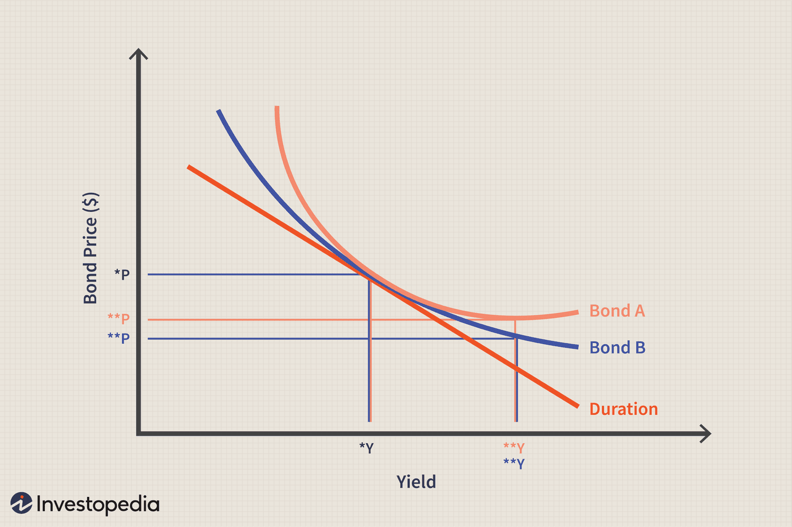

Geometry, mathematics, and convexity are essential components in algorithmic trading. These elements play a crucial role in modeling financial markets and automating trades. Algorithmic trading relies on quantitative strategies that often employ advanced mathematical models to analyze data and make informed decisions. Geometry aids in the visualization and analysis of market patterns, revealing insights that are not immediately obvious through numerical data alone. It helps in recognizing patterns and trends that are geometrically interpretable, fostering better strategy development.

Mathematics provides the foundational tools needed to translate complex market behaviors into analytical frameworks. These include everything from basic statistical analysis to more complex machine learning models, which can predict price movements and identify profitable trading opportunities. Tools such as linear regression help identify relationships between variables, while stochastic calculus models, like the Black-Scholes formula, aid in option pricing and risk assessment. 



Convexity, in particular, is a critical mathematical concept used extensively in the fixed-income market to measure the sensitivity of bond prices to changes in interest rates. Convexity goes beyond the basic measure of duration, providing a more nuanced understanding of how bond prices curve in response to interest rate shifts. This is a pivotal factor in risk management, as it allows traders to estimate the potential variability in bond prices and adjust their portfolios accordingly.

This article explores how these mathematical foundations are integrated into algorithmic trading to improve accuracy, execution speed, and strategic decision-making. It highlights the importance of these concepts in empowering algorithmic trading systems, ensuring that they can efficiently process vast quantities of data and execute trades with precision. The objective is to illuminate the influence these concepts have on enhancing trading strategies and managing market risk, providing a comprehensive understanding of their role in advancing the efficiency and efficacy of algorithmic trading.

## Table of Contents

## Understanding Geometry and Mathematics in Trading

Geometry and mathematics provide essential tools for the analysis of complex financial data and the identification of market patterns. These analytical methods enable traders and analysts to unravel intricate data structures, thus facilitating the tracking of market trends. By employing geometric approaches, such as visualizing data in multidimensional spaces, market participants can recognize patterns and relationships that might otherwise remain obscured in raw datasets.

Mathematical models serve a critical function by transforming qualitative market behaviors into quantitative frameworks. These frameworks allow for the systematic assessment of market dynamics, enabling the development of predictive models and decision-making algorithms. Linear regression, for example, is widely used to identify trends in stock prices. This statistical method establishes the relationship between a dependent financial variable, such as a stock price, and one or more independent variables, such as time or economic indicators.

The application of these mathematical principles forms the foundation of [algorithmic trading](/wiki/algorithmic-trading) strategies, enhancing both the design and execution of trades. By integrating mathematical algorithms into trading systems, practitioners can achieve higher accuracy and execute trades efficiently even under rapidly changing market conditions.

In practice, these mathematical approaches are often implemented using programming languages like Python. Python's comprehensive libraries for data analysis and [machine learning](/wiki/machine-learning), such as NumPy, pandas, and scikit-learn, provide powerful tools for constructing and deploying these models. A basic implementation of linear regression using Python can be exemplified as follows:

```python
import numpy as np
import pandas as pd
from sklearn.linear_model import LinearRegression
import matplotlib.pyplot as plt

# Sample data
data = {
    'Time': np.arange(1, 11),
    'StockPrice': [120, 122, 125, 130, 129, 134, 136, 140, 145, 150]
}

# Dataframe creation
df = pd.DataFrame(data)

# Reshaping data for sklearn
X = df['Time'].values.reshape(-1, 1)
y = df['StockPrice'].values

# Linear regression model
model = LinearRegression()
model.fit(X, y)

# Predictions
predicted_prices = model.predict(X)

# Visualization
plt.scatter(df['Time'], df['StockPrice'], color='blue', label='Actual Prices')
plt.plot(df['Time'], predicted_prices, color='red', label='Predicted Linear Trend')
plt.xlabel('Time')
plt.ylabel('Stock Prices')
plt.title('Stock Price Trend Analysis')
plt.legend()
plt.show()
```

This code snippet demonstrates how to use linear regression to analyze stock price trends across a defined time period. By fitting a model to the data, traders can provide insight into potential future price trajectories, informing strategic decisions in trading activities. Such mathematical and computational methodologies enhance the understanding and anticipation of market movements, making them indispensable in the field of algorithmic trading.

## Exploring Convexity in Financial Markets

Convexity in financial markets is a crucial concept used to assess the sensitivity of bond prices to changes in interest rates. Unlike duration, which provides a linear approximation, convexity offers a non-linear measure, capturing the curvature in the bond price-yield relationship.

Duration serves as a first-order approximation of how bond prices change with interest rates, but it does not account for the curvature of the price response. Convexity, on the other hand, measures this curvature, providing a more accurate estimation of bond price movements in response to [interest rate](/wiki/interest-rate-trading-strategies) fluctuations. Mathematically, convexity can be defined as the second derivative of the bond's price with respect to interest rates. It is expressed as:

$$

Convexity = \frac{1}{P} \sum_{t=1}^{n} \frac{C_t \times t(t+1)}{(1+y)^{t+2}} 
$$

where $P$ is the bond's price, $C_t$ is the cash flow at time $t$, $y$ is the yield, and $n$ is the number of periods.

Understanding convexity is important because it provides insights into the potential variability of bond prices as rates change, especially in complex interest rate environments. Bonds with higher convexity will exhibit larger price changes for a given change in interest rates compared to bonds with lower convexity.

Convexity has significant implications for risk management and portfolio optimization. In fixed-income portfolios, positive convexity indicates that bond prices will increase at an increasing rate when interest rates fall, and decrease at a decreasing rate when rates rise. This characteristic is desirable as it minimizes potential losses in rising rate scenarios while maximizing gains in falling rate environments. Conversely, bonds with negative convexity, such as mortgage-backed securities, may decrease portfolio stability as these instruments tend to lose value more rapidly in rising rate scenarios.

In practical terms, convexity is employed to construct bond portfolios that are resilient to varying interest rate conditions. By considering both duration and convexity, investors can better estimate the potential price variability of bonds in a portfolio, allowing for more strategic allocation and risk management. This concept becomes particularly vital during periods of significant interest rate [volatility](/wiki/volatility-trading-strategies), where small changes in rates can lead to substantial shifts in bond prices.

Overall, convexity enriches the toolkit available for managing fixed-income investments, offering a nuanced view of interest rate risks beyond what duration alone can provide. By incorporating convexity into financial models, investors can achieve a more comprehensive understanding of bond price dynamics, enhancing their ability to safeguard and grow their capital in an uncertain market landscape.

## The Role of Mathematics in Algorithmic Trading

Mathematics is a cornerstone of algorithmic trading, providing the methodological frameworks essential for crafting sophisticated trading strategies. Statistical and computational techniques are integral components, enabling traders to analyze data, predict market behaviors, and make informed decisions. 

Time series analysis is a vital statistical tool that facilitates the forecasting of future market movements based on historical data patterns. This technique involves examining ordered sequences of data points collected at successive intervals to identify trends, seasonal variations, and cyclical patterns. For instance, traders employ time series models, such as ARIMA (AutoRegressive Integrated Moving Average), to forecast future stock prices or market indices, allowing for strategic planning and risk management.

Regression models, both linear and non-linear, are employed to establish relationships between variables, providing insights into how changes in certain factors can influence asset prices. Linear regression, a simplistic yet powerful approach, enables traders to investigate dependencies, such as the impact of interest rate changes on bond prices. In Python, a basic linear regression model can be implemented using libraries like scikit-learn:

```python
from sklearn.linear_model import LinearRegression
import numpy as np

# Sample data
X = np.array([[1], [2], [3], [4], [5]])  # Independent variable (e.g., interest rates)
y = np.array([10, 20, 25, 35, 45])       # Dependent variable (e.g., bond prices)

# Create and train the model
model = LinearRegression()
model.fit(X, y)

# Predicting values
predicted = model.predict(np.array([[6]]))
```

Stochastic processes underpin models like Black-Scholes, which is essential for option pricing. This model accounts for the random behavior of asset prices and provides a closed-form solution for the pricing of European call and put options. The Black-Scholes formula is defined as:

$$
C = S_0 N(d_1) - X e^{-rt} N(d_2)
$$

where $C$ is the call option price, $S_0$ is the current stock price, $X$ is the strike price, $r$ is the risk-free interest rate, $t$ is the time to expiration, and $N(d)$ is the cumulative distribution function of the standard normal distribution. The expressions for $d_1$ and $d_2$ are:

$$
d_1 = \frac{\ln(S_0/X) + (r + \sigma^2/2)t}{\sigma\sqrt{t}}
$$
$$
d_2 = d_1 - \sigma\sqrt{t}
$$

Markowitz's Modern Portfolio Theory (MPT) offers a mathematical framework for optimizing asset allocation. MPT aims to maximize portfolio returns for a given risk level by diversifying investments. The foundation of this theory lies in the calculation of expected returns and standard deviations of individual assets, which guide the construction of an efficient frontier. This frontier represents the set of optimal portfolios that offer the highest expected return for a defined level of risk.

Effective algorithmic trading strategies integrate these mathematical frameworks to anticipate market trends and mitigate risks. In an environment driven by rapid data influx and volatility, the application of mathematics ensures that algorithmic systems execute trades with precision and reliability. Continuous advancements in computational power and algorithmic techniques enhance the capacity to utilize these mathematical insights, paving the way for more dynamic and adaptive trading strategies.

## Integration of Geometry and Convexity in Algo Trading

Algorithmic trading systems make extensive use of insights from geometry and convexity to craft sophisticated trading strategies that ensure both precision and speed in execution. By utilizing geometric patterns, these systems can effectively identify market price patterns that act as critical trading signals. Such patterns may include the identification of trends, shapes, and forms within data graphs that indicate potential market movements.

The role of convexity is predominantly seen in risk management, particularly in bond trading. Convexity offers a non-linear measure that captures how bond prices react to changes in interest rates, surpassing the simpler linear measure of duration. This allows traders to appreciate the curvature in the price-yield relationship, thereby facilitating a more accurate evaluation of bond price volatility in varying interest rate scenarios. By quantifying these reactions, convexity aids in optimizing trade decisions, ensuring portfolios are resilient to interest rate shifts.

Real-world applications of these concepts can be observed in dynamic trading environments where the integration of geometric and convex insight drives more informed and agile trading operations. For instance, geometric models are often applied in statistical [arbitrage](/wiki/arbitrage) strategies to recognize discrepancies between the expected and actual price movements, while convexity is used in duration-convexity hedging strategies to isolate interest rate risks from bond portfolios effectively.

The incorporation of these mathematical and geometric principles not only enhances the execution speed but also boosts the effectiveness of trading strategies, especially during periods of high market volatility. By employing advanced computation methods and leveraging rich datasets, algorithmic trading systems can adjust rapidly to market changes, ensuring that trades are executed at optimal prices. This mitigating approach reduces the adverse impact of unforeseen market events, providing traders with the capability to maintain an edge in competitive trading landscapes.

Overall, the integration of geometry and convexity into algorithmic trading exemplifies the synergy of mathematical insights in optimizing trading strategies, fostering an environment that values precision, efficiency, and risk management.

## Practical Applications and Case Studies

Practical applications of convexity in bond portfolio management are essential for optimizing performance and managing interest rate risks. Convexity, a measure of the curvature in the relationship between bond prices and interest rates, complements duration analysis by providing insights into bond price volatility under fluctuating rates. This non-linear relationship allows traders to more accurately predict potential price changes and adjust their portfolios accordingly to maximize returns while minimizing risk exposure.

Case studies illustrate how traders effectively employ convexity analysis in managing interest rate derivatives and bond portfolios. By evaluating the convexity of various fixed-income securities, traders can strategically select bonds that offer favorable convexity adjustments, thereby enhancing the overall yield if interest rates change as anticipated. For instance, incorporating bonds with higher positive convexity can protect portfolios during periods of rising interest rates by reducing the impact of price depreciation.

Geometric models are utilized to forecast market trends and develop investment strategies. By analyzing geometric patterns, such as support and resistance levels, algorithmic trading systems can generate signals that inform strategic decisions on asset positions. For example, technical analysis tools like triangle patterns or Fibonacci retracement levels are frequently used to identify potential reversals or continuations in stock price movements, aiding in timing entry and [exit](/wiki/exit-strategy) points in trades.

Mathematical models leveraging regression analysis and Python implementations are paramount in conducting deeper market analysis and prediction. Linear regression models can quantify the relationship between stock prices and various economic indicators, allowing traders to make data-driven forecasts on future market movements. In Python, libraries such as NumPy and pandas facilitate complex data manipulation and regression modeling:

```python
import pandas as pd
import numpy as np
from sklearn.linear_model import LinearRegression

# Sample data
data = {
    'Interest Rate': [0.02, 0.025, 0.03, 0.035, 0.04],
    'Bond Price': [100, 98, 95, 93, 90]
}

# Creating a DataFrame
df = pd.DataFrame(data)

# Reshaping the data for linear regression
X = df['Interest Rate'].values.reshape(-1, 1)
y = df['Bond Price'].values

# Applying linear regression
model = LinearRegression()
model.fit(X, y)

# Predicting bond price for a new interest rate
interest_rate_pred = np.array([[0.045]])
bond_price_pred = model.predict(interest_rate_pred)

print(f"Predicted Bond Price at 4.5% Interest Rate: {bond_price_pred[0]}")
```

These applications emphasize the critical role of mathematical insight in refining trading strategies and managing risks effectively. The integration of convexity analysis, geometric modeling, and regression-based predictions enables traders to make informed decisions that enhance portfolio performance and ensure effective risk management amidst the uncertainties of financial markets.

## Conclusion

The integration of geometry, mathematics, and convexity is pivotal in advancing algorithmic trading. These mathematical concepts facilitate precise visualization of trends and execution of trading strategies. By employing geometric methodologies, traders can better interpret complex market data, resulting in more informed decision-making processes.

Convexity plays a significant role in risk management, especially with bond market sensitivities. It allows traders to assess the non-linear relationship between bond prices and interest rates, enabling more accurate predictions of price volatility. This knowledge is crucial for optimizing bond portfolios and mitigating potential risks in fluctuating interest rate environments.

The synergy of these principles enhances algorithmic trading systems, refining decision-making and execution speed. The integration of geometric insights and convexity considerations helps in crafting sophisticated strategies that are responsive to market changes. This combined application ensures that trading algorithms operate with increased accuracy and efficiency, ultimately improving financial outcomes.

Advancements in computational technologies and machine learning applications promise to further elevate the effectiveness of these mathematical models in trading. Machine learning algorithms can process vast data sets to uncover hidden patterns, and when combined with mathematical models, they have the potential to revolutionize trade execution and strategy formulation. As these technologies evolve, their integration with mathematical principles will continue to enhance the capabilities and sophistication of algorithmic trading systems.

## References & Further Reading

Books and papers on convex optimization and [quantitative trading](/wiki/quantitative-trading) offer detailed insights for those interested in enhancing their understanding of algorithmic trading through mathematical concepts. Notable works by experts such as Stephen Boyd, Ernest P. Chan, and Marcos Lopez de Prado serve as foundational texts in this field.

Stephen Boyd's contributions, particularly in "Convex Optimization," lay the groundwork for understanding how convex mathematical structures can be leveraged to solve optimization problems in trading. This book explores the principles of convex sets and convex functions, providing readers with the necessary tools to model and optimize trading strategies.

Ernest P. Chan’s "Algorithmic Trading: Winning Strategies and Their Rationale" offers a pragmatic approach to developing quantitative strategies. The book balances theoretical underpinnings with practical examples, making it a valuable resource for understanding how to construct algorithmic trading systems that integrate mathematical and statistical models.

Marcos Lopez de Prado’s "Advances in Financial Machine Learning" introduces techniques critical for building sophisticated trading algorithms. His work emphasizes the integration of machine learning methods with financial theories, offering insights into how technological advancements can enhance traditional trading models.

Key topics addressed in these readings include financial calculus, technical analysis, and algorithmic trading methodologies. Resources such as these not only explain the theoretical underpinnings of algorithmic trading but also demonstrate practical applications through case studies and real-world examples. For practitioners, mathematical frameworks such as regression analysis, stochastic processes, and portfolio optimization are discussed, often accompanied by Python code implementations.

Advanced materials are recommended for traders seeking to refine their algorithmic strategies through a deeper understanding of mathematical models. These resources collectively provide a comprehensive landscape of both foundational theories and cutting-edge practices in algorithmic trading, supporting the growth and effectiveness of trading strategies.

