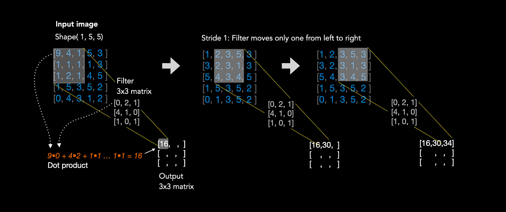

## Table of Contents

## What is a convolutional filter in machine learning?

A convolutional filter, often used in convolutional neural networks (CNNs), is a small matrix of numbers that slides over an input image to perform a mathematical operation called convolution. This operation helps the network detect specific features, like edges or textures, in different parts of the image. The filter, also known as a kernel, is applied by multiplying its values with the corresponding values of the image section it's currently over, and then summing these products to produce a single output value. This process is repeated across the entire image, creating a feature map that highlights where the specific feature is found.

Think of the convolutional filter as a magnifying glass that scans the image to find patterns. For instance, if the filter is designed to detect horizontal edges, it will produce high values in areas of the image where such edges exist. The values in the filter are learned during the training of the neural network, allowing it to become better at identifying the features it's meant to detect. By using multiple filters, each tuned to different features, the network can build a detailed understanding of the image, which is crucial for tasks like image classification or object detection.

## How does a convolutional filter work in image processing?

A convolutional filter in image processing is like a small window that moves across an image to find patterns. Imagine you have a picture, and you want to find all the straight lines in it. The filter, which is just a small grid of numbers, slides over the picture one step at a time. At each step, it multiplies its numbers with the numbers of the picture it's over and adds them up. This creates a new picture, called a feature map, that shows where the lines are. The filter's numbers, or weights, are chosen so that it looks for specific patterns, like edges or corners.

Let's say you want to find horizontal lines. Your filter might look like this: $$ \begin{bmatrix} -1 & -1 & -1 \\ 2 & 2 & 2 \\ -1 & -1 & -1 \end{bmatrix} $$. When this filter moves over the image, it will give high values where there are horizontal lines because the middle row of the filter (with positive numbers) will match the horizontal lines in the image. The other rows (with negative numbers) will cancel out areas without horizontal lines. By changing the numbers in the filter, you can make it look for different things, like vertical lines or even more complex patterns.

In practice, computers use these filters to help recognize objects in images. For example, if you're trying to find cars in a photo, you might use many different filters, each looking for different parts of a car, like wheels or windows. The computer learns which filters work best for finding cars by adjusting the numbers in the filters. This way, it can build a detailed picture of what a car looks like and spot them in new photos.

## What are the main components of a convolutional neural network (CNN)?

A convolutional neural network (CNN) is made up of several important parts that work together to understand images. The first main part is the convolutional layer. This layer uses small filters, or kernels, that move over the image to find patterns like edges or textures. Each filter does a math operation called convolution, which helps create a new image, called a feature map, that shows where these patterns are found. The filters' numbers, or weights, are learned by the network to get better at finding the right patterns. After convolution, an activation function, often ReLU (Rectified Linear Unit), is used to make the network more sensitive to important features and ignore less important ones.

The next key part is the pooling layer, which helps reduce the size of the feature maps and makes the network focus on the most important information. Pooling usually takes the highest value in a small area of the feature map, a process known as max pooling, to keep the most significant features. This helps the network work faster and still recognize the image even if it's moved or changed a bit. After several rounds of convolution and pooling, the data is flattened into a single column and fed into fully connected layers. These layers are like the brain of the network, making final decisions based on all the features found. They use weights to connect all the inputs to the outputs, and the network learns these weights to get better at its job, like telling apart cats and dogs in pictures.

Training a CNN involves adjusting the weights in the convolutional and fully connected layers to minimize the difference between the network's guesses and the correct answers. This is done using a method called backpropagation, where the error is calculated and used to update the weights, making the network's guesses more accurate over time. The whole process, from input image to final decision, helps the CNN learn to recognize and classify images with high accuracy.

## Why are convolutional filters important in deep learning?

Convolutional filters are important in deep learning because they help computers understand images better. These filters are small windows that move over an image, looking for patterns like lines or shapes. When a filter finds a pattern, it creates a new image, called a feature map, that shows where that pattern is in the original image. This is really helpful because it lets the computer focus on important parts of the image, like the edges of objects. The filters' numbers, or weights, are learned by the computer so it gets better at finding the right patterns. This makes the computer smarter at recognizing things in pictures.

Another reason convolutional filters are important is because they make deep learning models more efficient. By using these filters, the computer can process large images without needing too much memory or time. The filters also help the model recognize patterns even if the image is moved or changed a bit. This is because the filters look at small parts of the image and can find the same pattern in different places. This makes the model more flexible and better at understanding real-world images, where things can be in different positions or have different sizes. Overall, convolutional filters are a key part of making deep learning work well for tasks like recognizing objects in photos.

## How do you choose the size of a convolutional filter?

Choosing the right size for a convolutional filter depends on what you want the filter to do. If you want it to find small details in an image, like tiny lines or edges, you might use a small filter, like a 3x3 or 5x5 grid. These small filters can look closely at the image and pick up on fine details. On the other hand, if you want the filter to see bigger patterns, like the shape of a face or a car, you might use a larger filter, like a 7x7 or even bigger. The size of the filter affects how much of the image it can see at once, so you need to pick a size that matches the kind of pattern you're looking for.

Another thing to think about when choosing the filter size is how it affects the speed and size of your model. Smaller filters, like 3x3, need less memory and can make your model run faster because they do less math at each step. But you might need to use more of them to find the same patterns that a bigger filter could find in one go. Bigger filters, like 7x7, can find bigger patterns in one step but might slow down your model and use more memory. It's a balance between finding the right patterns and keeping your model efficient. In practice, people often start with smaller filters and add more layers to the model to find bigger patterns, which can work well and keep the model fast.

## What is the difference between a 1x1 and a 3x3 convolutional filter?

A 1x1 convolutional filter is really small, just one pixel wide and one pixel tall. It's like a tiny window that looks at each pixel in the image one at a time. This kind of filter is useful for changing the number of channels in an image, which can help make the model smaller and faster. It can also help the model learn to combine information from different parts of the image in a simple way. For example, if you have an image with many channels, a 1x1 filter can help reduce the number of channels without losing too much information.

A 3x3 convolutional filter is bigger, covering a 3 by 3 grid of pixels. This size is very common because it can find small patterns in the image, like edges or corners. When a 3x3 filter moves over the image, it looks at a small area and can see how the pixels around each other are related. This helps the model understand more about the structure of the image. For example, if you want to find the edges of objects in a picture, a 3x3 filter can do that well because it can see the change in pixel values over a small area.

## How does padding affect the output of a convolutional filter?

Padding is like adding a border around your image before you use a convolutional filter. When you add padding, you make the image bigger by putting extra pixels around the edges. This can change the size of the output you get after using the filter. If you don't add padding, the output will be smaller than the original image because the filter can't look at the edges of the image as well. But if you add padding, the output can be the same size as the original image or even bigger, depending on how much padding you use.

The formula to find out the size of the output after using a convolutional filter with padding is $$ \text{Output size} = \frac{\text{Input size} - \text{Filter size} + 2 \times \text{Padding}}{\text{Stride}} + 1 $$. Here, the "Input size" is how big your image is, the "Filter size" is how big your filter is, "Padding" is how many pixels you add around the image, and "Stride" is how many pixels the filter moves each time. If you set the padding to be half the size of the filter, like using a padding of 1 with a 3x3 filter, you can keep the output the same size as the input. This is called "same" padding because the output size is the same as the input size. If you don't use any padding, it's called "valid" padding, and the output will be smaller.

## What is the role of stride in convolutional filtering?

Stride in convolutional filtering is like the step size of the filter as it moves over the image. Imagine the filter as a small window that slides across the image. The stride tells you how many pixels the window moves each time. If the stride is 1, the window moves one pixel at a time. If it's 2, it moves two pixels at a time. A bigger stride means the filter covers the image faster but might miss some details because it's skipping over parts of the image.

The stride affects the size of the output you get after applying the filter. If you use a bigger stride, the output will be smaller because the filter is covering more ground with each step. The formula to calculate the output size with stride is $$ \text{Output size} = \frac{\text{Input size} - \text{Filter size} + 2 \times \text{Padding}}{\text{Stride}} + 1 $$. Here, "Input size" is how big your image is, "Filter size" is how big your filter is, "Padding" is how many pixels you add around the image, and "Stride" is how many pixels the filter moves each time. Choosing the right stride helps balance between processing speed and keeping important details in the image.

## How can convolutional filters help in feature extraction?

Convolutional filters are like tiny windows that move over an image to find important patterns, which is called feature extraction. Imagine you're looking for lines in a picture. The filter slides over the image, doing math to see if it finds lines. When it does, it creates a new picture, called a feature map, that shows where the lines are. The numbers in the filter, called weights, are learned by the computer to get better at finding the right patterns. This way, the computer can focus on important parts of the image, like the edges of objects, and ignore less important parts.

Using convolutional filters helps the computer understand images better because it can find different features at different levels. For example, early filters might find simple things like edges or corners, while later filters can find more complex patterns like shapes or textures. This is done by stacking layers of filters, where each layer builds on the features found by the layers before it. By doing this, the computer can build a detailed picture of what's in the image, which is crucial for tasks like recognizing objects or understanding scenes.

## What are some common architectures that use convolutional filters?

Convolutional filters are a key part of many popular deep learning architectures, like LeNet, AlexNet, and VGG. LeNet was one of the first to use these filters and helped show how good they are at understanding images. It has layers of filters that find simple patterns like edges and then more complex patterns like shapes. AlexNet made these ideas even better by using more layers and filters, which helped it win a big image recognition contest. VGG took this further by using many layers of small 3x3 filters, which helped it find even more detailed patterns in images.

Another important architecture is GoogLeNet, which introduced the idea of Inception modules. These modules use different sizes of filters at the same time, which helps the network find many kinds of patterns quickly. This makes GoogLeNet very efficient and good at recognizing objects in pictures. ResNet is another big one, known for its "residual" connections that help the network learn better by letting information skip some layers. This makes it easier for ResNet to handle very deep networks with many layers of filters, which can find very complex patterns in images.

## How do you implement a convolutional filter in a popular deep learning framework like TensorFlow or PyTorch?

To implement a convolutional filter in TensorFlow, you start by importing the necessary modules and setting up your data. You can use the `tf.keras.layers.Conv2D` layer to apply the filter. For example, if you want to use a 3x3 filter with 32 output channels and no padding, you would write `tf.keras.layers.Conv2D(32, (3, 3), padding='valid')`. The first number, 32, is how many different patterns the filter will look for. The `(3, 3)` tells the filter's size, and `padding='valid'` means the filter won't look at the edges of the image. You can add this layer to your model and then train it to learn the best numbers for the filter.

In PyTorch, implementing a convolutional filter is similar but uses different syntax. You import PyTorch and set up your data, then you use the `nn.Conv2d` module. For example, if you want to use a 3x3 filter with 32 output channels and no padding, you would write `nn.Conv2d(in_channels, 32, kernel_size=3, padding=0)`. Here, `in_channels` is the number of channels in your input image, 32 is the number of output channels, `kernel_size=3` sets the filter size to 3x3, and `padding=0` means no padding. You add this to your model and train it to find the best filter numbers.

Here's a simple example of how you might implement a convolutional filter in both TensorFlow and PyTorch:

```python
# TensorFlow example
import tensorflow as tf

model = tf.keras.Sequential([
    tf.keras.layers.Conv2D(32, (3, 3), padding='valid', activation='relu', input_shape=(28, 28, 1)),
    tf.keras.layers.MaxPooling2D((2, 2)),
    tf.keras.layers.Flatten(),
    tf.keras.layers.Dense(10, activation='softmax')
])

# PyTorch example
import torch
import torch.nn as nn

class SimpleCNN(nn.Module):
    def __init__(self):
        super(SimpleCNN, self).__init__()
        self.conv1 = nn.Conv2d(1, 32, kernel_size=3, padding=0)
        self.pool = nn.MaxPool2d(2, 2)
        self.fc1 = nn.Linear(32 * 13 * 13, 10)

    def forward(self, x):
        x = torch.relu(self.conv1(x))
        x = self.pool(x)
        x = x.view(-1, 32 * 13 * 13)
        x = self.fc1(x)
        return x
```

These examples show how to set up a basic convolutional neural network with one convolutional layer, a pooling layer, and a fully connected layer for classification.

## What advanced techniques can be used to optimize convolutional filters for better performance?

One advanced technique to optimize convolutional filters is called "depthwise separable convolutions." This method breaks down a regular convolutional filter into two smaller steps: a depthwise convolution and a pointwise convolution. The depthwise convolution uses a different filter for each input channel, which helps the network focus on important features in each channel without mixing them up right away. Then, the pointwise convolution combines these features using 1x1 filters. This approach can make the network faster and use less memory because it does less math overall. For example, if you have a 3x3 filter with 32 output channels and 64 input channels, a regular convolution would need $$3 \times 3 \times 32 \times 64$$ calculations. But with depthwise separable convolutions, you'd only need $$3 \times 3 \times 64 + 1 \times 1 \times 32 \times 64$$ calculations, which is a lot less.

Another technique is "dilated convolutions," which can help the filter see a bigger area of the image without making the filter bigger. In a dilated convolution, you add gaps between the numbers in the filter, like skipping every other pixel. This lets the filter look at a larger part of the image in one step, which can help find bigger patterns without using more memory or slowing down the network. For example, if you use a dilation rate of 2 with a 3x3 filter, it will actually look at a 5x5 area of the image. This can be really useful for tasks like image segmentation, where you need to understand the bigger picture of what's in the image. By using these advanced techniques, you can make your convolutional filters work better and help your network understand images more accurately.