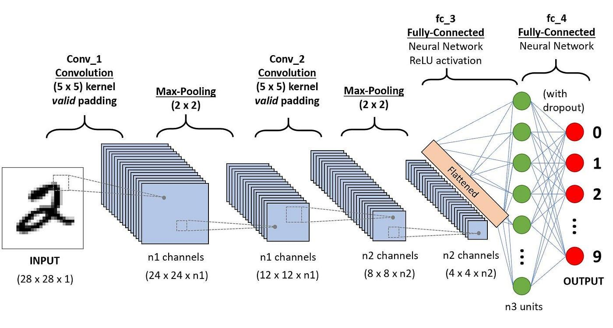

## Table of Contents

## What is a convolutional layer in the context of machine learning?

A convolutional layer is a part of a neural network, often used in image processing tasks. It works by applying filters to the input data to create feature maps that highlight certain patterns or features. Imagine you have a picture, and you want to find all the edges in it. The convolutional layer would use a filter that slides over the image, looking at small sections at a time, and helps to identify where the edges are.

The process involves a mathematical operation called convolution. If you have an input image and a filter, the convolution operation slides the filter across the image, performing a dot product at each position. This results in a new image, called a feature map, that represents how the filter's pattern matches the input at different locations. For example, if you use a filter designed to detect horizontal edges, the resulting feature map will show strong responses wherever horizontal edges are present in the original image. This helps the neural network understand and process the image more effectively.

## How does a convolutional layer differ from a fully connected layer?

A convolutional layer and a fully connected layer are both parts of neural networks, but they work in different ways. A convolutional layer is like a detective that looks for specific patterns in an image by using filters. Imagine you have a picture and you want to find all the edges. The convolutional layer slides a small window, called a filter, over the image and checks small parts at a time to see if those parts match the pattern the filter is looking for. This helps the network understand features like edges or textures without needing to look at the whole image at once.

On the other hand, a fully connected layer is more like a traditional neural network layer where every neuron in one layer is connected to every neuron in the next layer. It looks at the entire input at once, not just small parts like the convolutional layer does. This means it can learn to recognize more complex patterns, but it also means it needs a lot more data and can be slower to train. For example, if you have an image that's been processed by convolutional layers, the fully connected layer at the end might use all that information to decide what object is in the image.

In summary, convolutional layers are great for finding patterns in images by looking at small parts, while fully connected layers look at everything at once to make final decisions. Both are important, but they serve different purposes in a [neural network](/wiki/neural-network).

## What are the main components of a convolutional layer?

A convolutional layer has three main parts: filters, the convolution operation, and activation functions. Filters are small windows that slide over the input image. Each filter looks for a specific pattern, like edges or corners. When a filter slides over the image, it does a special math operation called convolution. This operation compares the filter with the part of the image it's over and creates a new image called a feature map. The feature map shows where the filter's pattern appears in the original image.

The second part, the convolution operation, is what makes the magic happen. Imagine you have a small 3x3 filter and a part of the image that's also 3x3. The convolution operation multiplies each number in the filter with the corresponding number in the image part, then adds them up. This result goes into the feature map. If you slide the filter over the whole image, you get a complete feature map. The math for this can be written as $$ (I \ast K)(i,j) = \sum_m \sum_n I(i+m, j+n) K(m,n) $$, where $$ I $$ is the input image, $$ K $$ is the filter, and $$ \ast $$ is the convolution operation.

The third part is the activation function. After the convolution operation, the numbers in the feature map go through an activation function, like ReLU (Rectified Linear Unit). ReLU makes any negative number zero and leaves positive numbers as they are. This helps the network learn better by making the feature map more useful. The activation function adds non-linearity to the model, which means it can learn more complex patterns. So, the convolutional layer uses filters, convolution, and activation functions to find and highlight important features in an image.

## Why are convolutional layers important in image processing tasks?

Convolutional layers are really important in image processing tasks because they help the computer understand images better. They do this by using filters that look for specific patterns in the image, like edges or corners. Imagine you're trying to find all the edges in a picture. The convolutional layer slides a small window, called a filter, over the image and checks small parts at a time to see if those parts have edges. This way, the computer can see where the edges are without looking at the whole picture at once. This makes the computer faster and more efficient at understanding what's in the image.

The math behind this is called convolution. When the filter slides over the image, it does a special math operation. If you have a small 3x3 filter and a part of the image that's also 3x3, the convolution operation multiplies each number in the filter with the corresponding number in the image part, then adds them up. This result goes into a new image called a feature map. The feature map shows where the filter's pattern appears in the original image. The formula for this is $$ (I \ast K)(i,j) = \sum_m \sum_n I(i+m, j+n) K(m,n) $$, where $$ I $$ is the input image, $$ K $$ is the filter, and $$ \ast $$ is the convolution operation. This process helps the computer break down the image into parts it can understand and use to recognize objects or patterns.

## What is the role of filters (kernels) in a convolutional layer?

Filters, also known as kernels, are small windows that slide over the input image in a convolutional layer. They are crucial because they look for specific patterns in the image, like edges or corners. Imagine you're trying to find all the edges in a picture. The filter slides over the image, checking small parts at a time to see if those parts have edges. This helps the computer understand where the edges are without looking at the whole picture at once. By using different filters, the convolutional layer can detect various features, making it easier for the computer to recognize objects or patterns in the image.

The math behind how filters work is called convolution. When a filter slides over the image, it does a special math operation. If you have a small 3x3 filter and a part of the image that's also 3x3, the convolution operation multiplies each number in the filter with the corresponding number in the image part, then adds them up. This result goes into a new image called a feature map. The feature map shows where the filter's pattern appears in the original image. The formula for this is $$ (I \ast K)(i,j) = \sum_m \sum_n I(i+m, j+n) K(m,n) $$, where $$ I $$ is the input image, $$ K $$ is the filter, and $$ \ast $$ is the convolution operation. This process helps the computer break down the image into parts it can understand and use to recognize objects or patterns.

## How does the convolution operation work in a convolutional layer?

The convolution operation in a convolutional layer is like a detective work where a small window, called a filter or kernel, slides over the entire input image. Imagine you have a picture and want to find edges or other patterns. The filter looks at small parts of the image at a time, doing a special math operation called convolution. This operation compares the filter with the part of the image it's over and creates a new image, called a feature map. The feature map shows where the filter's pattern appears in the original image. For example, if the filter is designed to detect horizontal edges, the feature map will highlight those edges in the image.

The math behind the convolution operation is straightforward but powerful. If you have a small 3x3 filter and a part of the image that's also 3x3, the convolution operation multiplies each number in the filter with the corresponding number in the image part, then adds them up. This result goes into the feature map. The formula for this is $$ (I \ast K)(i,j) = \sum_m \sum_n I(i+m, j+n) K(m,n) $$, where $$ I $$ is the input image, $$ K $$ is the filter, and $$ \ast $$ is the convolution operation. By sliding the filter over the whole image and doing this operation at each position, the convolutional layer can detect various features, helping the computer understand and process the image more effectively.

## What is the purpose of padding in convolutional layers, and what are the common types of padding?

Padding in convolutional layers is used to control the size of the output feature map. When a filter slides over an image, it can't go all the way to the edges without losing some information. Padding adds extra pixels around the image's border, so the filter can see the edges too. This helps keep the size of the output the same as the input, which is useful for stacking multiple convolutional layers without losing information. Without padding, each convolution would make the image smaller and smaller, which might not be what you want.

There are two common types of padding: zero padding and valid padding. Zero padding, also called same padding, adds zeros around the image's edges. This keeps the output size the same as the input size. For example, if you have a 5x5 image and use a 3x3 filter with zero padding, the output will still be 5x5. The formula for calculating the output size with zero padding is $$ \text{Output Size} = \frac{\text{Input Size} - \text{Filter Size} + 2 \times \text{Padding}}{ \text{Stride}} + 1 $$. Valid padding, on the other hand, doesn't add any extra pixels. It only uses the valid part of the image where the filter can fit completely. This usually results in a smaller output size. For a 5x5 image and a 3x3 filter with valid padding, the output would be 3x3.

## What is stride in a convolutional layer, and how does it affect the output?

Stride in a convolutional layer is like the step size the filter takes when it slides over the image. Imagine you're walking across a room. If you take big steps, you'll cover the room faster but might miss some details. If you take small steps, you'll see more details but it will take longer. In a convolutional layer, a bigger stride means the filter moves more pixels at a time, which can make the output smaller but faster to compute. A smaller stride means the filter moves fewer pixels, which can keep more details but makes the output larger and slower to compute.

The formula to calculate the output size when using stride is $$ \text{Output Size} = \frac{\text{Input Size} - \text{Filter Size} + 2 \times \text{Padding}}{\text{Stride}} + 1 $$. For example, if you have a 5x5 image, use a 3x3 filter, add 1 pixel of padding on each side, and use a stride of 2, the output size would be $$ \frac{5 - 3 + 2 \times 1}{2} + 1 = 2 $$. So, the output would be a 2x2 feature map. By changing the stride, you can control how much the image gets shrunk and how much detail is kept in the output.

## How do pooling layers typically interact with convolutional layers in a neural network?

Pooling layers work together with convolutional layers to make neural networks better at understanding images. After a convolutional layer finds patterns like edges or corners in an image, a pooling layer comes in to make the information easier to handle. It does this by shrinking the image, focusing on the most important parts. Imagine you have a big picture of a cat. The convolutional layer finds all the edges, but there are too many details. The pooling layer then takes those edges and makes them simpler, so the computer can process the image faster and still know it's a cat.

The most common type of pooling is max pooling. It looks at small parts of the image and picks the biggest number in each part. This helps the network keep the most important information while getting rid of less important details. For example, if you have a 4x4 image and use a 2x2 max pooling with a stride of 2, the output will be a 2x2 image. The formula for calculating the output size of max pooling is $$ \text{Output Size} = \frac{\text{Input Size} - \text{Pooling Size}}{\text{Stride}} + 1 $$. By working together, convolutional and pooling layers help the neural network understand and process images more efficiently.

## What are some advanced techniques used in convolutional layers, such as dilated convolutions?

Dilated convolutions are a special type of convolution that helps the neural network see a bigger part of the image without using more filters. Imagine you have a picture and want to find patterns that are spread out. A regular convolution uses a filter that slides over the image, looking at small parts at a time. A dilated convolution adds gaps between the pixels in the filter, so it can see more of the image at once. For example, if you use a 3x3 filter with a dilation rate of 2, the filter will actually cover a 5x5 area of the image. The formula for calculating the effective filter size with dilation is $$ \text{Effective Size} = (\text{Filter Size} - 1) \times \text{Dilation Rate} + 1 $$. This technique is useful for tasks like image segmentation, where you need to understand the bigger picture.

Another advanced technique is the use of depthwise separable convolutions. This method splits the convolution into two steps: depthwise convolution and pointwise convolution. In the depthwise step, each filter only looks at one channel of the input image at a time. This reduces the number of calculations needed. Then, in the pointwise step, 1x1 convolutions are used to combine the results from the depthwise step. This technique can make the network run faster and use less memory while still finding important patterns in the image. It's especially helpful for mobile devices where computing power is limited.

## How can one optimize the performance of convolutional layers in terms of computational efficiency?

To make convolutional layers work faster and use less computer power, one way is to use smaller filters. Big filters take a lot of time to slide over the image and do calculations. By using smaller filters, like 3x3 instead of 5x5, the computer has to do fewer calculations. Another way is to use fewer filters. Each filter looks for a different pattern in the image, so if you have too many, it can slow things down. By choosing the right number of filters, you can make the network faster without losing too much information. You can also use techniques like depthwise separable convolutions, which split the convolution into two steps. This can make the network run faster and use less memory.

Another important technique is to use stride and padding wisely. Stride is like the step size the filter takes when it moves over the image. A bigger stride means the filter moves more pixels at a time, which can make the output smaller and faster to compute. The formula for calculating the output size with stride is $$ \text{Output Size} = \frac{\text{Input Size} - \text{Filter Size} + 2 \times \text{Padding}}{\text{Stride}} + 1 $$. Padding adds extra pixels around the image's edges, so the filter can see the edges too. This helps keep the size of the output the same as the input, which is useful for stacking multiple convolutional layers without losing information. By choosing the right stride and padding, you can control the size of the output and make the network more efficient.

## What are some recent innovations or research directions in the field of convolutional layers?

Recent innovations in convolutional layers have focused on improving their efficiency and effectiveness. One exciting direction is the development of attention mechanisms in convolutional neural networks (CNNs). Attention mechanisms help the network focus on the most important parts of an image, similar to how a human might pay more attention to certain details. This can make the network better at tasks like image recognition and segmentation. Another innovation is the use of neural architecture search (NAS), which uses other algorithms to automatically design the best structure for convolutional layers. This can lead to more efficient and powerful networks without the need for manual design.

Another area of research is the integration of convolutional layers with other types of neural network layers. For example, combining convolutional layers with transformer layers, which are good at understanding sequences and relationships, can improve performance on tasks like video analysis. Researchers are also exploring the use of dynamic convolutions, where the filter's shape or size can change based on the input. This can make the network more flexible and better at handling different types of data. By constantly pushing the boundaries of what convolutional layers can do, researchers are making them more versatile and powerful tools for [machine learning](/wiki/machine-learning).