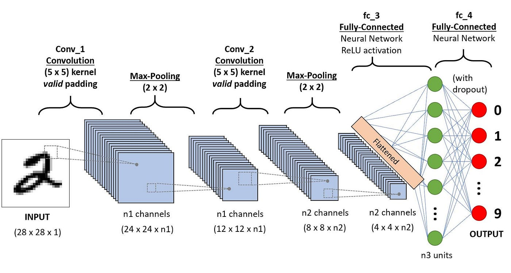

The world of artificial intelligence is vast and spans many fields and applications, from speech recognition to weather prediction. One term you may have heard in this context is "Convolutional Neural Network" (CNN). Particularly powerful for processing data with a grid topology, such as images, CNNs are playing an increasingly important role in the world of algorithmic trading.

## Table of Contents

## What is a CNN?

A Convolutional Neural Network (CNN) is a type of deep learning model designed to process data with a grid topology (for example, an image) by applying a series of filters. The main distinction between CNNs and other neural networks is their ability to automatically detect and learn spatial hierarchies of patterns from images.

## Typical architecture of a CNN

The typical architecture of a CNN begins with an input layer that receives raw data, such as an image. This is followed by convolution layers that convolve the data to extract features. After each convolution layer, an activation function is generally used, with the ReLU function being the most common. Next comes pooling or sub-sampling, which is used to reduce the dimensionality of the data. The extracted features are then passed on to fully connected (FC) layers, which make decisions based on these features. Finally, the CNN ends with an output layer that gives the network's final prediction.

## CNN in algorithmic trading

In the context of algorithmic trading, CNNs have several applications. They can be used to analyze market data.

Financial market data encompasses more than just numbers; it includes graphs, heatmaps and other visual representations. These elements can be analyzed by CNNs to detect patterns or trends.

Furthermore, when it comes to pattern recognition, traders often look for specific chart configurations, such as the "double bottom" or the "head and shoulders". CNNs can be trained to automatically identify these patterns.

Finally, for news analysis, even if financial information is predominantly text-based, CNNs can process the associated images, such as charts or infographics, that frequently accompany articles.

## Conclusion

The Convolutional Neural Network (CNN) is undoubtedly one of the cornerstones of computer vision in the field of artificial intelligence. With constant advances in technology and computing power, it's plausible to think that CNNs will play an even more dominant role in the future of algorithmic trading. As a trader or developer wishing to integrate AI into trading strategies, it is imperative to understand the potential and applications of CNNs.

💡 **Read more:**

- Trading strategies papers with code on [Equities](https://wiki.paperswithbacktest.com/trading-strategies/equities), [Cryptocurrencies](https://wiki.paperswithbacktest.com/trading-strategies/cryptocurrencies), [Commodities](https://wiki.paperswithbacktest.com/trading-strategies/commodities), [Currencies](https://wiki.paperswithbacktest.com/trading-strategies/currencies), [Bonds](https://wiki.paperswithbacktest.com/trading-strategies/bonds), [Options](https://wiki.paperswithbacktest.com/trading-strategies/options)
- [A curated list](https://github.com/paperswithbacktest/awesome-systematic-trading) of awesome libraries, packages, strategies, books, blogs, and tutorials for systematic trading
- [A bunch of datasets](https://huggingface.co/paperswithbacktest) for quantitative trading
- [A website to help you](https://paperswithbacktest.com/) become a quant trader and achieve financial independence