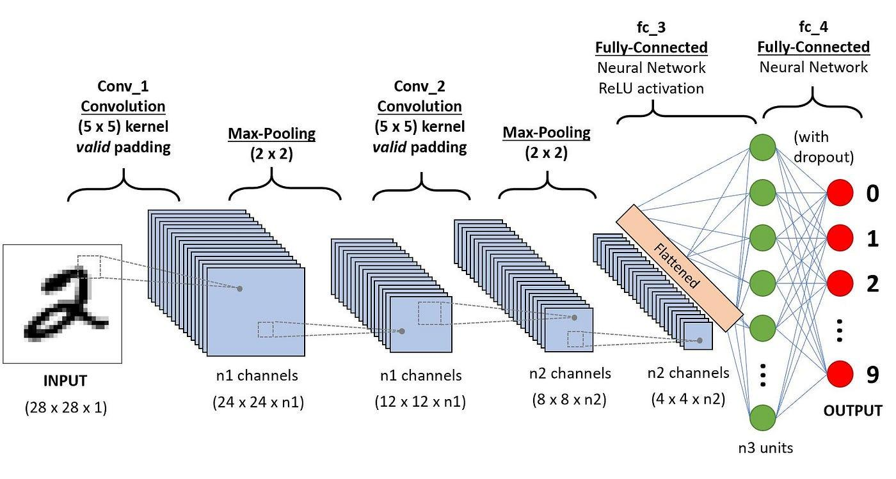

## Table of Contents

## What is a Convolutional Neural Network (CNN) and how does it differ from other neural networks?

A Convolutional Neural Network (CNN) is a type of neural network often used in image recognition and processing tasks. Unlike traditional neural networks, CNNs are designed to take advantage of the 2D structure of image data. They do this by applying a series of filters, or kernels, to the input data through a process called convolution. This allows the network to learn spatial hierarchies in the data, starting from simple features like edges and progressing to more complex patterns like shapes and objects.

The main difference between CNNs and other neural networks, like fully connected neural networks, lies in their architecture and the way they process data. In a fully connected neural network, every neuron in one layer is connected to every neuron in the next layer, which can lead to a high number of parameters and make the network computationally expensive. In contrast, a CNN uses shared weights and local connections, which significantly reduces the number of parameters and makes the network more efficient. Additionally, CNNs often include pooling layers that downsample the data, further reducing computational load and helping the network to be more robust to variations in the input.

In summary, CNNs are specialized for handling image data and are more efficient than traditional neural networks due to their unique architecture. They use convolution and pooling operations to extract features from images, making them particularly effective for tasks like image classification, object detection, and facial recognition.

## How does the convolution operation work in CNNs?

In a Convolutional Neural Network, the convolution operation is like sliding a small window, called a kernel or filter, over the input image. This kernel is a small matrix of numbers, and as it moves across the image, it performs a mathematical operation at each position. The operation involves multiplying the values in the kernel with the corresponding values in the part of the image it's currently over, and then summing these products up. This sum becomes a single value in a new, smaller image called a feature map. The kernel slides across the entire image, creating a feature map that highlights specific features like edges or textures.

For example, if you have a 5x5 image and a 3x3 kernel, the kernel will move across the image, performing the convolution at each position. If the kernel is at the top-left corner of the image, it will multiply its values with the corresponding values in the top-left 3x3 section of the image, sum them up, and place the result in the top-left of the feature map. As the kernel moves to the right and down, it continues this process, creating a feature map that captures the presence of the pattern the kernel is designed to detect. This process can be repeated with different kernels to detect various features in the image, building up a rich representation of the image's content.

The mathematical formula for convolution can be expressed as:

$$
\text{Output}(i, j) = \sum_m \sum_n \text{Input}(i+m, j+n) \cdot \text{Kernel}(m, n)
$$

Here, `Output(i, j)` is the value at position `(i, j)` in the feature map, `Input(i+m, j+n)` is the value at position `(i+m, j+n)` in the input image, and `Kernel(m, n)` is the value at position `(m, n)` in the kernel. This formula shows how the convolution operation combines the input image and the kernel to produce the feature map.

## What are the main components of a CNN architecture?

A CNN architecture typically includes several key components that work together to process and analyze image data. The first component is the convolutional layer, which applies filters to the input image to extract features. These filters, or kernels, slide over the image, performing a convolution operation to create feature maps that highlight different aspects of the image, like edges or textures. The convolution operation can be expressed as $$ \text{Output}(i, j) = \sum_m \sum_n \text{Input}(i+m, j+n) \cdot \text{Kernel}(m, n) $$. After convolution, an activation function, often ReLU (Rectified Linear Unit), is applied to introduce non-linearity into the model, helping it learn more complex patterns.

Following the convolutional layer, a pooling layer is often used to reduce the spatial dimensions of the feature maps, which helps to decrease the computational load and make the network more robust to variations in the input. Common pooling operations include max pooling, which takes the maximum value in a small region of the feature map, and average pooling, which takes the average. After several rounds of convolution and pooling, the data is flattened and fed into fully connected layers, which are similar to those in traditional neural networks. These layers combine the features learned by the convolutional and pooling layers to make final predictions. The output of the fully connected layers can be passed through a softmax function to produce probabilities for different classes in classification tasks.

In addition to these core components, CNNs may also include other elements like dropout layers to prevent overfitting, and batch normalization layers to stabilize the learning process. Dropout randomly deactivates a portion of neurons during training, which helps the network generalize better to new data. Batch normalization normalizes the inputs to a layer for each mini-batch, which can speed up training and improve the stability of the network. Together, these components form a powerful architecture for tasks like image classification, object detection, and more.

## What is the role of pooling layers in CNNs?

Pooling layers in CNNs help reduce the size of the data that needs to be processed. They do this by taking small sections of the feature maps created by the convolutional layers and summarizing them into a single value. This process is called downsampling. By reducing the size of the data, pooling layers make the network faster and more efficient. They also help the network focus on the most important features by keeping only the most significant information from each section of the feature map.

One common type of pooling is max pooling, which takes the highest value from a small region of the feature map. For example, if you have a 2x2 section of the feature map, max pooling will keep only the largest number from that section. Another type is average pooling, which takes the average of the values in the section. Both methods help the network be more robust to small changes in the input image, like shifts or rotations, because they focus on the general patterns rather than the exact positions of the features. This makes the network better at recognizing objects even if they are slightly different from the training images.

## How do activation functions like ReLU contribute to CNN performance?

Activation functions like ReLU help CNNs learn better by adding non-linearity to the model. Without non-linearity, a [neural network](/wiki/neural-network) would just be a series of linear operations, and it would be limited in what it can learn. ReLU, which stands for Rectified Linear Unit, is a simple function that returns zero for negative inputs and the input itself for positive inputs. This can be written as $$ \text{ReLU}(x) = \max(0, x) $$. By using ReLU, the network can learn more complex patterns and relationships in the data, making it better at tasks like recognizing objects in images.

ReLU also helps with the problem of vanishing gradients, which can slow down or stop the learning process in deep networks. When gradients get very small as they flow backward through the layers, it becomes hard for the network to update its weights effectively. ReLU helps because it doesn't squash its output like some other activation functions, so the gradients can flow more easily. This makes training deep CNNs faster and more reliable, leading to better performance overall.

## What is the significance of the AlexNet architecture in the history of CNNs?

AlexNet, introduced in 2012, was a game-changer for Convolutional Neural Networks (CNNs) and [deep learning](/wiki/deep-learning) in general. It won the ImageNet Large Scale Visual Recognition Challenge (ILSVRC) by a huge margin, showing that deep learning could achieve much better results than traditional methods. AlexNet used a deeper architecture than previous networks, with eight layers, including five convolutional layers and three fully connected layers. This helped it learn more complex features from images, making it better at recognizing different objects.

One of the key innovations of AlexNet was the use of ReLU activation functions instead of the more common sigmoid or tanh functions. ReLU, which stands for Rectified Linear Unit and can be written as $$ \text{ReLU}(x) = \max(0, x) $$, helped the network train faster and avoid the problem of vanishing gradients. AlexNet also used techniques like [data augmentation](/wiki/data-augmentation) and dropout to prevent overfitting, which improved its performance even more. Overall, AlexNet showed the world the power of deep CNNs and set the stage for many of the advances in computer vision that followed.

## How does transfer learning apply to CNNs and what are its benefits?

Transfer learning is a way to use what a CNN has learned from one task to help it with another task. Imagine you taught a CNN to recognize dogs in pictures. Now, you want it to recognize cats. Instead of starting from scratch, you can use the knowledge it already has about dogs to help it learn about cats faster. This is done by taking a pre-trained CNN, like one trained on a large dataset like ImageNet, and using its early layers, which have learned to detect basic features like edges and shapes. Then, you add new layers on top or fine-tune the existing layers to make the network good at the new task, like recognizing cats.

The benefits of transfer learning are big. First, it saves time and computing power because you don't need to train the whole network from the start. This is especially helpful if you don't have a lot of data for your new task. Second, it often leads to better performance because the network starts with a good understanding of basic features. For example, if you're trying to classify different types of flowers, a network pre-trained on general images can already recognize petals and leaves, so it can focus on learning the specific differences between flower types. This makes transfer learning a powerful tool in the world of CNNs.

## What are some common CNN architectures like VGG, ResNet, and Inception, and how do they differ?

VGG, ResNet, and Inception are popular CNN architectures each designed to improve on previous models in different ways. VGG, introduced in 2014, is known for its simplicity and uniform structure. It uses many small 3x3 convolutional layers stacked on top of each other, which helps it learn complex features. VGG is easy to understand and implement but can be computationally expensive because of its depth. On the other hand, ResNet, short for Residual Network, introduced in 2015, solves this problem by using "skip connections" or "residual blocks." These allow the network to train deeper layers more effectively by allowing the gradient to flow directly through the network, helping to avoid the vanishing gradient problem. The formula for a residual block can be written as $$ y = F(x) + x $$, where $$ F(x) $$ is the output of the convolutional layers and $$ x $$ is the input.

Inception, also known as GoogLeNet, introduced in 2014, takes a different approach by using "Inception modules." These modules apply multiple filter sizes at the same time, like 1x1, 3x3, and 5x5, and then concatenate the results. This allows the network to capture features at different scales efficiently. Inception also uses 1x1 convolutions to reduce the number of parameters, making it computationally lighter than VGG. Each of these architectures has its strengths: VGG is straightforward and good for understanding CNNs, ResNet allows for very deep networks, and Inception is efficient and good at capturing multi-scale features. Choosing the right architecture depends on the specific task and the resources available.

## How do advanced CNN architectures like EfficientNet and MobileNet optimize for performance and efficiency?

EfficientNet and MobileNet are advanced CNN architectures designed to be both powerful and efficient. EfficientNet uses a technique called compound scaling, which means it balances the depth, width, and resolution of the network to get the best performance with the least amount of computing power. This helps EfficientNet achieve great results without using too many resources. It also uses something called "squeeze-and-excitation" blocks, which help the network focus on the most important parts of the image. This makes EfficientNet very good at tasks like image classification while keeping the network size small.

MobileNet, on the other hand, is designed specifically for mobile and embedded devices, where computing power is limited. It uses depthwise separable convolutions, which break down the traditional convolution into two simpler steps. This reduces the number of calculations needed, making the network faster and more efficient. MobileNet also uses 1x1 convolutions to reduce the number of parameters, similar to Inception. By doing this, MobileNet can run well on phones and other small devices, making it a popular choice for apps that need to process images quickly and with low power usage.

## What are 3D CNNs and how are they applied in video and volumetric data analysis?

3D CNNs are a type of CNN that work with 3D data instead of the usual 2D images. They are good for analyzing things like videos and medical scans, where you have depth along with height and width. In a 3D CNN, the filters or kernels are 3D, too. They slide through the data in three dimensions, looking for patterns and features. This is different from regular CNNs, which only look at 2D slices. The convolution in a 3D CNN can be written as $$ \text{Output}(i, j, k) = \sum_m \sum_n \sum_p \text{Input}(i+m, j+n, k+p) \cdot \text{Kernel}(m, n, p) $$. This formula shows how the 3D kernel moves across the 3D input to create a 3D feature map.

In video analysis, 3D CNNs can understand how things move and change over time. They look at several frames together, not just one at a time, which helps them see actions and movements better. For example, they can be used to recognize what kind of action a person is doing in a video, like running or dancing. In medical imaging, 3D CNNs can analyze CT or MRI scans, which are 3D pictures of the inside of the body. They can help doctors find and understand things like tumors or other health issues by looking at the whole 3D image instead of just slices. This makes 3D CNNs very useful for tasks where understanding depth and time is important.

## How can CNNs be used for object detection and segmentation tasks?

CNNs can be used for object detection by finding and labeling objects in an image. They do this by using something called a sliding window, where the network looks at different parts of the image to see if there are any objects. One popular method is called R-CNN, which stands for Region-based Convolutional Neural Network. It first finds areas in the image that might have objects, then uses a CNN to see what those objects are. Another method, called YOLO (You Only Look Once), is faster because it looks at the whole image at once and predicts where objects are and what they are in one go. Both methods use CNNs to understand what's in the image and where it is.

For segmentation tasks, CNNs help by figuring out which pixels in an image belong to which object. This is called semantic segmentation when the network labels each pixel with a class, like "car" or "tree." A famous model for this is called U-Net, which uses a special shape to both downsample and upsample the image, helping it understand the big picture and the small details. For instance-segmentation, the network not only labels pixels but also separates different instances of the same object, like telling apart two different cars in a parking lot. CNNs like Mask R-CNN do this by combining object detection with segmentation, creating masks for each detected object. Both types of segmentation help computers understand images in a more detailed way.

## What are the latest developments in CNN research and their potential impact on future applications?

Recent developments in CNN research focus on making these networks more efficient and powerful. One big trend is the use of attention mechanisms, which help the network focus on the most important parts of an image. This idea comes from transformers, which are very good at understanding text. By adding attention to CNNs, researchers can make them better at tasks like image recognition and object detection. Another trend is the use of self-supervised learning, where the network learns from the data itself without needing labeled examples. This can help CNNs learn more about the world from huge amounts of data, making them better at understanding and working with images.

These developments could have a big impact on future applications. For example, more efficient CNNs could run on smaller devices like smartphones, making advanced image processing available to more people. Self-supervised learning could help in fields like medicine, where there might not be enough labeled data to train a network. By learning from the data itself, these networks could help doctors analyze medical images more accurately. Overall, these advances could lead to smarter and more accessible technology for everyone.

## References & Further Reading

[1]: LeCun, Y., Bengio, Y., & Hinton, G. (2015). ["Deep learning."](https://www.nature.com/articles/nature14539) Nature, 521(7553), 436-444.

[2]: Krizhevsky, A., Sutskever, I., & Hinton, G. E. (2012). ["ImageNet classification with deep convolutional neural networks."](https://dl.acm.org/doi/10.1145/3065386) Advances in Neural Information Processing Systems 25.

[3]: He, K., Zhang, X., Ren, S., & Sun, J. (2016). ["Deep residual learning for image recognition."](https://ieeexplore.ieee.org/document/7780459) Proceedings of the IEEE Conference on Computer Vision and Pattern Recognition.

[4]: Simonyan, K., & Zisserman, A. (2014). ["Very deep convolutional networks for large-scale image recognition."](https://arxiv.org/abs/1409.1556) arXiv preprint arXiv:1409.1556.

[5]: Szegedy, C., Liu, W., Jia, Y., Sermanet, P., Reed, S., Anguelov, D., ... & Rabinovich, A. (2015). ["Going deeper with convolutions."](https://ieeexplore.ieee.org/document/7298594) Proceedings of the IEEE Conference on Computer Vision and Pattern Recognition.

[6]: Howard, A. G., Zhu, M., Chen, B., Kalenichenko, D., Wang, W., Weyand, T., ... & Adam, H. (2017). ["MobileNets: Efficient convolutional neural networks for mobile vision applications."](https://arxiv.org/abs/1704.04861) arXiv preprint arXiv:1704.04861.

[7]: Tan, M., & Le, Q. (2019). ["EfficientNet: Rethinking model scaling for convolutional neural networks."](https://arxiv.org/abs/1905.11946) arXiv preprint arXiv:1905.11946.

[8]: Ronneberger, O., Fischer, P., & Brox, T. (2015). ["U-Net: Convolutional networks for biomedical image segmentation."](https://link.springer.com/chapter/10.1007/978-3-319-24574-4_28) International Conference on Medical Image Computing and Computer-Assisted Intervention.