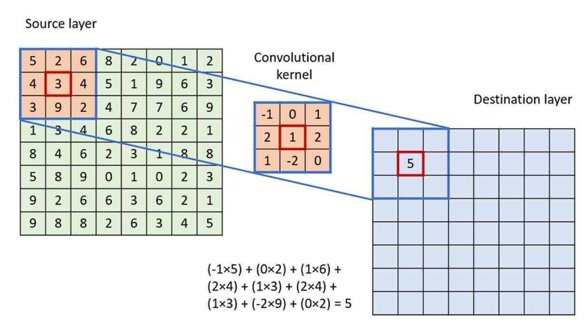

## Table of Contents

## What is a convolutional operation in the context of machine learning?

A convolutional operation in machine learning is a key part of convolutional neural networks (CNNs), which are commonly used in image processing and other tasks where spatial data is important. Think of it like using a special filter or a small window that slides over your data, usually an image. This filter looks at small parts of the image at a time and helps the network understand features like edges, corners, or even more complex patterns as it moves across the entire image. The filter performs a mathematical operation called convolution, where it multiplies its values with the corresponding values in the image section it's currently looking at and then sums them up to create a new value.

The mathematical process of convolution can be described with a simple formula. If we have an input image $$I$$ and a filter $$K$$, the output value $$O$$ at a given position can be calculated as $$O(x, y) = \sum_{i} \sum_{j} I(x+i, y+j) \cdot K(i, j)$$. This means that for every position in the output, we take the sum of the products of the overlapping values of the input and the filter. This operation helps the network detect specific features by emphasizing certain patterns and reducing the importance of others. As the filter moves across the entire image, it creates a new, transformed version of the image that captures these features, which can then be used by subsequent layers in the network to make predictions or classify the image.

## How does a convolutional operation differ from traditional matrix multiplication?

A convolutional operation is different from traditional matrix multiplication because it uses a small filter that slides over the entire input, like an image. This filter looks at small parts of the image at a time and performs a special calculation. In traditional matrix multiplication, you multiply every element of one matrix with every element of another matrix and then sum them up to get a new matrix. But in convolution, the filter only looks at a small area of the input at once, and it slides across the whole input to create the output.

The math behind convolution is a bit different too. In convolution, you use the filter to multiply and sum values from a small part of the input at a time. If we have an input image $$I$$ and a filter $$K$$, the output value $$O$$ at a given position can be calculated as $$O(x, y) = \sum_{i} \sum_{j} I(x+i, y+j) \cdot K(i, j)$$. This is different from matrix multiplication where you might multiply the whole matrices together. Convolution focuses on local patterns and helps the network understand features like edges or textures in images.

## What are the key components of a convolutional layer in a neural network?

A convolutional layer in a [neural network](/wiki/neural-network) has a few important parts. The first is the filter or kernel, which is a small matrix that slides over the input data, like an image. As it moves, it looks at small sections of the image and performs a calculation called convolution. This calculation helps the network find patterns, like edges or shapes, in the image. The size of the filter, how many filters you use, and how they move across the image are all things you can change to make the layer work better for your task.

Another key part is the stride, which decides how the filter moves across the image. A bigger stride means the filter jumps over more pixels each time it moves, which can make the output smaller. Padding is also important. It adds extra pixels around the edge of the image so the filter can still look at the edges and corners without missing any parts. This can help keep the output the same size as the input if you want.

The last part is the activation function, which is used after the convolution to add non-linearity to the network. This helps the network learn more complex patterns. A common choice is the ReLU (Rectified Linear Unit) function, which is simple but effective. It turns any negative values to zero and leaves positive values as they are. This helps the network focus on the important features it has found.

## Why are convolutional operations important in image processing tasks?

Convolutional operations are really important in image processing because they help computers understand what's in a picture. They do this by using a small filter that moves over the image, looking at small parts at a time. This filter helps the computer find patterns, like edges or shapes, which are important for recognizing things in the image. For example, if you want a computer to tell if a picture has a cat or a dog, it needs to see the ears, eyes, and other features. The filter helps the computer see these details by focusing on small areas and then putting it all together.

The math behind this is called convolution. If we have an image $$I$$ and a filter $$K$$, the output value $$O$$ at a certain spot can be calculated as $$O(x, y) = \sum_{i} \sum_{j} I(x+i, y+j) \cdot K(i, j)$$. This formula means that for every spot in the output, we take the sum of the products of the overlapping values of the image and the filter. This way, the computer can pick up on the important patterns in the image, like the shape of a nose or the curve of a tail. By using many filters and stacking them in layers, the computer can learn to recognize more and more complex patterns, which makes it better at tasks like identifying objects or detecting faces in photos.

## What is the role of filters (kernels) in convolutional operations?

Filters, also known as kernels, are small matrices that play a crucial role in convolutional operations. They slide over the input image, examining small sections at a time. This process helps the computer identify specific features within the image, such as edges, corners, or textures. Each filter is designed to detect a particular type of pattern. For instance, one filter might be good at finding vertical lines, while another might be better at spotting circles. By applying different filters, the computer can build a detailed understanding of the image's content.

The mathematical operation performed by a filter is called convolution. If we have an input image $$I$$ and a filter $$K$$, the output value $$O$$ at a given position can be calculated as $$O(x, y) = \sum_{i} \sum_{j} I(x+i, y+j) \cdot K(i, j)$$. This formula means that for every position in the output, we take the sum of the products of the overlapping values of the image and the filter. This process allows the computer to emphasize certain patterns in the image and reduce the importance of others. As the filter moves across the entire image, it creates a new, transformed version of the image that highlights these features, which can then be used by subsequent layers in the neural network to make predictions or classify the image.

## How do you calculate the output size of a convolutional layer?

To calculate the output size of a convolutional layer, you need to consider a few things: the size of your input, the size of your filter, the stride, and the padding. The formula to find the output size is $$O = \frac{(W - K + 2P)}{S} + 1$$, where $$O$$ is the output size, $$W$$ is the input size, $$K$$ is the filter size, $$P$$ is the padding, and $$S$$ is the stride. Let's break it down: the input size $$W$$ is how big your image is, the filter size $$K$$ is how big your filter is, the padding $$P$$ is how many pixels you add around your image, and the stride $$S$$ is how many pixels the filter moves each time.

Let's say you have an input image of size 32x32, a filter of size 5x5, no padding, and a stride of 1. Using the formula, the output size would be $$O = \frac{(32 - 5 + 2 \cdot 0)}{1} + 1 = \frac{27}{1} + 1 = 28$$. So, the output size would be 28x28. If you change any of these values, like adding padding or increasing the stride, the output size will change too. For example, with a padding of 2 and a stride of 2, the output size would be $$O = \frac{(32 - 5 + 2 \cdot 2)}{2} + 1 = \frac{31}{2} + 1 = 16.5$$, but since we can't have half a pixel, we round down to the nearest whole number, so the output size would be 16x16.

## What is padding and why is it used in convolutional operations?

Padding is when you add extra pixels around the edges of your image before you use a filter to look at it. This helps make sure the filter can look at the edges and corners of the image without missing any parts. If you didn't add padding, the output from the filter would be smaller than the input image because the filter wouldn't be able to look at the edges fully. Padding helps keep the output the same size as the input if you want, or it can help control how much smaller the output gets.

You can choose how much padding to add. A common choice is to add the same number of pixels as half the size of the filter on each side. This is called "same" padding because it keeps the output the same size as the input. If you don't add any padding, it's called "valid" padding, and the output will be smaller. The formula to calculate the output size with padding is $$O = \frac{(W - K + 2P)}{S} + 1$$, where $$O$$ is the output size, $$W$$ is the input size, $$K$$ is the filter size, $$P$$ is the padding, and $$S$$ is the stride. By changing the padding, you can control how the filter sees the edges of your image and how big the output will be.

## What is the concept of stride in convolutional operations and its impact on the output?

Stride in convolutional operations is like the step size the filter takes as it moves over the image. Imagine the filter as a small window that slides across the image. If the stride is 1, the filter moves one pixel at a time, looking at every possible small section of the image. But if the stride is bigger, like 2, the filter jumps over more pixels each time, so it looks at fewer sections of the image. This means the output from the convolution will be smaller because the filter is skipping over parts of the image.

The impact of stride on the output size can be calculated with a formula. The formula to find the output size is $$O = \frac{(W - K + 2P)}{S} + 1$$, where $$O$$ is the output size, $$W$$ is the input size, $$K$$ is the filter size, $$P$$ is the padding, and $$S$$ is the stride. If you increase the stride, the denominator in the formula gets bigger, which makes the output size smaller. For example, if you have an input image of size 32x32, a filter of size 5x5, no padding, and a stride of 1, the output size would be 28x28. But if you change the stride to 2, the output size becomes 14x14. So, a larger stride reduces the amount of computation needed but also reduces the spatial dimensions of the output.

## How does pooling work in conjunction with convolutional operations?

Pooling is like a way to make the image smaller and simpler after the convolutional operation. It looks at small parts of the image that the convolutional layer has already looked at and picks out the most important parts. There are different ways to do pooling, but the most common is called max pooling. In max pooling, you take a small section of the image, like a 2x2 square, and you keep only the biggest number in that square. This helps the computer focus on the most important features and makes the image smaller, which is good because it makes the computer work faster and helps it see the bigger picture.

When you use pooling with convolutional operations, you usually do the convolution first, and then you do the pooling. The convolutional layer uses filters to find patterns in the image, like edges or shapes. After that, the pooling layer makes the image smaller by [picking](/wiki/asset-class-picking) out the most important parts. This combination helps the computer understand the image better. If you have an input image of size 32x32 and you use a convolutional layer with a filter size of 5x5 and no padding, the output might be 28x28. If you then use a max pooling layer with a 2x2 pool size and a stride of 2, the output size would become 14x14. The formula to calculate the output size of a pooling layer is $$O = \frac{(W - K)}{S} + 1$$, where $$O$$ is the output size, $$W$$ is the input size, $$K$$ is the pool size, and $$S$$ is the stride.

## What are some advanced techniques used in convolutional operations, such as dilated convolutions?

Dilated convolutions are a special kind of convolutional operation that help the computer see a bigger part of the image without making the output bigger. Imagine the filter as a small window that slides over the image. In a regular convolution, this window moves one pixel at a time, but in a dilated convolution, it skips over some pixels. This is like adding holes to the filter, which lets it look at a larger area of the image without increasing the number of calculations. The amount of skipping is called the dilation rate. If the dilation rate is 2, the filter skips over one pixel between each value it looks at. This helps the computer understand the image better, especially when it needs to see larger patterns or details that are spread out.

The formula for dilated convolution is a bit different from regular convolution. If we have an input image $$I$$ and a filter $$K$$ with a dilation rate $$d$$, the output value $$O$$ at a given position can be calculated as $$O(x, y) = \sum_{i} \sum_{j} I(x + d \cdot i, y + d \cdot j) \cdot K(i, j)$$. This means that for every position in the output, we take the sum of the products of the values in the image that are $$d$$ pixels apart and the corresponding values in the filter. Dilated convolutions are useful in tasks like image segmentation, where understanding the context of larger areas in the image is important. They help the computer see more without making the network bigger or slower, which makes them a powerful tool in advanced image processing.

## How can convolutional operations be applied to domains other than image processing, such as natural language processing?

Convolutional operations can be used in natural language processing (NLP) to help computers understand text better. In NLP, instead of looking at pixels in an image, the convolutional layer looks at words or sequences of words. Each word is turned into a number, called an embedding, and these numbers are arranged in a way that the convolutional filter can slide over them. The filter looks for patterns in the text, like common phrases or important keywords. This can help with tasks like sentiment analysis, where the computer needs to understand if a piece of text is positive or negative, or text classification, where it needs to put the text into different categories.

For example, if you want to see if a sentence is positive or negative, the convolutional layer can look for words or phrases that often show up in positive or negative sentences. The formula to calculate the output of a convolutional operation in NLP is similar to the one used in image processing: $$O(x) = \sum_{i} I(x+i) \cdot K(i)$$. Here, $$O(x)$$ is the output at position $$x$$, $$I$$ is the input sequence of word embeddings, and $$K$$ is the filter. By using convolutional operations, the computer can find important patterns in the text and use them to make better decisions about what the text means.

## What are some of the latest research advancements in convolutional operations for deep learning?

Recent advancements in convolutional operations for [deep learning](/wiki/deep-learning) have focused on improving efficiency and performance. One notable development is the introduction of depthwise separable convolutions, which split the standard convolution into two separate steps: a depthwise convolution that applies a single filter to each input channel, followed by a pointwise convolution that combines the outputs using 1x1 convolutions. This approach significantly reduces the number of parameters and computations needed, making it more efficient for mobile and embedded devices. Researchers have also explored dynamic convolutions, where the filter weights change based on the input, allowing the network to adapt more flexibly to different data. The formula for depthwise separable convolutions can be represented as $$O = \text{Pointwise}(\text{Depthwise}(I, K_d), K_p)$$, where $$I$$ is the input, $$K_d$$ is the depthwise kernel, and $$K_p$$ is the pointwise kernel.

Another exciting area of research is the use of attention mechanisms in convolutional neural networks (CNNs). Attention allows the network to focus on the most relevant parts of the input, improving its ability to understand complex patterns. For instance, the Squeeze-and-Excitation (SE) block enhances the representational power of CNNs by recalibrating channel-wise feature responses adaptively. This technique has been shown to boost performance across various tasks, including image classification and object detection. Additionally, researchers are working on integrating convolutional operations with transformer architectures, traditionally used in natural language processing, to leverage the strengths of both approaches. This hybrid model can capture both local and global dependencies in data, leading to more robust and versatile networks.