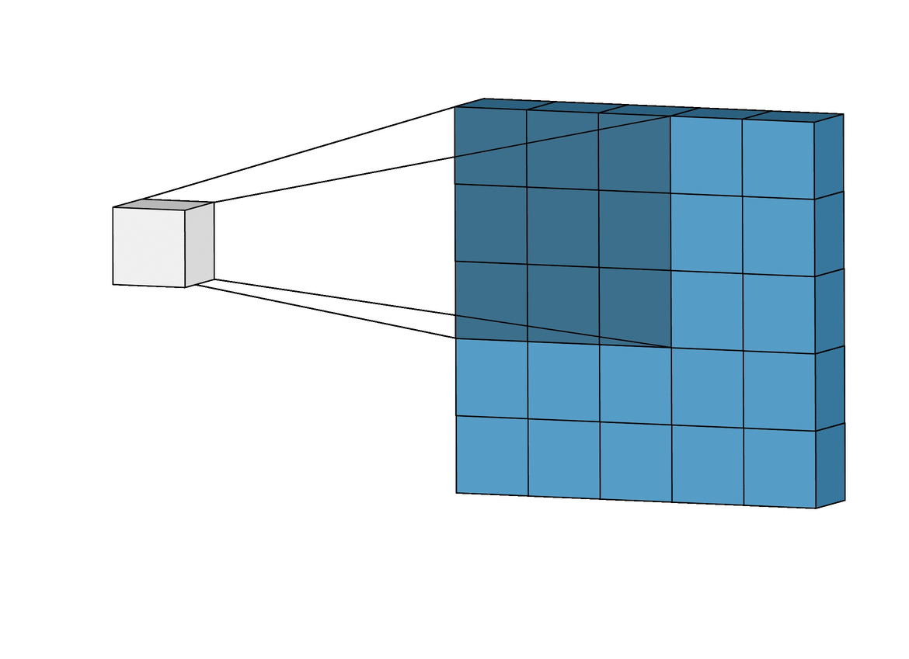

## Table of Contents

## What is a convolution in the context of machine learning?

In machine learning, a convolution is a special kind of mathematical operation used mainly in processing images and other types of data that have a grid-like structure. Imagine you have a big picture, and you want to find certain patterns or features in it, like edges or shapes. A convolution uses a small window, called a kernel or filter, which slides over the entire image. As it moves, it performs a calculation at each position, looking for the features you're interested in. This process helps in reducing the image's size while keeping important information, making it easier for the computer to understand and work with the data.

To explain it a bit more, let's say you have an image and a kernel. The kernel is usually a small matrix, like 3x3 or 5x5. As the kernel moves over the image, it multiplies its values with the corresponding values of the image part it's currently over, and then sums them up. This sum becomes the value of a new image, called a feature map, at the position where the kernel was. For example, if the kernel is looking for vertical lines, it will highlight those areas in the feature map. This process can be repeated with different kernels to detect various features, which is very useful in tasks like image recognition or object detection in machine learning models.

## How does a 1x1 convolution work and what is its purpose?

A 1x1 convolution, also known as a pointwise convolution, is a special type of convolution where the kernel size is just 1x1. This means it only looks at one pixel at a time. When you slide this tiny kernel over an image or a feature map, it doesn't look at neighboring pixels like larger kernels do. Instead, it multiplies the value of each pixel by the single value in the kernel and adds a bias if needed. This process can be thought of as a simple linear transformation applied to each pixel independently.

The purpose of a 1x1 convolution is to change the number of channels in a feature map without altering its spatial dimensions. For example, if you have a feature map with many channels and you want to reduce the number of channels, you can use a 1x1 convolution to do this efficiently. It's like applying a fully connected layer to each pixel across the entire feature map. This technique is very useful in neural networks, especially in architectures like ResNet or Inception, where it helps in reducing computational complexity and controlling the model's capacity.

## What is the difference between a depthwise convolution and a pointwise convolution?

A depthwise convolution and a pointwise convolution are two steps often used together in a technique called depthwise separable convolution. In a depthwise convolution, instead of using a single kernel that looks at all channels at once, you use one kernel per channel. This means each kernel only looks at one channel of the input and slides over it to create a new feature map for that channel. For example, if your input has 3 channels (like an RGB image), you would use 3 different kernels, each working on one channel independently. This helps reduce the number of parameters and computations needed.

On the other hand, a pointwise convolution is the same as a 1x1 convolution. It uses a 1x1 kernel that looks at all channels at a single position and combines them into a new set of channels. Imagine you have several feature maps from the depthwise convolution, and you want to mix the information from all of them. A pointwise convolution does this by applying a 1x1 kernel to each position across all channels, effectively mixing the information and changing the number of channels if needed. Together, depthwise and pointwise convolutions can achieve similar results to a regular convolution but with fewer parameters and computations, making them very useful in models like MobileNet.

## Can you explain what a depthwise separable convolution is and its advantages?

A depthwise separable convolution is a way to do a convolution in two steps: first a depthwise convolution, and then a pointwise convolution. Imagine you have a picture with different layers, like an RGB image that has red, green, and blue layers. In a depthwise convolution, you use a small window, called a kernel, to look at each layer of the picture one by one. So if you have three layers, you use three different kernels, one for each layer. This helps the computer to see patterns in each layer without mixing them up yet. After this, you use a pointwise convolution, which is like using a tiny 1x1 kernel to mix the information from all the layers together. This step helps to combine the patterns found in each layer into new layers that can be used for things like recognizing objects in the picture.

The big advantage of using depthwise separable convolutions is that they need fewer numbers and less work from the computer compared to regular convolutions. In a regular convolution, one big kernel looks at all the layers at the same time, which means it needs a lot more numbers to do its job. But with depthwise separable convolutions, you break the job into smaller, simpler steps. This means you use fewer numbers and the computer doesn't have to work as hard. This is really helpful when you want to use these methods on phones or other devices that don't have a lot of power. It makes the process faster and more efficient, without losing much of the important information needed to understand the picture or data.

## What is a dilated convolution and when is it useful?

A dilated convolution, sometimes called an atrous convolution, is a type of convolution where the kernel has gaps between its elements. Imagine you're looking at a picture and using a small window to find patterns. Normally, this window slides over the picture without any gaps. But with a dilated convolution, the window has spaces in it, so it can look at a wider area of the picture without increasing its size. This is useful because it lets the computer see bigger patterns or details without needing more numbers or working harder.

Dilated convolutions are especially helpful when you want to keep the size of your picture the same but still capture information from a larger area. For example, in tasks like understanding scenes in pictures or processing sounds, you might want to see patterns that are spread out. By using dilated convolutions, you can do this without making your computer work too hard or using too many numbers. This makes them very useful in things like self-driving car systems or voice recognition software, where understanding the bigger picture or the wider context is important.

## How does grouped convolution help in reducing computational complexity?

Grouped convolution splits the input channels into smaller groups and applies a separate convolution to each group. Imagine you have a big picture with many layers, like an RGB image that has red, green, and blue layers. Instead of using one big window to look at all the layers at once, you use smaller windows, each looking at just a few layers. This means you need fewer numbers to do the job because each window is smaller and works on less data at a time.

By breaking the convolution into smaller pieces, grouped convolution reduces the number of calculations the computer needs to do. For example, if you have 256 input channels and you split them into 4 groups, each group will only need to process 64 channels instead of all 256 at once. This can make the computer work faster and use less power, which is really helpful in devices like phones or when you're working with very big pictures or a lot of data.

## What are 3D convolutions and in which scenarios are they applied?

3D convolutions are a type of convolution used in processing data that has three dimensions, like videos or 3D medical images. Imagine you have a stack of pictures, and you want to find patterns that go across the whole stack. A 3D convolution uses a small 3D window, called a kernel, to slide over the entire stack. This kernel looks at the data in all three dimensions at once, helping the computer understand how things change over time or space.

3D convolutions are really useful in scenarios where you need to understand how things move or change. For example, in video analysis, they can help recognize actions or track objects as they move from one frame to the next. In medical imaging, they're used to analyze 3D scans of the body, like MRI or CT scans, to find and understand things like tumors or blood vessels. By looking at the data in three dimensions, 3D convolutions can capture more detailed and meaningful patterns than 2D convolutions, which only look at flat images.

## What is the concept of deformable convolution and how does it improve model performance?

Deformable convolution is a way to make the window, or kernel, that slides over your picture more flexible. Normally, this window moves in a fixed pattern, looking at the same spots in the picture each time. But with deformable convolution, you can change where the window looks. This means it can focus on the important parts of the picture, even if they're not in the usual spots. Imagine trying to find a cat in a picture. A regular window might miss the cat's tail because it's in an odd position, but a deformable window can adjust to look right at the tail.

This flexibility helps improve model performance because it can capture more detailed and varied patterns in the picture. For example, if you're trying to recognize objects in a busy scene, a deformable convolution can better handle things like different shapes and sizes of objects or objects that are partially hidden. By allowing the kernel to shift and adapt, deformable convolutions can make the computer better at understanding and processing complex images, leading to more accurate results in tasks like object detection and image segmentation.

## How do transposed convolutions work and what are their applications?

Transposed convolutions, sometimes called deconvolutions, are a way to increase the size of an image or a feature map in a neural network. Imagine you have a small picture and you want to make it bigger but keep the important details. A transposed convolution does this by using a special kind of window, or kernel, that spreads out the information from the small picture into a larger one. It's like taking a zoomed-in view and zooming out to see more of the picture. This is useful when you want to go from a compressed, smaller version of data back to a larger, more detailed version.

One way to think about how transposed convolutions work is by imagining the kernel moving over a grid that's bigger than the input. As it moves, it places the values from the small picture into the larger grid, often filling in the gaps with zeros and then using a regular convolution to blend everything together. This process can be described with a formula like $$ y[i,j] = \sum_{m,n} x[m,n] \cdot k[i-m, j-n] $$, where $$ y $$ is the output, $$ x $$ is the input, and $$ k $$ is the kernel. Transposed convolutions are commonly used in tasks like generating images, where you start with a small, abstract representation and need to build it up into a full, detailed picture. They're also helpful in tasks like image segmentation, where you need to take a smaller, processed version of an image and expand it back to the original size to label different parts.

## What is the significance of selective kernel convolution in enhancing model adaptability?

Selective kernel convolution is a smart way to make a computer model better at understanding pictures by letting it choose what parts to focus on. Imagine you're looking at a picture and you can decide to zoom in on certain details or look at the whole picture to understand it better. Selective kernel convolution does something similar. It uses different sizes of windows, or kernels, to look at the picture and then picks the best one for each part. This helps the model adapt to different kinds of pictures and situations, making it more flexible and accurate.

By using selective kernel convolution, the model can pay attention to both small details and big patterns in the picture. For example, if you're trying to recognize a dog in a picture, the model can use a small window to look at the dog's eyes and a bigger window to see the whole dog's shape. This adaptability means the model can work well with different kinds of images, whether they're close-ups or wide scenes. This makes selective kernel convolution very useful in tasks like image recognition and object detection, where understanding both the small and big parts of a picture is important.

## Can you describe the mechanism of attention-augmented convolutions?

Attention-augmented convolutions are a way to make the computer focus on the most important parts of a picture. Imagine you're looking at a photo and you want to understand what's in it. Instead of looking at everything equally, you pay more attention to the parts that seem important, like a person's face or a bright object. Attention-augmented convolutions do something similar by using a special kind of window, called a kernel, that can focus on different parts of the picture based on how important they are. This helps the computer understand the picture better by giving more weight to the important details.

The way attention-augmented convolutions work is by combining regular convolution with an attention mechanism. In a regular convolution, the kernel slides over the picture and looks at all parts equally. But with attention, the computer can decide which parts to look at more closely. It does this by calculating an attention map, which tells the kernel where to focus. The attention map is like a spotlight that shines brighter on the important parts of the picture. By mixing the information from the convolution and the attention map, the computer can process the picture more effectively and make better decisions about what it sees.

## What are the latest advancements in convolution techniques, such as DynamicConv or Octave Convolution, and their impacts on neural network architectures?

DynamicConv, also known as Dynamic Convolution, is a newer technique that makes the computer's window, or kernel, change as it looks at different parts of a picture. Imagine you're looking at a scene and you need to zoom in or out depending on what you see. DynamicConv does something similar by adjusting the kernel's size and shape on the fly. This helps the computer better understand complex pictures because it can focus on different details as needed. By doing this, DynamicConv makes neural networks more flexible and can improve their performance in tasks like image recognition and object detection without needing more numbers or working harder.

Octave Convolution is another recent advancement that splits the picture into two parts: a high-frequency part that captures small details and a low-frequency part that looks at bigger patterns. Think of it like using two different magnifying glasses to look at the same picture. One glass zooms in on tiny details, while the other looks at the overall shape. By processing these parts separately and then combining them, Octave Convolution can make the computer work more efficiently. This technique helps reduce the amount of work the computer needs to do, making it faster and using less power. It's especially useful in big models where saving computational resources is important.

Both DynamicConv and Octave Convolution have a big impact on neural network architectures. They make models more adaptable and efficient, which is crucial for applications on devices with limited power, like phones. By using these techniques, researchers and developers can create better models that work faster and use fewer resources, leading to advancements in fields like computer vision and artificial intelligence.