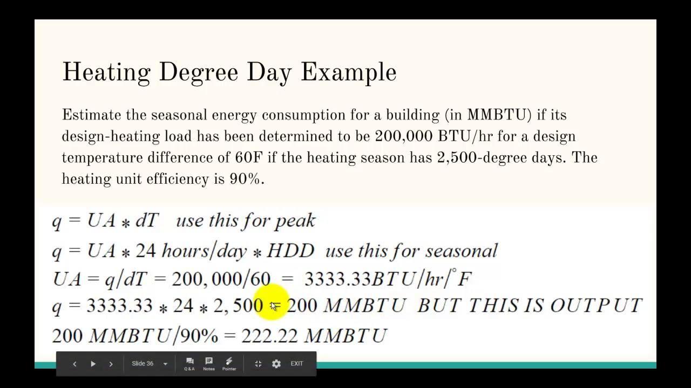

Accurate prediction of energy demand has become increasingly critical in today's landscape of growing energy needs and environmental concerns. As societies strive for efficient energy consumption and sustainability, the ability to predict how much energy will be required for heating, cooling, and other uses is vital. Cooling Degree Day (CDD) is one of the key metrics developed to estimate energy demand specifically linked to cooling systems. This measure represents the accumulated temperature difference above a predefined base temperature, typically 65°F (18°C), over a certain period, offering valuable insights into air conditioning requirements.

The application of CDD extends beyond basic energy demand forecasting. In particular, the integration of CDD calculations with algorithmic trading introduces a sophisticated approach to optimizing and hedging energy costs. Algorithmic trading refers to the use of computer algorithms to manage trading activities, making split-second decisions based on data analytics. By incorporating CDD metrics, traders can better anticipate energy demand patterns, thus enhancing market decision-making processes and managing financial risks associated with energy price fluctuations.



This article examines the methodologies behind CDD calculations and underscores their importance in the context of energy trading and algorithmic trading environments. Through exploring these intersections, the potential for increased efficiency and cost-effectiveness in energy markets becomes evident, paving the way for innovative solutions in energy management strategies.

## Table of Contents

## Understanding Cooling Degree Days (CDD)

Cooling Degree Days (CDD) is an essential metric that quantifies the demand for energy required to cool buildings. It is primarily used in the residential and commercial sectors to gauge the intensity of energy needed for air conditioning systems. The concept of CDD rests on understanding the deviation of daily average temperatures from a standard base temperature, which is typically set at 65°F (18°C). This base temperature is presumed to be the threshold at which buildings generally do not need cooling.

To calculate the Cooling Degree Days, the formula is as follows:

$$
\text{CDD} = \max(0, T_\text{avg} - T_\text{base})
$$

Where:
- $T_\text{avg}$ is the average daily temperature.
- $T_\text{base}$ is the base temperature, often set at 65°F.

For example, if the daily average temperature is 75°F, the CDD would be calculated as:

$$
\text{CDD} = \max(0, 75 - 65) = 10
$$

This value implies that there is a requirement comparable to 10 degree days of cooling to maintain comfort within the buildings. CDDs are accumulated over a period, such as a month or a cooling season, to provide a comprehensive measure of cooling energy demand.

The utility of CDD lies in its ability to offer insights into the energy needed by air conditioning systems. As temperatures rise above the base level, the number of cooling degree days increases, indicating heightened energy use. Conversely, when the average daily temperature is below or at the base temperature, CDD is zero, implying no need for cooling energy.

By employing data from CDD calculations, businesses and households can implement more energy-efficient practices, projecting the energy needs more accurately and adjusting cooling strategies accordingly. This metric proves invaluable not only for managing day-to-day operations but also for long-term planning and investment in energy conservation technologies.

## The Importance of CDD in Energy Management

Cooling Degree Days (CDD) serve as a critical metric for utility companies looking to efficiently forecast and manage energy consumption. By quantifying the difference between a day's average temperature and a base temperature, typically set at 65°F, CDD provides insight into the additional energy necessary for cooling systems. This becomes especially pertinent in warmer seasons when energy demand surges.

Utility companies utilize CDD as a foresight tool to anticipate peaks in energy consumption, allowing them to optimize power generation and distribution. This foresight is vital in mitigating the risks of system overloads and ensuring a stable power supply. Accurate CDD calculations enable these entities to establish pricing strategies that reflect the increased costs associated with peak energy demands. Consequently, CDD informs both the operational and financial planning within these companies.

For businesses and homeowners, CDD is equally significant. Monitoring CDD values can guide better decision-making regarding energy efficiency improvements. By understanding the correlation between CDD and energy consumption, consumers can adopt measures to augment insulation, enhance HVAC systems, or implement automated systems to regulate indoor temperatures, thus reducing energy use and associated costs.

In terms of cost implications, CDD data aids in forecasting energy cost fluctuations. Businesses particularly benefit by integrating CDD forecasts into their budget planning and operational strategies, aligning their activities and consumption patterns with periods of lower energy rates whenever possible. This alignment facilitates cost savings and enhances overall energy efficiency.

Therefore, CDD does not merely serve as a predictive tool but also as a framework for both large-scale energy providers and individual consumers to enhance their energy management protocols, thereby fostering both economic and environmental benefits.

## Calculating CDD: Simple and Advanced Methods

Cooling Degree Days (CDD) are calculated to quantify the demand for energy needed to cool buildings. The basic method for calculating CDD is straightforward: it involves subtracting a base temperature from the daily average temperature. Typically, the base temperature used is 65°F. This base is selected because it is the temperature above which buildings might require additional cooling. 

The formula for calculating the daily CDD is as follows:

$$
\text{CDD} = \max(0, \text{Average Daily Temperature} - 65°\text{F})
$$

In this formula, if the average daily temperature is less than 65°F, the CDD value is set to zero, indicating no need for additional cooling.

For more sophisticated CDD calculations, advanced methodologies incorporate increased granularity by using half-hourly or hourly temperature readings. This approach allows for a more precise estimation of energy needs, reflecting fluctuations in temperature throughout the day. An advanced calculation might involve integrating these temperature readings over the entire day to compute a more accurate representation of cooling requirements.

For example, using Python, the process might look like this:

```python
import numpy as np

def calculate_cdd(temperature_readings, base_temp=65):
    """
    Calculate CDD using half-hourly temperature readings.

    Parameters:
    - temperature_readings: list of half-hourly temperature values in Fahrenheit
    - base_temp: the base temperature above which cooling is needed

    Returns:
    - cdd: calculated Cooling Degree Days
    """
    # Convert half-hourly readings to hourly by averaging pairs
    hourly_temperatures = [np.mean(temperature_readings[i:i+2]) 
                           for i in range(0, len(temperature_readings), 2)]

    # Calculate daily average temperature
    daily_avg = np.mean(hourly_temperatures)

    # Calculate CDD
    cdd = max(0, daily_avg - base_temp)
    return cdd

# Example usage with hypothetical half-hourly temperature data
temperature_data = [67, 68, 69, 70, 71, 72, 73, 74, 75, 76, 77, 78, 79, 80, 81, 82, 83, 84, 85, 86, 87, 88, 89, 90, 91, 92, 93, 94, 95, 96, 97, 98, 99, 100, 101, 102, 103, 104, 105, 106, 107, 108, 109, 110, 111, 112, 113, 114]
cdd = calculate_cdd(temperature_data)
print("Calculated CDD:", cdd)
```

Advanced CDD calculations play a critical role in the field of weather derivatives. Weather derivatives are financial instruments used to hedge against the risks associated with weather variability, which can impact energy supply and demand. By employing precise CDD calculations, companies can accurately assess the potential impact of temperature fluctuations on their energy needs, aiding in risk management and strategic decision-making.

## Energy Trading and Weather Derivatives

Weather derivatives, including those based on Cooling Degree Days (CDD), have become essential instruments for managing financial risks associated with fluctuating energy demand and supply dynamics induced by weather conditions. These derivatives are financial contracts whose payoffs are determined by weather-related variables, such as temperature. The core function of CDD in this context is to quantify how much warmer the climate has been compared to a base temperature, typically set at 65°F, which directly influences the energy consumption patterns for cooling.

### Utilization across Sectors

Various industries, notably utilities, agriculture, and construction, heavily rely on weather derivatives for effective risk management. Utility companies, for instance, face significant challenges due to the variability in energy demand stemming from unpredictable weather patterns. By utilizing CDD-based derivatives, these firms can hedge against the risk of increased energy demand during hotter periods, thus stabilizing their operational and financial planning.

In the agricultural sector, weather conditions directly impact crop yields. Farmers and agricultural firms use these financial instruments to mitigate the risk posed by weather variations, ensuring financial stability despite potential crop yield fluctuations. Similarly, the construction industry, sensitive to weather conditions for planning and executing construction projects, leverages weather derivatives to hedge against delays and increased costs due to unexpected temperature rises.

### Deriving Settlement Prices

The process of deriving settlement prices for weather futures contracts is fundamentally linked to accurate CDD calculations. The settlement price of a weather derivative depends on the cumulative CDD values over a specific contract period. Typically, the payoff structure of these contracts can be defined by equations that model the relationship between actual and expected CDD values.

For example, a simple payoff structure for a CDD futures contract might be defined as:

$$
\text{Payoff} = \max(0, (\text{Actual CDD} - \text{Strike CDD})) \times \text{Contract Multiplier}
$$

In this equation, "Strike CDD" represents a predetermined threshold of cumulative CDD, and the "Contract Multiplier" is a [factor](/wiki/factor-investing) that scales the financial outcomes of the contract. Such contracts ensure that parties involved can hedge against deviations from expected temperature ranges, securing financial outcomes against unfavorable weather conditions.

### Strategic Implications

Understanding and accurately calculating CDD values are critical for firms looking to engage in weather derivatives markets. By employing advanced methods and technologies to predict temperature patterns, firms can gain a competitive advantage, optimizing their risk management strategies. The integration of such weather-based financial instruments facilitates better financial planning, reducing vulnerability to weather-induced market [volatility](/wiki/volatility-trading-strategies). 

In conclusion, the intersection of CDD and weather derivatives offers a robust mechanism to address the intricate challenges posed by weather-related risks across various sectors, affirming the indispensable role of these financial instruments in modern energy trading practices.

## Integrating CDD Calculations in Algorithmic Trading

Algorithmic trading employs mathematical models and computational power to execute trades quickly and efficiently, and integrating Cooling Degree Day (CDD) calculations can significantly bolster this approach in energy markets. CDD metrics serve as valuable indicators of anticipated energy demand, particularly for cooling systems, which can be leveraged to form predictive trading strategies.

The primary advantage of incorporating CDD calculations in [algorithmic trading](/wiki/algorithmic-trading) is the ability to anticipate and react to changes in energy demand patterns. By utilizing historical CDD data, traders can construct a robust model to forecast future temperature-related energy needs. For example, a simple linear regression model could be implemented in Python to predict future CDD values:

```python
import numpy as np
from sklearn.linear_model import LinearRegression

# Example historical CDD data
historical_temps = np.array([[72, 3], [80, 15], [75, 10]])  # [avg_temp, CDD]
future_temp = np.array([[78]])  # Future average temperature

# Prepare the model
model = LinearRegression()
X = historical_temps[:,0].reshape(-1,1)  # avg_temperature
y = historical_temps[:,1]  # CDD values

# Fit the model
model.fit(X, y)

# Predict future CDD value
predicted_CDD = model.predict(future_temp)
print(f"Predicted CDD value: {predicted_CDD[0]}")
```

The above code illustrates a basic linear regression model where `historical_temps` contain average temperatures and corresponding CDD values. When supplied with a future temperature, the model predicts the CDD value, which can inform trading decisions.

Additionally, real-time CDD data can be incorporated to adjust trading strategies dynamically. Platforms such as open-source libraries enable traders to collect and process temperature data, facilitating the continuous updating of trading algorithms based on the latest information. This capability allows for timely responses to unexpected weather changes that might influence energy consumption.

Algorithmic trading systems that integrate CDD calculations can significantly enhance decision-making procedures. They not only predict potential shifts in energy demand but also allow for the optimization of trading strategies, reducing risk and improving potential returns. These benefits underscore the critical role CDD integration plays in the development of advanced algorithmic trading applications in energy markets, paving the way for more accurate and efficient operations.

## Conclusion and Future Implications

As energy consumption patterns continue to shift, driven by factors such as population growth, urbanization, and climate change, tools like Cooling Degree Days (CDD) are becoming increasingly essential. Accurate CDD measurements offer a reliable metric for understanding the energy demands associated with cooling, providing a foundation for strategic energy management. This metric's role is pivotal in optimizing energy efficiency and reducing costs for both businesses and homeowners, as well as facilitating more precise energy consumption forecasts by utility companies.

In the context of financial markets, algorithmic trading represents a promising avenue for leveraging CDD data. The integration of CDD calculations into trading algorithms allows market participants to anticipate shifts in energy demand with greater accuracy, enabling more informed trading decisions. By incorporating both historical and real-time CDD data, traders can enhance their strategies to exploit emerging patterns, ultimately leading to improved financial outcomes.

Moreover, continuous advancements in technology and data analytics are expected to further refine CDD applications. The emergence of sophisticated data collection and processing tools, alongside the enhanced capabilities of [machine learning](/wiki/machine-learning) algorithms, offers unprecedented opportunities for more detailed and accurate CDD analysis. These innovations will likely lead to the development of more robust predictive models, facilitating a deeper understanding of the complex interplay between weather patterns and energy consumption.

Furthermore, the integration of Internet of Things (IoT) devices capable of providing real-time temperature data can improve the granularity and precision of CDD calculations. This could result in more dynamic energy management solutions, enabling stakeholders to not only respond to immediate energy demand changes but also to anticipate future trends.

In conclusion, as the landscape of energy consumption evolves, CDD will continue to serve as a vital tool in both energy management and financial markets. The synergy between algorithmic trading and CDD offers a strategic advantage in optimizing energy-related financial instruments, while ongoing technological advancements promise to enhance the accuracy and applicability of CDD data, paving the way for more resilient and adaptable energy management solutions.

## References & Further Reading

[1]: ["Cooling Degree Days and Energy Demand."](https://www.investopedia.com/terms/c/colddegreeday.asp) United States Environmental Protection Agency.

[2]: ["Degree Days: Understanding Heating and Cooling Degree Days."](https://www.weather.gov/key/climate_heat_cool) United States Census Bureau.

[3]: "Walawender, A., Hajto, M. J., & Walczak, A. (2015). Seasonal dynamics of sensible heat exchange of a Central European urban area on the example of Cracow City in Southern Poland. Journal of Atmospheric and Solar-Terrestrial Physics, 138, 53-65."

[4]: ["Advances in Financial Machine Learning"](https://www.amazon.com/Advances-Financial-Machine-Learning-Marcos/dp/1119482089) by Marcos Lopez de Prado

[5]: "Kaminski, V., & Freeman, J. (2013). Power and Weather Risk Premiums. The Journal of Energy Markets."

[6]: ["Machine Learning for Algorithmic Trading"](https://github.com/stefan-jansen/machine-learning-for-trading) by Stefan Jansen

[7]: ["Quantitative Trading: How to Build Your Own Algorithmic Trading Business"](https://www.amazon.com/Quantitative-Trading-Build-Algorithmic-Business/dp/1119800064) by Ernest P. Chan