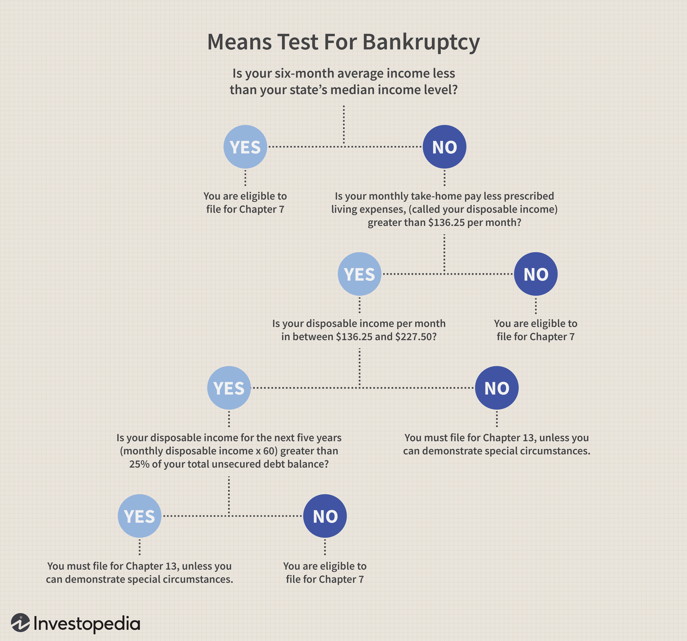

In the contemporary financial landscape, cooperative bankruptcies and algorithmic trading have become key topics of discussion. These elements play significant roles in shaping both the macro and microeconomic aspects of the financial ecosystem. Cooperative organizations, uniquely structured with member-based ownership, face distinctive challenges when encountering financial distress. Unlike traditional corporations, their legal and operational frameworks introduce complexities in bankruptcy scenarios.

Simultaneously, algorithmic trading has revolutionized the way financial markets react to and process economic signals, including those associated with bankruptcies. This sophisticated trading mechanism uses complex algorithms to execute high-speed transactions, thereby influencing market behaviors and potentially altering the outcomes for both creditors and debtors.



The interplay between cooperative bankruptcies and algorithmic trading unveils intricate issues and profound implications for stakeholders. For instance, creditors' committees, which play a crucial role in negotiating reorganization plans, may face unexpected hurdles due to the unpredictability and rapid market fluctuations induced by algorithmic trading. The dynamics of these committees can significantly impact the strategic decisions made during financial restructurings.

Moreover, the convergence of these two domains presents both challenges and opportunities. Rapid changes in asset valuation driven by algorithmic trading could either enhance or undermine the strategic recovery efforts made by cooperative stakeholders. On the one hand, technology-driven trading provides opportunities for optimizing recovery strategies and market positioning. On the other hand, it introduces a layer of complexity that requires stakeholders to have a deep understanding of both financial and technological landscapes.

In this article, we aim to shed light on the interaction between financial distress in cooperative entities and the influence of algorithmic trading on bankruptcy scenarios. We will explore how these factors impact stakeholders, focusing on the roles of creditors' committees and technological trading influences. By examining the challenges and opportunities that arise at this intersection, we hope to offer valuable insights for navigating financial distress effectively.

## Table of Contents

## The Cooperative Bankruptcy Landscape

Cooperative organizations, often referred to as co-ops, hold a distinctive position in the financial landscape due to their unique structural and operational characteristics. These entities are collectively owned and operated by individuals centered around common economic, social, or cultural needs and interests. While their collaborative nature may provide certain benefits, including shared responsibility and risk, the financial distress experienced by such entities can introduce complex challenges. This complexity arises from the cooperative's structure and operational intricacies, which differ significantly from traditional business corporations.

One significant challenge in cooperative bankruptcies is managing the variety of defaults. Technical defaults in co-ops occur when the entity violates terms of a debt contract, excluding failure to make payments. Such defaults can include breaching covenants, inadequate financial reporting, or failing to meet administrative stipulations. Though they may not immediately jeopardize financial stability, technical defaults can signal underlying operational issues, prompting lenders to take preventative measures.

Mortgage defaults represent another area of concern. For many cooperatives, real property serves as a pivotal asset and is frequently mortgaged to secure funding. Failure to meet mortgage obligations can trigger severe consequences, leading potentially to foreclosure. Foreclosure represents a worst-case scenario as it often results in the loss of essential assets, disrupting operations and affecting shareholder equity negatively.

The implications of foreclosure extend beyond asset loss. Co-op shareholders, unlike traditional equity investors, have direct stakes in the entity's operational facets, including housing or consumer services. Therefore, foreclosure not only diminishes financial returns but can also impact the accessibility to these services and alter the cooperative's communal fabric. Legal complexities surrounding shareholder rights further complicate these scenarios, making cooperative bankruptcy management notably demanding.

Understanding the unique risk factors in cooperative bankruptcies is crucial for stakeholders. The interplay between the ownership structure and financial obligations necessitates careful navigation through legal frameworks and stakeholder interests. This includes recognizing potential warning signs of financial distress early, managing communication effectively among diverse stakeholders, and exploring legal avenues tailored to co-op entities, such as reorganization plans that consider both financial rejuvenation and preservation of cooperative values.

For stakeholders, mastering these nuances is instrumental in protecting both the cooperative's financial viability and its foundational ethos. The strategies for navigating cooperative bankruptcy not only require financial acumen but also a sensitivity to the cooperative model's social dimensions, underscoring the importance of an informed, balanced approach in addressing financial distress within these distinctive organizations.

## The Role of Creditors' Committees in Bankruptcy

Creditors' committees play a crucial role in bankruptcy proceedings. These committees represent the interests of unsecured creditors in bankruptcy cases, especially under Chapter 11 of the United States Bankruptcy Code. The formation of a creditors' committee is usually mandated by the court to ensure fair representation and negotiation power for unsecured creditors, who frequently lack the collateral that secures other lenders' claims.

The committee is typically composed of the largest unsecured creditors willing to serve. Its members can include trade creditors, bondholders, and occasionally, retirees whose pensions are at risk. Their primary functions include reviewing the debtor's financial affairs and participating in formulating a plan of reorganization. This plan aims to satisfy the claims of creditors while enabling the distressed entity to emerge from bankruptcy as a viable enterprise.

A key responsibility of the creditors' committee is to act as a watchdog during the bankruptcy process. They can investigate the debtor's conduct, financial condition, and business operations to ensure transparency and accountability. This oversight function helps protect creditors' interests by highlighting any potential mismanagement or fraudulent activities.

One of the most significant roles of the committee is negotiating reorganization terms. They engage in discussions with the debtor, other creditors, and stakeholders to facilitate a feasible restructuring plan. This negotiation process can involve adjusting debt terms, altering business operations, or finding new financing methods. The goal is to reach an agreement that optimizes recovery for unsecured creditors while supporting the debtor's long-term sustainability.

Within the Chapter 11 process, creditors' committees wield considerable influence. The committee can influence the debtor's reorganization plans by proposing alternative strategies or modifications that better serve creditors' interests. Their input is critical when assessing the viability and fairness of proposed reorganization plans submitted to the court for approval.

Understanding the functions of creditors' committees in bankruptcy is essential for appreciating the complexities of financial distress scenarios. These committees provide a structured platform for creditors to voice concerns, propose solutions, and ensure equitable treatment amid financial turmoil. Their involvement is especially significant in cooperative bankruptcies, where the unique structure of cooperatives may complicate standard bankruptcy procedures. As part of the decision-making process, creditors' committees serve as an essential mechanism for balancing diverse interests and driving towards a resolution that honors both creditors' claims and the debtor's rehabilitation efforts.

## Algorithmic Trading and Market Dynamics

Algorithmic trading, which utilizes computer algorithms to automate trading decisions and execute orders, has significantly transformed financial market dynamics. By processing vast amounts of data at high speeds, algorithms can detect patterns and execute trades faster than any human trader could. In the context of financial distress, such as bankruptcy scenarios, [algorithmic trading](/wiki/algorithmic-trading) can have profound implications.

During periods of financial distress, markets often experience heightened [volatility](/wiki/volatility-trading-strategies). Algorithms, designed to react to specific economic signals, can exacerbate this volatility. For instance, the announcement of a potential bankruptcy might trigger a sell-off across automated trading systems, leading to plummeting asset values. In turn, this can create a cascading effect where the rapid change in asset prices influences the perception of a firm's financial health, potentially quickening its path to insolvency.

Moreover, algorithms can cause significant shifts in valuation. They are often programmed to react to market data, such as stock prices or financial metrics, which can change rapidly in bankruptcy situations. This mechanized response can lead to more volatile and perhaps less predictable market conditions. For creditors and debtors involved in bankruptcy cases, this rapid alteration in valuations necessitates a robust and adaptive strategy. Environments dominated by algorithmic trading require stakeholders to be agile in their financial assessments and decisions.

From a strategic perspective, the advantages of algorithmic trading lie in its ability to quickly capitalize on market inefficiencies and information asymmetries. Algorithms can analyze and respond to data-driven cues almost instantaneously, providing opportunities for those who leverage them effectively to gain a competitive edge. However, this speed and efficiency can also be detrimental. For instance, during a firm's bankruptcy proceedings, creditors relying solely on traditional approaches may find themselves at a disadvantage compared to those using sophisticated algorithms that could predict and respond to market moves.

Furthermore, the use of [machine learning](/wiki/machine-learning) within algorithmic trading offers both opportunities and risks. Machine learning models can be trained to detect complex patterns and predict market movements with high precision. However, these models can be overfitted to historical data and may not perform well under unprecedented market conditions such as those seen during bankruptcies. This overfitting risk introduces a potential pitfall where algorithms could make erroneous trades based on limited data, leading to suboptimal financial decisions.

```python
# A simple implementation of an algorithm trading strategy in Python
# This uses a moving average crossover strategy, a common method to identify trends.

import numpy as np
import pandas as pd

# Simulated stock price data
stock_prices = pd.Series([100, 102, 101, 105, 110, 108, 107, 111, 113, 112])

# Calculate moving averages
short_window = 3
long_window = 5

stock_prices['Short_MA'] = stock_prices.rolling(window=short_window, min_periods=1).mean()
stock_prices['Long_MA'] = stock_prices.rolling(window=long_window, min_periods=1).mean()

# Generate trading signals
stock_prices['Signal'] = 0
stock_prices['Signal'][short_window:] = np.where(stock_prices['Short_MA'][short_window:] 
                                                 > stock_prices['Long_MA'][short_window:], 1, -1)

# Create a trading position (buy=1, sell=-1)
stock_prices['Position'] = stock_prices['Signal'].diff()

print(stock_prices[['Short_MA', 'Long_MA', 'Signal', 'Position']])
```

In conclusion, while algorithmic trading provides remarkable opportunities for efficiency and profitability, it also demands a nuanced understanding of its potential drawbacks, especially during financial distress. Financial stakeholders must navigate these market dynamics carefully, combining traditional financial acumen with cutting-edge technological insights to manage the risks and opportunities presented by algorithmic trading in bankruptcy scenarios.

## Challenges and Opportunities at the Intersection

The intersection of financial distress scenarios and algorithmic trading introduces a multifaceted landscape characterized by both challenges and opportunities. The primary challenge for creditors lies in managing recoveries in an environment where market volatility is magnified by algorithmic trading. High-frequency trading algorithms are capable of executing trades at exceptional speeds, often in response to news and market events, including the financial distress of entities. This rapid trading activity can lead to sharp and unpredictable price movements, making it difficult for creditors to accurately assess the value of distressed assets and make timely decisions regarding recoveries.

From the perspective of cooperative shareholders, the introduction of algorithmic trading can serve as a double-edged sword. On one hand, technological trading layers can bring enhanced [liquidity](/wiki/liquidity-risk-premium) and potentially tighter bid-ask spreads, allowing shareholders to execute transactions more efficiently. This increased liquidity can be particularly beneficial in markets where cooperative entities are listed, providing shareholders with more opportunities to buy or sell their stakes. On the other hand, algorithmic trading can contribute to heightened volatility, with the potential to exacerbate price swings especially in less actively traded cooperative shares. This volatility may result in an unfavorable trading environment, ultimately undermining the value of the shareholders' investments.

To navigate the complexities introduced by the convergence of financial distress and algorithmic trading, stakeholders must adopt strategies that account for both technological and market dynamics. For creditors, implementing advanced data analytics and leveraging machine learning algorithms can offer insights into market trends and help in making informed decisions about asset liquidation or restructuring plans. For cooperative shareholders, staying informed about the technological trends and market factors influencing algorithmic trading can reveal new opportunities for leveraging trading platforms to optimize portfolio performance.

Strategizing effectively in this environment requires acknowledging the dual nature of these advancements. While automated trading systems increase market efficiency, they also require a robust understanding of the algorithms at play and their potential impacts on market conditions. By doing so, creditors and cooperative shareholders may enhance their ability to manage financial distress efficiently, thus turning potential challenges into opportunities for effective financial management and recovery.

## Conclusion

Navigating the intricacies of cooperative bankruptcy and algorithmic trading necessitates a fusion of traditional finance acumen and modern technological insight. In this complex financial environment, the role of technology, particularly algorithmic trading, has become increasingly significant, as it can rapidly adjust to economic signals and affect market dynamics during bankruptcy scenarios. As such, creditors and shareholders involved with cooperative bankruptcies must stay well-informed and maintain adaptability to effectively tackle this evolving landscape.

Incorporating effective strategies at the intersection of these domains is essential for skillfully managing financial distress situations. With the swift pace at which algorithmic trading influences market responses, stakeholders must employ both conventional financial approaches and innovative technological solutions to enhance decision-making processes. This strategic synchronization can facilitate more efficient navigation and potential recovery from financial distress scenarios.

As financial technologies continue to advance and reshape the market landscape, ongoing education and strategic learning are pivotal. Stakeholders must dedicate themselves to continuous professional development, ensuring they are equipped with the latest knowledge and skills necessary for adapting to technological innovations. In doing so, they can anticipate market changes and effectively respond to the challenges and opportunities that arise at the convergence of cooperative bankruptcy and algorithmic trading, ultimately fostering successful financial outcomes.

## References & Further Reading

[1]: Bergstra, J., Bardenet, R., Bengio, Y., & Kégl, B. (2011). ["Algorithms for Hyper-Parameter Optimization."](https://dl.acm.org/doi/10.5555/2986459.2986743) Advances in Neural Information Processing Systems 24.

[2]: ["Advances in Financial Machine Learning"](https://www.amazon.com/Advances-Financial-Machine-Learning-Marcos/dp/1119482089) by Marcos Lopez de Prado

[3]: ["Evidence-Based Technical Analysis: Applying the Scientific Method and Statistical Inference to Trading Signals"](https://www.amazon.com/Evidence-Based-Technical-Analysis-Scientific-Statistical/dp/0470008741) by David Aronson

[4]: ["Machine Learning for Algorithmic Trading"](https://github.com/stefan-jansen/machine-learning-for-trading) by Stefan Jansen

[5]: ["Quantitative Trading: How to Build Your Own Algorithmic Trading Business"](https://www.amazon.com/Quantitative-Trading-Build-Algorithmic-Business/dp/1119800064) by Ernest P. Chan