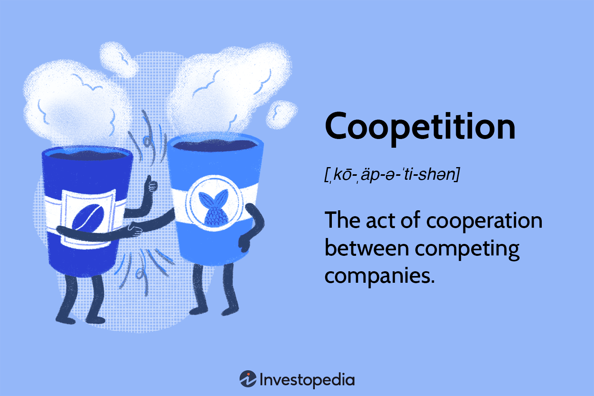

In a rapidly evolving business landscape, companies are compelled to adopt innovative strategies to maintain their competitive edge. One strategy that has garnered significant attention is coopetition—a strategic alliance where firms cooperate with their rivals while still competing with them. This dual approach is particularly pertinent as businesses navigate complex and interconnected markets where traditional competitive strategies are no longer sufficient.

Coopetition is becoming increasingly relevant in algorithmic trading, where cutting-edge technology, data-driven insights, and rapid execution are key to success. Algorithmic trading, characterized by the use of algorithms to execute trades at speeds and frequencies beyond human capability, is a domain where the blend of cooperation and competition can accelerate innovation and efficiency.



This article focuses on the intersection of coopetition and algorithmic trading, aiming to highlight how competitive collaboration can catalyze advancements in the trading sector. Through coopetition, firms can pool resources, share knowledge, and develop shared technologies, leading to enhanced trading platforms and strategies. This collective effort has the potential to redefine industry standards and create new opportunities for growth and innovation.

As businesses increasingly recognize the strategic value of coopetition, particularly in algorithmic trading, there is a burgeoning potential for this approach to reshape competitive strategies. By merging the strengths of competition and collaboration, coopetition opens up new pathways for firms to navigate modern market complexities effectively.

## Table of Contents

## Understanding Coopetition

Coopetition is a strategic approach that involves companies working together towards shared objectives while retaining elements of competition. Rooted in game theory, it aims to create synergistic advantages that can benefit all involved parties. Game theory, particularly the concept of the "prisoner's dilemma," illustrates how entities can achieve better outcomes through cooperation than acting independently. By applying this principle, companies can form alliances that harness mutual strengths and create new opportunities.

In the technology sector, coopetition has become a common practice as firms collaborate on resource sharing to foster innovation and broaden their market reach. This strategy allows companies to access technologies, skills, or market segments that would be challenging to develop independently. For example, tech firms may collaborate on research and development while competing in the commercialization of different applications of the technology.

By blurring the distinctions between collaboration and competition, businesses can enhance their product offerings and enter new markets more effectively. This approach enables firms to combine complementary assets and expertise, accelerating the development of innovative products and solutions. In doing so, companies engaging in coopetition can leverage shared resources to improve their competitive positions without sacrificing their standing in the marketplace. Coopetition thus requires careful management to ensure a balance between achieving common goals and maintaining individual competitive advantages.

## The Role of Coopetition in Algorithmic Trading

Algorithmic trading is a domain where technology, speed, and precision form the backbone of profitability and efficiency. In such a high-stakes environment, coopetition offers a powerful strategic tool for firms looking to enhance their trading capabilities. By working together, trading firms can pool their technological resources and expertise to develop more sophisticated algorithms. These collaborations can result in innovative solutions that are more robust than what any individual firm could achieve alone.

Sharing technological expertise among trading firms can facilitate significant advancements in algorithm development. Skilled developers from different firms can jointly create algorithms that are not only efficient but also adaptive to changing market conditions. This collaborative approach can lead to the optimization of algorithmic models, allowing firms to better manage risk and execute trades with increased accuracy.

Moreover, coopetition can play a crucial role in enhancing data analytics capabilities. Trading firms generate and analyze vast amounts of data to inform their strategies. By collaborating, companies can combine their data sets, providing a more comprehensive view of market trends and anomalies. This shared data pool can enhance [machine learning](/wiki/machine-learning) models, resulting in improved predictions and higher returns.

One of the key outcomes of coopetition in [algorithmic trading](/wiki/algorithmic-trading) is the potential development of industry standards. As firms collaborate, they can establish common frameworks for data handling, algorithmic ethics, and security measures. These standards not only boost the overall efficiency and reliability of trading systems but also increase trust and transparency across the industry. Establishing such standards can lead to an industry environment where firms are more willing to engage in further collaborative efforts, knowing that their partnerships are grounded in a stable and understood framework.

The strategic combination of competition and collaboration in algorithmic trading presents a unique opportunity to drive innovation, reduce operational risks, and enhance market stability. By engaging in coopetition, trading firms are better positioned to navigate and adapt to the complexities of modern financial markets, ultimately leading to a more resilient and dynamic trading ecosystem.

## Benefits of Competitive Collaboration

Coopetition is a strategic approach that allows firms to optimize resources and cut costs by sharing the burdens of development. By pooling resources, companies can avoid redundant efforts, resulting in significant cost savings. This collaborative model allows each firm to leverage the strengths of others, leading to enhanced product innovations. When companies work together, they benefit from collective expertise and experiences, which can accelerate the development of new technologies or improve existing ones.

Additionally, sharing technologies and data enhances market intelligence. Access to a broader pool of information can provide insights that might not be available to individual firms, granting them a competitive edge. Improved market intelligence helps companies better understand consumer needs, optimize pricing strategies, and anticipate market trends.

For small and medium enterprises (SMEs), coopetition can be particularly beneficial. By collaborating with larger firms, SMEs can access resources and capabilities that would otherwise be beyond their reach. This collaboration can help level the playing field against more established competitors, enabling SMEs to innovate and enter markets more effectively.

In a cooperative environment, firms can capitalize on each other's technological advancements and market insights, leading to more informed decision-making processes. This can result in smarter investments and resource allocations, ultimately benefiting all parties involved and fostering an environment conducive to sustainable growth.

## Challenges and Risks of Coopetition

Coopetition, while beneficial, presents a series of challenges and risks that companies need to address diligently. One significant risk is the potential for conflicts of interest. Companies involved in coopetitive arrangements must carefully navigate these relationships to ensure that their proprietary information and competitive edges are safeguarded. This often involves establishing clear boundaries and agreements regarding the use and sharing of sensitive data and technology.

Moreover, engaging in coopetition may lead to a reliance on partners, which can pose substantial risks if a partner withdraws strategically or shifts focus towards competitive moves. Such dependencies can leave firms vulnerable, disrupting operations or limiting strategic flexibility.

Trust and alignment of goals are crucial for managing these partnerships effectively. Without mutual trust, the collaboration can deteriorate, resulting in negative outcomes for all parties involved. To mitigate these risks, companies must invest in transparent communication and establish shared objectives that align well with their individual goals.

In summary, while coopetition can foster significant innovation and resource optimization, companies must carefully manage the inherent risks to maximize the benefits of collaborative competition.

## Real-world Examples of Coopetition

The partnership between Pfizer and BioNTech during the COVID-19 pandemic serves as a prime example of successful coopetition within the pharmaceutical industry. This collaboration combined Pfizer's extensive expertise in clinical trials and distribution with BioNTech's innovative mRNA technology. By working together, both companies were able to expedite the development and distribution of the COVID-19 vaccine known as BNT162b2 or Comirnaty, which significantly contributed to global vaccination efforts [1]. This partnership exemplifies how coopetition enables firms to leverage each other's strengths, drive rapid innovation, and deliver critical solutions in record time.

In the technology industry, Apple and Samsung provide another notable example of coopetition. Despite being fierce competitors in the consumer electronics market, particularly in smartphones, the two companies have maintained a complex relationship where collaboration and competition coexist. Samsung, through its component manufacturing division, supplies crucial components like OLED displays to Apple for its iPhones. This relationship allows Apple to access high-quality components essential for its products, while Samsung benefits from a lucrative customer contract [2]. This dynamic highlights how coopetition allows companies to optimize resource usage and continue competing aggressively in the end-user market.

These examples underscore the potential of coopetition to create significant value and drive innovation across various industries. By strategically engaging in coopetitive relationships, companies can enhance their capabilities and achieve outcomes that would be challenging through competition or collaboration alone. As global industries continue to evolve, the ability to simultaneously cooperate and compete will likely distinguish leaders from the followers.

**References:**

1. Polack, F. P., et al. (2020). Safety and Efficacy of the BNT162b2 mRNA Covid-19 Vaccine. New England Journal of Medicine. [link](https://www.nejm.org/doi/full/10.1056/NEJMoa2034577)
2. Yang, H., et al. (2019). Strategic Coopetition of High-Tech Firms. Journal of Business Research, 101, 64-71.

## Future of Coopetition in Business Strategy

As industries become increasingly interconnected, coopetition—the strategic blend of cooperation and competition—is poised to play a critical role in shaping global business strategies. This paradigm shift is driven by the need for organizations to both collaborate and compete in order to leverage shared resources and expertise while maintaining a competitive edge. By balancing these dual dynamics, firms can navigate the complexities of today's global marketplace and position themselves for sustainable growth.

In the context of algorithmic trading, the implications of coopetition are particularly significant. Algorithmic trading systems rely on sophisticated technologies, high-speed computing, and advanced data analytics. These elements are not only resource-intensive but also require continuous innovation and refinement. Through coopetition, firms engaged in algorithmic trading can share knowledge, collaborate on the development of powerful algorithms, and establish industry standards that enhance the efficiency and reliability of trading platforms.

For instance, trading firms can collaboratively develop algorithms that predict market trends more accurately, leading to better decision-making processes. By sharing data and technological advancements within a competitive framework, these firms can optimize trading strategies while minimizing associated costs. This cooperative engagement can result in a more resilient and adaptive trading ecosystem, ultimately benefiting all stakeholders involved.

Moreover, as algorithmic trading continues to evolve, coopetitive frameworks can facilitate the integration of emerging technologies such as [artificial intelligence](/wiki/ai-artificial-intelligence) and machine learning. These technologies can further augment trading strategies by providing deeper insights and automated decision-making capabilities. Python, widely used in the financial technology sector, offers robust libraries for developing and testing trading algorithms, enabling firms to experiment and innovate within a cooperative setting. 

To exemplify, consider the following Python snippet demonstrating a basic moving average crossover strategy, a common trading algorithm:

```python
import numpy as np
import pandas as pd

# Sample data
data = {'Close': [100, 102, 104, 105, 103, 107, 110]}
df = pd.DataFrame(data)

# Calculating moving averages
df['Short_MA'] = df['Close'].rolling(window=2).mean()
df['Long_MA'] = df['Close'].rolling(window=3).mean()

# Generating buy/sell signals
df['Signal'] = np.where(df['Short_MA'] > df['Long_MA'], 1, 0)

df
```

This foundational concept can be extended through collaborative efforts to develop more complex models that incorporate additional factors, such as macroeconomic indicators or sentiment analysis. By working cooperatively, firms can create a competitive advantage that is difficult to replicate individually, thus reinforcing the value of coopetition.

Looking ahead, the potential for coopetition to reshape business strategies is undeniable. Firms capable of skillfully balancing the tension between collaboration and competition will be well-equipped to thrive in an increasingly interconnected global economy. As algorithmic trading and other industries advance, coopetition will continue to unlock new opportunities for innovation and collective progress, fostering growth and resilience in modern business landscapes.

## Conclusion

Coopetition represents a nuanced approach to business strategy, effectively blending elements of competition and collaboration. This strategic framework allows companies to collaborate on shared objectives while maintaining their individual competitive edges. By integrating complementary strengths and resources, firms can generate innovative solutions that might not be attainable in isolation. This fosters an environment where collective learning and growth are prioritized, ultimately benefiting all entities involved.

Particularly in algorithmic trading, coopetition presents opportunities to develop novel algorithms, enhance data analytics, and optimize trading processes. By working together, trading firms can mitigate risks associated with volatile markets and increase the robustness of their trading strategies. In this highly technical field, sharing technological advancements and pooling expertise can lead to improved market predictability and operational efficiency.

For companies aiming for long-term success, coopetition provides a foundation to navigate the complexities of modern markets. It aligns with the growing interconnectedness of global industries, where the ability to collaborate without compromising core competitive strategies is increasingly valuable. By embracing coopetitive models, businesses can secure sustainable growth, adapt to dynamic market conditions, and continue to innovate. Coopetition thus serves as a versatile strategy for organizations to thrive in an ever-evolving business landscape.

## References & Further Reading

[1]: Brandenburger, A. M., & Nalebuff, B. J. (1996). ["Co-opetition."](https://www.amazon.com/Co-Opetition-Adam-M-Brandenburger/dp/0385479506) Currency.

[2]: Polack, F. P., et al. (2020). ["Safety and Efficacy of the BNT162b2 mRNA Covid-19 Vaccine."](https://www.nejm.org/doi/full/10.1056/NEJMoa2034577) New England Journal of Medicine.

[3]: Yang, H., et al. (2019). ["Strategic Coopetition of High-Tech Firms."](https://www.ncbi.nlm.nih.gov/pmc/articles/PMC7247501/) Journal of Business Research, 101, 64-71.

[4]: Lopez de Prado, M. (2018). ["Advances in Financial Machine Learning."](https://www.amazon.com/Advances-Financial-Machine-Learning-Marcos/dp/1119482089) Wiley.

[5]: Chan, E. P. (2009). ["Quantitative Trading: How to Build Your Own Algorithmic Trading Business."](https://github.com/ftvision/quant_trading_echan_book) Wiley.