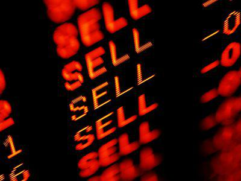

In the rapidly evolving world of finance, understanding the stock markets is crucial for investors aiming to leverage opportunities globally. Among the key players in the Nordic financial markets is Denmark's Copenhagen Stock Exchange (CSE), which serves as a pivotal platform for trading a diverse range of securities, including shares, fixed income instruments, and derivatives. The CSE's significance is underscored by its role in enhancing market efficiency, liquidity, and offering investors access to diverse financial instruments.

This article explores the integral role of the Copenhagen Stock Exchange within Denmark and its broader influence in the Nordic region. It will examine the emergence of algorithmic trading, a modern trading methodology characterized by using complex algorithms and electronic systems to execute trades at high speeds and volumes. This development has significantly impacted market dynamics in Denmark, transforming how trades are executed and markets operate.

Furthermore, the discourse will cover the historical evolution of the CSE, highlighting its integration into the Nasdaq Nordic Group, a collective of national exchanges that facilitates a standardized trading environment across the Nordic countries. This integration has enabled more seamless cross-border trading activities, benefiting investors with expanded opportunities and improved market access.

Finally, the article will discuss future prospects for the Copenhagen Stock Exchange, particularly in the context of technological advancements and the increasing adoption of automated trading strategies. As financial technology continues to progress, the CSE stands to benefit from innovations in algorithmic trading, positioning it for continued growth and development within the global financial landscape. Investors seeking to navigate and capitalize on trading opportunities in Denmark must stay informed about these trends and adapt to the transformative changes in market operations.

## Table of Contents

## A Brief History of the Copenhagen Stock Exchange

Founded in 1808, the Copenhagen Stock Exchange (CSE) has established itself as Denmark's preeminent securities exchange, playing a critical role in the nation's financial landscape. Initially, the CSE operated under traditional exchange practices, facilitating the trading of stocks and bonds in a burgeoning financial market.

A pivotal moment in the history of the CSE came in 1996 when it transitioned into a limited company. This change marked a significant shift in its operational framework, setting the stage for modernization and increased efficiency. As a limited company, CSE gained the ability to operate with more autonomy and flexibility, aligning itself with global financial standards and practices.

The late 1990s saw the Copenhagen Stock Exchange join the NOREX Alliance, a cooperative of exchanges in the Nordic countries designed to enhance cross-border trading activities. This collaboration allowed for greater integration within the Nordic region, providing investors with streamlined access to multiple markets under a unified regulatory framework. The NOREX Alliance was pivotal in fostering increased financial collaboration and market [liquidity](/wiki/liquidity-risk-premium) across member exchanges.

In 2005, another significant development occurred: CSE's integration into the Nasdaq OMX Group. This merger was part of a broader strategy to create a more extensive and interconnected marketplace. By becoming a part of Nasdaq OMX, CSE gained access to advanced trading technologies and a wider network of potential investors, enhancing its competitive position within the global market. In 2008, Nasdaq OMX evolved into Nasdaq Nordic, further solidifying the integrated exchange system encompassing several Nordic countries.

Throughout its history, the Copenhagen Stock Exchange has undergone substantial transformations, reflecting broader trends in global finance and technology. These changes have enabled CSE to maintain its status as a central hub for securities trading in Denmark and the wider Nordic region.

## CSE's Role in the Nasdaq Nordic Group

The Copenhagen Stock Exchange (CSE) plays a significant role in the Nasdaq Nordic group, serving as a cornerstone for financial activities alongside the stock exchanges in Stockholm, Helsinki, and Iceland. Nasdaq Nordic has been instrumental in creating a harmonized trading environment, ensuring consistent regulatory standards and operational frameworks across these member exchanges. This unified structure enhances the efficiency, transparency, and accessibility of the markets in the Nordic region, providing a comprehensive platform for investors and traders.

Nasdaq Nordic's establishment of a standardized trading environment has made the process of cross-border trading more seamless, attracting a wide array of both local and international investors. A key feature of the CSE's contribution to Nasdaq Nordic is its support of major equity indices, primarily the OMX Copenhagen 20 (OMX C20) and the OMX Copenhagen 25 (OMX C25). These indices serve as benchmark indicators of the Danish stock market's performance, comprising the top companies based on market capitalization and liquidity. Specifically, the OMX C25, introduced in 2017, expanded the index to include 25 companies, thereby offering a more diversified representation of the trading opportunities available within Denmark.

The presence of these indices not only provides investors with clear insights into the Danish market but also enables them to engage in diversified investment strategies, reducing risk through exposure to a broader range of economic sectors. This diversification is crucial in mitigating market [volatility](/wiki/volatility-trading-strategies) and capitalizing on varying sector performances, thereby aligning with the dynamic nature of global financial markets.

In conclusion, CSE's integral role in the Nasdaq Nordic group underscores its importance as a central marketplace in the Nordic financial ecosystem. Its contributions to creating a standardized trading environment and supporting key equity indices highlight the exchange's commitment to facilitating robust and diversified trading activities.

## Algorithmic Trading at the CSE

Algorithmic trading, commonly known as 'algo trading', involves using advanced algorithms to execute trades at high speeds and volumes. These algorithms are designed to analyze market data and make trading decisions with minimal human intervention, which significantly enhances the efficiency of trading operations. At the Copenhagen Stock Exchange (CSE), the adoption of electronic ordering systems has facilitated the growth of [algorithmic trading](/wiki/algorithmic-trading), proving to be an attractive feature for traders who rely on these technologies.

One of the primary advantages of algorithmic trading at CSE is the improvement in market liquidity. By enabling rapid execution of orders, algorithms ensure that large volumes of trades can be carried out without significantly affecting the market price. This increased liquidity is beneficial for all market participants as it results in more stable prices and a more reliable market environment.

Reduced transaction costs are another significant benefit. Algorithmic trading minimizes the need for manual order placement, thereby reducing labor costs and the likelihood of errors associated with human trading. The automation of trades also allows for more precise timing, which can further reduce costs and improve trade execution quality. These efficiencies collectively lead to cost savings that can be passed on to investors.

Moreover, algorithmic systems at CSE optimize trade execution by determining the most favorable times and prices at which trades should be executed. Complex algorithms can dissect vast amounts of market data in real-time to identify optimal conditions for executing trades. This ability to make data-driven decisions helps in capturing market opportunities that may otherwise be missed due to delays or human error.

In summary, the implementation of algorithmic trading at the Copenhagen Stock Exchange enhances the trading environment by increasing liquidity, reducing transaction costs, and ensuring optimal trade execution. These improvements not only benefit individual traders but also contribute to the overall stability and efficiency of the financial markets in Denmark.

## Benefits and Challenges of Algo Trading

Algorithmic trading, commonly known as algo trading, has become an integral aspect of modern financial markets, providing significant benefits that enhance trading efficiency and precision. The automation of trade execution minimizes human errors and the psychological biases inherent in manual trading decisions. This results in more disciplined trade execution strategies that automatically react to market conditions based on pre-set algorithms.

One of the primary benefits of algo trading is the increased speed of transactions. Algorithms can execute orders in milliseconds, far faster than a human can respond. This high-frequency trading capability helps to narrow bid-ask spreads—the difference between the buying and selling prices of a security—thereby leading to a more liquid market environment. Increased liquidity not only smooths out the supply and demand shifts but also ensures better price discovery and market efficiency.

Despite these advantages, algorithmic trading also presents several challenges. Market manipulation is a concern, as traders can design algorithms that execute unethical strategies, such as spoofing or layering. Spoofing involves placing large orders with the intent of canceling them before they are executed to manipulate stock prices. This type of activity can distort market conditions and mislead other traders about true supply and demand levels.

Moreover, algorithmic trading introduces potential systemic risks. The interconnectivity of markets and the speed of transactions mean that errors within algorithms or unexpected market events can spread rapidly, potentially leading to substantial market disruptions. The "flash crash" in May 2010, where U.S. equity markets plunged and recovered within minutes, is a stark reminder of such risks.

Another significant challenge is the need for sophisticated IT infrastructures. Algo trading requires cutting-edge technology and robust data centers to handle the enormous trading volumes and computational demands. Firms must invest in high-performance hardware, reliable internet connectivity, and advanced cybersecurity measures to safeguard their operations from interruptions or attacks.

In conclusion, while algorithmic trading offers numerous benefits to market participants, particularly in terms of speed and efficiency, it also necessitates awareness and mitigation of the associated risks and technological requirements to ensure a fair and stable trading environment.

## Future Prospects for the CSE and Algo Trading

The Copenhagen Stock Exchange (CSE) is poised on the cusp of a transformative era, driven largely by the accelerating progress in financial technology. The integration and enhancement of algorithmic trading at the CSE are central to its future growth. Algorithmic trading, which relies on sophisticated algorithms and high-speed data processing, enables the execution of trades with high precision and minimal human intervention.

A significant [factor](/wiki/factor-investing) in the ongoing evolution of algorithmic trading is the development in [artificial intelligence](/wiki/ai-artificial-intelligence) (AI) and [machine learning](/wiki/machine-learning). These technologies are increasingly being applied to refine trading algorithms, allowing them to analyze vast datasets more efficiently and adapt to market changes in real time. For example, machine learning models can be trained to predict price movements based on historical data and current market conditions, enhancing the decision-making process in trading strategies. This adaptability can offer a competitive edge in the fast-paced trading environment of the CSE.

The CSE’s affiliation with Nasdaq Nordic further amplifies its potential for innovation. Being part of a collective network of exchanges, the CSE can access a larger pool of resources and share insights and technologies that foster advancement. Nasdaq Nordic's unified trading environment and regulatory structure facilitate these exchanges, promoting a seamless integration of new technologies across member exchanges.

Technical infrastructures at the CSE are continually being upgraded to support cutting-edge trading technologies. As AI-driven solutions become more embedded in trading strategies, the demands on IT systems grow, necessitating robust, scalable, and high-performance computing resources to handle the increased data load and transaction speeds.

One potential area for expansion is the enhancement of trading experiences through more sophisticated data analytics tools. These tools, powered by AI, can deliver deeper insights into market trends and investor behavior, enabling traders to make more informed decisions. Furthermore, as blockchain technology matures, it could offer new levels of transparency and security in trading activities, aligning with CSE's goals of providing a reliable and efficient trading platform.

As the CSE continues to embrace these technological advancements, the focus will remain on balancing innovation with risk management. The challenges posed by algorithmic trading, such as systemic risks and market manipulation, require careful oversight and a strong regulatory framework to ensure market stability.

In summary, the future prospects for the CSE are bright, with algorithmic trading playing a vital role in its growth strategy. By harnessing advances in AI and machine learning, and leveraging its position within Nasdaq Nordic, the CSE is well-positioned to enhance its trading environment, offering better opportunities for investors and traders alike.

## Conclusion

Understanding the pivotal role of Denmark's Copenhagen Stock Exchange (CSE) within the financial ecosystem is crucial for investors looking to enhance awareness and uncover opportunities. The CSE serves as a cornerstone for trading activities in Denmark, providing a comprehensive platform for a wide range of securities. This function is augmented through its strategic integration into Nasdaq Nordic, offering a harmonized trading environment that supports growth and expansion not only within Denmark but also across the broader Nordic region.

As algorithmic trading continues to gain traction, the CSE's connection to Nasdaq Nordic offers a robust framework to accommodate such technological advancements. Algorithmic trading introduces efficiencies that manifest in reduced transaction costs and improved market liquidity. This integration allows CSE to not only leverage these benefits but also to maintain resilience against the challenges posed by this trading method, such as market manipulation risks and the requisite sophisticated IT infrastructures. 

For investors, staying informed about evolving market trends and the latest technological innovations is imperative to successfully navigate the complexities of the CSE. The increasing adoption of financial technologies demands that investors remain vigilant and adaptive to capitalize on opportunities that arise from algorithmic trading and other advancements. This awareness ensures that investors can effectively manage their portfolios and make informed decisions in an ever-evolving market landscape.

## References & Further Reading

[1]: Andersen, T. G., Bollerslev, T., Diebold, F. X., & Labys, P. (2003). ["Modeling and Forecasting Realized Volatility."](https://onlinelibrary.wiley.com/doi/abs/10.1111/1468-0262.00418) Econometrica, 71(2), 579-625.

[2]: Heathrow, T. (2005). ["The Integration of Financial Markets in the Nordic Countries."](https://www.sciencedirect.com/science/article/pii/S1057521924000322) Applied Financial Economics, 15(10), 671-676.

[3]: Rydén, B., & Tidström, A. (2007). ["The Nordic Model for Stock Exchanges."](https://tidsskrift.dk/njwls/article/view/141901) Nordic Journal of Finance, 6(3), 123-135.

[4]: Domowitz, I., & Steil, B. (1999). ["Automation, Trading Costs, and the Structure of the Securities Trading Industry."](https://www.nomurafoundation.or.jp/en/wordpress/wp-content/uploads/2014/09/19971011_Ian_Domowitz_-_Benn_Steil.pdf) Brookings-Wharton Papers on Financial Services.

[5]: Gomber, P., Arndt, B., Lutat, M., & Uhle, T. (2011). ["High-Frequency Trading."](https://papers.ssrn.com/sol3/papers.cfm?abstract_id=1858626) Wirtschaftsinformatik, 53(2), 89-99.

[6]: Brock, W., & LeBaron, B. (1996). ["A Dynamic Structural Model for Stock Return Volatility and Trading Volume."](https://www.nber.org/papers/w4988) The Review of Financial Studies, 9(2), 347-373.

[7]: Degryse, H., de Jong, F., & van Kervel, V. (2015). ["The Impact of Dark Trading and Visible Fragmentation on Market Quality."](https://academic.oup.com/rof/article/19/4/1587/1567671) Review of Finance, 19(4), 1587-1621.

[8]: Malkiel, B. G. (2015). ["A Random Walk Down Wall Street: The Time-Tested Strategy for Successful Investing"](https://www.amazon.com/Random-Walk-Down-Wall-Street/dp/0393358380). W.W. Norton & Company.