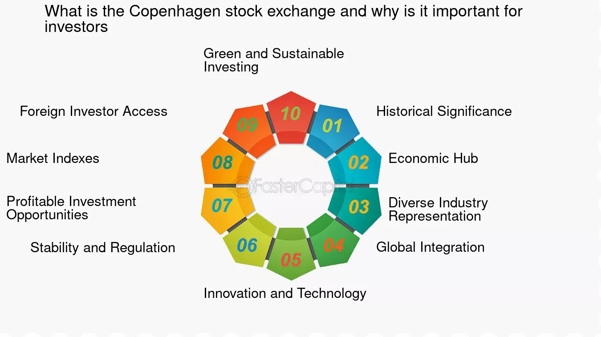

## Table of Contents

## What is the Copenhagen Stock Exchange?

The Copenhagen Stock Exchange is a place where people and companies can buy and sell shares of Danish companies. It is also known as Nasdaq Copenhagen. It started a long time ago in 1625, making it one of the oldest stock exchanges in the world. People use the stock exchange to invest their money in businesses they believe will grow and make profits.

The main job of the Copenhagen Stock Exchange is to help companies get money they need to grow. When a company wants to raise money, it can sell parts of itself, called shares, to the public. People who buy these shares become part owners of the company. The stock exchange makes sure that these trades happen fairly and openly. It also keeps track of the prices of the shares, so everyone knows how much they are worth.

## How does the Copenhagen Stock Exchange function as a marketplace for securities?

The Copenhagen Stock Exchange, also known as Nasdaq Copenhagen, works like a big marketplace where people can buy and sell pieces of Danish companies called shares. When someone wants to buy shares, they can go to the stock exchange and find someone who wants to sell those shares. The exchange makes sure that these trades happen smoothly and fairly. It's like a big meeting place where everyone can see the prices of the shares and decide if they want to buy or sell.

The stock exchange helps companies get money they need to grow their business. When a company decides it needs more money, it can sell shares to the public. People who buy these shares are giving money to the company and, in return, they become part owners. The stock exchange keeps track of all these trades and the prices of the shares, making sure everything is done in a clear and honest way. This helps both the companies and the people investing their money.

## What types of securities are traded on the Copenhagen Stock Exchange?

The Copenhagen Stock Exchange, or Nasdaq Copenhagen, is a place where different types of securities are bought and sold. The main type of security traded there is stocks, which are shares in Danish companies. When people buy stocks, they become part owners of the company and can make money if the company does well.

Besides stocks, the Copenhagen Stock Exchange also trades bonds. Bonds are like loans that people give to companies or the government. In return, the company or government promises to pay back the money with interest over time. This gives investors another way to make money and helps companies and the government raise funds they need.

Another type of security you can find at the Copenhagen Stock Exchange is exchange-traded funds (ETFs). ETFs are like baskets of different investments, such as stocks and bonds, all put together. When you buy an [ETF](/wiki/etf-trading-strategies), you're buying a small piece of all the things inside it. This makes it easier for people to invest in a variety of securities without having to buy each one separately.

## Who are the main participants in the Copenhagen Stock Exchange?

The main participants in the Copenhagen Stock Exchange are investors and companies. Investors are people or organizations that buy and sell stocks, bonds, and ETFs. They might be everyday people saving for the future, or big institutions like banks and pension funds. They want to make money by investing in companies they believe will grow and be successful. Companies, on the other hand, use the stock exchange to raise money. When a company needs funds to grow, it can sell shares to the public. This gives them the money they need, and in return, the people who buy the shares become part owners of the company.

Another key participant is the stock exchange itself, which is run by Nasdaq Copenhagen. The stock exchange acts like a referee, making sure that all trades are fair and transparent. It sets rules that everyone has to follow, and it keeps track of all the prices and trades that happen. Brokers are also important participants. They are the people who help investors buy and sell securities. They work for brokerage firms and help match buyers with sellers, making the whole process easier for everyone involved.

## How does one buy or sell stocks on the Copenhagen Stock Exchange?

To buy or sell stocks on the Copenhagen Stock Exchange, you need to use a broker. A broker is like a helper who works for a brokerage firm. You can open an account with a brokerage firm, either online or in person. Once you have an account, you can tell your broker which stocks you want to buy or sell. Your broker will then go to the stock exchange and find someone who wants to do the opposite trade. For example, if you want to buy shares of a company, your broker will find someone who wants to sell those shares.

When your broker finds a match, the trade happens at the current market price. The stock exchange makes sure that everything is done fairly and that the price is clear to everyone. After the trade, the shares you bought will show up in your brokerage account, and if you sold shares, the money from the sale will go into your account. The whole process is quick and can often be done in a few minutes, thanks to modern technology. Remember, you might have to pay a small fee to your broker for their help in making the trade.

## What are the trading hours of the Copenhagen Stock Exchange?

The Copenhagen Stock Exchange, also known as Nasdaq Copenhagen, has regular trading hours from 9:00 AM to 5:00 PM, local time in Denmark. This is when most of the buying and selling of stocks, bonds, and ETFs happens. People and companies can trade during these hours, and the stock exchange makes sure everything goes smoothly.

There are also times outside of these regular hours when trading can happen. These are called pre-market and after-hours trading. Pre-market trading starts at 8:00 AM and goes until the regular market opens at 9:00 AM. After-hours trading happens from 5:00 PM until 10:00 PM. Not as many trades happen during these times, but it gives people more chances to buy and sell if they can't do it during the regular hours.

## What is the role of the OMX Copenhagen 20 Index in the stock exchange?

The OMX Copenhagen 20 Index is a very important part of the Copenhagen Stock Exchange. It is like a list of the 20 biggest and most important companies in Denmark. The index helps people see how well these big companies are doing. When people look at the OMX Copenhagen 20 Index, they can tell if the Danish stock market is going up or down. It's like a quick way to check the health of the economy in Denmark.

The index is also used by investors to make decisions. If the OMX Copenhagen 20 Index is going up, it might mean that it's a good time to buy stocks because the market is doing well. If it's going down, people might decide to sell their stocks or wait before buying more. The index is updated all the time during trading hours, so people can keep track of changes as they happen. This helps everyone involved in the stock market make smarter choices about their money.

## How does the Copenhagen Stock Exchange regulate trading and ensure fairness?

The Copenhagen Stock Exchange, run by Nasdaq Copenhagen, works hard to make sure trading is fair and everyone follows the rules. They do this by setting up rules that everyone has to follow. These rules help stop people from cheating or doing things that could hurt others. The stock exchange also watches all the trades that happen to make sure they are done the right way. If someone breaks the rules, the stock exchange can punish them, like by fining them or stopping them from trading.

Another way the Copenhagen Stock Exchange keeps things fair is by making sure all the prices are clear and easy to see. They show the prices of stocks, bonds, and ETFs to everyone at the same time. This helps people make good choices about buying and selling. The stock exchange also uses technology to match buyers and sellers quickly and fairly. This way, everyone gets a fair chance to trade, and no one can jump ahead of the line.

## What are the listing requirements for companies wanting to be traded on the Copenhagen Stock Exchange?

To get listed on the Copenhagen Stock Exchange, a company needs to meet certain rules. They have to show they are a good business that can be trusted. This means they need to share a lot of information about how they are doing, like how much money they are making and what they own. They also need to have enough shares available for people to buy. The company has to follow all the rules set by the stock exchange and the laws of Denmark.

Another important thing is that the company needs to be big enough. They have to have a certain amount of money, called market capitalization, which is how much all their shares are worth together. They also need to have been around for a while and show that they can keep making money. This helps make sure that the companies on the stock exchange are strong and can be a good investment for people.

## How does the Copenhagen Stock Exchange contribute to the Danish economy?

The Copenhagen Stock Exchange helps the Danish economy by giving companies a place to get money they need to grow. When a company wants to expand, it can sell shares on the stock exchange. People buy these shares and give money to the company. This helps the company build new things, hire more workers, and make more products. When companies grow, they create jobs and help the economy get stronger.

The stock exchange also helps people in Denmark save and invest their money. By buying stocks, people can put their money into businesses they believe will do well. If the companies do well, the value of the stocks goes up, and people can make more money. This encourages people to save and invest, which is good for the economy. Plus, the stock exchange shows how the economy is doing through indexes like the OMX Copenhagen 20. This helps everyone understand if the economy is growing or shrinking.

## What technological systems support trading at the Copenhagen Stock Exchange?

The Copenhagen Stock Exchange uses a computer system called the INET trading platform to help people buy and sell stocks. This system makes trading fast and fair. It matches buyers and sellers quickly and shows everyone the prices at the same time. This helps make sure that trading is done in a clear and honest way. The INET platform is used by many stock exchanges around the world, not just in Denmark.

Another important technology at the Copenhagen Stock Exchange is the surveillance system. This system watches all the trades to make sure no one is cheating or breaking the rules. It uses special software to look for any strange trading patterns. If it finds something that doesn't look right, it can alert the people who run the stock exchange. This helps keep the market safe and fair for everyone.

## How have recent global economic trends affected the operations and performance of the Copenhagen Stock Exchange?

Recent global economic trends, like changes in interest rates and big events like the COVID-19 pandemic, have had a big impact on the Copenhagen Stock Exchange. When interest rates go up, it can make borrowing money more expensive for companies. This can slow down their growth and make their stocks less attractive to investors. During the COVID-19 pandemic, many businesses had to close or change how they worked, which made the stock market go up and down a lot. The Copenhagen Stock Exchange saw big changes in stock prices as people worried about the economy.

Even with these challenges, the Copenhagen Stock Exchange has been able to keep working well. It uses technology to help people trade quickly and fairly, even when things are uncertain. The stock exchange also helps companies raise money during tough times, which is important for keeping the Danish economy going. By staying strong and adaptable, the Copenhagen Stock Exchange continues to be a key part of Denmark's financial system, helping both companies and investors navigate through global economic changes.

## References & Further Reading

[1]: Andersen, T. G., Bollerslev, T., Diebold, F. X., & Labys, P. (2003). ["Modeling and Forecasting Realized Volatility."](https://onlinelibrary.wiley.com/doi/abs/10.1111/1468-0262.00418) Econometrica, 71(2), 579-625.

[2]: Heathrow, T. (2005). ["The Integration of Financial Markets in the Nordic Countries."](https://www.sciencedirect.com/science/article/pii/S1057521924000322) Applied Financial Economics, 15(10), 671-676.

[3]: Rydén, B., & Tidström, A. (2007). ["The Nordic Model for Stock Exchanges."](https://tidsskrift.dk/njwls/article/view/141901) Nordic Journal of Finance, 6(3), 123-135.

[4]: Domowitz, I., & Steil, B. (1999). ["Automation, Trading Costs, and the Structure of the Securities Trading Industry."](https://www.nomurafoundation.or.jp/en/wordpress/wp-content/uploads/2014/09/19971011_Ian_Domowitz_-_Benn_Steil.pdf) Brookings-Wharton Papers on Financial Services.

[5]: Gomber, P., Arndt, B., Lutat, M., & Uhle, T. (2011). ["High-Frequency Trading."](https://papers.ssrn.com/sol3/papers.cfm?abstract_id=1858626) Wirtschaftsinformatik, 53(2), 89-99.

[6]: Brock, W., & LeBaron, B. (1996). ["A Dynamic Structural Model for Stock Return Volatility and Trading Volume."](https://www.nber.org/papers/w4988) The Review of Financial Studies, 9(2), 347-373.

[7]: Degryse, H., de Jong, F., & van Kervel, V. (2015). ["The Impact of Dark Trading and Visible Fragmentation on Market Quality."](https://academic.oup.com/rof/article/19/4/1587/1567671) Review of Finance, 19(4), 1587-1621.

[8]: Malkiel, B. G. (2015). ["A Random Walk Down Wall Street: The Time-Tested Strategy for Successful Investing"](https://www.amazon.com/Random-Walk-Down-Wall-Street/dp/0393358380). W.W. Norton & Company.