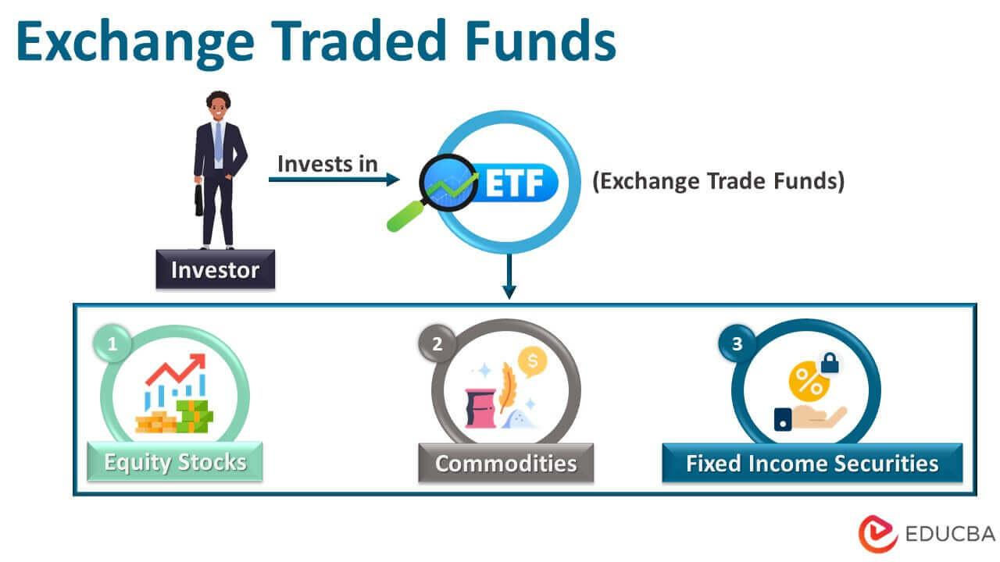

## Table of Contents

## What is a copper Exchange-Traded Fund (ETF)?

A copper Exchange-Traded Fund (ETF) is a type of investment fund that focuses on copper. It allows people to invest in copper without actually buying the physical metal. Instead, the ETF might hold shares in companies that mine copper, or it might invest in copper futures contracts. This makes it easier for investors to gain exposure to the price movements of copper without dealing with the complexities of owning the metal itself.

Copper ETFs can be a good choice for someone who believes the price of copper will go up. If the price of copper increases, the value of the ETF should also increase. This can be a way to diversify an investment portfolio, as copper is used in many industries like construction and electronics. However, like all investments, copper ETFs come with risks, such as changes in the copper market or broader economic conditions that could affect the price of copper.

## How does a copper ETF work?

A copper ETF works by letting people invest in copper without having to buy the actual metal. Instead of buying copper bars or coins, you buy shares of the ETF. The ETF then uses the money from selling shares to invest in things related to copper. This could be shares in companies that mine copper, or it could be contracts that promise to buy or sell copper in the future. When you buy shares of the ETF, you're betting that the price of copper will go up. If it does, the value of your shares in the ETF should also go up.

The [ETF](/wiki/etf-trading-strategies) is managed by professionals who decide how to invest the money. They might choose to invest in a mix of mining companies and futures contracts to spread out the risk. The value of the ETF goes up and down based on what's happening in the copper market. If copper becomes more expensive, the ETF's value usually goes up. But if the price of copper drops, the value of the ETF can go down too. This makes copper ETFs a way to invest in copper without dealing with the hassle of storing and selling physical copper.

## What are the benefits of investing in a copper ETF?

Investing in a copper ETF is easy and convenient. You don't need to worry about buying, storing, or selling physical copper. Instead, you can just buy shares of the ETF through a broker, like you would with any stock. This makes it simple to add copper to your investment mix without dealing with the hassle of the metal itself.

Another benefit is that copper ETFs can help spread out your investment risk. Copper is used in many industries, like building and electronics, so its price can go up when these industries do well. By investing in a copper ETF, you're betting on the growth of these industries without putting all your money into one company. This can make your overall investment portfolio more balanced and less risky.

## What are the risks associated with copper ETFs?

One big risk with copper ETFs is that the price of copper can go up and down a lot. Copper prices can change because of things like how much people want it, how much there is to buy, and what's happening in the world economy. If the price of copper goes down, the value of your ETF shares will also go down. This means you could lose money if you need to sell your shares when copper prices are low.

Another risk is that the ETF might not be as good as just owning copper. The people who run the ETF have to pay for things like managing the fund and trading. These costs can add up and make the ETF less valuable over time. Plus, if the ETF invests in companies that mine copper, those companies might not do well even if copper prices are going up. This can make the ETF go down in value even when you think it should be going up.

Lastly, there's always the chance that something unexpected happens in the copper market or the world economy. For example, new laws or big changes in how much copper people want can shake things up. If the ETF is holding futures contracts, those can be tricky and might not always move the way you expect. So, even though copper ETFs can be a good way to invest in copper, they come with risks that you need to think about carefully.

## How can someone start investing in copper ETFs?

To start investing in copper ETFs, you first need to open a brokerage account. This is like a bank account, but for buying and selling investments. You can do this online with many big companies like Fidelity, Vanguard, or Charles Schwab. Once your account is set up, you'll need to add money to it. This is the money you'll use to buy the copper ETF shares.

After your account is funded, you can search for a copper ETF. There are different ones to choose from, so you might want to do some research to find one that fits what you're looking for. Once you've picked an ETF, you can place an order to buy shares. You can decide how many shares you want to buy and at what price. Once your order is filled, you'll own shares in the copper ETF and can watch how they do over time.

## What factors influence the price of copper and, consequently, copper ETFs?

The price of copper can change because of how much people want it and how much is available. If more people want copper for things like building houses or making electronics, the price goes up. But if there's a lot of copper available, the price might go down. Also, big events like strikes at copper mines or new laws about mining can shake up the supply and change the price.

The world economy also plays a big role. When countries are doing well, they use more copper, which can push the price up. But if the economy slows down, people might not need as much copper, and the price can drop. Things like the value of the U.S. dollar matter too, because copper is often bought and sold in dollars. If the dollar gets stronger, copper can seem more expensive to people using other currencies, and that can affect the price.

Because copper ETFs follow the price of copper, these same things that move copper prices will also move the value of the ETFs. If copper prices go up because more people want it or there's less available, the value of the copper ETF should go up too. But if the price of copper drops because of a slow economy or too much supply, the value of the ETF will likely go down. So, keeping an eye on these factors can help you understand what might happen to your investment in a copper ETF.

## Can you explain the difference between physically-backed and futures-based copper ETFs?

A physically-backed copper ETF is one where the fund actually owns real copper. This means the ETF holds onto copper in a safe place, like a warehouse. When you invest in this kind of ETF, you're betting that the price of copper will go up. If it does, the value of your shares in the ETF should go up too. But, if the price of copper goes down, the value of your shares will also drop. These ETFs can be good if you want a direct connection to the price of copper, but they might cost more because the ETF has to pay to store the metal.

A futures-based copper ETF, on the other hand, doesn't hold actual copper. Instead, it invests in contracts that promise to buy or sell copper at a set price in the future. These contracts are called futures. The ETF managers buy and sell these futures to try and make money as the price of copper changes. This type of ETF can be riskier because futures prices can be different from the actual price of copper. But they can also be cheaper to run because they don't have to pay for storing physical metal. When you invest in a futures-based ETF, you're betting on how the futures market thinks copper prices will change.

## How do copper ETFs fit into a diversified investment portfolio?

Copper ETFs can help make your investment portfolio more diverse by letting you invest in something different from stocks and bonds. Copper is used in lots of industries, like building and making electronics, so its price can go up when these industries do well. By adding a copper ETF to your portfolio, you spread out your risk because you're not putting all your money into one type of investment. If stocks or bonds aren't doing well, your copper ETF might still go up if copper prices are rising.

But, it's important to remember that copper ETFs come with their own risks. The price of copper can change a lot because of things like how much people want it, how much is available, and what's happening in the world economy. If copper prices drop, the value of your ETF will go down too. So, while a copper ETF can help balance your portfolio, you need to think about how much risk you're okay with and make sure you're not putting too much of your money into it.

## What are the tax implications of investing in copper ETFs?

When you invest in copper ETFs, you need to think about taxes. If you make money by selling your ETF shares for more than you paid for them, you'll owe capital gains tax. How much tax you pay depends on how long you held the shares. If you held them for more than a year, it's called a long-term capital gain, and the tax rate is usually lower. If you held them for a year or less, it's a short-term capital gain, and you'll pay tax at your regular income tax rate.

Also, some copper ETFs might pay out dividends. These dividends are usually taxed as regular income. But if the ETF is structured in a certain way, like a grantor trust, you might have to pay taxes on the gains the ETF makes, even if you don't sell your shares. This is because the IRS sees you as owning the copper directly. So, it's a good idea to talk to a tax advisor to understand how these rules apply to your specific situation and to make sure you're prepared for any tax bills that might come up.

## How do global economic trends affect copper ETFs?

Global economic trends can have a big impact on copper ETFs because copper is used all over the world in many industries. When the world economy is doing well, countries build more houses and factories, and they make more electronics. All of these things need copper, so the demand for copper goes up and the price can go up too. This is good for copper ETFs because if the price of copper goes up, the value of the ETF shares should go up as well. But if the world economy slows down, people might not need as much copper, and the price can drop. This would make the value of the copper ETF go down.

Another thing that can affect copper ETFs is how strong the U.S. dollar is. Copper is often bought and sold in U.S. dollars, so if the dollar gets stronger, copper can seem more expensive to people using other currencies. This might make them buy less copper, which can lower the price. On the other hand, if the dollar gets weaker, copper might seem cheaper to those people, and they might buy more, which can push the price up. So, keeping an eye on what's happening in the world economy and with the U.S. dollar can help you understand what might happen to your investment in a copper ETF.

## What are some of the major copper ETFs available in the market?

There are a few major copper ETFs that you can invest in. One popular choice is the Global X Copper Miners ETF (COPX). This ETF focuses on companies that mine copper, so it gives you a way to invest in copper without buying the actual metal. Another option is the United States Copper Index Fund (CPER). This ETF invests in copper futures contracts, which means it tries to follow the price of copper without holding the metal itself. Both of these ETFs can be good ways to add copper to your investment mix, but they work a bit differently.

Another copper ETF to consider is the iPath Series B Bloomberg Copper Subindex Total Return ETN (JJC). This is an exchange-traded note (ETN) that tracks the performance of copper futures, similar to CPER. ETNs are a bit different from ETFs because they are debt instruments, but they can still be a good way to invest in copper. Each of these ETFs has its own costs and risks, so it's important to do your homework and pick the one that fits best with what you're looking for in your investment portfolio.

## How can advanced investors use copper ETFs for hedging strategies?

Advanced investors can use copper ETFs to hedge against risks in their portfolios. If an investor has a lot of money in industries that use a lot of copper, like construction or electronics, they might buy a copper ETF to protect themselves. If copper prices go down, it could hurt their other investments, but the copper ETF might go up in value. This can help balance out the losses in their portfolio. By doing this, they're not betting that copper prices will go up, but instead, they're trying to protect their money from big swings in copper prices.

Another way advanced investors can use copper ETFs for hedging is by using them to balance out their exposure to other commodities or currencies. For example, if an investor thinks the U.S. dollar will get weaker, they might buy a copper ETF because copper is often bought and sold in dollars. If the dollar does get weaker, the price of copper might go up, and the value of the ETF could go up too. This can help the investor make money or at least not lose as much if the dollar drops. Using copper ETFs this way takes some careful planning, but it can be a smart way to manage risk in a portfolio.

## References & Further Reading

[1]: [Bergstra, J., Bardenet, R., Bengio, Y., & Kégl, B. (2011). "Algorithms for Hyper-Parameter Optimization."](https://papers.nips.cc/paper/4443-algorithms-for-hyper-parameter-optimization) Advances in Neural Information Processing Systems 24.

[2]: ["Advances in Financial Machine Learning"](https://www.amazon.com/Advances-Financial-Machine-Learning-Marcos/dp/1119482089) by Marcos Lopez de Prado

[3]: ["Evidence-Based Technical Analysis: Applying the Scientific Method and Statistical Inference to Trading Signals"](https://www.amazon.com/Evidence-Based-Technical-Analysis-Scientific-Statistical/dp/0470008741) by David Aronson

[4]: ["Machine Learning for Algorithmic Trading"](https://github.com/stefan-jansen/machine-learning-for-trading) by Stefan Jansen

[5]: ["Quantitative Trading: How to Build Your Own Algorithmic Trading Business"](https://www.amazon.com/Quantitative-Trading-Build-Algorithmic-Business/dp/1119800064) by Ernest P. Chan