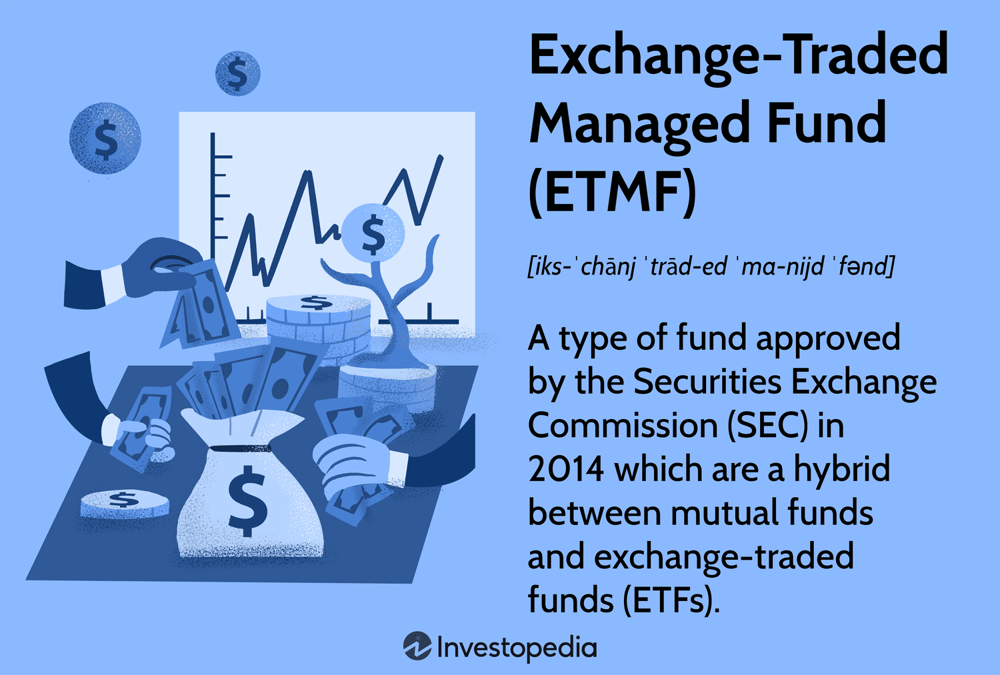

Exchange-Traded Funds (ETFs) represent a pivotal innovation in the landscape of investment strategies, providing investors with a diverse array of financial instruments bundled within a single, tradable security. Originating in the early 1990s, ETFs have witnessed a rapid growth trajectory, attracting both retail and institutional investors for their unique ability to diversify risk, enhance liquidity, and reduce transaction costs compared to traditional mutual funds. As of recent years, the appeal of ETFs extends beyond equities, encompassing commodities that play crucial roles in the global economy.

Commodities have long been integral components of investment portfolios, offering a hedge against inflation and a means of diversification. Among these, copper holds a significant position due to its extensive use in various industrial applications, including construction, electrical equipment, and renewable energy technologies. As an essential industrial metal, copper is often viewed as an economic indicator due to the metal's sensitivity to changes in industrial demand. The ability to incorporate copper into an investment portfolio is facilitated by Copper ETFs, which provide a convenient and efficient means of gaining exposure to the copper market. These instruments enable investors to participate in the price movements of copper without the complexities associated with trading copper futures or physical copper, thereby simplifying the investment process while maintaining the benefits associated with commodity exposure.



With the advent of technology and advancements in computational analytics, algorithmic trading has emerged as a transformative approach within financial markets, including ETF management. Algorithmic trading involves the use of computer programs to execute trades based on predetermined criteria, allowing for data-driven, systematic investment strategies. This method not only optimizes trading efficiency and timing but also minimizes human biases and errors. As algorithmic trading gains momentum, its integration with Copper ETFs presents numerous opportunities for optimizing portfolio returns through strategies that capitalize on the dynamic nature of copper market movements.

The objective of this article is to explore investment strategies involving Copper ETFs, concentrating on the advantages algorithmic trading brings to commodity ETF investments. Through a comprehensive examination of traditional and algorithmic strategies, this article aims to equip investors with insights into building robust, efficient approaches to investing in Copper ETFs, thereby enhancing their understanding and capability to harness the potential benefits of this innovative investment strategy.

## Table of Contents

## Understanding Copper ETFs

Exchange-Traded Funds (ETFs) are investment funds that are traded on stock exchanges, much like stocks. Copper ETFs are a specific type of ETF that provides investors with exposure to the copper market. These financial instruments typically comprise assets such as copper futures, copper mining stocks, and other copper-related securities, offering a way to gain exposure to copper prices without directly trading or holding the physical metal.

Investing in Copper ETFs presents several benefits. Firstly, they offer liquidity, as ETFs are traded on major stock exchanges, allowing investors to buy and sell shares throughout the trading day at market-determined prices. This liquidity makes it easier for investors to enter and exit positions in comparison to holding physical copper or other less liquid investments. Secondly, Copper ETFs provide diversification. By investing in a basket of copper-related assets, investors can spread risk across various components of the copper market, which can include both direct exposure to copper prices and indirect exposure via mining companies. Lastly, Copper ETFs are cost-effective. They allow investors to gain copper exposure without the costs associated with buying, storing, and insuring physical copper, and they often have lower fees compared to active mutual funds.

There are several popular Copper ETFs available in the market. For example, Global X Copper Miners [ETF](/wiki/etf-trading-strategies) (COPX) focuses on copper mining companies, providing indirect exposure to copper itself, while the United States Copper Index Fund (CPER) directly tracks the performance of copper futures contracts. These ETFs have shown different performance trends depending on market conditions, reflecting both the spot price of copper and market sentiment regarding the metal.

Copper ETFs align with industrial demand due to copper's critical role as an industrial metal. Copper is extensively used in infrastructure, electrical grids, and electronic products, making its demand sensitive to industrial activity and economic growth. As global infrastructure initiatives and the transition to renewable energy sources continue to fuel copper demand, Copper ETFs can offer investors a way to capitalize on these economic trends. The growing reliance on copper in technology and renewable energy sectors further accentuates its importance in the global economy, providing another layer of potential growth for investors in Copper ETFs.

In summary, Copper ETFs provide a structured and efficient way for investors to access the copper market, combining the benefits of [liquidity](/wiki/liquidity-risk-premium), diversification, and cost-effectiveness. By aligning with industrial demand, these ETFs can be a strategic addition to investment portfolios aiming to capitalize on the economic significance of copper.

## Investing in Copper ETFs: Traditional vs. Algorithmic Strategies

Investors have various strategies when considering investments in Copper Exchange-Traded Funds (ETFs). Traditional strategies often involve [fundamental analysis](/wiki/fundamental-analysis) and market timing, while modern approaches include [algorithmic trading](/wiki/algorithmic-trading). Both have their advantages and limitations, and understanding these can help optimize investment outcomes.

Traditional investment strategies, including fundamental analysis, focus on evaluating a copper ETF's intrinsic value by examining economic factors such as supply, demand, and geopolitical influences impacting copper prices. Investors conducting fundamental analysis might study macroeconomic indicators like industrial production and GDP growth rates, which correlate with copper demand. Market timing, another traditional approach, involves attempting to predict market movements and making buying or selling decisions accordingly. This strategy often relies on qualitative insights and historical price patterns. However, market timing can be challenging due to the inherent unpredictability and [volatility](/wiki/volatility-trading-strategies) of commodity markets.

In contrast, algorithmic trading leverages computer algorithms to automate the trading process, using quantitative models to identify trading opportunities. The data-driven nature of algorithmic trading allows for [backtesting](/wiki/backtesting) strategies against historical data, optimizing decision-making based on statistical evidence. This can potentially enhance the effectiveness and efficiency of ETF investments. By using algorithms, traders can execute orders at speeds and frequencies unattainable by human traders.

Algorithmic strategies for Copper ETFs include [momentum](/wiki/momentum) trading and mean reversion. Momentum trading involves capitalizing on existing market trends; algorithms detect upward or downward trends and generate trade signals accordingly. For instance, if copper prices exhibit a consistent upward trend, an algorithm might initiate a buy order when specific technical indicators (e.g., moving averages or Relative Strength Index) are met. Conversely, mean reversion strategies assume that copper prices will revert to their mean over time. These algorithms identify deviations from historical averages and execute trades anticipating a return to the mean.

Python is commonly used to develop and test algorithmic trading strategies. Consider the following basic example of a momentum trading strategy using Python:

```python
import pandas as pd
import numpy as np

# Assume `price_data` is a DataFrame with historical price data for a Copper ETF
# 'Close' is the column representing the closing prices

# Calculate the moving averages
price_data['MA_5'] = price_data['Close'].rolling(window=5).mean()
price_data['MA_20'] = price_data['Close'].rolling(window=20).mean()

# Generate buy/sell signals
price_data['Signal'] = np.where(price_data['MA_5'] > price_data['MA_20'], 1, 0)

# Calculate returns
price_data['Return'] = price_data['Close'].pct_change()
price_data['Strategy_Return'] = price_data['Signal'].shift(1) * price_data['Return']

# Cumulative returns
cumulative_returns = (1 + price_data['Strategy_Return']).cumprod()
```

Algorithmic trading can offer several advantages by bringing discipline and removing emotional biases from trading decisions. Nonetheless, the success of any algorithm depends on the quality of the data used and the robustness of the model. While algorithmic trading can enhance investment strategies with Copper ETFs, it is crucial to consider the risks, such as model overfitting and technical failures. Balancing traditional and algorithmic approaches might be optimal for investors seeking exposure to the copper market.

## Building an Algorithmic Trading Strategy for Copper ETFs

Developing an algorithmic trading strategy for Copper Exchange-Traded Funds (ETFs) involves several key steps, each crucial to ensuring the strategy is robust, effective, and adaptable to market conditions. The process typically begins with thorough market research, which involves analyzing historical price data and identifying patterns or anomalies that may influence trading decisions. Understanding market dynamics, such as supply and demand factors affecting copper prices, is essential. This research provides a foundation upon which algorithms can be built.

Model selection follows, where traders choose an appropriate algorithmic model to implement based on insights gained during market research. Common models include trend-following, mean reversion, and [machine learning](/wiki/machine-learning)-based approaches. The choice of model depends on the trader's understanding of the copper market and the specific behavior they aim to capitalize on. For example, a trend-following strategy might be suitable in a stable, upward-moving market, whereas mean reversion strategies could perform well in volatile conditions.

Backtesting is a critical phase that involves testing the chosen model against historical data to evaluate its performance. Backtesting provides insights into the strategy's potential effectiveness and allows for refining and optimizing the model parameters. It's essential to use extensive historical data to ensure the strategy's robustness across different market conditions. In Python, libraries like Pandas for data manipulation and Backtrader for backtesting can be invaluable in this process.

Several tools and platforms are frequently used in developing and executing algorithmic trading strategies for Copper ETFs. Popular trading platforms like MetaTrader and [Interactive Brokers](/wiki/interactive-brokers-api) provide APIs that allow for automated trading execution. Additionally, cloud-based services like QuantConnect and Quantopian offer integrated environments for developing, testing, and deploying trading algorithms with access to historical and live data.

Data quality plays a pivotal role in algorithmic trading. Accurate, high-frequency data is necessary to create effective strategies. Sources like Bloomberg or Reuters provide reliable data feeds that can improve the accuracy of trading decisions. Risk management is another crucial aspect, involving setting parameters such as stop-loss levels and position sizing to minimize potential losses.

Continuous optimization involves regularly assessing the algorithm's performance and making necessary adjustments to adapt to changing market conditions. This includes updating model parameters and incorporating new data into the strategy.

Key metrics and indicators in algorithmic trading for Copper ETFs include price trends, volatility measures, and correlation with other commodities or market indices. Price trends can be analyzed using moving averages or the Relative Strength Index (RSI), while volatility can be gauged through indicators like the Average True Range (ATR).

In summary, building an algorithmic trading strategy for Copper ETFs requires an iterative process of research, model selection, backtesting, and optimization. By leveraging reliable tools and maintaining a focus on data quality and risk management, traders can develop a strategy that's both effective and resilient in capturing market opportunities.

## Risks and Considerations in Algorithmic Trading of Copper ETFs

Algorithmic trading in Copper Exchange-Traded Funds (ETFs) offers numerous advantages, yet it also comes with significant challenges and risks. Understanding these potential pitfalls is vital for successful implementation and management of algorithmic strategies.

One of the primary risks connected with algorithmic trading is market volatility. Copper prices can fluctuate due to various factors, including supply disruptions and changes in global demand. These price fluctuations can lead to significant losses if an algorithm is not designed to respond adequately to rapid market changes. To mitigate this risk, strategies should include volatility measures and dynamic risk management protocols.

Technical failures are another concern. Algorithms rely heavily on robust technology infrastructure, and any interruption, such as software bugs, hardware malfunctions, or connectivity issues, can lead to execution delays or unintended orders. Traders can diminish these risks by employing fault-tolerant systems and conducting regular maintenance checks.

Regulatory and ethical considerations are increasingly important in algorithmic trading. Regulators such as the Securities and Exchange Commission (SEC) and the Commodity Futures Trading Commission (CFTC) in the U.S. impose strict guidelines to ensure market integrity. Algorithmic traders must comply with such regulations, including maintaining proper audit trails and ensuring algorithms do not engage in manipulative practices. Ethically, algorithms should be designed to promote fair trading practices and should not exploit market weaknesses.

To address these risks, robust testing, diversification, and real-time monitoring are essential strategies for risk mitigation. Backtesting algorithms against historical data helps validate their effectiveness before deployment. In addition, diversification across different trading strategies and assets can help spread risk. Real-time monitoring systems should be in place to ensure that any anomalies are detected promptly and corrective actions are taken immediately.

Human oversight remains a crucial element in supporting algorithmic trading strategies. While algorithms can process data more quickly than human traders, humans possess the intuition and judgment necessary for handling unprecedented situations. Thus, combining algorithmic efficiency with human insight can enhance decision-making and ensure a more adaptive trading system. Regular audits and manual oversight mechanisms can further contribute to safeguarding against unintended consequences of automated trades.

In summary, while algorithmic trading in Copper ETFs presents vast opportunities, it also necessitates careful consideration of risks and regulatory frameworks. By integrating robust testing, diversification, real-time monitoring, and maintaining human oversight, traders can enhance the resilience and reliability of their algorithmic trading strategies.

## Case Studies: Successful Algorithmic Trading Strategies in Copper ETFs

Real-world examples of successful algorithmic trading strategies in Copper Exchange-Traded Funds (ETFs) illustrate the practical applications of technology-driven investment methods in commodity markets. These examples demonstrate how specific algorithmic strategies can optimize investment performance, leveraging market conditions and sophisticated algorithm designs.

One notable case study involves a mean-reversion strategy applied to Copper ETFs during a period of high market volatility. The algorithm was designed to capitalize on the statistical tendency of copper prices to revert to their historical mean over time. The fundamental principle behind mean-reversion is to identify overbought or oversold conditions, allowing the algorithm to execute trades that anticipate corrections in price. This strategy leverages past price data and statistical analysis to identify entry and [exit](/wiki/exit-strategy) points, thereby generating profits from short-term price movements.

Success in this context heavily depended on market conditions characterized by frequent and sharp price fluctuations in copper markets. The algorithm's ability to quickly execute trades in response to these fluctuations was crucial. Uphold the efficiency of the strategy by employing robust data feeds and low-latency trading platforms, ensuring timely access to market information and swift order execution.

Another example of a successful strategy is the application of momentum trading algorithms to Copper ETFs. Momentum trading involves tracking the strength of copper price trends and opening positions in the direction of the trend. This approach assumes that prices will continue in their current trajectory for some time after a significant move. Here, algorithm design focused on sophisticated trend analysis techniques, integrating moving averages and oscillators to detect and confirm momentum shifts. The success of such strategies is typically evident when copper markets experience sustained trends driven by broader economic factors, such as global demand shifts or supply chain disruptions.

Analyzing these cases reveals several lessons for future investment decisions in Copper ETFs. Firstly, algorithm design should align closely with prevailing market conditions. High volatility favors mean-reversion strategies, whereas trending markets benefit more from momentum-based approaches. Secondly, the importance of data quality and processing speed is paramount; algorithms must remain adaptive to real-time changes.

Additionally, continuous optimization of algorithms ensures that strategies remain effective as market conditions evolve. Backtesting with historical data remains a critical step in the algorithm development process, allowing for the refinement of trading rules and verifying the robustness of strategies before live deployment. Risk management protocols, such as stop-loss orders and position size limits, are essential to mitigate potential losses, particularly in volatile commodity markets.

In summary, successful algorithmic trading of Copper ETFs requires a nuanced understanding of market dynamics, careful strategy design, and a rigorous emphasis on data quality and risk management. These case studies provide valuable insights, highlighting the potential of algorithmic trading to enhance investment efficiency and capitalize on opportunities within the copper market.

## Conclusion

Copper Exchange-Traded Funds (ETFs) offer a streamlined and accessible way to invest in the copper market without engaging directly with futures contracts or physical commodities. This article has explored various strategies for investing in Copper ETFs, emphasizing the growing intersection of such investments with algorithmic trading methods. Algorithmic trading enhances the efficiency, accuracy, and speed of executing investment strategies, offering substantial advantages over conventional methods.

Integrating algorithmic trading into commodity ETF strategies, particularly Copper ETFs, presents several benefits. Firstly, algorithmic trading facilitates data-driven decision-making, allowing investors to leverage analytics to optimize their portfolios based on real-time market conditions and historical performance data. This can lead to more informed and timely decisions, reducing the emotional bias that often hampers manual trading.

Algorithmic trading also supports diverse strategy implementations, such as momentum trading and mean reversion, which have been shown to be effective when applied to Copper ETFs. Algorithms can continuously analyze market patterns, execute trades at optimal times, and adjust strategies in response to shifts in market conditions. This dynamic capability is particularly crucial in the copper market, given its sensitivity to global industrial demand and economic cycles.

For investors interested in exploring further, several resources can deepen their understanding of Copper ETFs and algorithmic trading strategies. Texts on financial market algorithms, especially those tailored to commodities and ETFs, provide foundational knowledge. Online platforms offering algorithmic trading courses can also be valuable, as they often include practical projects that mirror real-world trading scenarios. Additionally, keeping abreast of market analyses and reports on copper and other essential commodities will provide context that enhances strategic planning.

In conclusion, algorithmic trading represents a transformative approach for investors seeking efficient and responsive strategies in Copper ETF investments. By embracing these advanced trading technologies, investors can enhance their portfolio performance while navigating the complexities of the copper market.

## References & Further Reading

[1]: [Bergstra, J., Bardenet, R., Bengio, Y., & Kégl, B. (2011). "Algorithms for Hyper-Parameter Optimization."](https://papers.nips.cc/paper/4443-algorithms-for-hyper-parameter-optimization) Advances in Neural Information Processing Systems 24.

[2]: ["Advances in Financial Machine Learning"](https://www.amazon.com/Advances-Financial-Machine-Learning-Marcos/dp/1119482089) by Marcos Lopez de Prado

[3]: ["Evidence-Based Technical Analysis: Applying the Scientific Method and Statistical Inference to Trading Signals"](https://www.amazon.com/Evidence-Based-Technical-Analysis-Scientific-Statistical/dp/0470008741) by David Aronson

[4]: ["Machine Learning for Algorithmic Trading"](https://github.com/stefan-jansen/machine-learning-for-trading) by Stefan Jansen

[5]: ["Quantitative Trading: How to Build Your Own Algorithmic Trading Business"](https://www.amazon.com/Quantitative-Trading-Build-Algorithmic-Business/dp/1119800064) by Ernest P. Chan