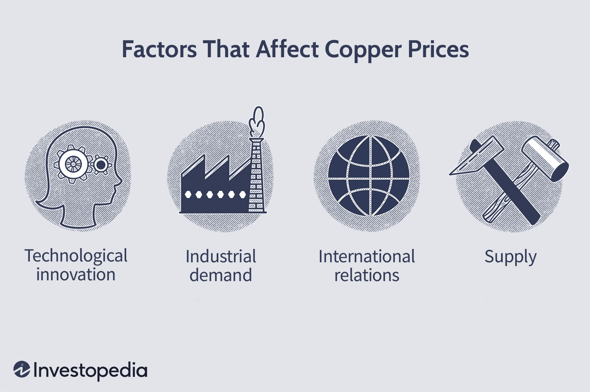

The copper market is pivotal to understanding global economic dynamics due to copper's fundamental role in numerous industries and its pervasive impact on economic activities. Known for its excellent thermal and electrical conductivity, as well as its pliability and corrosion resistance, copper is integral to the construction, automotive, electronics, and renewable energy sectors. These properties make copper indispensable in building infrastructure, manufacturing electric vehicles, and producing electronics, underpinning its vast applications and significant influence on global markets.

Economic health can often be gauged through copper prices, earning the metal the moniker "Doctor Copper" because its price trends are seen as an indicator of the global economy's overall condition. This is due to copper's widespread usage across rapidly growing economic sectors. As emerging markets continue to expand and investments in green energy intensify, copper's demand trajectory increasingly reflects broader economic trends. Consequently, understanding copper's market behavior provides valuable insights into economic growth patterns, inflation, and industrial activities.



This article will explore several critical aspects of the copper market, including future market trends, price forecasting, and the burgeoning role of algorithmic trading in copper investment. By analyzing these elements, one can better appreciate how copper's market underpins economic narratives and offers opportunities for strategic investments.

## Table of Contents

## Understanding Copper and Its Market Dynamics

Copper is an essential metal known for its electrical conductivity, thermal conductivity, and malleability, making it a vital component in multiple industries. Its unique properties find applications in construction, electronics, transportation, and renewable energy sectors, among others. In construction, copper is used extensively in wiring, plumbing, and roofing due to its durability and resistance to corrosion. In electronics, copper’s outstanding conductivity is leveraged in circuit boards and wiring, making it an indispensable material in the manufacturing of electrical devices.

Emerging markets significantly drive copper demand. As these economies expand, the urbanization and infrastructure development that accompany such growth necessitate substantial copper utilization. Countries like China and India, with their large-scale infrastructure projects and increasing industrial activities, have been notable contributors to heightened copper demand. Furthermore, the global shift towards renewable energy sources, such as wind and solar power, amplifies the need for copper. Copper's role in renewable energy is pivotal, as it is used in wind turbines, solar panels, and electric vehicle components, aligning with the worldwide trend toward sustainable practices.

The dynamics of the copper market are intricately tied to global economic conditions. Economic growth or downturns influence industry output and, consequently, copper demand. For instance, during periods of economic expansion, construction and manufacturing activities typically surge, thereby bolstering copper consumption. Conversely, economic recessions can lead to a contraction in demand.

Technological advancements also play a critical role in shaping copper market dynamics. Innovations in electronics and energy storage often rely on copper, thus influencing demand patterns. Moreover, advancements in mining technologies impact copper supply, affecting pricing and market stability.

Geopolitical factors can considerably sway copper market dynamics. The concentration of copper production in specific regions, such as South America and Africa, makes the market susceptible to geopolitical instability, labor strikes, and regulatory changes, which can disrupt supply chains and lead to price [volatility](/wiki/volatility-trading-strategies). Additionally, international trade policies and tariffs influence copper import and export flows, affecting global market equilibrium.

In summary, understanding copper's market dynamics necessitates a holistic consideration of its widespread industrial applications, the impact of emerging markets and renewable energy investments on demand, and the interplay of economic, technological, and geopolitical factors. These elements collectively inform the copper market landscape, dictating supply, demand, and price trajectories.

## Factors Influencing Copper Prices

Copper prices are influenced by a myriad of factors, prominently including economic indicators and global events. One of the primary economic indicators is Gross Domestic Product (GDP) growth. A thriving economy often fuels construction and industrial activities, increasing demand for copper. For example, a rise in GDP generally correlates with increased infrastructure projects and manufacturing, which require substantial copper usage. Conversely, during economic downturns, reduced industrial activity can lead to a decline in copper demand and prices.

Housing market trends also play a significant role. The construction sector is a major consumer of copper, particularly in residential building for electrical wires and plumbing systems. A robust housing market, characterized by high rates of construction and sales, can stimulate copper demand, thereby elevating prices. Conversely, a sluggish housing market can reduce demand and exert downward pressure on prices.

Supply chain disruptions can lead to significant price volatility. Geopolitical tensions, such as trade disputes or conflicts in copper-producing regions, can hinder the extraction and transportation of copper, causing supply shortages. Natural disasters, like earthquakes or floods, can disrupt mining operations and supply chains. When supply is constrained and demand remains constant or increases, copper prices tend to rise sharply.

The availability and price of substitute materials also affect copper demand. Aluminum, for instance, is often considered a substitute due to its similar properties but lighter weight and lower cost. If copper prices rise significantly, industries may opt to substitute aluminum in their products to save costs. This shift can reduce copper demand and potentially decrease its price. However, the feasibility of substitution depends on the application and the comparative advantages of the materials involved.

In summary, copper prices are closely tied to various economic indicators and external factors, including GDP growth, housing market trends, supply chain disruptions, and the availability of substitute materials. Understanding these dynamics is crucial for forecasting and navigating the copper market effectively.

## Forecasting Copper Prices

Recent forecasts indicate a gradual increase in copper prices over the coming years, largely driven by accelerating demand from powerhouse economies like China and India. As these countries continue their industrialization and urbanization processes, the demand for copper is expected to increase significantly. This metal is crucial for infrastructure development, electronics, and renewable energy technologies, which are expanding rapidly in these regions. Notably, China's commitment to renewable energy and electric vehicle production adds a substantial boost to copper demand, given its essential role in wiring and electronics.

The growth of the renewable energy sector is yet another [factor](/wiki/factor-investing) fuelling predictions of rising copper prices. Renewable energy technologies, such as wind turbines and solar panels, require significant amounts of copper. As countries aim to meet climate targets and reduce reliance on fossil fuels, investments in renewable energy are expected to escalate, driving copper demand further. According to the International Energy Agency (IEA), global energy-related investments in renewables are expected to increase, contributing to sustained copper demand.

Analysts employ a combination of historical data analysis and current economic indicators to project copper price trends. Historical data provides insights into long-term price movements and cyclical patterns in the copper market. Economic indicators, such as GDP growth rates, industrial production levels, and infrastructure spending, are used to gauge future demand. For instance, a rise in housing construction or manufacturing output typically correlates with increased copper consumption, thereby influencing price forecasts.

Advanced forecasting models may incorporate [machine learning](/wiki/machine-learning) techniques to process large datasets and identify complex patterns that traditional models might overlook. These models can assess a range of variables, including geopolitical factors, technological advancements, and policy changes that could impact supply and demand dynamics. 

In conclusion, while forecasts suggest a positive trend in copper prices, these projections are contingent on various factors, including sustained economic growth in emerging markets and continued investment in renewable energy technologies. By closely monitoring these elements, analysts aim to provide accurate and actionable insights into future copper price trajectories.

## Algorithmic Trading in the Copper Market

Algorithmic trading is fundamentally altering the landscape of investment strategies in the copper market. This technology-driven trading approach uses complex algorithms to automate trading processes, which significantly enhances efficiency in both price discovery and risk management. 

The use of algorithms in trading involves executing pre-programmed trading instructions accounting for variables such as time, price, and [volume](/wiki/volume-trading-strategy). This method provides several advantages over traditional trading, primarily through the reduction of transaction costs. Algorithmic trading systems are designed to execute orders rapidly, minimizing the bid-ask spreads and thereby reducing the market impact usually encountered in manual trading.

Another major benefit of [algorithmic trading](/wiki/algorithmic-trading) in the copper market is the improvement in [liquidity](/wiki/liquidity-risk-premium). Algorithms can analyze vast datasets at high speeds, facilitating quicker decision-making and enabling traders to respond to market conditions more effectively than manual methods. Improved liquidity results in more efficient markets, as it allows assets to be bought and sold with minimal price fluctuations.

Algorithmic trading strategies in the copper market typically include market-making, [arbitrage](/wiki/arbitrage), and trend-following strategies. For example, a market-making algorithm might provide liquidity by simultaneously placing buy and sell orders for copper futures, profiting from the spread between the bid and ask prices. Arbitrage algorithms could exploit price differences between copper in different markets or derivative instruments. Meanwhile, trend-following algorithms can identify and capitalize on emerging price patterns, adjusting trading strategies based on historical price data and observed trends.

The code snippet below illustrates a simple example of a trend-following algorithm for copper prices using the Python programming language:

```python
import pandas as pd
import numpy as np
import matplotlib.pyplot as plt

# Load historical copper price data
data = pd.read_csv('copper_prices.csv')

# Calculate moving averages
data['Short_MA'] = data['Close'].rolling(window=20).mean()
data['Long_MA'] = data['Close'].rolling(window=100).mean()

# Define a simple buy/sell strategy
data['Signal'] = 0
data.loc[data['Short_MA'] > data['Long_MA'], 'Signal'] = 1
data.loc[data['Short_MA'] < data['Long_MA'], 'Signal'] = -1

# Plot the results
plt.figure(figsize=(14,7))
plt.plot(data['Close'], label='Copper Prices')
plt.plot(data['Short_MA'], label='20-day MA', alpha=0.7)
plt.plot(data['Long_MA'], label='100-day MA', alpha=0.7)
plt.plot(data[data['Signal'] == 1].index, 
         data['Short_MA'][data['Signal'] == 1], 
         '^', markersize=10, color='g', label='Buy Signal')
plt.plot(data[data['Signal'] == -1].index, 
         data['Short_MA'][data['Signal'] == -1], 
         'v', markersize=10, color='r', label='Sell Signal')
plt.title('Copper Prices and Moving Averages')
plt.legend(loc='best')
plt.show()
```

In this script, we compute short-term and long-term moving averages of copper prices to generate buy and sell signals. When the short-term moving average crosses above the long-term moving average, a buy signal is generated. Conversely, a sell signal is triggered when the short-term moving average crosses below the long-term moving average.

The increasing reliance on algorithmic trading in the copper market reflects a broader trend in financial markets. Algorithms continue to enhance investment strategies by enabling faster, more informed decision-making and more efficient execution of trades. As the copper market evolves, the role of automation and technological innovation will likely grow, presenting opportunities for enhancing returns and managing risks effectively.

## Challenges and Opportunities

Political instability in key copper-producing regions often poses significant challenges to market stability. Many of the world's largest copper reserves are located in areas that experience frequent political and social unrest. For instance, countries such as Chile, Peru, and the Democratic Republic of the Congo are major producers of copper, and any disruption in these regions can lead to substantial fluctuations in the global supply chain, influencing prices and market reliability. Political instability can manifest in various forms, including strikes, changes in government policies, regulatory changes, or even nationalization of resources, all of which can have immediate and far-reaching effects on copper production and distribution.

On the flip side, opportunities within the copper market are expanding due to rapid technological advancements and the global shift toward more sustainable practices. The growing demand for renewable energy technologies and electric vehicles is driving a surge in copper consumption. As the world economy shifts to greener technologies, the need for copper, integral to building renewable energy infrastructures and electric motors, is set to increase. This creates opportunities for countries and companies that invest in sustainable mining practices and technology-enhanced extraction methods, enabling them to capitalize on the growing demand while minimizing environmental impacts.

Additionally, the use of advanced technologies such as blockchain for improving supply chain transparency, and AI for optimizing mining operations, stands to revolutionize the copper industry. For instance, machine learning algorithms can predict mine productivity and optimize operation schedules, potentially reducing costs and increasing yield.

Investors in the copper market must stay informed and adaptive to capitalize on these emerging trends. Staying abreast of global political climates, advancements in mining technologies, and shifts toward sustainable development is crucial. By leveraging data analytics and market research, investors can make informed decisions that enhance their portfolio strategies in this dynamic environment. As these trends continue to evolve, those who remain agile and well-informed will likely find the most success in navigating the challenges and seizing the opportunities within the copper market.

## Conclusion

The copper market's future presents a landscape fraught with both challenges and opportunities. Understanding its intricate market dynamics is vital for investors aiming to develop robust strategies. Leveraging advanced technologies like algorithmic trading can significantly enhance investment approaches by optimizing price discovery and risk management. Algorithmic trading utilizes complex algorithms that allow for faster and more efficient market analysis, resulting in reduced transaction costs and improved liquidity.

Investors must stay informed of global trends, as these can significantly impact the copper market. Economic developments in major consumption markets, for instance, can lead to considerable shifts in demand. The ongoing transition towards renewable energy sources, such as wind and solar power, is expected to spur copper demand, given that these technologies require substantial amounts of copper. Furthermore, geopolitical factors and policy changes in copper-producing regions can influence supply dynamics, potentially leading to volatility in prices.

Navigating these complexities requires investors to maintain a keen awareness of macroeconomic indicators, supply chain developments, and technological advancements. By doing so, they can better position themselves to capitalize on emerging trends and mitigate risks associated with potential market disruptions. Adapting to these evolving dynamics will be crucial for investors seeking success in this dynamic and vital market.

## References & Further Reading

[1]: [International Copper Study Group (ICSG)](https://icsg.org/) - Provides insights and data on copper production, consumption, and trade globally.

[2]: Baffes, J. (2007). ["Oil Spills on Other Commodities"](https://www.sciencedirect.com/science/article/pii/S0301420707000542). American Journal of Agricultural Economics, 89(3), 761–774.

[3]: Tilton, J. E., & Guzmán, J. I. (2016). ["Mineral Economics and Policy"](https://www.taylorfrancis.com/books/mono/10.4324/9781315733708/mineral-economics-policy-john-tilton-juan-ignacio-guzm%C3%A1n). Routledge.

[4]: [International Energy Agency (IEA) Reports](https://www.iea.org/reports/world-energy-outlook-2024) - Offers information on global energy investment trends, including those related to renewables and copper.

[5]: Fama, E. F., & French, K. R. (1989). ["Business Conditions and Expected Returns on Stocks and Bonds"](https://www.sciencedirect.com/science/article/pii/0304405X89900950). The Journal of Financial Economics.

[6]: ["Copper: A Material for Amplifiers"](https://orronoco.blogspot.com/2021/05/copper-vs-aluminum-chassis-case-real.html) - Engineering and technical information on copper applications in various industries.