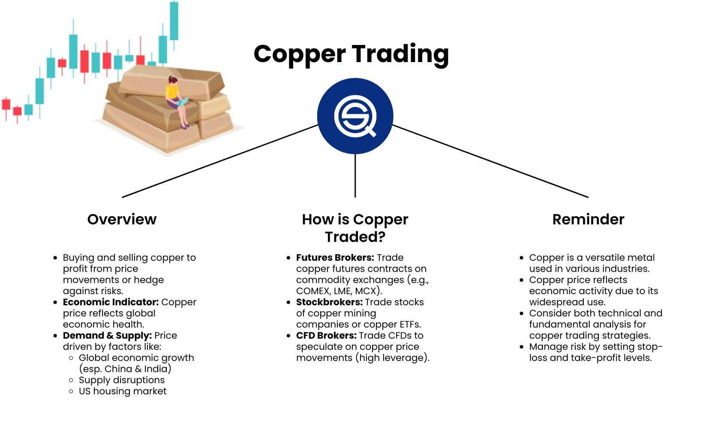

## Table of Contents

## What is copper and why is it important in trading?

Copper is a reddish metal that is found in the Earth. It is used in many things like wires, pipes, and electronics because it is a good conductor of electricity and heat. Copper is also strong and lasts a long time, which makes it useful in building and construction.

Copper is important in trading because it is used all over the world. When people trade copper, they can learn about how strong the global economy is. If more copper is being bought and sold, it often means that countries are building more things and their economies are doing well. Traders watch copper prices to help them decide when to buy or sell other things, like stocks or other metals.

## How does the global supply and demand for copper affect its price?

The price of copper goes up and down because of how much people want it and how much is available. When a lot of people want copper and there isn't enough to go around, the price goes up. This can happen if countries are building a lot of new things, like houses or factories, because they need more copper for wires and pipes. On the other hand, if there is a lot of copper but not many people want it, the price goes down. This might happen if the economy is not doing well and people are not building as much.

Sometimes, things like strikes at copper mines or new copper mines opening can change how much copper is available. If a big mine stops working because of a strike, less copper gets to the market and the price can go up. If a new mine starts working, more copper comes to the market and the price might go down. Also, if a country that uses a lot of copper, like China, changes how much it is building, this can affect the global demand for copper and change its price.

## What are the basic steps to start trading copper?

To start trading copper, you first need to learn about how the copper market works. This means understanding what affects the price of copper, like supply and demand, global economic conditions, and news about copper mines. You can learn this by reading articles, watching videos, or taking online courses about commodity trading. Once you feel you know enough, you can move on to choosing a trading platform. There are many online platforms where you can trade copper, like futures exchanges or commodity brokers. Make sure to pick one that is trusted and fits your needs.

After choosing a platform, you'll need to open an account. This usually involves filling out some forms with your personal information and maybe talking to someone from the platform to make sure you understand the risks of trading. Once your account is set up, you'll need to put some money into it. This money will be used to buy and sell copper. When you're ready, you can start placing trades. You can buy copper if you think the price will go up, or sell it if you think the price will go down. Remember to keep learning and watching the market closely, as things can change quickly.

## What are the different ways to trade copper (futures, ETFs, stocks)?

There are different ways to trade copper, and each way has its own benefits and risks. One way is to trade copper futures. Futures are contracts where you agree to buy or sell copper at a certain price on a future date. You can trade these on special markets called futures exchanges. Trading futures can be risky because prices can change a lot, but it also gives you a chance to make a lot of money if you guess the price right.

Another way to trade copper is through ETFs, which stands for Exchange Traded Funds. ETFs are like baskets of investments that you can buy and sell like stocks. Some ETFs focus on copper or companies that mine copper. They are easier to trade than futures and can be a good way to invest in copper without dealing with the complexities of futures contracts. However, the price of an ETF might not move exactly the same way as the price of copper.

You can also trade copper by buying stocks in companies that mine or use copper. If you think the price of copper will go up, you might want to buy stocks in a copper mining company. The stock price of these companies can go up when copper prices go up, but it also depends on other things like how well the company is run. Trading stocks can be less risky than futures but more risky than ETFs, and it gives you a way to invest in the copper industry without directly trading the metal itself.

## How can economic indicators influence copper prices?

Economic indicators can tell us a lot about how strong or weak an economy is, and this can affect the price of copper. When economic indicators show that an economy is doing well, like when more jobs are being created or when people are spending more money, it usually means that there will be more building and construction. This increases the demand for copper because it's used in things like wires and pipes. So, if economic indicators are positive, the price of copper might go up because more people want it.

On the other hand, if economic indicators show that an economy is not doing well, like when there are fewer jobs or people are spending less money, it can lead to less building and construction. This means less demand for copper, which can make its price go down. Also, economic indicators from big countries that use a lot of copper, like China, can have a big effect on the global demand for copper and change its price a lot. So, traders and investors watch these indicators closely to guess where copper prices might be heading.

## What are the key technical analysis tools used in copper trading?

Technical analysis tools help traders predict where the price of copper might go next by looking at past price data. One common tool is the moving average, which is a line on a chart that shows the average price of copper over a certain period, like 50 days or 200 days. Traders use moving averages to see if the price is going up or down over time. If the price is above the moving average, it might mean the price will keep going up. If it's below, it might mean the price will keep going down. Another tool is the Relative Strength Index (RSI), which measures how fast the price is going up or down. If the RSI is over 70, it might mean the price is too high and could go down soon. If it's under 30, it might mean the price is too low and could go up soon.

Another important tool is the support and resistance levels. These are price levels where the price of copper often stops going down (support) or stops going up (resistance). Traders watch these levels closely because they can help predict when the price might change direction. For example, if the price of copper hits a support level and starts going up, traders might buy copper because they think the price will keep going up. Chart patterns like head and shoulders or triangles also help traders. These patterns can show when the price might break out of a range and start moving in a new direction. By using these tools together, traders can make better guesses about where the price of copper might go next.

## How do geopolitical events impact copper trading strategies?

Geopolitical events can have a big impact on copper trading strategies because they can change how much copper is available and how much people want it. For example, if there is a war or a big political problem in a country that produces a lot of copper, like Chile or Peru, it might make it harder to get copper out of those places. This can mean less copper on the market, which can make the price go up. Traders need to watch the news and understand what's happening in these countries so they can decide when to buy or sell copper based on these events.

Also, geopolitical events can change how much copper people want. If a big country like China, which uses a lot of copper, has a political problem that slows down its economy, it might not need as much copper for building and construction. This can make the demand for copper go down and the price might go down too. Traders need to pay attention to these events and think about how they might affect the global demand for copper. By understanding these things, traders can make better plans for when to buy or sell copper.

## What are the common risk management techniques for copper trading?

Risk management is important when trading copper because the price can go up and down a lot. One common way to manage risk is to use stop-loss orders. This means setting a price at which you will automatically sell your copper if the price starts to go down too much. This can help you lose less money if the price goes against what you thought it would do. Another way is to not put all your money into copper. Instead, you can spread your money out by trading other things too, like stocks or other metals. This is called diversification and it can help you not lose everything if the price of copper goes down a lot.

Another technique is to use hedging. Hedging means doing something to protect yourself from losing money if the price of copper goes down. For example, you can buy a futures contract that lets you sell copper at a certain price in the future. If the price of copper goes down, you can still sell it at the higher price you agreed on in the futures contract. This can help you lose less money. Also, it's a good idea to always keep learning about the copper market and the economy. The more you know, the better you can guess what might happen next and make smart choices about when to buy or sell copper.

## How can a trader use fundamental analysis to predict copper price movements?

Fundamental analysis helps traders predict copper price movements by looking at things that affect the supply and demand for copper. Traders look at how much copper is being produced around the world. If new mines open or if there are strikes at big mines, this can change how much copper is available. They also watch the economies of big countries like China, which uses a lot of copper. If China's economy is growing fast, it might need more copper for building and construction, which can make the price go up. By understanding these things, traders can guess if the price of copper might go up or down.

Traders also pay attention to economic indicators like GDP growth, employment rates, and manufacturing data. These indicators can show how strong or weak an economy is, which can affect how much copper people want. For example, if a country's GDP is growing, it might mean more building and construction, so more copper will be needed. On the other hand, if an economy is slowing down, people might not need as much copper, and the price could go down. By keeping an eye on these indicators, traders can make better decisions about when to buy or sell copper.

## What are the advanced strategies for trading copper options?

Trading copper options can be a bit tricky, but advanced strategies can help traders make money even when the market is moving in different ways. One strategy is called a straddle. With a straddle, you buy both a call option and a put option at the same time, with the same price and expiration date. This means you can make money if the price of copper moves a lot in either direction. If the price goes up a lot, you can use the call option to buy copper at a lower price and then sell it at the higher price. If the price goes down a lot, you can use the put option to sell copper at a higher price and then buy it back at the lower price. This strategy can be good when you think the price will move a lot but you're not sure which way.

Another advanced strategy is called a spread. There are different kinds of spreads, but one common one is the vertical spread. With a vertical spread, you buy and sell options at different prices but with the same expiration date. For example, you might buy a call option at a lower price and sell a call option at a higher price. This can help you make money if the price of copper goes up, but it also limits how much you can lose if the price goes down. Spreads can be a good way to trade copper options because they can help you manage risk better than just buying or selling one option by itself.

## How do algorithmic trading systems apply to copper markets?

Algorithmic trading systems use computers to buy and sell copper automatically. These systems can look at a lot of information very quickly, like the price of copper, how much people want it, and what's happening in the economy. They use special math formulas to decide when to buy or sell copper. This can help traders make money faster and without making mistakes that people might make. For example, if the price of copper starts to go up, an algorithm can buy copper right away, even if it's the middle of the night when no one is watching the market.

These systems can also help traders follow their trading plans better. Sometimes, people can get scared or excited and make bad choices, but a computer will do what it's told to do. Algorithms can be set up to use different trading strategies, like buying when the price hits a certain level or selling when it goes down too much. This can make trading copper easier and more successful for people who use these systems. But, it's important to remember that these systems need to be watched and changed sometimes to make sure they keep working well.

## What are the long-term trends and forecasts for copper trading?

The long-term trends for copper trading show that the demand for copper is likely to keep growing. This is because more and more people around the world are using things that need copper, like electric cars, solar panels, and smartphones. Countries like China and India are building a lot of new things, which also means they need more copper. At the same time, it can be hard to find new places to mine copper, so the supply might not grow as fast as the demand. This could make the price of copper go up over time.

Forecasts for copper trading say that the price might keep going up in the next few years because of these trends. Experts think that as more people use green energy and electric vehicles, the need for copper will get even bigger. But, things like new technology for mining or recycling copper could change how much copper is available. Traders need to keep watching these trends and forecasts to make good choices about when to buy or sell copper in the long run.

## References & Further Reading

[1]: ["Algorithmic Trading: Winning Strategies and Their Rationale"](https://www.wiley.com/en-us/Algorithmic+Trading%3A+Winning+Strategies+and+Their+Rationale-p-9781118460146) by Ernest P. Chan

[2]: ["High-Frequency Trading: A Practical Guide to Algorithmic Strategies and Trading Systems"](https://www.wiley.com/en-us/High+Frequency+Trading%3A+A+Practical+Guide+to+Algorithmic+Strategies+and+Trading+Systems%2C+2nd+Edition-p-9781118343500) by Irene Aldridge

[3]: ["Evidence-Based Technical Analysis: Applying the Scientific Method and Statistical Inference to Trading Signals"](https://www.amazon.com/Evidence-Based-Technical-Analysis-Scientific-Statistical/dp/0470008741) by David Aronson

[4]: ["Advances in Financial Machine Learning"](https://www.wiley.com/en-us/Advances+in+Financial+Machine+Learning-p-9781119482086) by Marcos Lopez de Prado

[5]: ["Machine Learning for Algorithmic Trading"](https://github.com/PacktPublishing/Machine-Learning-for-Algorithmic-Trading-Second-Edition) by Stefan Jansen

[6]: Gordon, R. B., Bertram, M., & Graedel, T. E. (2006). ["Metal Stocks and Sustainability."](https://pubmed.ncbi.nlm.nih.gov/16432205/) Science, 314(5803), 1800-1801.

[7]: ["Quantitative Trading: How to Build Your Own Algorithmic Trading Business"](https://books.google.com/books/about/Quantitative_Trading.html?id=j70yEAAAQBAJ) by Ernest P. Chan