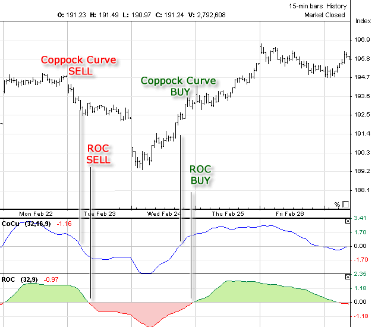

## Table of Contents

## What is the Coppock Curve?

The Coppock Curve is a technical analysis tool used by investors to identify long-term buying opportunities in the stock market. It was developed by Edwin Sedgwick Coppock in the late 1960s and is designed to signal when the market is shifting from a bearish to a bullish trend. The curve is calculated using a weighted moving average of the sum of the 14-month and 11-month rates of change in a market index, such as the S&P 500. When the curve crosses above zero, it is considered a buy signal, indicating that the market may be entering a bullish phase.

The Coppock Curve is particularly useful for long-term investors because it helps them avoid false signals that can occur with shorter-term indicators. By focusing on longer time frames, the curve smooths out short-term market fluctuations and provides a clearer picture of the overall market trend. This makes it a valuable tool for investors looking to make strategic, long-term investment decisions rather than reacting to daily market movements. However, like any indicator, it is not foolproof and should be used in conjunction with other analysis tools to make the most informed investment decisions.

## Who developed the Coppock Curve and when?

The Coppock Curve was developed by a man named Edwin Sedgwick Coppock. He created it in the late 1960s. Edwin wanted to help investors find good times to buy stocks over the long term.

The Coppock Curve is a tool that helps people see when the stock market might start going up after being down for a while. It uses a special math formula to look at the market over many months. This way, it can give a signal when it might be a good time to invest.

## What is the purpose of the Coppock Curve in financial analysis?

The Coppock Curve is a tool that helps people who invest in the stock market. Its main purpose is to tell investors when it might be a good time to buy stocks. It does this by looking at how the market has been doing over a long time, usually many months. When the Coppock Curve goes above zero, it gives a signal that the market might start going up soon. This helps investors know when to buy stocks to possibly make more money in the future.

The curve is really helpful for people who want to invest for a long time, not just a few days or weeks. It smooths out the ups and downs that happen in the market every day and focuses on bigger trends. This way, it avoids giving false signals that might trick someone into buying at the wrong time. But, even though the Coppock Curve is useful, it's not perfect. Smart investors use it along with other tools to make the best choices about when to buy and sell stocks.

## How is the Coppock Curve calculated?

The Coppock Curve is calculated using a special formula that looks at how the stock market has changed over time. First, you find the rate of change for the market over 14 months and 11 months. The rate of change is just how much the market has gone up or down compared to where it was before. You add these two rates of change together. Then, you use a weighted moving average to smooth out this sum over the last 10 months. This helps to make the numbers less jumpy and easier to understand.

When you finish these steps, you get a number that is the Coppock Curve. If this number goes above zero, it's a signal that the market might start going up soon. This is a good time for investors to think about buying stocks. The Coppock Curve helps people see the big picture of the market over a long time, not just what's happening day to day.

## What data is required to compute the Coppock Curve?

To compute the Coppock Curve, you need data on the stock market's performance over time. Specifically, you need the closing prices of a market index, like the S&P 500, for at least the past 14 months. This is because you need to calculate the rate of change for both 14 months and 11 months. The rate of change shows how much the market has gone up or down compared to where it was before.

Once you have this data, you can find the rate of change for 14 months and 11 months, add these two rates together, and then use a 10-month weighted moving average to smooth out the result. This process gives you the Coppock Curve value. If this value goes above zero, it's a signal that the market might be starting to go up, which can be a good time for investors to buy stocks.

## Can you explain the role of the Rate of Change (ROC) in the Coppock Curve calculation?

The Rate of Change (ROC) is a key part of figuring out the Coppock Curve. It helps us see how much the stock market has changed over time. To calculate the Coppock Curve, we need to find the ROC for two different time periods: 14 months and 11 months. The ROC for 14 months tells us how much the market has gone up or down compared to where it was 14 months ago. The same goes for the 11-month ROC, but it looks back 11 months instead. We add these two ROCs together to get a better picture of the market's movement.

Once we have the sum of the 14-month and 11-month ROCs, we use a 10-month weighted moving average to smooth out this number. This helps to make the Coppock Curve less jumpy and more reliable. The final value of the Coppock Curve is important because when it goes above zero, it's a signal that the market might start going up soon. This helps investors know when it could be a good time to buy stocks. So, the ROC is really important because it's the starting point for figuring out the whole Coppock Curve.

## What is the significance of the 11-month and 14-month periods in the Coppock Curve formula?

The 11-month and 14-month periods in the Coppock Curve formula are important because they help us see how the stock market has changed over time. These specific periods were chosen by Edwin Sedgwick Coppock because he believed they gave a good picture of the market's long-term trends. The 14-month period looks at changes over a slightly longer time than the 11-month period, which helps to capture different aspects of the market's movement. By adding the Rate of Change (ROC) for both these periods together, the Coppock Curve can give a more complete view of whether the market is starting to go up or down.

When you use both the 11-month and 14-month ROCs, you get a better idea of the market's overall direction. The 11-month ROC might pick up on shorter-term trends, while the 14-month ROC focuses on longer-term changes. Together, they help smooth out the ups and downs that can happen in the market over shorter periods. This makes the Coppock Curve a useful tool for investors who want to make decisions based on long-term trends rather than reacting to daily or weekly market movements.

## How do you interpret the signals generated by the Coppock Curve?

The Coppock Curve helps investors know when it might be a good time to buy stocks. The main thing to look for is when the curve goes above zero. When this happens, it's a signal that the market might start going up soon. This is called a buy signal. Investors use this signal to decide when to buy stocks, hoping to make money as the market goes up.

The curve is designed to look at long-term trends, so it's not about making quick decisions based on what the market does every day. Instead, it helps you see the bigger picture over many months. But remember, the Coppock Curve isn't perfect. It's just one tool among many that investors use. They often look at other things too, to make sure they're making the best choices about when to buy and sell stocks.

## What are the limitations of using the Coppock Curve in market analysis?

The Coppock Curve is a helpful tool for investors, but it has some limitations. One big limitation is that it's meant for long-term trends, so it might not be the best choice if you want to make quick decisions based on what the market does every day or week. The curve can take a while to signal a change, so you might miss out on short-term opportunities. Also, the Coppock Curve uses specific time periods, like 11 and 14 months, which might not always be the best fit for every market situation. This means it might not catch all the important changes in the market.

Another limitation is that the Coppock Curve can give false signals sometimes. Even though it's designed to smooth out the ups and downs of the market, there can still be times when it suggests buying stocks when it might not be the best time. This can lead to losses if the market doesn't go up as expected. Because of this, it's important not to rely only on the Coppock Curve. Smart investors use it along with other tools and indicators to make sure they're making the best choices about when to buy and sell stocks.

## Can the Coppock Curve be used effectively in different market conditions?

The Coppock Curve can work well in different market conditions, but it's not perfect for every situation. It's really good at spotting long-term trends, so it's helpful when the market is going through big changes over many months. For example, if the market has been going down for a while and starts to turn around, the Coppock Curve can signal that it might be a good time to buy stocks. But, it might not be as useful when the market is moving a lot in a short time because it's designed to look at longer periods.

Even though the Coppock Curve can be used in different market conditions, it has some limits. It might not catch all the important changes in the market because it uses specific time periods, like 11 and 14 months. Also, it can sometimes give false signals, telling you to buy stocks when it might not be the best time. That's why it's important to use the Coppock Curve along with other tools and indicators to make the best choices about when to buy and sell stocks.

## How does the Coppock Curve compare to other momentum indicators?

The Coppock Curve is a momentum indicator that looks at long-term trends in the stock market. It's different from other momentum indicators like the Relative Strength Index (RSI) or the Moving Average Convergence Divergence (MACD) because it focuses on longer periods, like 11 and 14 months. The RSI and MACD, on the other hand, often look at shorter time frames, like 14 days or 26 days. This means the Coppock Curve might be better for investors who want to make decisions based on what's happening over many months, not just a few weeks or days.

Other momentum indicators can be more sensitive to short-term changes in the market, which can be good for traders who want to make quick decisions. For example, the RSI can show if a stock is overbought or oversold in a short time, which can help traders know when to buy or sell. The MACD can also give signals about short-term trends and changes in momentum. But, because the Coppock Curve looks at longer periods, it might miss some of these short-term opportunities. Still, it's a good tool for long-term investors because it helps them avoid false signals and focus on bigger trends in the market.

## Are there any real-world examples where the Coppock Curve successfully predicted market trends?

One real-world example where the Coppock Curve successfully predicted a market trend was during the early 1980s. After a long period of decline, the stock market started to recover. In late 1982, the Coppock Curve for the S&P 500 went above zero, signaling that it might be a good time to buy stocks. Investors who followed this signal saw the market go up a lot in the next few years. This shows how the Coppock Curve can help spot when the market is starting to turn around after being down for a while.

Another example happened in the early 2000s. After the dot-com bubble burst, the market went through a tough time. But in early 2003, the Coppock Curve for the S&P 500 crossed above zero again. This was a signal that the market might start going up soon. People who bought stocks around this time saw the market recover and grow over the next few years. These examples show that the Coppock Curve can be a useful tool for long-term investors, helping them find good times to buy stocks after the market has been down.

## What is the Coppock Curve?

Developed by economist Edwin Coppock in 1962, the Coppock Curve is a long-term momentum indicator used to recognize substantial shifts in stock market indices. The motivation behind the creation of the Coppock Curve was to identify buying opportunities following bear markets. It is particularly useful in pinpointing major market upturns and downturns.

The calculation of the Coppock Curve involves a few essential steps. It is derived from the weighted moving average of the sum of two different rate of change (ROC) calculations: one for 14 months and another for 11 months. The basic formula is as follows:

1. Calculate the 14-month ROC and 11-month ROC for a stock index or market.
2. Sum these two ROCs.
3. Apply a 10-period weighted moving average (WMA) to the resulting sum. 

The formula can be represented mathematically as:

$$
\text{Coppock Curve}_t = \text{WMA}_{10} (\text{ROC}_{14} + \text{ROC}_{11})
$$

Where $\text{ROC}_n$ is the rate of change over $n$ months and $\text{WMA}_{10}$ is the 10-period weighted moving average.

The primary usage of the Coppock Curve is to generate buy signals. Traders typically interpret the indicator as suggesting a buying opportunity when the Coppock Curve crosses above zero. This crossover point is considered a signal that the market or stock index is poised for an upward trend, making it a valuable tool for traders focusing on long-term investment strategies.

## How do you calculate the Coppock Curve?

The calculation of the Coppock Curve involves several key steps, focusing on the rate of change (ROC) and weighted moving average (WMA). Below is a breakdown of the involved process, using methods that can also be programmed for [algorithmic trading](/wiki/algorithmic-trading) systems.

### Step-by-Step Calculation:

1. **Calculate the Rate of Change (ROC):**
   To begin, calculate the 14-month and 11-month ROC of a stock index. The ROC is determined using the following formula:
$$
   \text{ROC} = \left( \frac{\text{Current Price} - \text{Price N Months Ago}}{\text{Price N Months Ago}} \right) \times 100

$$

   For the Coppock Curve, calculate both the 14-month and 11-month ROCs.

2. **Sum the ROCs:**
   Add the 14-month and 11-month ROCs to obtain a single cumulative rate of change value.

3. **Apply a 10-Period Weighted Moving Average (WMA):**
   The summed ROC values are then smoothed by applying a 10-period WMA. The WMA gives more significance to recent data points, calculated as follows:
$$
   \text{WMA} = \frac{\sum ( \text{Weight} \times \text{ROC})}{\sum \text{Weights}}

$$

   In practical terms, assign the most recent month a weight of 10, the second most recent a weight of 9, down to a weight of 1 for the tenth month.

4. **Interpret the Coppock Curve:**
   The WMA-derived curve oscillates around a zero line. When the Coppock Curve crosses above this zero threshold, it generates a buy signal, indicating potential long-term bullish market conditions. Conversely, while a cross below zero might not explicitly signal selling, it could suggest maintaining current positions or heightened caution.

### Python Example Code
The computation of the Coppock Curve can be implemented in Python, facilitating integration into automated trading systems:

```python
import pandas as pd

def calculate_coppock_curve(prices):
    # Calculate 14-month ROC
    roc_14 = (prices / prices.shift(14) - 1) * 100
    # Calculate 11-month ROC
    roc_11 = (prices / prices.shift(11) - 1) * 100

    # Sum the ROCs
    roc_sum = roc_14 + roc_11

    # Calculate 10-period WMA
    weights = list(range(1, 11))
    coppock_curve = roc_sum.rolling(window=10).apply(lambda x: sum(weights[i] * x[i] for i in range(len(weights))) / sum(weights), raw=False)

    return coppock_curve

# Example Usage - Assuming 'price_data' is a pandas Series of historical prices
# coppock_values = calculate_coppock_curve(price_data)
```

This step-by-step approach ensures accurate calculation of the Coppock Curve, allowing traders to effectively utilize it for identifying potential market entry points based on long-term [momentum](/wiki/momentum) indicators.

## What is the interpretation of the Coppock Curve?

When the Coppock Curve crosses above the zero line, it suggests a buying opportunity. This zero crossover points to the possibility of an emerging bullish trend in the market. The interpretation is based on the premise that the weighted moving average (WMA) of the rate of change (ROC) from the preceding months has turned positive, indicating that the price momentum is growing stronger.

The calculation of the Coppock Curve inherently factors in the sum of the ROC over 14 and 11 months, smoothing this data using a 10-period WMA:

$$
\text{Coppock Curve} = \text{WMA}_{10} (\text{ROC}_{14} + \text{ROC}_{11})
$$

While the primary focus of the Coppock Curve is to identify buying opportunities, it is important to understand the nuances when the curve drops below zero. Such a decline might be interpreted as a signal to sell or hold, yet this is not the principal design of the indicator. Instead, a drop below zero should be viewed as a warning of weakening bullish momentum rather than a direct sell signal. The curve lacks the sensitivity to clearly capture short-term market retracements or corrections, which means additional indicators could provide a more comprehensive perspective during decision-making.

The Coppock Curve's main strength is its capacity to identify extended bullish periods, setting it apart as an indicator chiefly of growing market optimism. By analyzing market history, traders can observe that movements above zero frequently precede significant bullish phases. However, it remains crucial to incorporate other technical analysis tools for a holistic approach, particularly for devising [exit](/wiki/exit-strategy) strategies.

## References & Further Reading

[1]: Coppock, E. S. C. (1962). "A Guide to the Calculation and Use of the Coppock Indicator." Barron's Magazine.

[2]: Pring, M. J. (2002). ["Technical Analysis Explained: The Successful Investor's Guide to Spotting Investment Trends and Turning Points."](https://www.amazon.com/Technical-Analysis-Explained-Fifth-Successful/dp/0071825177) McGraw-Hill Education.

[3]: Murphy, J. J. (1999). ["Technical Analysis of the Financial Markets: A Comprehensive Guide to Trading Methods and Applications."](https://archive.org/details/technicalanalysi0000murp) New York Institute of Finance.

[4]: Aronson, D. R. (2007). ["Evidence-Based Technical Analysis: Applying the Scientific Method and Statistical Inference to Trading Signals."](https://onlinelibrary.wiley.com/doi/book/10.1002/9781118268315) Wiley.

[5]: Schwager, J. D. (1996). ["Technical Analysis"](https://archive.org/details/technicalanalysi00schw) by Jack D. Schwager.