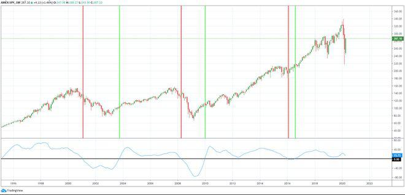

In the ever-evolving world of stock trading, technical analysis plays a crucial role in helping traders make informed decisions. By analyzing historical price data, along with volumes and patterns, traders strive to predict future market movements. Among the numerous technical indicators developed over the years, the Coppock Curve has gained notable attention for its ability to identify long-term market trends.

The Coppock Curve was created by economist Edwin Coppock in 1962. It was designed primarily to signal buying opportunities rather than selling ones. It does this by identifying major upturns after significant downturns in stock market indices, making it particularly useful for long-term investors who focus on momentum trends instead of short-term fluctuations. It works by measuring a weighted moving average of the rate of changes over specific historical periods, thereby smoothing out the noise and providing a clearer picture of potential future trends.



With advancements in technology, the Coppock Curve can be effectively utilized in algorithmic trading. Automated trading systems can incorporate this indicator as part of a broader strategy to improve precision in trade execution. Such systems reduce emotional bias, an inherent drawback in manual trading, and can be programmed to initiate trades when predefined conditions, such as the Coppock Curve crossing certain thresholds, are met.

This article explores the intricacies of the Coppock Curve, detailing its calculation and practical application in algorithmic trading systems. By examining the integration of this indicator into automated systems, traders can enhance their strategies and better navigate the complexities of the financial markets.

## Table of Contents

## What is the Coppock Curve?

Developed by economist Edwin Coppock in 1962, the Coppock Curve is a long-term momentum indicator used to recognize substantial shifts in stock market indices. The motivation behind the creation of the Coppock Curve was to identify buying opportunities following bear markets. It is particularly useful in pinpointing major market upturns and downturns.

The calculation of the Coppock Curve involves a few essential steps. It is derived from the weighted moving average of the sum of two different rate of change (ROC) calculations: one for 14 months and another for 11 months. The basic formula is as follows:

1. Calculate the 14-month ROC and 11-month ROC for a stock index or market.
2. Sum these two ROCs.
3. Apply a 10-period weighted moving average (WMA) to the resulting sum. 

The formula can be represented mathematically as:

$$
\text{Coppock Curve}_t = \text{WMA}_{10} (\text{ROC}_{14} + \text{ROC}_{11})
$$

Where $\text{ROC}_n$ is the rate of change over $n$ months and $\text{WMA}_{10}$ is the 10-period weighted moving average.

The primary usage of the Coppock Curve is to generate buy signals. Traders typically interpret the indicator as suggesting a buying opportunity when the Coppock Curve crosses above zero. This crossover point is considered a signal that the market or stock index is poised for an upward trend, making it a valuable tool for traders focusing on long-term investment strategies.

## Calculating the Coppock Curve

The calculation of the Coppock Curve involves several key steps, focusing on the rate of change (ROC) and weighted moving average (WMA). Below is a breakdown of the involved process, using methods that can also be programmed for [algorithmic trading](/wiki/algorithmic-trading) systems.

### Step-by-Step Calculation:

1. **Calculate the Rate of Change (ROC):**
   To begin, calculate the 14-month and 11-month ROC of a stock index. The ROC is determined using the following formula:
$$
   \text{ROC} = \left( \frac{\text{Current Price} - \text{Price N Months Ago}}{\text{Price N Months Ago}} \right) \times 100

$$

   For the Coppock Curve, calculate both the 14-month and 11-month ROCs.

2. **Sum the ROCs:**
   Add the 14-month and 11-month ROCs to obtain a single cumulative rate of change value.

3. **Apply a 10-Period Weighted Moving Average (WMA):**
   The summed ROC values are then smoothed by applying a 10-period WMA. The WMA gives more significance to recent data points, calculated as follows:
$$
   \text{WMA} = \frac{\sum ( \text{Weight} \times \text{ROC})}{\sum \text{Weights}}

$$

   In practical terms, assign the most recent month a weight of 10, the second most recent a weight of 9, down to a weight of 1 for the tenth month.

4. **Interpret the Coppock Curve:**
   The WMA-derived curve oscillates around a zero line. When the Coppock Curve crosses above this zero threshold, it generates a buy signal, indicating potential long-term bullish market conditions. Conversely, while a cross below zero might not explicitly signal selling, it could suggest maintaining current positions or heightened caution.

### Python Example Code
The computation of the Coppock Curve can be implemented in Python, facilitating integration into automated trading systems:

```python
import pandas as pd

def calculate_coppock_curve(prices):
    # Calculate 14-month ROC
    roc_14 = (prices / prices.shift(14) - 1) * 100
    # Calculate 11-month ROC
    roc_11 = (prices / prices.shift(11) - 1) * 100

    # Sum the ROCs
    roc_sum = roc_14 + roc_11

    # Calculate 10-period WMA
    weights = list(range(1, 11))
    coppock_curve = roc_sum.rolling(window=10).apply(lambda x: sum(weights[i] * x[i] for i in range(len(weights))) / sum(weights), raw=False)

    return coppock_curve

# Example Usage - Assuming 'price_data' is a pandas Series of historical prices
# coppock_values = calculate_coppock_curve(price_data)
```

This step-by-step approach ensures accurate calculation of the Coppock Curve, allowing traders to effectively utilize it for identifying potential market entry points based on long-term [momentum](/wiki/momentum) indicators.

## Interpreting the Coppock Curve

When the Coppock Curve crosses above the zero line, it suggests a buying opportunity. This zero crossover points to the possibility of an emerging bullish trend in the market. The interpretation is based on the premise that the weighted moving average (WMA) of the rate of change (ROC) from the preceding months has turned positive, indicating that the price momentum is growing stronger.

The calculation of the Coppock Curve inherently factors in the sum of the ROC over 14 and 11 months, smoothing this data using a 10-period WMA:

$$
\text{Coppock Curve} = \text{WMA}_{10} (\text{ROC}_{14} + \text{ROC}_{11})
$$

While the primary focus of the Coppock Curve is to identify buying opportunities, it is important to understand the nuances when the curve drops below zero. Such a decline might be interpreted as a signal to sell or hold, yet this is not the principal design of the indicator. Instead, a drop below zero should be viewed as a warning of weakening bullish momentum rather than a direct sell signal. The curve lacks the sensitivity to clearly capture short-term market retracements or corrections, which means additional indicators could provide a more comprehensive perspective during decision-making.

The Coppock Curve's main strength is its capacity to identify extended bullish periods, setting it apart as an indicator chiefly of growing market optimism. By analyzing market history, traders can observe that movements above zero frequently precede significant bullish phases. However, it remains crucial to incorporate other technical analysis tools for a holistic approach, particularly for devising [exit](/wiki/exit-strategy) strategies.

## Utilizing the Coppock Curve in Algorithmic Trading

The Coppock Curve is a valuable component in algorithmic trading systems, primarily due to its capacity to filter noise and identify long-term market trends. When the curve crosses the zero line, it generates a potential trading signal. Automated trading systems can be designed to initiate buy orders when the Coppock Curve moves above zero, enhancing precision and minimizing the impact of human emotions on trading decisions.

By leveraging the computational prowess of modern trading platforms, the Coppock Curve can be seamlessly integrated into algorithms. Typically, these systems continuously monitor the curve's behavior, executing trades based on predefined parameters. For example, an algorithm might be programmed to check if the Coppock Curve has been above the zero line for three consecutive periods before executing a buy order, thus confirming the strength of the signal.

Enhancing the effectiveness of the Coppock Curve involves combining it with additional technical indicators, a common practice in developing robust trading algorithms. Indicators like the Relative Strength Index (RSI) or moving average convergence divergence (MACD) are often used alongside the Coppock Curve. This multi-indicator approach helps confirm signals and reduce the likelihood of false positives. 

A simple Python example using the Coppock Curve in a trading strategy might involve utilizing libraries like Pandas for data handling and NumPy for calculations. Here is a basic illustration of how the Coppock Curve might be used in such a strategy:

```python
import pandas as pd
import numpy as np

# Function to calculate Rate of Change (ROC)
def rate_of_change(df, period):
    return df['Close'].pct_change(periods=period)

# Load historical data
data = pd.read_csv('historical_data.csv')

# Calculate the 11-month and 14-month ROC
roc_11 = rate_of_change(data, 11)
roc_14 = rate_of_change(data, 14)

# Calculate the Coppock Curve (10-period weighted moving average of the sum of ROCs)
roc_sum = roc_11 + roc_14
coppock_curve = roc_sum.rolling(window=10).mean()

# Signal generation based on the Coppock Curve
data['Signal'] = np.where(coppock_curve > 0, 1, 0)

# Trade initiation logic, where Signal = 1 implies a buy signal
data['Trade'] = data['Signal'].diff()

# Output the signals
print(data[['Date', 'Signal', 'Trade']].dropna())
```

This simplistic approach forms the basis of a more intricate trading algorithm. Traders can adjust the parameters and incorporate additional rules to refine the strategy to suit different market conditions. This adaptability, along with the ability to automate decision-making, makes the Coppock Curve a useful tool in algorithmic trading.

## Advantages and Limitations of the Coppock Curve

One advantage of the Coppock Curve lies in its simplicity and its effectiveness in identifying long-term trends within stock markets. This simplicity stems from its utilization of a weighted moving average of the rate of change (ROC), providing a smoothed representation of market momentum. The focus of the Coppock Curve on long-term data points, specifically using 14-month and 11-month ROCs, helps it to filter out short-term market noise, allowing traders to concentrate on significant market shifts.

Despite its advantages, the Coppock Curve possesses certain limitations, primarily due to its nature as a lagging indicator. This characteristic can lead to delayed entry points. The calculation of moving averages inherently incorporates historical price data, which can cause the curve to react later than other leading indicators. Traders must be cognizant of this delay, as it may impact the timing of their trades.

Furthermore, the Coppock Curve is not designed to provide clear sell signals. The emphasis of the indicator is primarily on identifying buying opportunities when the curve crosses above zero, making it less reliable for signaling when to exit a position or sell. As a result, traders often need to supplement the Coppock Curve with additional indicators or analytical tools to construct a comprehensive trading strategy that addresses potential exit points.

By recognizing these strengths and weaknesses, traders can better incorporate the Coppock Curve into their trading strategies, using it alongside complementary indicators for a balanced approach to market analysis.

## Conclusion

The Coppock Curve is a valuable tool for traders, especially those with a focus on long-term market trends. Its ability to cut through the noise and signal potential buying opportunities during significant market upturns makes it an attractive option for investors aiming for a strategic approach to their portfolios. When integrated into algorithmic trading systems, the Coppock Curve offers considerable advantages in speed and efficiency, allowing traders to automate their response to emerging trends and reduce the influence of emotional biases. The automation of buy signals when the curve crosses the zero line can streamline decision-making and enhance trading precision. 

Despite its strengths, the Coppock Curve is not without limitations. It is important to recognize that as a lagging indicator, it may provide delayed entry points, and it does not natively generate clear sell signals. These limitations underscore the importance of using the Coppock Curve in conjunction with other analytical tools. By incorporating complementary indicators, traders can develop a robust strategy that compensates for the curve’s shortcomings. Thus, while the Coppock Curve is not a standalone solution, it can be a powerful component within a comprehensive trading strategy.

## References & Further Reading

[1]: Coppock, E. S. C. (1962). "A Guide to the Calculation and Use of the Coppock Indicator." Barron's Magazine.

[2]: Pring, M. J. (2002). ["Technical Analysis Explained: The Successful Investor's Guide to Spotting Investment Trends and Turning Points."](https://www.amazon.com/Technical-Analysis-Explained-Fifth-Successful/dp/0071825177) McGraw-Hill Education.

[3]: Murphy, J. J. (1999). ["Technical Analysis of the Financial Markets: A Comprehensive Guide to Trading Methods and Applications."](https://archive.org/details/technicalanalysi0000murp) New York Institute of Finance.

[4]: Aronson, D. R. (2007). ["Evidence-Based Technical Analysis: Applying the Scientific Method and Statistical Inference to Trading Signals."](https://onlinelibrary.wiley.com/doi/book/10.1002/9781118268315) Wiley.

[5]: Schwager, J. D. (1996). ["Technical Analysis"](https://archive.org/details/technicalanalysi00schw) by Jack D. Schwager.