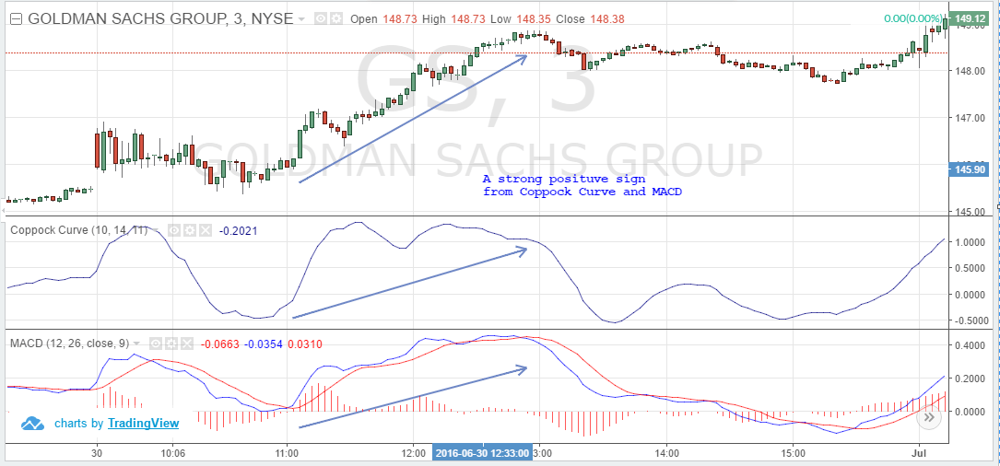

## Table of Contents

## What is the Coppock Curve and its origin?

The Coppock Curve is a technical analysis indicator used to identify long-term buying opportunities in the stock market. It was developed by Edwin Sedgwick Coppock in the late 1960s. The indicator is designed to signal when the market is entering a bullish phase after a period of decline. It does this by measuring the rate of change in stock market prices over a specific period, typically using a combination of 11 and 14-month rate-of-change figures, and then smoothing these figures with a 10-month weighted moving average.

The origin of the Coppock Curve is rooted in a request from the Episcopal Church, which asked Coppock to develop a method for determining when to invest church funds in the stock market. Coppock, who was an economist, drew inspiration from the idea of mourning periods, suggesting that it takes about 11 to 14 months for people to recover from economic and emotional setbacks. This led him to create the Coppock Curve, which he first published in the June 1962 issue of Barron's. Since its introduction, the indicator has been widely used by investors to identify major market bottoms and to make informed decisions about when to enter the market.

## How is the Coppock Curve calculated?

The Coppock Curve is calculated by first figuring out the rate of change in stock market prices over two different time periods, usually 11 and 14 months. To do this, you take the current price of the market and subtract the price from 11 months ago, then divide that by the price from 11 months ago. You do the same thing for the 14-month period. This gives you two percentages that show how much the market has changed over those periods.

Next, you add these two percentages together. After that, you smooth out the result using a 10-month weighted moving average. This means you take the sum of the percentages from the last 10 months, but you give more importance to the more recent months. The final number you get is the Coppock Curve value. When this value goes from negative to positive, it's a signal that it might be a good time to buy stocks because the market could be starting to go up.

## What is the significance of the Coppock Curve in technical analysis?

The Coppock Curve is a useful tool in technical analysis because it helps investors find good times to buy stocks. It does this by showing when the market might be starting to go up after being down for a while. When the Coppock Curve goes from a negative number to a positive number, it's a sign that the market could be entering a bullish phase. This means that prices might start to go up, and it could be a good time to invest.

The significance of the Coppock Curve lies in its ability to identify long-term trends. Unlike other indicators that might focus on short-term movements, the Coppock Curve looks at changes over 11 and 14 months and then smooths them out over 10 months. This makes it less likely to give false signals and more reliable for spotting major market bottoms. By using the Coppock Curve, investors can make more informed decisions about when to enter the market, potentially leading to better investment outcomes.

## How can the Coppock Curve be used to identify buy signals?

The Coppock Curve helps investors find good times to buy stocks by showing when the market might start going up after being down. It does this by looking at how much the market has changed over 11 and 14 months and then smoothing those changes over 10 months. When the Coppock Curve goes from a negative number to a positive number, it's a sign that the market might be starting to go up. This is called a buy signal because it means it could be a good time to invest in stocks.

Investors use the Coppock Curve to make better decisions about when to buy. For example, if the curve has been negative for a while and then turns positive, it suggests that the market is entering a bullish phase. This means that stock prices might start to rise, and it could be a good time to buy. By waiting for the Coppock Curve to give a buy signal, investors can increase their chances of buying at the start of an upward trend, which can lead to better investment results.

## Can the Coppock Curve be used to identify sell signals, and if so, how?

The Coppock Curve is mainly used to find good times to buy stocks, but it can also help find times to sell. It does this by looking at when the curve goes from being positive to being negative. If the curve has been positive for a while and then turns negative, it might mean the market is starting to go down. This can be a sign to sell stocks because prices might start to fall.

Using the Coppock Curve to find sell signals can help investors make better choices about when to get out of the market. For example, if the curve turns negative after being positive, it suggests that the market might be entering a bearish phase. This means that stock prices could start to drop, and it could be a good time to sell. By watching the Coppock Curve, investors can try to sell their stocks before prices go down too much.

## What are the typical time frames for using the Coppock Curve?

The Coppock Curve is usually used to look at long-term trends in the stock market. It is not meant for short-term trading. The typical time frames for using the Coppock Curve are 11 months, 14 months, and 10 months. The curve calculates the rate of change in stock prices over 11 and 14 months, then smooths these changes with a 10-month weighted moving average.

This means that when you use the Coppock Curve, you are looking at how the market has been doing over almost a year or more. It helps you see big trends and changes in the market, not small, quick ups and downs. Because it focuses on these longer periods, the Coppock Curve is best for investors who are thinking about their investments over the long term, not for people who want to buy and sell stocks quickly.

## How does the Coppock Curve perform in different market conditions?

The Coppock Curve works well in different market conditions, but it is best at spotting when the market is starting to go up after being down for a while. When the market has been going down and the Coppock Curve turns from negative to positive, it usually means a good time to buy stocks. This is because the curve is good at finding the end of a big drop in the market. It might not catch the very bottom, but it often signals a good time to buy before the market starts to go up a lot.

In a market that is going up and down a lot, the Coppock Curve can be less helpful. It is made to look at long-term changes, so it might not show the quick ups and downs that happen in a choppy market. If the market is just moving sideways without a clear trend, the Coppock Curve might give false signals or not give any signals at all. This is why it is better used for long-term investing and not for quick trading.

## What are the limitations and potential pitfalls of using the Coppock Curve?

The Coppock Curve has some limits and can be tricky to use. It is made to look at long-term changes in the market, so it might not catch the quick ups and downs. If the market is going up and down a lot or just staying the same, the Coppock Curve might not work well. It could give wrong signals or not give any signals at all. This means it is not good for people who want to buy and sell stocks quickly. Also, the Coppock Curve might not catch the very bottom of a market drop, so you might miss the best time to buy.

Another problem is that the Coppock Curve uses set time frames of 11, 14, and 10 months. These numbers might not work well in all market situations. If the market changes faster or slower than usual, the Coppock Curve might not give good signals. It's also important to remember that no single tool can predict the market perfectly. Using the Coppock Curve with other tools and looking at the bigger picture can help make better investment choices.

## How can the Coppock Curve be combined with other technical indicators for better results?

The Coppock Curve works better when you use it with other technical indicators. One good way to do this is to use it with the Moving Average Convergence Divergence (MACD). The MACD looks at shorter-term changes in the market, so it can help you see quick ups and downs that the Coppock Curve might miss. If the Coppock Curve shows a good time to buy and the MACD also shows a buy signal, it can make you feel more sure about buying stocks.

Another helpful indicator to use with the Coppock Curve is the Relative Strength Index (RSI). The RSI shows if a stock is being bought too much or sold too much in the short term. If the Coppock Curve says it's a good time to buy and the RSI shows the stock is not being bought too much, it can be a stronger sign to buy. Using these two together can help you make better choices about when to buy and sell stocks.

You can also use the Coppock Curve with trend lines or support and resistance levels. These can help you see where the market might go next. If the Coppock Curve gives a buy signal and the price is near a strong support level, it might be an even better time to buy. By combining the Coppock Curve with these other tools, you can get a fuller picture of what the market is doing and make smarter investment decisions.

## Are there any variations or modifications to the traditional Coppock Curve strategy?

Some people change the traditional Coppock Curve to make it work better for them. One way to do this is by using different time frames. Instead of using 11, 14, and 10 months, you might try using 9, 12, and 8 months or some other numbers. This can help the curve fit better with how fast the market is moving at that time. Another change is to use the Coppock Curve on different things, like single stocks or other markets, not just the whole stock market.

Another way to change the Coppock Curve is by adding other indicators to it. For example, some people use the Moving Average Convergence Divergence (MACD) or the Relative Strength Index (RSI) along with the Coppock Curve. This can help make the signals more reliable because you're looking at the market from different angles. By trying different changes and seeing what works best, you can make the Coppock Curve a more useful tool for your investing.

## What historical examples illustrate the effectiveness of the Coppock Curve?

One good example of the Coppock Curve working well was in the early 1980s. The stock market had been going down for a while, and things looked bad. But in July 1982, the Coppock Curve turned from negative to positive. This was a sign that the market might start going up. People who saw this signal and bought stocks did well because the market did start to go up a lot after that. This shows how the Coppock Curve can help find good times to buy when the market is at a low point.

Another time the Coppock Curve was useful was in 2009, after the big financial crisis. The market had been falling a lot, and many people were worried. But in April 2009, the Coppock Curve gave a buy signal by turning positive. Investors who followed this signal and bought stocks at that time saw big gains as the market started to recover. This example shows that even after big drops, the Coppock Curve can help find the start of a new upward trend.

## How can traders backtest the Coppock Curve strategy to optimize its use?

Traders can backtest the Coppock Curve strategy by looking at old market data to see how well the strategy would have worked in the past. They can use computer programs or special software to do this. First, they need to get the old price data for the stock market or the stocks they want to test. Then, they calculate the Coppock Curve for those old prices using the 11, 14, and 10-month time frames. They watch for times when the curve goes from negative to positive, which is a buy signal, and from positive to negative, which is a sell signal. By seeing how these signals would have worked in the past, traders can learn if the Coppock Curve could have made them money.

After doing the backtest, traders can try to make the strategy better. They might change the time frames used in the Coppock Curve, like trying 9, 12, and 8 months instead. They can also see if adding other indicators, like the MACD or RSI, makes the signals more reliable. By testing different changes, traders can find the best way to use the Coppock Curve for their investing. This helps them feel more sure about using the strategy in the future because they know it has worked well in the past.

## What is the Coppock Curve?

The Coppock Curve is a smoothed momentum indicator designed primarily to signal market bottoms, offering investors insights into potential recovery phases of stock markets. Developed in the 1960s by economist Edwin Coppock, the indicator is rooted in the psychological concept of a grieving period, estimating that markets tend to recover after an extended downturn lasting approximately 11 to 14 months. This concept is reflected in the timeframes of the indicator's calculation.

The calculation of the Coppock Curve employs a weighted moving average (WMA) of the Rate of Change (ROC) of an asset's price over selected periods—traditionally, 11 and 14 months. The formula for the Coppock Curve can be expressed as follows:

$$
\text{Coppock Curve} = \text{WMA}\left(\text{ROC}(\text{Close}, 11) + \text{ROC}(\text{Close}, 14), 10\right)
$$

In this formula:
- $\text{ROC}(\text{Close}, n)$ denotes the Rate of Change of the asset's closing prices over $n$ months.
- $\text{WMA}$ signifies the weighted moving average applied to the sum of the ROCs over the specified periods.

The ROC is a [momentum](/wiki/momentum) measure that calculates the percentage change between the current price and the price a certain number of periods back. By smoothing these changes with a WMA, the Coppock Curve helps filter out short-term [volatility](/wiki/volatility-trading-strategies), highlighting the longer-term momentum that can indicate potential market bottoms.

This methodology underscores Edwin Coppock’s belief that markets, like individuals, experience cycles of grief and recovery, with the Coppock Curve functioning as a tool to quantify these changes in a systematic manner. Through its capacity to anticipate shifts in market dynamics, the Coppock Curve remains a valuable indicator for traders and investors focusing on long-term investment strategies.

## What are the Coppock Curve Trading Rules?

The Coppock Curve is a technical analysis tool used to identify potential buy signals in stock market indices. The trading rules associated with the Coppock Curve are primarily designed to guide the entry and [exit](/wiki/exit-strategy) points based on the crossover of the indicator with the zero line.

To calculate the Coppock Curve, the formula used is:

$$
\text{Coppock Curve} = \text{WMA}(\text{ROC}(\text{Close}, 11) + \text{ROC}(\text{Close}, 14), 10)
$$

Here's a breakdown of the components:
- **Rate of Change (ROC)**: This is a momentum oscillator that measures the percentage change in price between the current price and the price a specified number of periods ago. For the Coppock Curve, two periods are used: 11 and 14 months.
- **Weighted Moving Average (WMA)**: After calculating the ROC for the specified periods, a 10-period WMA is applied to smooth the resulting values, producing the Coppock Curve.

### Trading Strategy:
- **Entering a Long Position**: When the Coppock Curve crosses above the zero line, it signals a potential market recovery. Investors may consider entering long positions in anticipation of an upward trend.

- **Exiting a Long Position**: Conversely, when the Coppock Curve crosses below the zero line, it indicates a possible shift in market conditions. This crossover suggests it might be prudent to exit long positions to avoid potential declines.

Here's a simple Python code snippet to calculate the Coppock Curve and determine trading signals:

```python
import pandas as pd

def calculate_roc(data, period):
    """Calculate Rate of Change (ROC)"""
    return (data / data.shift(period) - 1) * 100

def calculate_wma(data, period):
    """Calculate Weighted Moving Average (WMA)"""
    weights = list(range(1, period + 1))
    return data.rolling(period).apply(lambda x: (x * weights).sum() / sum(weights), raw=True)

def coppock_curve(data):
    """Calculate Coppock Curve"""
    roc_11 = calculate_roc(data, 11)
    roc_14 = calculate_roc(data, 14)
    coppock = calculate_wma(roc_11 + roc_14, 10)
    return coppock

# Example usage with a Pandas DataFrame `df` with a 'Close' column
df['Coppock'] = coppock_curve(df['Close'])
df['Signal'] = 0
# Buy signal
df.loc[df['Coppock'] > 0, 'Signal'] = 1  
# Sell signal
df.loc[df['Coppock'] < 0, 'Signal'] = -1
```

The execution of this strategy hinges on robust backtesting to ensure its efficacy across different market conditions, taking into account the indicator’s lagging nature. It's recommended to complement the Coppock Curve with additional technical indicators to confirm signals and refine the trading strategy.

## Question: How effective is backtesting the Coppock Curve Strategy?

Backtesting the Coppock Curve strategy involves analyzing historical data to understand its efficacy in real-world market conditions. Historical performance analysis shows that the Coppock Curve, a momentum-based indicator, effectively aids in reducing drawdowns—periods when the value of a portfolio declines—thereby supporting risk-adjusted returns. This makes it an appealing tool for traders seeking to capitalize on long-term market trends while controlling risk exposure.

To create a robust backtesting framework, it is essential to utilize a comprehensive dataset covering various market phases, including bull and bear markets. This approach ensures that the strategy is tested under diverse conditions, helping validate its reliability and effectiveness.

One of the key aspects of the Coppock Curve strategy is its potential to reduce the time a trader's capital is actively exposed in the market. By reducing the time spent in the market, traders can minimize their exposure to adverse market conditions, potentially lowering risk. This is particularly beneficial in volatile markets where price fluctuations could lead to substantial losses.

The standard methodology for calculating the Coppock Curve involves using the weighted moving average (WMA) of the Rate of Change (ROC) of a stock's closing price over specific periods, typically 11 and 14 months, followed by smoothing with a 10-month WMA. The formula is as follows:

$$
\text{Coppock Curve} = \text{WMA}(\text{ROC}(\text{Close}, 11) + \text{ROC}(\text{Close}, 14), 10)
$$

To backtest this, one could use Python libraries such as Pandas and NumPy to handle data and calculate the ROC and WMA:

```python
import pandas as pd
import numpy as np

def calculate_coppock_curve(prices, short_window=11, long_window=14, wma_window=10):
    roc_11 = prices.pct_change(short_window)
    roc_14 = prices.pct_change(long_window)
    roc_sum = roc_11 + roc_14

    wma = roc_sum.rolling(window=wma_window, min_periods=1).apply(lambda x: np.average(x, weights=range(1, len(x)+1)))

    return wma
```

This code snippet calculates the Coppock Curve for a given set of historical price data. Running backtests with this function involves applying it to different indices and stocks, interpreting the zero-line crossings as buy or sell signals, and subsequently tracking the performance metrics like drawdowns and returns over time.

Ultimately, the results of thorough backtesting can help tailor the Coppock Curve strategy to specific market conditions, ensuring it aligns with the trader’s risk tolerance and investment goals. This tailored strategy allows for informed decision-making, facilitating a more nuanced approach to market exposure and risk management.

## References & Further Reading

[1]: Coppock, E. S. (1962). "A Quarterly Trend Report." Barron's.

[2]: Jansen, S. (2018). ["Machine Learning for Algorithmic Trading."](https://searchworks.stanford.edu/view/13246850) Packt Publishing.

[3]: Turner, R. C., & Seri, R. (2012). ["Statistical Techniques for Algorithmic and High-Frequency Trading."](https://assets.cambridge.org/97811070/91146/frontmatter/9781107091146_frontmatter.pdf) Springer. 

[4]: Chan, E. P. (2009). ["Quantitative Trading: How to Build Your Own Algorithmic Trading Business."](https://github.com/ftvision/quant_trading_echan_book) Wiley.

[5]: Aronson, D. R. (2006). ["Evidence-Based Technical Analysis: Applying the Scientific Method and Statistical Inference to Trading Signals."](https://www.amazon.com/Evidence-Based-Technical-Analysis-Scientific-Statistical/dp/0470008741) Wiley.

[6]: Pring, M. J. (1991). ["Technical Analysis Explained: The Successful Investor's Guide to Spotting Investment Trends and Turning Points."](https://www.amazon.com/Technical-Analysis-Explained-Fifth-Successful/dp/0071825177) McGraw-Hill Education.

[7]: Murphy, J. J. (1999). ["Technical Analysis of the Financial Markets: A Comprehensive Guide to Trading Methods and Applications."](https://www.amazon.com/Technical-Analysis-Financial-Markets-Comprehensive/dp/0735200661) New York Institute of Finance.