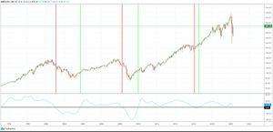

Technical analysis is a key component in trading strategies, focusing on analyzing statistical trends derived from trading activity, such as price movement and volume. It provides traders and investors with a means to predict future price behavior based on past market data. Unlike fundamental analysis, which evaluates a company's financial statements, technical analysis is rooted in the belief that past market trends often repeat and can offer significant insights into future movements.

The Coppock Curve is a renowned tool within technical analysis, developed by economist Edwin Coppock in the early 1960s. Initially designed to capture long-term buying opportunities, the Coppock Curve serves as a momentum indicator that helps traders identify potential turning points in market trends. The curve is calculated using a weighted moving average (WMA) of the rate of change (ROC) of a market index, incorporating historical data to highlight opportunities when markets appear poised to reverse. 



In today’s rapidly evolving financial markets, trade signals derived from technical indicators serve as valuable inputs for algorithmic trading systems. Algorithmic trading employs complex algorithms to monitor markets and execute trades efficiently, minimizing human intervention. These systems offer benefits such as speed, precision, and the ability to process large volumes of data, enhancing decision-making capacities significantly. The increasing reliance on algorithmic trading reflects its significance in achieving cost-effective and timely execution of trade strategies, often driven by insights obtained from technical indicators.

This article aims to explore the integration of the Coppock Curve into algorithmic trading frameworks, offering insights into its application and adaptation for both retail and institutional traders. The discussion targets individuals and professionals interested in leveraging technical analysis to optimize trading strategies within automated systems. The exploration emphasizes practical guidance and considerations required to harness the Coppock Curve effectively, encompassing the principles of signal generation, customization for algorithmic contexts, and the importance of backtesting. As the financial landscape continues to shift towards automation, understanding tools like the Coppock Curve becomes increasingly crucial for achieving strategic trading objectives.

## Table of Contents

## Understanding the Coppock Curve

The Coppock Curve, developed by Edwin Coppock in 1962, is a momentum indicator used primarily to identify long-term buying opportunities. Coppock introduced this tool after being inspired by Ralph Nelson Elliott's wave theory and through consultation with Episcopal clergymen, who suggested a bereavement period as an analogy for how long it takes markets to recover from significant downturns. The result is an indicator designed to forecast the beginning of new market uptrends.

The Coppock Curve operates as a momentum indicator that signals potential buy opportunities by focusing on market turning points. This tool is calculated based on a smoothed weighted average derived from the Rate of Change (ROC) indicators. Specifically, it involves taking a 14-month ROC and an 11-month ROC, summing them, and then applying a 10-month weighted moving average (WMA) to the result. The mathematical expression can be described as follows:

$$
\text{Coppock Curve} = \text{WMA}_{10}(\text{ROC}_{14} + \text{ROC}_{11})
$$

Where:

- $\text{ROC}_{14}$ is the Rate of Change over 14 months.
- $\text{ROC}_{11}$ is the Rate of Change over 11 months.
- $\text{WMA}_{10}$ is the 10-period weighted moving average of the summed ROCs.

Originally intended for long-term market analysis, the primary aim was to signal buying points for indices involving broad market movements rather than individual securities. The indicator's effectiveness is linked primarily to its ability to highlight major market bottoms, making it particularly useful for investors with a longer-term perspective.

Despite its initial focus on long-term strategies, the Coppock Curve has demonstrated adaptability across various markets and timeframes. Traders can adjust the settings to accommodate shorter investment periods, although the indicator is most reliable when aligned with its intended long-term approach. This adaptability allows it to be employed in diverse market conditions, from equities to commodities and [forex](/wiki/forex-system), albeit with careful consideration of market-specific dynamics.

In summary, the Coppock Curve is a significant tool in technical analysis designed to predict long-term market recoveries. Its robustness is attributed to its careful construction, combining [momentum](/wiki/momentum) indicators with smoothing to filter out short-term [volatility](/wiki/volatility-trading-strategies). Its flexibility across different markets and timeframes ensures its continued relevance in modern trading strategies.

## Generating Trade Signals with the Coppock Curve

The Coppock Curve is a momentum indicator widely utilized in identifying buy and sell signals within various trading environments. Its functionality is rooted in the aggregation of rate-of-change (ROC) metrics combined with a weighted moving average (WMA), generating a line that traders analyze to discern potential market shifts.

### Using the Coppock Curve for Trade Signals

The Coppock Curve's primary utility for trade signals involves interpreting its movement relative to the zero line. Crossing this threshold typically triggers buying or selling actions, contingent upon the direction of the cross.

- **Zero Line as a Trade Trigger**: Traditionally, a cross above the zero line signifies a buy signal, indicating that a market is gaining momentum. Conversely, a cross below the zero line suggests a sell signal, highlighting potential bearish conditions. This simplicity makes the Coppock Curve an attractive tool for traders seeking straightforward signals.

### Coppock Curve on Different Timeframes

The adaptability of the Coppock Curve across various timeframes enables traders to tailor its application to their specific strategies. Short-term traders might employ daily or hourly charts, capturing more immediate price fluctuations. In contrast, long-term investors might prefer weekly or monthly charts, which can filter out short-term noise and focus on sustained trends.

### Examples in Real Market Scenarios

For example, consider a scenario where the Coppock Curve on a weekly chart crosses above the zero line for a major index like the S&P 500. This occurrence might have historically preceded a bullish market phase, prompting traders to take long positions. Conversely, a drop below the zero line on a similar timeframe could have presaged a market correction, alerting traders to potential short opportunities.

### Benefits and Limitations

**Benefits**: 
The Coppock Curve is recognized for its ability to smooth out short-term volatility, providing clearer long-term signals that can be valuable for trend identification. Additionally, its straightforward calculation and interpretation make it accessible to traders of varying experience levels.

**Limitations**: 
Despite its advantages, the Coppock Curve is not infallible. Its reliance on historical data can lead to delayed reactions in rapidly changing markets. The indicator may also generate false signals during sideways or choppy markets, necessitating the incorporation of supplementary analysis or additional indicators to corroborate its signals.

In conclusion, the Coppock Curve, with its simplicity and historical effectiveness, remains a significant tool for generating trade signals, though traders must be mindful of its limitations and adapt their strategies to different market contexts and conditions.

## Incorporating the Coppock Curve in Algo Trading

Algorithmic trading has become a cornerstone of modern financial markets, offering advantages such as efficiency, precision, and the ability to process vast amounts of data. By employing computer algorithms, traders can execute orders at speeds and frequencies impossible for human traders. This automated approach also allows for systematic and back-tested strategies, reducing emotional decision-making and enhancing consistency.

Integrating the Coppock Curve into an [algorithmic trading](/wiki/algorithmic-trading) strategy involves several key steps. First, it is crucial to understand the formula behind the Coppock Curve, which is primarily a momentum indicator. The formula consists of a weighted moving average (WMA) applied to the sum of two Rate of Change (ROC) calculations:

$$
\text{Coppock Curve} = \text{WMA}(\text{ROC}_{14} + \text{ROC}_{11})
$$

The typical periods used in the original formulation are 11 and 14 months for the ROCs, but these can be adjusted to cater to different trading goals and timeframes.

To incorporate this in an algorithm, one must first select a programming language, with Python being a popular choice due to its comprehensive suite of libraries for financial analysis. The `pandas` library can be used for data manipulation, and `numpy` for numerical computing, making them ideal for calculating the Coppock Curve.

Here is a basic outline in Python to compute the Coppock Curve:

```python
import pandas as pd
import numpy as np

# Assume df is a DataFrame with a 'Close' column
def calculate_ROC(series, period):
    return series.pct_change(periods=period) * 100

def calculate_Coppock_curve(df, wma_period=10):
    roc_11 = calculate_ROC(df['Close'], 11)
    roc_14 = calculate_ROC(df['Close'], 14)
    coppock_curve = (roc_11 + roc_14).rolling(window=wma_period).mean()
    return coppock_curve

df['CoppockCurve'] = calculate_Coppock_curve(df)
```

Programming considerations include ensuring data integrity and handling issues such as missing data or outliers. Optimization of the algorithm for speed and computational efficiency is also vital, especially when dealing with high-frequency data. Additionally, strategies for implementing the buy/sell signals generated by the Coppock Curve should be robust and thoroughly tested.

Adjustments to the Coppock Curve settings can enhance its effectiveness in algorithmic trading. The WMA period might be shortened for more responsive signals in high-frequency trading or lengthened for long-term investment strategies. Similarly, the ROC periods can be adjusted based on historical performance and market conditions.

Backtesting strategies with the Coppock Curve involve simulating its historical performance on past market data. This process is crucial for evaluating the reliability and profitability of the trading strategy before deploying it live. Tools like Python's `[backtrader](/wiki/backtrader)` or `zipline` provide extensive capabilities for conducting thorough backtests, allowing traders to refine their strategies by iterating through multiple parameter settings.

In conclusion, the Coppock Curve can be integrated into algorithmic trading systems by leveraging its momentum-measuring capabilities and fine-tuning its parameters to match trading objectives. By combining this technical indicator with algorithmic trading, traders can enhance their ability to capitalize on market trends efficiently.

## Adjusting Settings for Improved Signals

The Coppock Curve is a momentum indicator that traders use to generate buy and sell signals by analyzing the rate of change (ROC) and weighted moving average (WMA) of a price series. Understanding the adjustments of these components can significantly influence the indicator's reliability and effectiveness across different trading scenarios.

The primary components of the Coppock Curve are the ROC and the WMA. The ROC is a measure of the speed at which prices are changing, while the WMA provides a smoothed average of the past ROC values. The original formulation proposed by Edwin Coppock is designed for long-term trading signals, typically utilizing a 14-month ROC and an 11-month WMA. These settings may not be optimal for all traders, particularly those focusing on shorter timeframes; hence, adjustments may be necessary.

### Impact of Adjusting ROC and WMA

Altering the ROC and WMA parameters affects both the frequency and accuracy of the Coppock Curve signals. A shorter ROC period can increase signal frequency but may reduce signal reliability due to higher sensitivity to market noise. Conversely, extending the ROC can smooth out the noise but might delay the identification of emerging trends.

The WMA period also plays a crucial role. Shortening the WMA intensifies the curve, enabling it to react faster to changes, which is beneficial for traders who need to respond quickly to market shifts. However, this might lead to an increase in false signals. A longer WMA, while reducing false signals, tends to lag, making it suitable for traders with a longer-term outlook.

### Optimal Settings for Different Traders

For short-term traders, optimizing the Coppock Curve might involve shorter ROC and WMA settings, such as a 5-day ROC combined with a 3-day WMA. This customization allows for more responsive signals, aligning better with the fast-paced nature of short-term trading. Long-term traders, maintaining the conventional settings, benefit from the reduced noise and the emphasis on significant trend shifts, aligning with a strategy focusing on broader market trends.

### Customizing the Coppock Curve for Market Conditions

To tailor the Coppock Curve to specific market conditions, traders can experiment with different ROC and WMA combinations based on their observations of market volatility and market cycle phases. During periods of high volatility, it can be prudent to extend the WMA to absorb market noise. In contrast, during stable market phases, reducing the WMA can make the indicator more responsive to new trends.

```python
import pandas as pd

def coppock_curve(prices, roc_period1=14, roc_period2=11, wma_period=10):
    """
    Calculate the Coppock Curve.

    :param prices: List or Pandas Series of closing prices.
    :param roc_period1: First ROC period.
    :param roc_period2: Second ROC period.
    :param wma_period: WMA period.
    :return: Pandas Series representing the Coppock Curve values.
    """
    roc1 = prices.pct_change(roc_period1)
    roc2 = prices.pct_change(roc_period2)
    coppock = (roc1 + roc2).rolling(window=wma_period).mean()
    return coppock

# Example usage:
# prices = pd.Series([...])  # replace with actual price data
# coppock_values = coppock_curve(prices)
```

### Importance of Testing and Tweaking

Testing different settings is crucial for maximizing the Coppock Curve's effectiveness. Backtesting strategies using historical data enables traders to observe how various configurations perform under different market circumstances. Adjustments should be iterative, always keeping an eye on minimizing false signals while capturing meaningful trends. 

Iterative testing and adjustment can transform the Coppock Curve into a robust component of a comprehensive trading strategy. By carefully optimizing settings, traders can significantly enhance signal quality, aligning trading activities better with market dynamics and improving overall trading results.

## Filtering Trades for Enhanced Performance

Trend analysis plays a critical role in filtering trade signals generated by the Coppock Curve, thereby enhancing performance and reducing the likelihood of false signals. By understanding the direction of the market trend, traders can better assess whether signals are in alignment with prevailing market conditions. The key to trend analysis is identifying long-term market trends using moving averages or other trend indicators to avoid trading against the primary market direction.

In conjunction with trend analysis, incorporating additional technical indicators can provide confirmation for the Coppock Curve signals. Indicators such as Moving Average Convergence Divergence (MACD), Relative Strength Index (RSI), and Bollinger Bands can be used to validate signals generated by the Coppock Curve. For instance, a buy signal from the Coppock Curve might be confirmed by MACD when both its line and signal line are below the zero line, suggesting that the market is oversold and primed for a reversal.

Successful trade filtering strategies often employ a multi-indicator approach. A case study might include using the Coppock Curve in combination with a moving average crossover strategy whereby a buy signal is only acted upon if the Coppock Curve signals coincide with a crossover of a short-term moving average above a long-term moving average. This dual confirmation can help traders avoid premature entries and preserve capital.

Reducing false signals and improving profitability involves careful selection of indicators and market conditions. To accomplish this, traders may employ statistical methods such as [backtesting](/wiki/backtesting) and Monte Carlo simulations to determine the historical reliability of the Coppock Curve signals augmented with other indicators. By analyzing extensive historical data, traders can identify the conditions under which the Coppock Curve offers the most reliable signals and adjust their strategies accordingly.

Aligning trade signals with market trends requires an understanding of both macroeconomic trends and technical market movements. Traders should be mindful of the broader economic context—such as [interest rate](/wiki/interest-rate-trading-strategies) changes, geopolitical events, and currency fluctuations—that might influence market trends. By doing so, they ensure that trade signals not only conform to the current market trends but are also resilient to potential market disruptions.

Here is a simple Python example demonstrating the integration of the Coppock Curve with moving average filters for trade signal confirmation:

```python
import numpy as np
import pandas as pd

# Sample data
data = pd.DataFrame({'price': [...], 'date': [...]})

# Calculate Rate of Change (ROC)
data['roc'] = (data['price'] - data['price'].shift(14)) / data['price'].shift(14) * 100

# Calculate weighted moving average (WMA)
data['wma'] = data['roc'].ewm(span=10, adjust=False).mean()

# Coppock Curve
data['coppock_curve'] = data['wma'].rolling(window=10).sum()

# Moving Averages
data['short_ma'] = data['price'].rolling(window=50).mean()
data['long_ma'] = data['price'].rolling(window=200).mean()

# Trade Signals
data['signal'] = np.where((data['coppock_curve'] > 0) & (data['short_ma'] > data['long_ma']), 'buy', 'hold')
```

By employing a combination of trend analysis and additional technical indicators, traders can enhance their trading performance when working with the Coppock Curve, thus achieving a more balanced and effective trading strategy.

## Special Considerations for Using the Coppock Curve

The Coppock Curve, while a robust tool for many traders, must be approached with special considerations, particularly in volatile markets. This section outlines possible challenges and offers strategies for optimizing its use.

### Challenges in Volatile Markets

Volatile markets can significantly impact the efficacy of technical indicators, including the Coppock Curve. Rapid price fluctuations can lead to frequent whipsaws, where the indicator may generate false signals. As the Coppock Curve is calculated using a weighted moving average (WMA) of the rate of change (ROC) of prices, sudden market movements can skew these averages, causing misleading trade signals.

### Scenarios of Unreliable Signals

In highly volatile conditions, the Coppock Curve might produce unreliable signals for several reasons:

1. **Lag in Detection**: The Coppock Curve is designed for long-term momentum detection. In fast-moving markets, this characteristic can cause a delay in signal generation, resulting in missed opportunities or late entries.

2. **Noise Amplification**: Short-term volatility can introduce noise, which can be mistakenly interpreted as a signal, particularly when the indicator hovers around the zero line without a clear upward or downward trajectory.

### Risk Management Strategies

Effective risk management is crucial when using the Coppock Curve, especially in unpredictable markets:

- **Diversification**: Trading in multiple asset classes can reduce the risk associated with a single volatile market.

- **Stop-Loss Orders**: Implementing stop-loss orders can help protect against adverse movements contrary to Coppock-generated signals.

- **Position Sizing**: Adjusting the size of your trades based on volatility—larger in stable markets and smaller in volatile conditions—can help manage risk.

### Dealing with Market Anomalies

Market anomalies, such as sudden geopolitical events or unexpected economic data releases, can affect the Coppock Curve's reliability. During such events, the market can exhibit erratic behavior, which might lead the indicator astray. Traders should combine the Coppock Curve with other indicators, like [volume](/wiki/volume-trading-strategy) analysis or volatility indexes, to reaffirm signals before making decisions.

### FAQs

**Q: Can the Coppock Curve be used in short-term trading?**  
A: While primarily designed for long-term trends, it can be adapted with shorter ROC and WMA periods. However, this may increase susceptibility to noise in volatile markets.

**Q: What adjustments can be made for better signal accuracy?**  
A: Traders can tweak the ROC and WMA settings or apply additional filters like moving averages to smooth out signals.

**Q: How does one handle a false signal?**  
A: Incorporate additional confirmation strategies, such as cross-verifying with other trend indicators, before acting on a signal.

By understanding these considerations and implementing robust strategies, traders can better navigate the complexities of using the Coppock Curve in varied market conditions.

## Conclusion

The Coppock Curve remains an invaluable tool in the domain of technical analysis, offering traders a reliable method to gauge momentum and generate trade signals. Its primary benefit lies in its ability to identify long-term buying opportunities by analyzing the Rate of Change (ROC) and Weighted Moving Average (WMA), thus providing a streamlined assessment of market trends. By capturing the essence of market momentum, traders can better align their strategies with prevailing conditions, leading to potentially more informed trading decisions.

Integrating the Coppock Curve into algorithmic trading enhances the process by automating signal generation and execution, allowing traders to capitalize on opportunities swiftly. Automation reduces emotional biases, ensures consistency, and can significantly improve trading efficiency. Traders utilizing algorithms can adjust parameters like the ROC and WMA periods, tailored to specific market conditions and timeframes, ensuring the Coppock Curve adapts alongside evolving market dynamics. 

Experimentation and optimization are vital for traders aiming to leverage the Coppock Curve effectively. Backtesting different configurations and combining the indicator with other metrics can unveil potent strategies, fine-tuning them to suit personal risk profiles and market environments. This adaptive approach encourages a methodological exploration of technical analysis tools, pushing the boundaries of what is possible in trading.

Looking ahead, technical indicators like the Coppock Curve will continue to evolve, integrating advancements in computational power and [machine learning](/wiki/machine-learning). Such developments promise enhanced precision and contextual insight, empowering traders with increasingly sophisticated analytical capabilities. As these technologies advance, the importance of flexible, adaptable tools will only increase, paving the way for innovative approaches in financial markets.

As a final call to action, traders and investors alike should consider incorporating the Coppock Curve into their trading toolkit. Through trial, adaptation, and iterative learning, integrating this tool can provide a robust foundation for developing sound trading strategies. Embracing such indicators not only enriches one's trading practice but also fortifies the decision-making process in a consistently challenging market landscape.

## References & Further Reading

[1]: Akram, M. (2014). ["Technical Analysis and Financial Asset Forecasting: From Simple Tools to Advanced Techniques."](https://www.researchgate.net/publication/303422777_Technical_Analysis_and_Financial_Asset_Forecasting_From_Simple_Tools_to_Advanced_Techniques) Springer.

[2]: Aronson, D. R. (2007). ["Evidence-Based Technical Analysis: Applying the Scientific Method and Statistical Inference to Trading Signals."](https://onlinelibrary.wiley.com/doi/book/10.1002/9781118268315) Wiley.

[3]: Chan, E. P. (2008). ["Quantitative Trading: How to Build Your Own Algorithmic Trading Business."](https://github.com/ftvision/quant_trading_echan_book) John Wiley & Sons.

[4]: Coppock, E. S. (1962). ["Guide to Today's Market."](https://en.wikipedia.org/wiki/Coppock_curve) Barron's National Business and Financial Weekly.

[5]: Jansen, S. (2020). ["Machine Learning for Algorithmic Trading: Predictive Models to Extract Signals from Market and Alternative Data for Systematic Trading Strategies with Python."](https://www.amazon.com/Machine-Learning-Algorithmic-Trading-alternative/dp/1839217715) Packt Publishing.

[6]: Ulrich, J. (1989). ["Technical Analysis of Stock Trends."](https://archive.org/details/technical-analysis-of-stock-trends-9th) by Robert D. Edwards and John Magee, revised by W.H.C. Bassetti, New York Institute of Finance.

[7]: Wheeler, D. (1994). ["Understanding the Coppock Curve."](https://therobusttrader.com/coppock-curve/) Fidelity Learning Center.

[8]: Lopez de Prado, M. (2018). ["Advances in Financial Machine Learning."](https://www.amazon.com/Advances-Financial-Machine-Learning-Marcos/dp/1119482089) John Wiley & Sons.