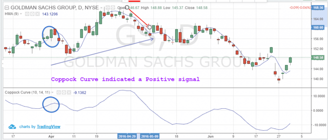

## Table of Contents

## What is the Coppock Curve and its origin?

The Coppock Curve is a technical analysis indicator used to predict stock market trends. It was created to identify major buying opportunities in the stock market by signaling when a long-term bullish trend might be starting. The indicator is calculated using a weighted moving average of the sum of two rates of change over different time periods, usually 11 and 14 months. When the Coppock Curve moves from a negative value to a positive value, it suggests that a new bull market may be beginning.

The Coppock Curve was developed by Edwin Sedgwick Coppock in the late 1960s. Coppock was an economist who wanted to create a tool that could help investors make better decisions about when to buy stocks. He got the idea for the curve from conversations with church leaders who asked him how long it typically takes for people to recover from emotional trauma, like the grief of losing a loved one. Coppock thought that the stock market might behave similarly after a downturn, and he used this idea to develop his indicator. Since its creation, the Coppock Curve has been used by many investors to guide their investment strategies.

## How is the Coppock Curve calculated?

The Coppock Curve is calculated by taking the sum of two rates of change over different time periods, usually 11 and 14 months. First, you find the rate of change for the stock market index over 11 months. This means you look at how much the index has changed from one month to 11 months later. Then, you do the same thing but for 14 months. After finding these two rates of change, you add them together.

Next, you take the sum of these rates of change and smooth it out using a weighted moving average. This helps to reduce the impact of short-term fluctuations and gives a clearer picture of the long-term trend. The most common method is to use a 10-month weighted moving average. When the resulting Coppock Curve crosses from negative to positive, it suggests that a new bull market may be starting, which can be a signal for investors to buy stocks.

## What are the key components needed to generate the Coppock Curve?

To generate the Coppock Curve, you need to start by calculating the rate of change of a stock market index over two different time periods, typically 11 and 14 months. The rate of change shows how much the index has gone up or down from one month to the same month 11 or 14 months later. Once you have these two rates of change, you add them together to get a combined rate of change.

After you have the combined rate of change, the next step is to smooth it out using a weighted moving average. This helps to make the data less jumpy and easier to understand. The most common way to do this is by using a 10-month weighted moving average. The final result is the Coppock Curve, which can help investors see if the market might be starting a new upward trend when it moves from a negative value to a positive one.

## How can the Coppock Curve be used to identify buy and sell signals?

The Coppock Curve helps investors find good times to buy stocks. It does this by looking for when the curve moves from being below zero to above zero. This change means that the market might be starting a new upward trend, which is a good time to buy. Investors watch for this "buy signal" because it can mean the start of a bull market, where stock prices go up over time.

On the other hand, the Coppock Curve doesn't give clear signals for when to sell stocks. It's mainly used for finding good buying opportunities. However, if the curve starts to go down after being high for a while, it might mean the market is getting weaker. Some investors might see this as a hint to sell or be careful, but it's not a strong "sell signal" like the buy signal is. So, while the Coppock Curve is great for buying, it's less useful for deciding when to sell.

## What are the typical time frames used for the Coppock Curve?

The Coppock Curve uses two main time frames to work out if it's a good time to buy stocks. The first time frame is 11 months, and the second is 14 months. These time frames help to see how much the stock market has changed over these periods. By adding the changes together, the Coppock Curve can show if the market might start going up soon.

After adding the changes for 11 and 14 months, the Coppock Curve smooths out the numbers using a 10-month weighted moving average. This helps to make the data easier to understand and less jumpy. When the curve goes from below zero to above zero, it's a sign that it might be a good time to buy stocks because a new upward trend could be starting.

## How does the Coppock Curve perform in different market conditions?

The Coppock Curve works best in markets that have big ups and downs. It's really good at finding the start of long times when the market goes up, called bull markets. When the market has been going down for a while and then starts to turn around, the Coppock Curve can show this change by moving from below zero to above zero. This is a sign for investors to buy stocks because the market might keep going up for a long time.

In markets that don't have big changes, the Coppock Curve might not be as helpful. If the market is just moving a little bit up and down without big swings, the curve might not give clear signals about when to buy. It's not made for these kinds of markets, so it's best used when the market has clear ups and downs. 

Sometimes, the Coppock Curve might give a false signal, which means it shows a buy signal but the market doesn't go up like expected. This can happen if the market changes direction quickly or if there's a short up followed by another down. Investors need to be careful and look at other signs too, not just rely on the Coppock Curve alone.

## What are the common pitfalls when using the Coppock Curve for trading?

One common problem when using the Coppock Curve for trading is that it can give false signals. This means the curve might show it's a good time to buy stocks, but then the market doesn't go up like expected. This can happen if the market changes direction quickly or if there's a short up followed by another down. Investors need to be careful and not rely only on the Coppock Curve. They should also look at other signs and information to make better decisions.

Another issue is that the Coppock Curve works best in markets with big ups and downs. If the market is just moving a little bit without big changes, the curve might not give clear signals about when to buy. It's not made for these kinds of markets, so it's best used when the market has clear ups and downs. Also, the Coppock Curve is mainly for finding good times to buy stocks, not for deciding when to sell. So, if you're looking for sell signals, you'll need to use other tools along with the Coppock Curve.

## How can the Coppock Curve be integrated with other technical indicators?

The Coppock Curve can be used with other technical indicators to help investors make better choices about when to buy and sell stocks. One way to do this is by using the Moving Average Convergence Divergence (MACD) indicator along with the Coppock Curve. The MACD can help show if the market's short-term trend is getting stronger or weaker. If the Coppock Curve shows a buy signal and the MACD is also moving up, it might be a stronger sign that it's a good time to buy stocks.

Another useful indicator to use with the Coppock Curve is the Relative Strength Index (RSI). The RSI can tell investors if a stock is overbought or oversold. If the Coppock Curve signals a buy and the RSI is showing the stock is oversold, it could be a good time to buy. But if the RSI shows the stock is overbought, it might be better to wait. By looking at both the Coppock Curve and the RSI, investors can get a clearer picture of the market and make more informed decisions.

## What are some real-world examples of successful trades using the Coppock Curve?

In 2009, after the big market drop in 2008, the Coppock Curve gave a buy signal for the S&P 500 in April. This was when the curve moved from negative to positive. People who followed this signal and bought stocks at that time did well because the market started a long upward trend. The S&P 500 went up a lot over the next few years, making it a good time to have bought stocks.

Another example was in 1982. The Coppock Curve signaled a buy for the Dow Jones Industrial Average in August. This was right after a long time when the market had been going down. People who bought stocks when the curve went from negative to positive saw the market start a big upward move. The Dow Jones went up a lot over the next few years, showing that the Coppock Curve can be a good tool for finding the start of bull markets.

## How can one backtest the effectiveness of the Coppock Curve in trading strategies?

To backtest the effectiveness of the Coppock Curve in trading strategies, you need to look at historical data of the stock market. You can use past data to see when the Coppock Curve gave buy signals and check what happened to the market after those signals. This means you'll need to go back in time, find the points where the curve moved from negative to positive, and then track the market's performance from those points forward. By doing this, you can see if buying stocks when the Coppock Curve gave a signal would have led to good results over time.

You can use software or tools that let you input historical data and the formula for the Coppock Curve. These tools will calculate the curve for you and show you when it crossed from negative to positive. Then, you can compare those dates with the actual market performance to see if the strategy worked. It's important to look at many different time periods to get a good idea of how well the Coppock Curve works. This way, you can see if it's a reliable tool for finding good times to buy stocks.

## What advanced techniques can be applied to enhance the Coppock Curve signals?

One way to make the Coppock Curve better is by using it with other tools that help predict what the market might do next. For example, you can use the Moving Average Convergence Divergence (MACD) along with the Coppock Curve. The MACD can show if the market is getting stronger or weaker in the short term. If the Coppock Curve says it's a good time to buy and the MACD is also going up, it might be a stronger sign to buy stocks. Another tool you can use is the Relative Strength Index (RSI), which tells you if a stock is overbought or oversold. If the Coppock Curve gives a buy signal and the RSI says the stock is oversold, it could be a good time to buy. But if the RSI says the stock is overbought, it might be better to wait.

Another advanced technique is to use different time frames for the Coppock Curve. Instead of just using the usual 11 and 14 months for the rates of change, you could try different periods to see if they work better. For example, you might use 12 and 15 months or even shorter periods like 6 and 9 months. This can help you find the best time frame that works for the market you're looking at. Also, you can try using different lengths for the weighted moving average, like 9 or 11 months instead of the usual 10 months. By playing around with these settings, you might find a way to make the Coppock Curve give even better signals for when to buy stocks.

## How does the Coppock Curve compare to other momentum indicators in terms of reliability and performance?

The Coppock Curve is a momentum indicator that works well for finding the start of long-term upward trends in the stock market. It's good at showing when the market might start going up after being down for a while. Compared to other momentum indicators like the Relative Strength Index (RSI) or the Moving Average Convergence Divergence (MACD), the Coppock Curve is more focused on long-term trends. It might not be as quick to show short-term changes in the market, but it's reliable for spotting big turns in the market. The RSI, for example, is better for seeing if a stock is overbought or oversold in the short term, but it can give false signals if the market is moving a lot. The MACD is good for showing both short and long-term trends, but it can also be less clear during times when the market is moving up and down a lot.

In terms of performance, the Coppock Curve has been successful in signaling the start of bull markets, like in 2009 and 1982. These signals helped investors buy stocks at the right time and make good profits over the long term. However, the Coppock Curve can sometimes give false signals, especially if the market changes direction quickly. Other momentum indicators like the RSI and MACD might give more frequent signals, but they also have their own problems. The RSI can be too sensitive to short-term changes, while the MACD can be hard to read during times of big market swings. So, while the Coppock Curve might not be the best for short-term trading, it's a strong tool for long-term investors who want to catch the start of big market moves.

## What is the Coppock Curve and how does it work?

The Coppock Curve, developed by Edwin Coppock in 1962, is a momentum indicator used primarily to identify long-term buying opportunities. Coppock introduced this tool after being inspired by Ralph Nelson Elliott's wave theory and through consultation with Episcopal clergymen, who suggested a bereavement period as an analogy for how long it takes markets to recover from significant downturns. The result is an indicator designed to forecast the beginning of new market uptrends.

The Coppock Curve operates as a momentum indicator that signals potential buy opportunities by focusing on market turning points. This tool is calculated based on a smoothed weighted average derived from the Rate of Change (ROC) indicators. Specifically, it involves taking a 14-month ROC and an 11-month ROC, summing them, and then applying a 10-month weighted moving average (WMA) to the result. The mathematical expression can be described as follows:

$$
\text{Coppock Curve} = \text{WMA}_{10}(\text{ROC}_{14} + \text{ROC}_{11})
$$

Where:

- $\text{ROC}_{14}$ is the Rate of Change over 14 months.
- $\text{ROC}_{11}$ is the Rate of Change over 11 months.
- $\text{WMA}_{10}$ is the 10-period weighted moving average of the summed ROCs.

Originally intended for long-term market analysis, the primary aim was to signal buying points for indices involving broad market movements rather than individual securities. The indicator's effectiveness is linked primarily to its ability to highlight major market bottoms, making it particularly useful for investors with a longer-term perspective.

Despite its initial focus on long-term strategies, the Coppock Curve has demonstrated adaptability across various markets and timeframes. Traders can adjust the settings to accommodate shorter investment periods, although the indicator is most reliable when aligned with its intended long-term approach. This adaptability allows it to be employed in diverse market conditions, from equities to commodities and [forex](/wiki/forex-system), albeit with careful consideration of market-specific dynamics.

In summary, the Coppock Curve is a significant tool in technical analysis designed to predict long-term market recoveries. Its robustness is attributed to its careful construction, combining [momentum](/wiki/momentum) indicators with smoothing to filter out short-term [volatility](/wiki/volatility-trading-strategies). Its flexibility across different markets and timeframes ensures its continued relevance in modern trading strategies.

## How can the Coppock Curve be incorporated into algorithmic trading?

Algorithmic trading has become a cornerstone of modern financial markets, offering advantages such as efficiency, precision, and the ability to process vast amounts of data. By employing computer algorithms, traders can execute orders at speeds and frequencies impossible for human traders. This automated approach also allows for systematic and back-tested strategies, reducing emotional decision-making and enhancing consistency.

Integrating the Coppock Curve into an [algorithmic trading](/wiki/algorithmic-trading) strategy involves several key steps. First, it is crucial to understand the formula behind the Coppock Curve, which is primarily a momentum indicator. The formula consists of a weighted moving average (WMA) applied to the sum of two Rate of Change (ROC) calculations:

$$
\text{Coppock Curve} = \text{WMA}(\text{ROC}_{14} + \text{ROC}_{11})
$$

The typical periods used in the original formulation are 11 and 14 months for the ROCs, but these can be adjusted to cater to different trading goals and timeframes.

To incorporate this in an algorithm, one must first select a programming language, with Python being a popular choice due to its comprehensive suite of libraries for financial analysis. The `pandas` library can be used for data manipulation, and `numpy` for numerical computing, making them ideal for calculating the Coppock Curve.

Here is a basic outline in Python to compute the Coppock Curve:

```python
import pandas as pd
import numpy as np

# Assume df is a DataFrame with a 'Close' column
def calculate_ROC(series, period):
    return series.pct_change(periods=period) * 100

def calculate_Coppock_curve(df, wma_period=10):
    roc_11 = calculate_ROC(df['Close'], 11)
    roc_14 = calculate_ROC(df['Close'], 14)
    coppock_curve = (roc_11 + roc_14).rolling(window=wma_period).mean()
    return coppock_curve

df['CoppockCurve'] = calculate_Coppock_curve(df)
```

Programming considerations include ensuring data integrity and handling issues such as missing data or outliers. Optimization of the algorithm for speed and computational efficiency is also vital, especially when dealing with high-frequency data. Additionally, strategies for implementing the buy/sell signals generated by the Coppock Curve should be robust and thoroughly tested.

Adjustments to the Coppock Curve settings can enhance its effectiveness in algorithmic trading. The WMA period might be shortened for more responsive signals in high-frequency trading or lengthened for long-term investment strategies. Similarly, the ROC periods can be adjusted based on historical performance and market conditions.

Backtesting strategies with the Coppock Curve involve simulating its historical performance on past market data. This process is crucial for evaluating the reliability and profitability of the trading strategy before deploying it live. Tools like Python's `[backtrader](/wiki/backtrader)` or `zipline` provide extensive capabilities for conducting thorough backtests, allowing traders to refine their strategies by iterating through multiple parameter settings.

In conclusion, the Coppock Curve can be integrated into algorithmic trading systems by leveraging its momentum-measuring capabilities and fine-tuning its parameters to match trading objectives. By combining this technical indicator with algorithmic trading, traders can enhance their ability to capitalize on market trends efficiently.

## References & Further Reading

[1]: Akram, M. (2014). ["Technical Analysis and Financial Asset Forecasting: From Simple Tools to Advanced Techniques."](https://www.researchgate.net/publication/303422777_Technical_Analysis_and_Financial_Asset_Forecasting_From_Simple_Tools_to_Advanced_Techniques) Springer.

[2]: Aronson, D. R. (2007). ["Evidence-Based Technical Analysis: Applying the Scientific Method and Statistical Inference to Trading Signals."](https://onlinelibrary.wiley.com/doi/book/10.1002/9781118268315) Wiley.

[3]: Chan, E. P. (2008). ["Quantitative Trading: How to Build Your Own Algorithmic Trading Business."](https://github.com/ftvision/quant_trading_echan_book) John Wiley & Sons.

[4]: Coppock, E. S. (1962). ["Guide to Today's Market."](https://en.wikipedia.org/wiki/Coppock_curve) Barron's National Business and Financial Weekly.

[5]: Jansen, S. (2020). ["Machine Learning for Algorithmic Trading: Predictive Models to Extract Signals from Market and Alternative Data for Systematic Trading Strategies with Python."](https://www.amazon.com/Machine-Learning-Algorithmic-Trading-alternative/dp/1839217715) Packt Publishing.

[6]: Ulrich, J. (1989). ["Technical Analysis of Stock Trends."](https://archive.org/details/technical-analysis-of-stock-trends-9th) by Robert D. Edwards and John Magee, revised by W.H.C. Bassetti, New York Institute of Finance.

[7]: Wheeler, D. (1994). ["Understanding the Coppock Curve."](https://therobusttrader.com/coppock-curve/) Fidelity Learning Center.

[8]: Lopez de Prado, M. (2018). ["Advances in Financial Machine Learning."](https://www.amazon.com/Advances-Financial-Machine-Learning-Marcos/dp/1119482089) John Wiley & Sons.