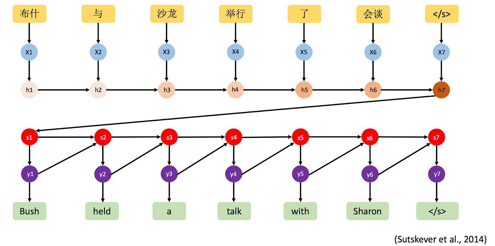

## Table of Contents

## What is a copy mechanism in machine learning?

A copy mechanism in machine learning is a technique used in sequence-to-sequence models, like those used in natural language processing. It helps the model to directly copy parts of the input sequence into the output sequence. This is particularly useful when the model needs to generate text that includes specific words or phrases from the input, such as names, dates, or technical terms. By using a copy mechanism, the model can improve its accuracy and relevance, especially in tasks like summarization, translation, and dialogue systems.

For example, in a summarization task, if the input text contains the name "Albert Einstein," the model can use the copy mechanism to include this name directly in the summary without having to generate it from scratch. This not only saves computational resources but also ensures that important details are preserved. The mechanism works by assigning a probability to each word in the input sequence, indicating how likely it is to be copied to the output. This is often done using an attention mechanism, which helps the model focus on relevant parts of the input when generating the output.

## How does a copy mechanism differ from traditional sequence-to-sequence models?

Traditional sequence-to-sequence models work by taking an input sequence and converting it into an output sequence through an encoder-decoder architecture. The encoder processes the input and creates a fixed-size context vector that captures the essence of the input. The decoder then uses this context vector to generate the output sequence one word at a time. These models rely on their learned vocabulary to generate each word in the output, which can sometimes lead to errors or loss of important details from the input, especially for rare or out-of-vocabulary words.

A copy mechanism enhances traditional sequence-to-sequence models by allowing the model to directly copy words from the input sequence into the output. This is particularly useful for tasks where preserving specific details, like names or numbers, is crucial. The copy mechanism uses an attention mechanism to assign probabilities to each word in the input, determining which words are most likely to be copied to the output. This approach not only improves the accuracy of the model but also helps in handling out-of-vocabulary words more effectively, as the model can simply copy them instead of trying to generate them from its learned vocabulary.

## What are the main components of a copy mechanism?

A copy mechanism in machine learning has three main parts: an encoder, a decoder, and an attention mechanism. The encoder takes in the input text and turns it into a format the model can understand. The decoder then uses this information to create the output text. The attention mechanism helps the model decide which parts of the input are important and should be copied to the output.

The attention mechanism works by looking at each word in the input and giving it a score. This score tells the model how likely it is that the word should be copied to the output. For example, if the input has the name "John Smith," the attention mechanism might give a high score to these words so they are copied directly into the output. This helps the model keep important details from the input in the output.

The copy mechanism also has a special part called the "copy probability." This part decides if a word should be copied from the input or generated from the model's vocabulary. The formula for this can be written as $$ p_{\text{copy}} $$. If $$ p_{\text{copy}} $$ is high, the model is more likely to copy a word from the input. If it's low, the model will try to generate a new word instead. This balance helps the model create accurate and relevant outputs.

## Can you explain the concept of attention in the context of copy mechanisms?

Attention in the context of copy mechanisms helps the model focus on important parts of the input text. It's like when you read a book and pay more attention to certain words or sentences because they are important. In a copy mechanism, the attention mechanism looks at each word in the input and gives it a score. This score tells the model how likely it is that the word should be copied to the output. For example, if the input has a name like "John Smith," the attention mechanism might give a high score to these words so they are copied directly into the output.

The attention mechanism works by calculating a probability for each word in the input. This probability is often called the attention weight, and it helps the model decide which words to focus on. The formula for calculating the attention weight can be written as $$ \alpha_i = \frac{\exp(e_i)}{\sum_{j=1}^{T} \exp(e_j)} $$, where $$ e_i $$ is the score for the i-th word, and T is the total number of words in the input. By using these attention weights, the model can better understand which parts of the input are most relevant and should be copied to the output, making the generated text more accurate and relevant.

## What is the TopK Copy mechanism and how does it work?

The TopK Copy mechanism is a way to make sure that the most important words from the input text are copied into the output. It works by picking the top K words from the input that have the highest attention scores. These scores tell the model which words are most important. For example, if the input has the name "John Smith," and "John" and "Smith" have high attention scores, the TopK Copy mechanism will make sure these words are included in the output.

To do this, the TopK Copy mechanism first calculates the attention weights for each word in the input. The formula for this can be written as $$ \alpha_i = \frac{\exp(e_i)}{\sum_{j=1}^{T} \exp(e_j)} $$, where $$ e_i $$ is the score for the i-th word, and T is the total number of words in the input. After calculating these weights, the mechanism selects the top K words based on these scores. Then, it adds these words to the output, making sure that the most important parts of the input are not missed. This helps the model create more accurate and relevant outputs by focusing on the key information from the input.

## How does the TopK Copy mechanism improve the performance of sequence generation tasks?

The TopK Copy mechanism helps make sequence generation tasks better by focusing on the most important words from the input text. It does this by picking the top K words that have the highest attention scores. These scores tell the model which words are most important. For example, if the input has the name "John Smith," and "John" and "Smith" have high attention scores, the TopK Copy mechanism will make sure these words are included in the output. This helps the model keep the key information from the input, making the generated text more accurate and relevant.

The mechanism works by first calculating the attention weights for each word in the input. The formula for this can be written as $$ \alpha_i = \frac{\exp(e_i)}{\sum_{j=1}^{T} \exp(e_j)} $$, where $$ e_i $$ is the score for the i-th word, and T is the total number of words in the input. After calculating these weights, the mechanism selects the top K words based on these scores. Then, it adds these words to the output, making sure that the most important parts of the input are not missed. By doing this, the TopK Copy mechanism improves the performance of sequence generation tasks by ensuring that the model focuses on the key information from the input.

## What are some common applications of copy mechanisms in natural language processing?

Copy mechanisms are really helpful in natural language processing, especially for tasks like text summarization. Imagine you are writing a summary of a long article. A copy mechanism helps by copying important words or phrases directly from the article into the summary. This way, the summary keeps key information like names or dates, making it more accurate and useful. For example, if the article is about "Albert Einstein," the model can copy his name into the summary instead of trying to come up with it from scratch. This is done using an attention mechanism, which looks at each word in the article and gives it a score. The formula for this can be written as $$ \alpha_i = \frac{\exp(e_i)}{\sum_{j=1}^{T} \exp(e_j)} $$, where $$ e_i $$ is the score for the i-th word, and T is the total number of words in the article. The words with the highest scores are more likely to be copied.

Another common use of copy mechanisms is in machine translation. When translating text from one language to another, it's important to keep specific terms or names the same. For example, if you are translating a sentence about "New York City," the copy mechanism can make sure "New York City" stays the same in the translated text. This helps avoid mistakes and keeps the translation accurate. The copy mechanism works by looking at the input text and deciding which words should be copied to the output. This decision is based on the attention scores, which help the model focus on the most important parts of the input. By using a copy mechanism, the model can handle out-of-vocabulary words better and create more reliable translations.

## What are the challenges faced when implementing a copy mechanism?

One challenge when implementing a copy mechanism is figuring out which words to copy from the input text. This is done using an attention mechanism, which gives each word a score. The formula for this can be written as $$ \alpha_i = \frac{\exp(e_i)}{\sum_{j=1}^{T} \exp(e_j)} $$, where $$ e_i $$ is the score for the i-th word, and T is the total number of words in the input. The model needs to decide if a word should be copied or if it should be generated from its vocabulary. This decision can be tricky because the model needs to balance between copying important details and creating new words that fit the context. If the model copies too much, the output might be too similar to the input and not add much new information. If it copies too little, important details might be left out.

Another challenge is handling out-of-vocabulary words. These are words that the model hasn't seen during training. A copy mechanism helps by copying these words directly from the input, but it still needs to recognize them correctly. This can be difficult if the input text has a lot of unique or rare words. The model also needs to know when to use the copy mechanism and when to generate new words. This decision-making process adds complexity to the model and can affect its performance. If the model doesn't use the copy mechanism well, it might miss important details or produce less accurate outputs.

## How can the effectiveness of a copy mechanism be evaluated?

To evaluate the effectiveness of a copy mechanism, you can look at how well it keeps important words from the input in the output. One way to do this is by using a metric called ROUGE, which measures how similar the output is to a reference summary. If the copy mechanism is working well, the output should include key details like names or numbers from the input, making the ROUGE score higher. Another way to check is by looking at the F1 score, which shows how well the model balances copying and generating new words. If the F1 score is high, it means the model is doing a good job at both tasks.

Another important thing to check is how the model handles out-of-vocabulary words. These are words that the model hasn't seen before. A good copy mechanism should be able to copy these words correctly from the input. You can evaluate this by seeing how often the model correctly copies these words into the output. If the model does this well, it means the attention mechanism, which decides which words to copy, is working correctly. The attention mechanism uses a formula like $$ \alpha_i = \frac{\exp(e_i)}{\sum_{j=1}^{T} \exp(e_j)} $$ to give each word a score, and the words with the highest scores are more likely to be copied. By checking these things, you can see how effective the copy mechanism is in keeping important details and handling new words.

## What are some advanced techniques used to optimize copy mechanisms?

One advanced technique to optimize copy mechanisms is using a pointer-generator network. This network combines the ability to generate new words from its vocabulary with the ability to copy words directly from the input. It uses a special part called the "copy probability," written as $$ p_{\text{copy}} $$, to decide if a word should be copied or generated. If $$ p_{\text{copy}} $$ is high, the model is more likely to copy a word from the input. This helps the model keep important details like names or numbers in the output, making it more accurate. The pointer-generator network also uses an attention mechanism to focus on the most important parts of the input. The formula for this can be written as $$ \alpha_i = \frac{\exp(e_i)}{\sum_{j=1}^{T} \exp(e_j)} $$, where $$ e_i $$ is the score for the i-th word, and T is the total number of words in the input. By using these techniques, the model can better balance copying and generating, leading to more effective outputs.

Another technique is using reinforcement learning to fine-tune the copy mechanism. Reinforcement learning helps the model learn from its mistakes and improve over time. The model gets rewards for creating good outputs and penalties for bad ones. This helps the model figure out the best times to use the copy mechanism and when to generate new words. For example, if the model copies too many words and the output is too similar to the input, it might get a lower reward. On the other hand, if it misses important details, it might also get a lower reward. By adjusting the copy mechanism based on these rewards, the model can become more effective at keeping key information while still creating new content. This makes the model better at tasks like text summarization and machine translation.

## How do copy mechanisms handle out-of-vocabulary words?

Copy mechanisms help models deal with out-of-vocabulary words by copying them directly from the input text into the output. These are words that the model hasn't seen during training, so it can't generate them from its vocabulary. Instead, the copy mechanism uses an attention mechanism to focus on these words and give them a high score. The formula for this can be written as $$ \alpha_i = \frac{\exp(e_i)}{\sum_{j=1}^{T} \exp(e_j)} $$, where $$ e_i $$ is the score for the i-th word, and T is the total number of words in the input. By using these scores, the model can decide which out-of-vocabulary words are important and should be copied to the output, making the generated text more accurate and relevant.

For example, if the input text includes a name like "John Smith," and "John Smith" is an out-of-vocabulary word, the copy mechanism will recognize it as important and copy it into the output. This way, the model doesn't have to guess or generate the name from scratch, which could lead to mistakes. By copying these words, the model can keep key details from the input, even if they are new or rare. This makes the model better at tasks like text summarization and machine translation, where keeping specific terms or names is important.

## What future developments can we expect in the field of copy mechanisms?

In the future, copy mechanisms might get even better at understanding and copying important parts of text. They could use more advanced attention mechanisms to focus on key words and phrases more accurately. For example, researchers might develop new ways to calculate attention scores, like using $$ \alpha_i = \frac{\exp(e_i)}{\sum_{j=1}^{T} \exp(e_j)} $$, to make sure the model copies the right words from the input. This could help the model handle out-of-vocabulary words even better, making the output more accurate and relevant.

Another exciting development could be the use of more sophisticated reinforcement learning techniques to fine-tune copy mechanisms. By learning from rewards and penalties, the model could become better at deciding when to copy and when to generate new words. This could lead to more balanced and effective outputs, especially in tasks like text summarization and machine translation. As these techniques improve, copy mechanisms could become an even more powerful tool in natural language processing, helping models keep important details while creating new content.