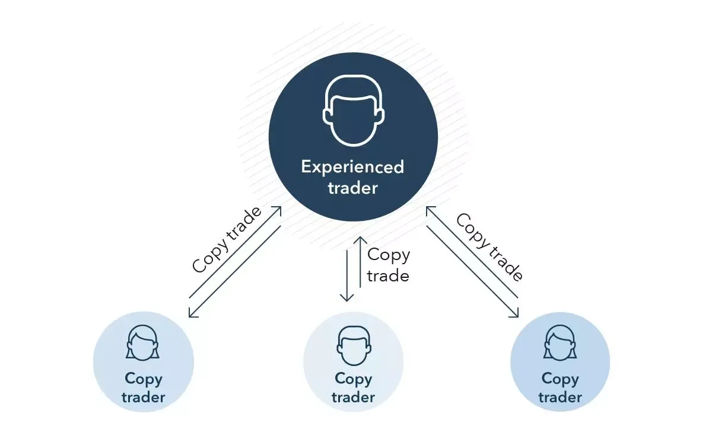

## Table of Contents

## What is copy trading?

Copy trading is a way for people to automatically copy the trades of experienced traders. It's like following a successful friend's investment moves without having to do the research yourself. You choose a trader whose performance you like, and then your account will automatically make the same trades as they do.

This method can be helpful for beginners who don't know much about trading yet. It lets them learn from experienced traders and possibly make money without needing to understand all the details of the market. However, it's important to remember that even if you're copying a good trader, there's still a risk of losing money. So, it's wise to start small and keep an eye on how things are going.

## How does copy trading work?

Copy trading works by letting you follow the trades of experienced traders. You pick a trader you like, and then your trading account automatically does the same trades as them. For example, if the trader you're following buys a certain stock, your account will buy the same stock at the same time. If they sell, you sell too. This way, you can make money if the trader you're copying does well, without having to decide which stocks to buy or sell yourself.

To start copy trading, you need to find a platform that offers this service, like eToro or ZuluTrade. Once you sign up, you can look at different traders' past performance and choose one or more to follow. You decide how much money you want to copy their trades with. It's like setting a budget for how much you're willing to invest in copying that trader. Remember, even if you're copying a good trader, there's always a risk of losing money, so it's smart to start with a small amount and watch how it goes.

## What are the benefits of copy trading for beginners?

Copy trading is great for beginners because it lets them learn from experienced traders without needing to know a lot about the market. When you copy trade, you can see how the experts pick their stocks and make trades. This can help you understand more about trading and the market as you watch and learn from what they do. It's like having a teacher showing you the ropes, but you don't have to ask questions or do homework.

Another big benefit is that copy trading can save you a lot of time. Instead of spending hours researching which stocks to buy or sell, you can just follow a trader who already knows what they're doing. This means you can start trading right away without having to become an expert first. It's a way to get into the market and possibly make money while you're still learning the basics.

## What are the risks associated with copy trading?

Copy trading can be risky because you're putting your money in the hands of someone else. Even if the trader you're following has done well in the past, there's no guarantee they'll keep doing well. The market can change, and what worked before might not work again. If the trader you're copying makes a bad trade, you'll lose money too. So, it's important to remember that copy trading doesn't remove the risk of losing money; it just shifts the decision-making to someone else.

Another risk is that you might not fully understand why the trader is making certain moves. If you don't know the reasons behind their trades, it can be hard to tell if they're making good choices or just getting lucky. Plus, if you're not watching closely, you might miss important changes in the market or in the trader's strategy. It's a good idea to keep an eye on your investments and be ready to stop copying if things start to go wrong.

## How do you choose a trader to copy?

When [picking](/wiki/asset-class-picking) a trader to copy, it's good to look at their past results. Check how well they've done over time, not just in the last few weeks or months. A trader with a steady track record of making money is usually a safer bet than someone who has big wins but also big losses. Also, see how much risk they take. Some traders might make big profits, but they could also lose a lot if things go wrong. You want someone who balances making money with not taking too many risks.

It's also smart to look at how long the trader has been around. Someone who's been trading for a few years is often more reliable than someone who just started. You can also read reviews or feedback from other people who copy them to see if they're happy with the results. And don't forget to think about what kind of trading you want to do. If you're interested in tech stocks, find a trader who focuses on those. Matching your interests with the trader's strategy can make you feel more comfortable with your choice.

## What platforms offer copy trading services?

eToro is a popular platform that lets you copy trade. It's easy to use and you can see a lot of information about the traders you might want to follow. They show you how well the traders have done in the past, how much risk they take, and even what other people think about them. This helps you pick a good trader to copy. eToro is good for beginners because it's simple and you can start with a small amount of money.

Another platform is ZuluTrade. It's also easy to use and you can find traders from all over the world. ZuluTrade lets you see detailed stats about the traders, like how much money they've made and lost, and how often they trade. This can help you decide if a trader is right for you. Both eToro and ZuluTrade are good choices if you want to try copy trading without needing to know a lot about the market.

## How can you manage and monitor your copy trading investments?

To manage and monitor your copy trading investments, it's important to regularly check how the traders you're following are doing. Most platforms like eToro and ZuluTrade have dashboards where you can see how much money you've made or lost, and how the traders are performing. You can also set up alerts to notify you if the trader's performance changes a lot or if there are big moves in the market. This way, you can keep an eye on your investments without having to watch them all the time.

It's also a good idea to review your copy trading strategy every now and then. If a trader you're copying starts doing poorly, you might want to stop copying them and find someone else. You can also adjust how much money you're putting into copying different traders based on how well they're doing. Remember, even though you're copying someone else, it's still your money, so stay involved and make changes if you need to.

## What are the costs involved in copy trading?

When you start copy trading, you need to know about the costs. Most platforms charge a fee for copying trades. This fee can be a percentage of the money you make from copying the trader, or it might be a fixed amount for each trade. For example, eToro charges a fee of 1% on the profits you make from copy trading. Some platforms also have other fees, like a fee for withdrawing money from your account or for not trading enough.

Besides the platform fees, you also need to think about the costs of the trades themselves. When you buy or sell stocks or other investments, there are usually costs like commissions or spreads. These are the differences between the buying and selling prices of an investment. The trader you're copying might also charge a fee for letting you copy their trades. So, it's important to add up all these costs to understand how much you might be spending on copy trading.

## How does copy trading differ from social trading?

Copy trading and social trading are similar because they both let you follow other traders. But copy trading is more automatic. When you copy trade, you choose a trader and your account does the same trades as them without you having to do anything else. It's like setting it and forgetting it. You can start making trades right away based on what the trader you're following does.

Social trading, on the other hand, is more about sharing ideas and learning from each other. It's like being part of a club where traders talk about what they're doing and why. You can see what others are trading and decide if you want to do the same trades. But you have to make the trades yourself. Social trading can help you learn more about the market and make better decisions, but it's not as automatic as copy trading.

## What strategies can be used to optimize copy trading performance?

To optimize your copy trading performance, start by picking the right traders to follow. Look at their past results, but don't just focus on the big wins. A good trader usually has a steady track record and doesn't take too many risks. Also, check how long they've been trading. Someone who's been around for a while is often more reliable. You can also read reviews from other people who copy them to see if they're happy with the results. And make sure the trader's strategy matches what you're interested in, like tech stocks or something else.

Once you've chosen your traders, keep an eye on how they're doing. Most platforms let you set up alerts to tell you if the trader's performance changes a lot or if there are big moves in the market. This way, you can adjust your investments if you need to. If a trader starts doing poorly, you might want to stop copying them and find someone else. Also, think about how much money you're putting into each trader. You can change this based on how well they're doing. By staying involved and making smart changes, you can make the most out of copy trading.

## How can you evaluate the performance of traders you are copying?

To evaluate the performance of traders you are copying, start by looking at their past results. Check how much money they've made over time, not just in the last few weeks or months. A good trader usually has a steady track record of making profits and doesn't take too many risks. You can also see how much risk they take by looking at the size of their wins and losses. If a trader makes big profits but also has big losses, they might be too risky for you. Also, read reviews or feedback from other people who copy them to see if they're happy with the results.

Another way to evaluate a trader's performance is by keeping an eye on how they're doing now. Most platforms let you set up alerts to notify you if the trader's performance changes a lot or if there are big moves in the market. This way, you can stay updated and make changes if you need to. If a trader starts doing poorly, you might want to stop copying them and find someone else. Also, think about how long the trader has been around. Someone who's been trading for a few years is often more reliable than someone who just started. By regularly checking their performance and staying involved, you can make sure you're copying the right traders.

## What are advanced techniques for managing a copy trading portfolio?

To manage a copy trading portfolio well, you can start by spreading your money across different traders. This way, if one trader does poorly, you won't lose all your money. Look for traders who focus on different types of investments, like stocks, [forex](/wiki/forex-system), or cryptocurrencies. This can help balance out your risks. Also, keep an eye on how much money you're putting into each trader. If one trader is doing really well, you might want to put more money into copying them. But if another trader starts doing badly, you can take some money out and find a better one to copy.

Another advanced technique is to use stop-loss orders. These are like safety nets that automatically stop you from losing too much money. If a trade goes against you, a stop-loss order can close it before you lose more than you're comfortable with. Also, keep checking the performance of the traders you're copying. Most platforms let you set up alerts to tell you if something big happens, like a trader's performance changing a lot or big moves in the market. By staying involved and making smart changes, you can make your copy trading portfolio work better for you.

## References & Further Reading

[1]: Bjorøy, T., Johansen, M., Mikkelsen, H., & Yosuf, S. ["Developing a Profitable Tradeworld: Copy Trading and Its Impacts."](https://www.njg.geologi.no/images/NJG_articles/NGT_77_4_269-287.pdf) SSRN Electronic Journal, 2019.

[2]: Vasanth, K. ["A Comparative Analysis of Algorithmic Trading and Copy Trading."](https://algotradinglib.com/en/pedia/c/comparative_analysis.html) arXiv preprint arXiv:2007.15060, 2020.

[3]: ["The Copy Trading Guide"](https://www.bullwaves.com/blog-news/the-ultimate-guide-to-copy-trading) by Oyetrade — A comprehensive guide on choosing the right copy trading platform and strategies.

[4]: Koulajian, P. ["Exploring Trading Systems and Strategies with Copy Trading."](https://dl.acm.org/doi/book/10.5555/2528248) Eurekahedge, 2018.

[5]: Pardo, R. ["The Evaluation and Optimization of Trading Strategies,"](https://onlinelibrary.wiley.com/doi/book/10.1002/9781119196969) 2nd Edition. Wiley, 2008. 

[6]: Szynowski, M. ["Copy Trading: Opportunities and Risks."](https://victormatara.com/copy-trading-platforms-risks-and-rewards/) ResearchGate, 2019.