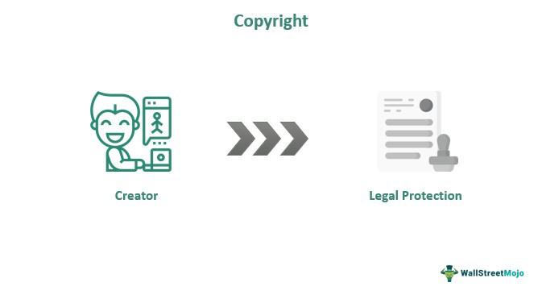

In an era defined by technological advancements, understanding the nuances of copyright types and intellectual property is crucial, particularly in innovative fields like algorithmic trading. Algorithmic trading utilizes computer algorithms to automate trades based on pre-defined criteria, revolutionizing the financial markets by increasing trading speed and efficiency. Central to this process are the algorithms themselves, which are sophisticated sets of rules designed to analyze financial data and execute trades at speeds beyond human capability.

The intellectual property embedded in these algorithms is of substantial value. Protecting this intellectual property is vital for maintaining a competitive edge in the market. Companies invest significant resources in developing proprietary trading strategies, which rely extensively on these complex algorithms. The unauthorized use or replication of such algorithms can lead to substantial financial losses and diminish the competitive advantage gained through innovation.

This article examines various types of copyrights and addresses key intellectual property concerns inherent in algorithmic trading. It highlights the importance of safeguarding algorithmic IP to ensure that companies can protect their investments and sustain their innovative potential. By navigating the complex landscape of copyright and intellectual property law, organizations can better shield their intellectual assets and remain competitive in an ever-evolving technological environment.

## Table of Contents

## Understanding Copyright

Copyright is a legal framework designed to protect the rights of creators over their original works. This protection grants creators control over the reproduction, distribution, and adaptation of their works, ensuring that they can benefit from their intellectual contributions. By assigning exclusive rights to authors and inventors for a predetermined period, copyright serves as a crucial mechanism to foster creativity and innovation.

The primary function of copyright law is to prevent the unauthorized use or duplication of a creator’s work. It ensures that creators receive recognition and potential financial rewards for their inventions, thereby incentivizing further creative endeavors. Typically, the duration of these exclusive rights varies by jurisdiction but often lasts for the lifetime of the creator plus a set number of years—commonly 70 years after the creator's death.

Copyright law encompasses a wide range of creative works. Traditional examples include literature, music, and the fine arts. However, in the modern digital age, the scope of copyright has expanded to include software, which is crucial in fields such as algorithmic trading. Algorithms used for trading can be viewed as a form of software, thus qualifying for copyright protection. This means that the specific code or structure written to develop such algorithms is shielded from unauthorized use or replication.

It's essential for creators to understand what aspects of their work can be copyrighted. While the expression of an idea, such as the text of a program code, is protectable, the underlying idea itself is not. Therefore, algorithmic creators must focus on how they implement these ideas in code to safeguard their intellectual property adequately.

In summary, understanding copyright law is vital for those who create original works, including those developing software algorithms. This legal framework enables creators to defend their works against unauthorized use, thus preserving their ability to innovate and contribute to technological advancement.

## Intellectual Property in Algorithmic Trading

Algorithms used for trading can be of immense value, primarily due to their potential to execute transactions with speed and precision that far exceed human capabilities. Protecting these algorithms as intellectual property (IP) is crucial in maintaining a competitive advantage in the financial markets. Trading algorithms, often a closely guarded asset, are typically protected as trade secrets or through the patenting of unique algorithmic methods.

Trade secrets are one effective means of protection, relying on the secrecy of the information to provide a competitive edge. The fundamental principle is to ensure that details of the algorithm are not disclosed to the public or competitors. The implementation of strict internal controls and confidentiality agreements with employees and partners is essential to maintaining this secrecy. Furthermore, robust digital security protocols, such as encryption and access controls, are necessary to safeguard against cyber threats and unauthorized access.

Patents provide another layer of protection by granting exclusive rights to the holder to use the patented technology for a specified period. However, the decision to patent must be carefully considered, as it requires the disclosure of the algorithm. This disclosure can potentially allow competitors to understand the underlying mechanism, albeit without the right to use it without permission. The complexity and innovative step involved in the algorithm often determine the success of a patent application, as patents are only granted for novel and non-obvious inventions.

Beyond trade secrets and patents, classifying algorithms as intellectual property ensures that proprietary trading systems remain shielded against competitors. This classification aids in legally enforcing the rights against misappropriation or infringement. It is vital to note that the legal framework for IP protection concerning algorithms can be complex and varies by jurisdiction. Thus, organizations often engage legal experts specializing in IP law to navigate these complexities and devise comprehensive protection strategies.

Ultimately, safeguarding algorithmic intellectual property not only preserves a firm's competitive advantage but also fosters innovation by ensuring that the rewards for creativity and technical skill are duly recognized and protected.

## Types of Copyright and Their Application

Copyright is a critical element in the protection of original works, providing legal coverage primarily to artistic, literary, and intellectual properties. For [algorithmic trading](/wiki/algorithmic-trading), the most pertinent copyrights are those related to software, as they can help safeguard the complex code and processes that underpin trading algorithms. Copyright law grants developers exclusive rights to reproduce, distribute, and create derivative works from their original creations, thereby protecting the unique software solutions used for automated trading.

Understanding the distinctions between copyrights, trademarks, and patents is essential for comprehensively protecting intellectual property. Copyrights protect the expression of ideas in a tangible form, but not the underlying ideas themselves. This is crucial for software, where the code is protected, but the algorithmic logic or method might require additional safeguards. Trademarks, on the other hand, protect symbols, names, and slogans used to identify goods or services. They are less relevant to algorithm protection but can be important for the branding of trading services. Patents protect new inventions or discoveries, including novel processes, and play a significant role in safeguarding unique trading algorithms.

In algorithmic trading, patents and copyrights offer a structured framework for intellectual property protection. Patents can protect algorithmic processes explicitly if they meet the criteria of novelty, non-obviousness, and industrial applicability. This requires an approach focusing on the innovative aspects of the algorithmic method rather than the software code itself. Software copyrights are useful for protecting the specific code and implementation of trading systems. They ensure that the code cannot be copied or distributed without authorization, thus preserving the algorithm's competitive advantage in the market.

## Legal Challenges in Protecting Algorithms

As algorithms continue to grow in complexity, they present unique legal challenges, particularly in defining ownership and articulating the scope of protection under intellectual property (IP) law. Algorithms are a compilation of mathematical concepts and logical reasoning, elements that are often difficult to categorize as intellectual property in a traditional sense. This complexity raises questions about who owns an algorithm—whether it is the coder, the company that employs them, or even the data or technology used in formulating the algorithm.

Current intellectual property laws are often insufficient or ambiguous when applied to sophisticated algorithmic creations. Traditional IP frameworks, such as copyright and patents, struggle to accommodate the dynamic and iterative nature of algorithms. Copyright law primarily protects the expression of ideas and not the ideas themselves, raising challenges in protecting algorithms that inherently embody mathematical concepts rather than original literary expression. Patents could serve as a potential safeguard; however, demonstrating the novelty and non-obviousness required for patent approval might be exceptionally challenging for algorithms that incrementally evolve over time.

The legal processes to ensure algorithmic protection can be convoluted, often necessitating novel interpretations and adaptations of existing laws. The nuance involved in assessing whether a particular algorithm sufficiently meets the criteria for patentability or if its code qualifies for copyright protection can be substantial. Legal professionals must often navigate between ensuring a strong legal posture and maintaining flexibility to adapt to rapidly changing technology.

Additionally, algorithms pose challenges in terms of trade secret protection. While trade secrets can theoretically safeguard an algorithm, maintaining its secrecy can be practically difficult in collaborative or networked environments. Unauthorized access, inadvertent disclosures, or legal challenges requiring the divulgence of a trade secret can easily compromise protection strategies.

Looking ahead, future advancements in IP law may need to evolve substantially to provide adequate coverage for novel technologies such as algorithmic trading systems. This evolution might include developing bespoke legal instruments or frameworks that specifically cater to digital creations and algorithmic innovations. Legislative bodies might need to collaborate with tech experts to draft laws that encompass the unique characteristics and requirements of these technologies.

As algorithmic trading continues to advance technologically, legal frameworks must adapt accordingly. Staying current with changes in IP law and adopting flexible yet robust protection strategies remain essential for organizations seeking to safeguard their algorithmic innovations effectively.

## Strategies for Protecting Algorithmic IP

Effective protection of algorithmic intellectual property (IP) in trading involves deploying multiple strategies that address both legal and technical dimensions. One of the primary methods is classifying algorithms as trade secrets. By keeping key components of an algorithm confidential, organizations leverage the legal framework that protects trade secrets, discouraging unauthorized use or reproduction. This requires strict internal protocols to ensure that only individuals with a need-to-know basis can access the algorithm’s details.

Another approach is patenting unique algorithmic processes. While the patent system can offer robust protection, it requires public disclosure of the algorithm, potentially exposing sensitive elements. Thus, organizations must carefully evaluate which aspects of an algorithm can be patented without compromising proprietary advantages. Patent protection is particularly useful for algorithms with novel processes that meet the standard criteria for patentability: novelty, non-obviousness, and industrial applicability.

Confidentiality agreements or non-disclosure agreements (NDAs) complement these legal strategies by legally binding employees, contractors, and partners to maintain the secrecy of the algorithmic details. These agreements are essential in scenarios where individuals have access to sensitive information, thus mitigating risks associated with insider threats.

Securing algorithmic IP also requires addressing the technical aspects of cybersecurity. Implementation of robust security measures such as zero-trust environments ensures that access to the algorithm is continuously verified, reducing the risk of unauthorized access. Zero-trust architecture operates under the principle of “never trust, always verify,” mandating rigorous authentication protocols for users and devices attempting to access the system.

Additionally, digital watermarks can be embedded within code to trace unauthorized dissemination or modifications. These watermarks act like a signature, allowing organizations to track the origin of any publicly leaked algorithm.

To comprehensively protect algorithmic investments, organizations must establish clear protocols for IP-related disputes. This involves creating mechanisms for detecting and responding to potential breaches or infringements swiftly and efficiently. Regular audits and compliance checks ensure that all security and legal frameworks are adhered to, minimizing the risk of IP theft or misuse.

Organizations should foster an overarching culture of IP awareness, providing training and resources to employees about the importance of protecting sensitive intellectual property. By adopting these comprehensive protection strategies, organizations can secure their competitive advantage and safeguard their innovations in algorithmic trading.

## Conclusion

The complex landscape of copyright and intellectual property law is increasingly pivotal for those looking to secure algorithms used in trading. As technology rapidly advances, the laws governing these domains must remain adaptable to effectively shield cutting-edge innovations in algorithmic trading. The evolution of algorithmic trading systems demands a legal framework that can keep pace with technological developments, ensuring that these valuable algorithms remain secure from unauthorized use and theft.

To this end, it is essential for stakeholders involved in algorithmic trading to maintain an up-to-date understanding of intellectual property laws and the specific challenges they face. By doing so, they can ensure that their intellectual assets are protected within the bounds of current legal standards. Organizations that stay informed about legislative changes and adopt comprehensive IP protection strategies can substantially reduce the risk of infringement and enhance their competitive edge.

Effective strategies include the classification of algorithms as trade secrets, pursuing patents for unique algorithmic processes, and deploying robust security protocols. By integrating these strategies, organizations can create a robust IP protection framework that mitigates potential risks associated with algorithmic theft or misuse.

In conclusion, the evolving field of algorithmic trading highlights the necessity for adaptable legal protections and proactive strategies. As the industry shifts, so must the approaches used to protect the digital assets at its core. Vigilant attention to intellectual property laws, coupled with strategic protective measures, will ensure that innovations in algorithmic trading remain effectively safeguarded.

## References & Further Reading

[1]: Bergstra, J., Bardenet, R., Bengio, Y., & Kégl, B. (2011). ["Algorithms for Hyper-Parameter Optimization."](https://dl.acm.org/doi/10.5555/2986459.2986743) Advances in Neural Information Processing Systems 24.

[2]: ["Advances in Financial Machine Learning"](https://www.amazon.com/Advances-Financial-Machine-Learning-Marcos/dp/1119482089) by Marcos Lopez de Prado

[3]: ["Evidence-Based Technical Analysis: Applying the Scientific Method and Statistical Inference to Trading Signals"](https://www.amazon.com/Evidence-Based-Technical-Analysis-Scientific-Statistical/dp/0470008741) by David Aronson

[4]: ["Machine Learning for Algorithmic Trading"](https://github.com/PacktPublishing/Machine-Learning-for-Algorithmic-Trading-Second-Edition) by Stefan Jansen

[5]: ["Quantitative Trading: How to Build Your Own Algorithmic Trading Business"](https://books.google.com/books/about/Quantitative_Trading.html?id=j70yEAAAQBAJ) by Ernest P. Chan