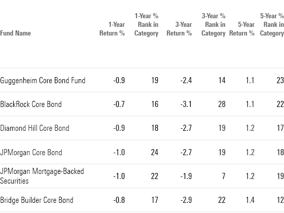

## Table of Contents

## What is a core bond fund?

A core bond fund is a type of investment fund that mainly invests in high-quality bonds. These bonds are usually from governments or big companies that are less likely to fail to pay back their debts. The goal of a core bond fund is to provide steady income to investors while keeping their money safe. It's like a safe place to put your money if you want it to grow a little bit without taking big risks.

These funds often focus on bonds that have medium-term lengths, which means they will pay back the money in a few years, not right away or very far in the future. By doing this, they try to balance the risk and reward. Core bond funds are popular with people who want to keep their money safe but still earn some interest. They are a good choice for someone who wants to invest without worrying too much about losing their money.

## Why might long-term investors consider core bond funds?

Long-term investors might consider core bond funds because they offer a stable and predictable source of income. Unlike stocks, which can go up and down a lot, bonds in these funds usually pay interest regularly. This can help investors feel more secure about their money over many years. It's like getting a steady paycheck from your investments, which can be comforting when planning for the future.

Also, core bond funds can help balance out the risk in an investment portfolio. If a long-term investor has a lot of money in stocks, adding core bond funds can make things less risky. When the stock market goes down, bond funds often don't lose as much value. This means that even if some investments are doing poorly, the bond funds can help keep the overall value of the portfolio more stable. This balance is important for long-term investors who want to grow their money without too much worry.

## What are the key characteristics of core bond funds?

Core bond funds are mainly made up of high-quality bonds. These bonds come from governments or big, stable companies that are very likely to pay back what they owe. Because of this, core bond funds are seen as safe places to invest. They focus on bonds that will pay back the money in a few years, not right away or very far in the future. This helps the funds balance risk and reward, making them a good choice for people who want to keep their money safe while still [earning](/wiki/earning-announcement) some interest.

Another important thing about core bond funds is that they give investors a steady income. The bonds in these funds usually pay interest regularly, which can be really helpful for long-term investors. It's like getting a regular paycheck from your investments. Also, core bond funds can help make an investment portfolio less risky. If someone has a lot of money in stocks, adding core bond funds can help balance things out. When the stock market goes down, bond funds often don't lose as much value, which helps keep the overall value of the portfolio more stable.

## How do core bond funds differ from other types of bond funds?

Core bond funds are different from other types of bond funds because they focus on high-quality bonds. These bonds are from governments or big, stable companies that are very likely to pay back what they owe. This makes core bond funds safer than other bond funds, like high-yield bond funds, which invest in riskier bonds that offer higher interest rates but also have a higher chance of not paying back the money.

Another way core bond funds differ is in their investment goals. Core bond funds aim to provide a steady income and keep the money safe. They usually invest in bonds that will pay back the money in a few years, balancing risk and reward. On the other hand, other types of bond funds, like short-term bond funds, might focus on bonds that pay back the money very soon, or long-term bond funds might focus on bonds that pay back the money far in the future. Each type of bond fund has a different strategy and level of risk.

Overall, core bond funds are a good choice for people who want to keep their money safe while still earning some interest. They are less risky than high-yield bond funds and provide a more stable income compared to other bond funds. This makes them a popular choice for long-term investors who want to balance their investment portfolio and reduce overall risk.

## What are the risks associated with investing in core bond funds?

Even though core bond funds are seen as safe, they still have some risks. One risk is that the value of the bonds in the fund can go down if interest rates go up. When interest rates rise, new bonds that are issued will pay more interest, making the older bonds in the fund less valuable. This can cause the price of the fund to drop, which means investors might lose money if they need to sell their shares at that time.

Another risk is that the companies or governments that issued the bonds might not be able to pay back the money they owe. This is called default risk, but it's lower in core bond funds because they invest in high-quality bonds. Still, it's something to think about. Also, inflation can be a problem. If the cost of things goes up a lot, the interest you earn from the bonds might not be enough to keep up with those rising costs, which means your money won't go as far in the future.

## How can core bond funds be used to diversify an investment portfolio?

Core bond funds can help make an investment portfolio more balanced. When you have a lot of money in stocks, adding core bond funds can lower the overall risk. Stocks can go up and down a lot, but core bond funds usually stay more stable. This means that if the stock market goes down, the bond funds might not lose as much value. This can help keep the value of your whole portfolio more steady, which is good for long-term investors who want to grow their money without too much worry.

Another way core bond funds help with diversification is by providing a steady income. While stocks might pay dividends, they can be unpredictable. Core bond funds, on the other hand, usually pay interest regularly. This steady income can be really helpful for people who need a reliable source of money over time. By mixing stocks and core bond funds, investors can have both the chance for their money to grow and a more predictable income stream, making their investment portfolio more balanced and less risky.

## What are the top core bond funds available for long-term investors?

Some of the top core bond funds for long-term investors are the Vanguard Total Bond Market Index Fund (VBTLX) and the Fidelity Total Bond Fund (FTBFX). These funds are popular because they invest in a wide range of high-quality bonds, which helps spread out the risk. The Vanguard fund is known for its very low costs, which means more of the money you earn stays in your pocket. The Fidelity fund, on the other hand, is managed by experts who try to pick the best bonds to invest in, which can be good for people who want a bit more active management.

Another good choice is the PIMCO Income Fund (PIMIX). This fund is managed by a well-known company that has a lot of experience with bonds. It aims to give investors a higher income than many other core bond funds while still keeping the risk low. For those looking for a more socially responsible option, the iShares [ESG](/wiki/esg-investing) Aware U.S. Aggregate Bond [ETF](/wiki/etf-trading-strategies) (EAGG) is a good pick. This fund invests in bonds that meet certain environmental, social, and governance standards, which can be important for investors who care about making a positive impact with their money.

All of these funds can be good choices for long-term investors because they focus on high-quality bonds that provide a steady income and help balance out the risk in a portfolio. By choosing one of these funds, investors can feel more secure about their money over many years, knowing that they are investing in a way that is both safe and potentially rewarding.

## How do fees and expenses impact the returns of core bond funds?

Fees and expenses can make a big difference in how much money you get back from core bond funds. When you invest in a fund, you usually have to pay fees to the company that manages it. These fees can be a percentage of the money you have in the fund, and they are taken out of your returns. So, if a fund earns 5% in a year but charges a 1% fee, you only get to keep 4%. Over many years, these fees can add up and take a big chunk out of your earnings.

It's important to look at the fees when choosing a core bond fund. Some funds, like index funds, have very low fees because they just follow a set list of bonds without much extra work. Other funds, managed by people who pick the bonds, might have higher fees because they need to pay those people. By choosing a fund with lower fees, you can keep more of the money the fund earns, which can make a big difference in the long run.

## What is the historical performance of core bond funds compared to other investment options?

Historically, core bond funds have provided steady but moderate returns compared to other investment options like stocks. Over the long term, stocks have generally offered higher returns than core bond funds. For example, the average annual return for the S&P 500, which is a big group of stocks, has been around 10% over the last few decades. In contrast, core bond funds might give you returns of about 4-5% a year. This difference means that if you put money in stocks, it could grow a lot more over many years, but it's also riskier because stock prices can go up and down a lot.

However, core bond funds have an important role in an investment portfolio because they are less risky than stocks. When the stock market goes down, core bond funds often don't lose as much value. This can help keep your money safer during tough times. For example, during the 2008 financial crisis, while many stocks lost a lot of value, core bond funds stayed more stable. This stability is why many long-term investors like to have some money in core bond funds, even if they don't grow as fast as stocks. It helps balance out the risk and gives a more predictable income.

## How should interest rate changes affect the strategy for investing in core bond funds?

When interest rates go up, it can make the value of the bonds in core bond funds go down. This happens because new bonds that are issued will pay more interest, making the older bonds in the fund less valuable. If you need to sell your shares in the fund at that time, you might get less money back. So, if you think interest rates will go up soon, you might want to wait a bit before putting more money into core bond funds. It's good to think about how long you plan to keep your money in the fund. If you can leave it there for a long time, changes in interest rates might not matter as much because you can wait for the bonds to pay back the money they owe.

On the other hand, when interest rates go down, the value of the bonds in core bond funds usually goes up. This is because the older bonds in the fund are paying more interest than the new ones that are being issued. This can be a good time to put more money into core bond funds because you might be able to sell your shares for more later. But remember, nobody can predict interest rates perfectly, so it's smart to keep some money in core bond funds no matter what. They can help balance out the risk in your investment portfolio and give you a steady income, which is important for long-term planning.

## What advanced strategies can be used to optimize returns from core bond funds?

One advanced strategy to optimize returns from core bond funds is called laddering. This means you buy bonds that will pay back the money at different times. Some might pay back in a year, some in two years, and others in three or more years. By doing this, you can take advantage of different interest rates over time. When a bond pays back, you can reinvest that money in a new bond with a higher [interest rate](/wiki/interest-rate-trading-strategies) if rates have gone up. This can help you earn more money over the long run without taking on too much risk.

Another strategy is to use active management. Instead of just buying a bunch of bonds and holding them, you can choose a core bond fund that has people actively [picking](/wiki/asset-class-picking) which bonds to buy and sell. These managers try to pick the best bonds to invest in, which can lead to higher returns. They might focus on bonds that are likely to do well if interest rates change or if the economy does something unexpected. This can be more expensive because you have to pay the managers, but if they do a good job, it can be worth it.

## How can investors evaluate the quality and management of a core bond fund?

To evaluate the quality and management of a core bond fund, investors should first look at the fund's historical performance. This means checking how well the fund has done over the past few years compared to other similar funds. You can find this information in the fund's fact sheet or on financial websites. It's also important to look at the fund's credit quality. Core bond funds should invest in high-quality bonds, so you want to see that most of the bonds in the fund have high ratings from agencies like Moody's or Standard & Poor's. This tells you how likely the bonds are to pay back the money they owe.

Another thing to consider is the management team. Find out who is in charge of picking the bonds for the fund and what their experience is. A good management team will have a strong track record and a clear strategy for choosing bonds. You can usually find this information in the fund's prospectus or on the company's website. Also, look at the fund's fees and expenses. Lower fees mean more of the money the fund earns stays in your pocket. By considering these factors, you can get a good idea of whether a core bond fund is well-managed and likely to perform well in the future.

## References & Further Reading

[1]: ["The Intelligent Investor: The Definitive Book on Value Investing. A Book of Practical Counsel"](https://www.amazon.com/Intelligent-Investor-Definitive-Investing-Essentials/dp/0060555661) by Benjamin Graham

[2]: ["Investments"](https://www.financestrategists.com/wealth-management/investments/) by Zvi Bodie, Alex Kane, and Alan J. Marcus

[3]: ["Fixed Income Analysis"](https://en.wikipedia.org/wiki/Fixed_income_analysis) by Barbara S. Petitt and Jerald E. Pinto

[4]: ["Advances in Financial Machine Learning"](https://www.amazon.com/Advances-Financial-Machine-Learning-Marcos/dp/1119482089) by Marcos Lopez de Prado

[5]: ["Quantitative Trading: How to Build Your Own Algorithmic Trading Business"](https://www.amazon.com/Quantitative-Trading-Build-Algorithmic-Business/dp/1119800064) by Ernest P. Chan

[6]: ["Fixed-Income Securities: Valuation, Risk, and Risk Management"](http://pietroveronesi.org/teaching/FIS/StudentSolutionManual.pdf) by Pietro Veronesi

[7]: Fama, E. F., & French, K. R. (1993). ["Common risk factors in the returns on stocks and bonds."](https://www.sciencedirect.com/science/article/pii/0304405X93900235) Journal of Financial Economics, 33(1), 3-56. 

[8]: ["Algorithmic Trading and DMA: An introduction to direct access trading strategies"](https://archive.org/details/algorithmictradi0000john) by Barry Johnson