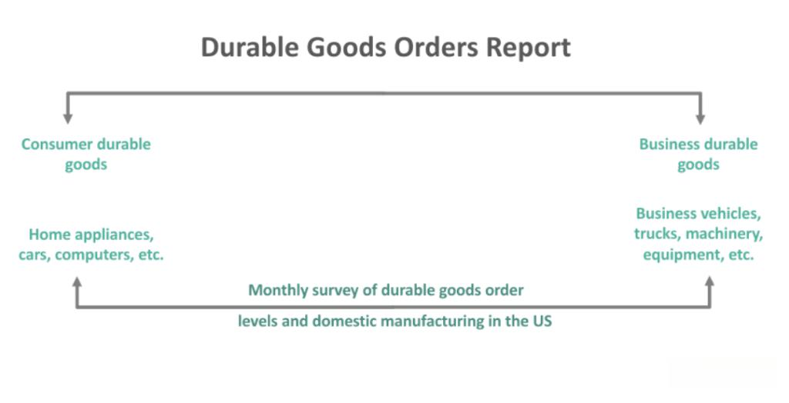

Economic indicators serve as essential tools for understanding market trends and making informed decisions in finance, policy-making, and business investments. These indicators provide crucial insights into the economic health of a country, reflecting vital aspects such as production output, employment levels, and consumer spending. By analyzing these metrics, economists and traders can forecast future economic conditions and adjust their strategies accordingly.

Durable goods, a significant category of economic indicators, play a pivotal role in economic analysis. Durable goods are items with an extended product life, often exceeding three years. These include appliances, vehicles, and machinery, representing substantial consumer and business investments. The demand for durable goods is closely linked to economic cycles, as consumers and businesses are more likely to invest in these high-value products during periods of economic stability and growth.



Core durable goods orders, which exclude volatile transportation equipment, provide a more stable and representative picture of the underlying demand for these goods. This metric is crucial for evaluating economic conditions because it strips out the noise from large, infrequent orders, thereby offering a clearer view of longer-term economic trends.

The relevance of durable goods data extends to algorithmic trading, where automated systems use historical and real-time economic indicators to execute trades. In this context, core durable goods orders can signal shifts in consumer and business confidence, subsequently affecting stock prices, bond yields, and currency values. Traders employing algorithmic strategies can capitalize on these data releases by identifying patterns and building predictive models to enhance their trading performance.

The purpose of this article is to explore how durable goods economic indicators, particularly core durable goods orders, impact trading strategies. By understanding these metrics, investors and traders can better predict market movements and make more informed investment decisions.

## Table of Contents

## Understanding Durable Goods

Durable goods are a category of consumer products characterized by their longevity and ability to withstand wear and tear over an extended period. Typically, durable goods have a life expectancy of three years or more. These goods are usually bought infrequently due to their durability and often require a significant investment. Common examples include automobiles, household appliances, furniture, and electronics. The economic importance of durable goods is notable, as their production and purchase strongly influence economic cycles and are often regarded as a measure of economic health.

The distinction between durable and non-durable goods lies primarily in their usage lifespan. Non-durable goods, such as food, clothing, and paper products, are consumed quickly and need frequent repurchasing. Conversely, durable goods represent longer-term investments, impacting various economic sectors, including manufacturing, retail, and financial services. The dichotomy between these goods is crucial in economic analysis, where fluctuations in durable goods orders can indicate shifts in consumer behavior and broader economic trends.

Durable goods play a significant role in consumer confidence and business investment. Purchases of durable goods often require substantial financial commitment, reflecting consumer optimism about future economic conditions. Thus, an increase in durable goods orders typically signifies a positive outlook, suggesting that consumers feel secure in their financial stability. Similarly, businesses view durable goods data as a vital indicator of future demand, informing investment decisions and capacity planning. As a result, variations in durable goods orders can influence corporate strategy, stock valuations, and economic forecasting.

Overall, durable goods serve as a critical barometer for understanding economic dynamics, providing valuable insights into consumer confidence, business investment trends, and overall economic stability.

## Core Durable Goods Orders

Core durable goods orders represent a subset of the broader category of durable goods, which are tangible items expected to last for three years or more, such as appliances, vehicles, and machinery. The distinction between core durable goods orders and total durable goods orders is the exclusion of transportation equipment, primarily aircraft, from the former. This exclusion is important due to the highly volatile nature of transportation equipment orders, which can significantly fluctuate from month to month and potentially distort the overall analysis of the data.

The exclusion of transportation equipment provides a smoother, more stable metric that better reflects the underlying economic trends. By focusing on core durable goods orders, analysts can gain a clearer picture of the manufacturing sector's health and gauge future business investment trends.

Core durable goods orders are crucial for economic analysis, offering several key takeaways. They serve as a leading indicator of economic activity, providing insights into manufacturers' future production plans and supply chain dynamics. An increase in core orders generally signals business optimism and anticipated economic expansion, as businesses are more likely to invest in equipment and infrastructure when they expect growth.

Moreover, core durable goods orders are often compared with the total durable goods orders to assess broader economic conditions. Total durable goods orders include all categories, so significant disparities between total and core orders may indicate substantial shifts in transportation-related industries or other specific sectors. For example, a sharp rise in total orders driven by aircraft purchases might not reflect an overall expansion in manufacturing activity. Conversely, a robust growth in core orders without a corresponding increase in total orders suggests a more generalized strength in manufacturing excluding transportation.

Overall, core durable goods orders are instrumental in understanding long-term economic trends, providing integral data that feed into economic forecasting and influencing policymaking and investment strategies.

## Role of Durable Goods Orders in Economic Analysis

Durable goods orders serve as a critical barometer of economic health and potential growth. These orders pertain to long-lasting items such as appliances, vehicles, and machinery, whose purchase typically signifies a substantial and long-term financial commitment from consumers and businesses. An increase in durable goods orders generally signals confidence in economic stability and future growth, reflecting both consumer willingness to invest in long-term goods and businesses’ intention to expand production capabilities.

The impact of durable goods data on GDP and economic forecasting is significant. As a component of the GDP calculation under the expenditure approach, durable goods orders contribute to personal consumption expenditures and private domestic investment. A sustained rise in durable goods orders suggests potential upswing in GDP, given that durable goods often lead to increased spending in related sectors through supply chain dynamics. Economists and policymakers closely monitor these figures as they refine GDP forecasts throughout the year.

Durable goods orders also play a pivotal role in predicting business investment trends. Businesses interpret increased orders as a demand indicator, prompting capital investment in new equipment and facilities to scale up production capabilities. Conversely, declines in such orders signal potential economic slowdowns, causing businesses to restrain investment. Economists studying shifts in these orders can gauge upcoming business cycle phases, directing forecasts for corporate performance and broader economic [momentum](/wiki/momentum).

The influence of durable goods orders extends into financial markets, especially impacting stocks, bonds, and [forex](/wiki/forex-system) markets. For equities, robust durable goods orders suggest potential revenue growth for companies, especially those in manufacturing and industrial sectors, prompting bullish stock market reactions. In bond markets, higher-than-expected durable goods orders could trigger inflation concerns, potentially increasing interest rates and impacting bond yields negatively. In forex markets, these orders serve as a leading indicator of economic vitality; positive figures can attract foreign investment, appreciating the domestic currency.

Durable goods orders, therefore, are not merely data points but vital economic indicators, integrating insights across economic health, GDP metrics, investment trends, and financial market dynamics.

## Algorithmic Trading and Durable Goods Orders

Algorithmic trading, often referred to as algo trading, involves the use of computer programs and algorithms to execute trades at speeds and frequencies that are impossible for human traders. These automated systems are designed to follow a predefined set of rules based on timing, price, quantity, or any mathematical model. The primary objective of [algorithmic trading](/wiki/algorithmic-trading) is to leverage technology to optimize trading decisions, minimize transaction costs, and capitalize on market opportunities.

Economic indicators play a crucial role in shaping algorithmic trading strategies. These indicators provide critical insights into the economic environment and are used to predict market movements. Among the multitude of economic indicators, core durable goods orders are particularly significant. This metric excludes volatile items like transportation equipment and offers a refined view of economic demand and manufacturing activity. Algorithmic trading systems integrate such indicators to make informed predictions about market trends, allowing traders to position themselves advantageously.

Incorporating core durable goods orders into trading algorithms involves analyzing the data to predict economic performance. For instance, a noticeable increase in core durable goods orders might indicate a robust manufacturing sector, suggesting potential for growth in related stocks. Conversely, a decrease could signal economic slowing, prompting strategies such as short selling.

Trading algorithms can be built to react to changes in core durable goods orders data. A basic example is:

```python
def trading_decision(core_orders_data, threshold):
    if core_orders_data > threshold:
        return "Buy"
    elif core_orders_data < threshold:
        return "Sell"
    else:
        return "Hold"

# Example usage:
core_orders_data = 5.7  # Example data (in percentage change)
threshold = 3.0
decision = trading_decision(core_orders_data, threshold)
print(decision)  # Outputs: Buy
```

This simplistic Python function evaluates whether the changes in core durable goods orders surpass a defined threshold, triggering a buy or sell order.

Complex strategies may involve statistical models like regression analysis or [machine learning](/wiki/machine-learning) to predict future market directions based on historical durable goods data. These methods can refine the decision process further and incorporate additional variables for more robust predictions.

For example, a machine learning model could analyze past core durable goods orders alongside other economic indicators to predict stock market reactions. Such models help traders exploit data-driven insights, maximizing the probability of favorable trades.

Ultimately, the integration of core durable goods orders into algorithmic trading strategies enhances the ability of traders to anticipate market shifts and reacts in a timely manner. The precise and systematic nature of algo trading, combined with strategic data incorporation, underscores its efficacy in navigating financial markets.

## Case Studies in Algo Trading with Durable Goods Data

**Example 1: Stock market reaction to durable goods data releases**

The release of durable goods data can have a significant impact on stock markets, especially for industries closely tied to manufacturing and heavy goods. For instance, a higher-than-expected increase in core durable goods orders is often interpreted as a sign of economic strength. This can lead to a rise in stock prices, particularly for companies in the manufacturing sector. Conversely, if the data shows a decrease, it can signal a potential slowdown, causing stock prices to drop. Algorithmic trading systems take advantage of these fluctuations by using predefined rules and models to predict market behavior based on durable goods data releases. For example, an algorithm may be designed to buy stocks of manufacturing companies when durable goods orders exceed expectations, potentially yielding profitable trades.

**Example 2: Forex market dynamics influenced by durable goods metrics**

In the foreign exchange market, durable goods data can affect currency values due to its implications for the overall economic outlook. A robust durable goods report may indicate a growing economy, leading to expectations of higher interest rates. This, in turn, can attract foreign investment, increasing demand for domestic currency and subsequently driving up its value. Algorithmic trading in the forex market can be programmed to monitor durable goods orders and execute trades based on currency pair movements anticipated from the data. An algorithm might, for instance, buy the U.S. dollar against the euro if the durable goods data suggests a strong U.S. economic performance, expecting the U.S. dollar to appreciate.

**Success stories of algorithmic trading capitalizing on durable goods insights**

Various hedge funds and trading firms have successfully utilized durable goods data within their algorithmic trading strategies. These success stories typically involve high-frequency trading algorithms that can process economic data releases in real-time, executing trades within milliseconds. This speed advantage allows them to capitalize on the immediate market reactions following the durable goods data announcement. Some firms have reported significant returns by consistently incorporating this economic indicator into their models, enhancing their predictive accuracy and trading efficiency.

**Lessons learned from these case studies**

The examination of these case studies reveals several lessons for traders and investors. Firstly, the importance of quick data interpretation and execution cannot be overstated in algorithmic trading. Developing robust models that accurately forecast market responses to durable goods data is crucial. Additionally, diversifying the algorithm's inputs by integrating various economic indicators can improve trade decision robustness and reduce risks. The influence of durable goods data on both stock and forex markets underscores the necessity for traders to be well-versed in multiple asset classes and adaptable to market dynamics. Understanding these key takeaways can aid in refining trading strategies and achieving more consistent outcomes.

## Conclusion

Durable goods play a pivotal role in economic analysis by serving as a barometer for assessing economic health and future growth prospects. As durable goods are typically large-ticket items that require significant investment, they are sensitive to changes in economic conditions. Consequently, shifts in durable goods orders are often a precursor to broader economic trends. They provide insights into consumer confidence and business investment intentions, which are crucial for economists and investors aiming to predict market movements.

Core durable goods orders, which exclude the often volatile transportation component, offer a clearer view of underlying economic activities. By focusing on this metric, analysts can more accurately gauge business capital expenditures and predict subsequent economic trends. Core durable goods orders are thus a valuable tool for market prediction, offering predictive power in assessing economic stability and growth.

In the context of algorithmic trading, durable goods data serves as a significant input for developing sophisticated trading algorithms. These orders can signal turning points that, if appropriately timed, allow for optimized investment strategies. Algorithms designed to capitalize on these signals can execute trades with precision, exploiting market inefficiencies and maximizing returns. For example, a Python script utilizing durable goods data might look like this:

```python
import pandas as pd
import numpy as np

def calculate_moving_average(data, period=12):
    return data.rolling(window=period).mean()

# Example usage with durable goods data (mock dataset)
durable_goods_data = pd.Series([100, 105, 110, 115, 120, 125, 130, 135, 140, 145, 150])
moving_average = calculate_moving_average(durable_goods_data)
```

Leveraging durable goods data for informed investment decisions should be a priority for traders aiming to harness the potential of economic indicators. Core durable goods orders, in particular, aid investors in identifying trends that might affect market valuations and investment strategies. The ever-evolving nature of global markets necessitates continuous monitoring and analysis of these indicators to remain competitive.

Encouragement is warranted for further research and consistent tracking of durable goods orders. Such efforts will refine existing trading models and foster the development of more sophisticated strategies. By deepening our understanding of the relationships between durable goods data and market dynamics, we can enhance the robustness of economic forecasting and investment decision-making processes.

## References & Further Reading

[1]: ["US Durable Goods Orders"](https://www.census.gov/manufacturing/m3/adv/current/index.html) on Investopedia

[2]: ["Understanding Core Capital Goods"](https://www.investopedia.com/terms/c/capitalgoods.asp) – Federal Reserve Bank of St. Louis

[3]: ["Algorithmic Trading: Winning Strategies and Their Rationale"](https://www.wiley.com/en-us/Algorithmic+Trading%3A+Winning+Strategies+and+Their+Rationale-p-9781118460146) by Ernest P. Chan

[4]: Erenburg, G., & Webber, D. W. (1995). ["Stock Market Reaction to Unexpected Changes in Interest Rates."](https://www.semanticscholar.org/paper/The-Relationship-between-Public-and-Private-Erenburg/40d71823e72709d7916b656953273ceafd0f5044) Journal of Financial Research, 18(2), 205-219.

[5]: ["The Economic Meaning of Durable Goods Orders"](https://www.investopedia.com/terms/d/durable-goods-orders.asp) – Macro Musings Blog

[6]: ["Durable Goods Manufacturing"](https://www.census.gov/manufacturing/m3/adv/current/index.html) - U.S. Bureau of Labor Statistics

[7]: Paraskevopoulos, D. A., & Balikcioglu, E. (2017). ["The Impact of Macroeconomic News Announcements on Stock Market Activity"](https://www.sciencedirect.com/science/article/pii/S0378426621002119) – Journal of Applied Economics and Business Research