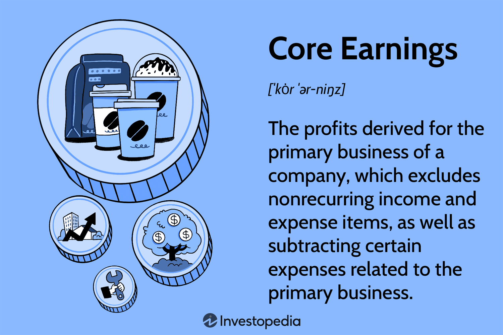

## Table of Contents

## What are core earnings?

Core earnings are the profits a company makes from its main business activities, without including any one-time or unusual gains or losses. This helps investors see how well the company is doing in its regular operations. For example, if a company sells furniture, its core earnings would come from selling furniture, not from selling a piece of land it owned.

To calculate core earnings, you start with the company's total earnings and then take away any income or expenses that don't come from its main business. This might include things like profits from selling off assets, costs from lawsuits, or earnings from investments that aren't part of the company's primary work. By focusing on core earnings, investors can get a clearer picture of the company's ongoing financial health and performance.

## How do core earnings differ from reported earnings?

Core earnings and reported earnings are two ways to look at a company's profits, but they show different things. Reported earnings, also called net income, are the total profits a company makes after all its expenses are subtracted. This includes everything the company earns and spends, even if some of those earnings or expenses are unusual or one-time events. For example, if a company sells a building, the money from that sale would be part of its reported earnings.

Core earnings, on the other hand, focus only on the profits from the company's main business activities. They leave out any one-time or unusual gains or losses that don't reflect the company's regular operations. So, if that same company sells a building, the money from the sale wouldn't be included in core earnings because selling buildings isn't part of its main business. By looking at core earnings, investors can see how well the company is doing in its day-to-day work, without being distracted by unusual events.

## Why are core earnings important for investors?

Core earnings are important for investors because they show how well a company is doing in its main business. When investors look at core earnings, they can see if the company is making money from what it does every day, without being confused by one-time events like selling a building or winning a lawsuit. This helps investors understand the true health of the company's regular operations.

By focusing on core earnings, investors can make better decisions about whether to buy, hold, or sell a company's stock. If a company's core earnings are growing, it might mean the company is getting better at its main business and could be a good investment. On the other hand, if core earnings are shrinking, it might be a warning sign that the company's main business is struggling, even if its reported earnings look good because of unusual gains.

## What are the components of core earnings?

Core earnings are made up of the money a company makes from its main business activities. This includes the revenue from selling products or services that are part of the company's everyday work. For example, if a company makes cars, the money it gets from selling cars would be part of its core earnings. It also includes the costs that are directly related to making and selling those products or services, like the cost of materials, wages for workers, and other expenses needed to keep the business running smoothly.

To find core earnings, you start with the company's total earnings and then take away any income or expenses that don't come from its main business. This means leaving out things like profits from selling off assets, costs from lawsuits, or earnings from investments that aren't part of the company's primary work. By focusing on these main business activities, core earnings give a clear picture of how well the company is doing in its regular operations, without being affected by unusual or one-time events.

## How can core earnings be calculated?

To calculate core earnings, you start with the company's total earnings, which is also called net income. This is the money the company makes after all its expenses are subtracted. Then, you take away any income or expenses that don't come from the company's main business. For example, if a company sells furniture, you would not include money from selling a piece of land or costs from a lawsuit in the core earnings. You only keep the money from selling furniture and the costs that go with making and selling that furniture.

By doing this, you get a number that shows how much money the company is making from its everyday work. This helps investors see if the company is doing well in its main business, without being confused by one-time events. If a company's core earnings are growing, it might mean the company is getting better at what it does every day. If core earnings are shrinking, it could be a sign that the company's main business is struggling, even if its total earnings look good because of unusual gains.

## Can you provide an example of a company's core earnings?

Let's say there's a company called "Happy Bikes" that makes and sells bicycles. In one year, Happy Bikes made $1 million from selling bikes, but they also sold an old factory for $200,000. Their total earnings, or net income, for the year was $1.2 million. However, the money from selling the factory is not part of their main business of making and selling bikes. So, to find their core earnings, we take away the $200,000 from the factory sale. That leaves us with core earnings of $1 million, which comes just from selling bikes.

Looking at Happy Bikes' core earnings helps investors see how well the company is doing at making and selling bikes, without being confused by the one-time sale of the factory. If Happy Bikes' core earnings are growing over time, it means they are getting better at their main business. But if their core earnings are going down, even if their total earnings look good because of the factory sale, it could be a warning sign that their bike business is not doing well.

## What adjustments are typically made to arrive at core earnings?

To find core earnings, you start with a company's total earnings and make some changes. You take away any money that comes from things the company doesn't do every day. For example, if a company sells a building or wins a lawsuit, that money isn't part of their main business. So, you take it out of the total earnings. You also take away any costs that don't come from the main business, like the cost of a lawsuit or the cost of closing a factory.

After you make these changes, what you have left is the money the company makes from its everyday work. This helps people who want to invest in the company see how well it's doing at its main job. If a company's core earnings are going up, it means they are getting better at what they do every day. If core earnings are going down, it might mean their main business is having problems, even if their total earnings look good because of other things.

## How do accounting standards affect the calculation of core earnings?

Accounting standards are rules that companies follow when they record and report their money. These rules can affect how a company calculates its core earnings. For example, some standards might tell a company to include certain costs in their main business earnings, while others might say to leave them out. This can change what the company counts as core earnings. If the rules are different, it can make it hard to compare the core earnings of companies from different countries or industries.

Even though accounting standards can affect core earnings, many investors still find them useful. They use these standards to make sure the core earnings numbers are fair and correct. By following the same rules, companies can show their main business earnings in a clear way. This helps investors see if a company is doing well at its main job, no matter what the accounting rules are.

## What are the limitations of using core earnings as a financial metric?

Core earnings can be helpful, but they have some problems. One big problem is that different people might have different ideas about what counts as "core" business activities. This can make it hard to compare core earnings from one company to another. Also, companies might try to make their core earnings look better by leaving out certain costs or income that they think are not part of their main business. This can make the numbers less trustworthy.

Another problem is that accounting rules can change how core earnings are calculated. Different countries or industries might have different rules, which can make it hard to compare companies fairly. Even though core earnings try to show how well a company is doing at its main job, these differences can make it confusing. Investors need to be careful and understand these limitations when they look at core earnings to make good decisions.

## How do analysts use core earnings in their valuation models?

Analysts use core earnings to get a clear picture of how well a company is doing at its main job. They use this number to see if the company is making more money from its everyday work over time. This helps them figure out if the company is growing and if it's a good investment. By focusing on core earnings, analysts can ignore one-time events like selling a building or winning a lawsuit, which don't show the true health of the company's main business.

In their valuation models, analysts often use core earnings to calculate important numbers like the price-to-earnings ratio (P/E ratio). This ratio helps them see if the company's stock price is a good deal compared to how much money the company is making from its main business. If core earnings are growing, it might mean the company's stock is worth more. But if core earnings are shrinking, it could be a warning sign that the company's main business is struggling, even if its total earnings look good because of other things.

## What are some common misconceptions about core earnings?

One common misconception about core earnings is that they are the same as total earnings or net income. People sometimes think that if a company's total earnings are high, its core earnings must be high too. But core earnings only count the money a company makes from its main business, not from one-time events like selling a building or winning a lawsuit. So, a company might have high total earnings but low core earnings if most of its money comes from those one-time events.

Another misconception is that core earnings are always easy to figure out and compare between companies. But different people might have different ideas about what counts as a company's main business. This can make it hard to compare core earnings from one company to another. Also, accounting rules can change how core earnings are calculated, making it even harder to compare companies from different countries or industries. So, even though core earnings can be a helpful way to see how well a company is doing at its main job, they can be tricky to use correctly.

## How have core earnings been used in financial scandals or controversies?

Core earnings have been part of some financial scandals because companies can sometimes change what they count as core earnings to make their business look better than it really is. For example, a company might leave out certain costs or include income that they say is part of their main business, even if it's not. This can trick investors into thinking the company is doing well when it's not. One famous case was with WorldCom in the early 2000s. They made their core earnings look higher by counting money from one-time events as part of their main business. This made their stock price go up, but it was all a lie.

Another example is with Enron, where they used complex accounting tricks to hide their real earnings. They made their core earnings look good by moving debt off their [books](/wiki/algo-trading-books) and counting income from deals that weren't really part of their main business. This made it hard for investors to see that the company was in trouble. These scandals show that while core earnings can be a useful way to see how well a company is doing, they can also be used to hide the truth if companies are not honest about what they include in their numbers.

## What is the Role of Financial Analysis in Evaluating Core Earnings?

Financial analysis plays a critical role in evaluating core earnings, offering deeper insights into a company's operational efficiency. Core earnings, which focus on the profits derived exclusively from primary business activities, provide an essential benchmark for assessing the fundamental health of an enterprise. Unlike traditional GAAP earnings, core earnings strip away the effects of nonrecurring items, such as asset sales or restructuring costs, offering a clearer view of sustained profitability.

### Understanding Long-Term Viability

Assessing a company’s core earnings is fundamental in determining the sustainability of its business model. By focusing solely on core activities, analysts can more accurately predict future performance and identify potential red flags that may not be apparent when reviewing GAAP earnings. This refined perspective is particularly useful for long-term investors seeking stable returns.

### Enhanced Techniques in Financial Analysis

Two primary techniques in financial analysis benefit significantly from a focus on core earnings: valuation analysis and relative value analysis. 

1. **Valuation Analysis**: This method evaluates a company's worth by discounting its forecasted earnings to present value. Core earnings provide a more stable and reliable measure for these forecasts, particularly in volatile industries where extraordinary items frequently skew GAAP results. One common model is the Discounted Cash Flow (DCF) analysis, which uses a company's core earnings as a proxy for cash flows. The formula for calculating DCF is:
$$
   DCF = \sum \frac{C_t}{(1+r)^t}

$$

   Where:
   - $C_t$ represents core earnings at time $t$,
   - $r$ is the discount rate,
   - $t$ symbolizes the time period.

2. **Relative Value Analysis**: This approach involves comparing a company's valuation metrics, such as the price-to-earnings (P/E) ratio, to those of peers within the industry. By utilizing core earnings, this analysis provides a more accurate comparison, reducing the impact of non-operational factors. This adjustment helps determine if a company is overvalued or undervalued relative to its true business performance.

### Financial Analysis Tools

Several financial tools and models incorporate core earnings to provide comprehensive assessments:

- **Financial Ratios**: Key ratios like Return on Assets (ROA) and Return on Equity (ROE) calculated using core earnings offer a more authentic depiction of a company’s efficiency in using its resources. 

- **Earnings Quality Analysis**: This tool examines the portion of earnings derived from high-quality, sustainable activities, enhancing traditional financial statement analysis. Core earnings are central to this process, as they exclude anomalies and provide a clearer quality assessment.

- **Trend Lines and Projections**: Analysts leverage historical core earnings data to project future earnings trends. This method helps in forecasting potential growth patterns and identifying cyclical challenges.

These tools underscore the importance of core earnings in facilitating robust and accurate financial analysis, vital for making sound investment decisions. Financial professionals rely on these methodologies to mitigate risks and capitalize on opportunities, ensuring they deliver optimal value to stakeholders. By maintaining a focus on core earnings, analysts and investors can better navigate the complexities of the financial markets and make informed decisions that align with their strategic goals.

 to Algorithmic Trading

Algorithmic trading, often referred to as algo trading, is a method of executing trades using pre-programmed instructions accounting for variables such as time, price, and [volume](/wiki/volume-trading-strategy). These algorithms rely heavily on quantitative models and mathematical computations to make decisions, facilitating trading strategies that would be impracticable for human traders to execute manually due to the rapid speed and vast data quantities involved.

At its core, [algorithmic trading](/wiki/algorithmic-trading) aims to optimize trade execution by automating processes, which increases the speed at which trades are conducted while also reducing transaction costs. This automation is achieved through the implementation of complex mathematical models that can process large data sets far more efficiently than human traders. The automated nature of algo trading can lead to significant improvements in trading accuracy and efficiency, primarily by eliminating human error and emotional bias.

One of the fundamental aspects of algorithmic trading is its reliance on various data inputs and the use of statistical analysis to identify trading opportunities. This involves leveraging different types of data, including historical price patterns, trading volume, correlations between different financial instruments, and even external data such as economic indicators and news events. By doing so, algorithms can execute orders at optimal times, ensuring that trades are carried out at the best possible prices available.

A typical algorithmic trading strategy might include the use of statistical [arbitrage](/wiki/arbitrage), [momentum](/wiki/momentum)-based strategies, or index fund rebalancing. For example, a momentum-based strategy would involve buying stocks that have shown an upward price movement with high volume and selling those that have underperformed, capitalizing on the continuation of existing trends.

The increasing sophistication of these algorithms, driven by advancements in [machine learning](/wiki/machine-learning) and [artificial intelligence](/wiki/ai-artificial-intelligence), has further elevated the potential of algorithmic trading. Machine learning models enable algorithms to learn from historical data and evolve their trading strategies over time, enhancing their capability to adapt to changing market conditions and optimize trading outcomes.

$$
\text{Profit}_{t} = \sum_{i=1}^{n} (\text{Price}_{\text{sale}, i} - \text{Price}_{\text{purchase}, i} \times \text{Volume})
$$

In summary, the importance of algorithmic trading in today's financial markets cannot be overstated. It has fundamentally transformed how trading is conducted, offering increased efficiencies and precision. For market participants, understanding the mechanisms and potential of algo trading is essential for navigating the modern trading environment effectively.

## References & Further Reading

[1]: ["Core Earnings: New Data and Evidence"](https://www.hbs.edu/ris/Publication%20Files/RSW_SSRN_20201120_672bd334-4c7d-4aa4-b20f-3610e4f7046b.pdf) by Ethan Rouen, Journal of Financial Analysts, CFA Institute.

[2]: ["The Basics of Algorithmic Trading"](https://www.investopedia.com/articles/active-trading/101014/basics-algorithmic-trading-concepts-and-examples.asp) by Adam Hayes, Investopedia.

[3]: ["Advances in Financial Machine Learning"](https://www.amazon.com/Advances-Financial-Machine-Learning-Marcos/dp/1119482089) by Marcos Lopez de Prado.

[4]: ["Quantitative Trading: How to Build Your Own Algorithmic Trading Business"](https://www.amazon.com/Quantitative-Trading-Build-Algorithmic-Business/dp/1119800064) by Ernest P. Chan.

[5]: ["Algorithmic Trading: Winning Strategies and Their Rationale"](https://www.amazon.com/Algorithmic-Trading-Winning-Strategies-Rationale-ebook/dp/B00CY5HC0U) by Ernest P. Chan.

[6]: ["Machine Learning for Asset Managers"](https://ia802907.us.archive.org/31/items/machine_learning_for_asset_managers/machine_learning_for_asset_managers.pdf) by Marcos Lopez de Prado.

[7]: ["Artificial Intelligence in Finance"](https://hbr.org/2023/08/what-the-finance-industry-tells-us-about-the-future-of-ai) by Tomaso Aste, Supriya Kapoor, Leandro Zunino, Elsevier Journal of Financial Markets.