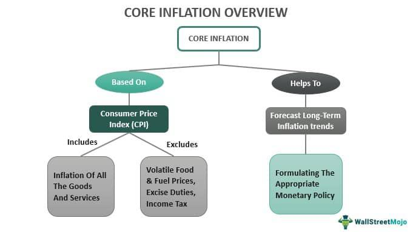

## Table of Contents

## What is core inflation?

Core inflation is a measure of inflation that excludes certain items that can have temporary price swings. These items usually include food and energy, like gasoline, because their prices can go up and down a lot due to things like weather or political events. By leaving these out, core inflation gives a clearer picture of the long-term trend of inflation in an economy.

Understanding core inflation helps policymakers and economists see the underlying rate of inflation more clearly. It helps them make better decisions about things like interest rates and economic policies. For example, if core inflation is rising, it might mean that the general level of prices is going up more steadily, which could lead to changes in monetary policy to keep the economy stable.

## How is core inflation measured?

Core inflation is measured by taking the overall inflation rate and removing the prices of certain items that can change a lot from month to month. Usually, this means taking out the prices of food and energy. These items can go up or down quickly because of things like bad weather or problems with oil supplies. By not including them, economists get a better idea of the steady, long-term changes in prices.

To calculate core inflation, economists use a price index like the Consumer Price Index (CPI) or the Personal Consumption Expenditures (PCE) price index. They start with the total CPI or PCE, which includes all sorts of goods and services. Then, they subtract the parts that come from food and energy. What's left is the core inflation rate, which shows how prices are changing without the ups and downs of those specific items.

## Why is core inflation important for economic policy?

Core inflation is important for economic policy because it helps policymakers understand the true, long-term trend of inflation in the economy. By taking out the prices of things like food and energy, which can change a lot from month to month, core inflation gives a clearer picture of how prices are changing over time. This is helpful because it shows what's really happening with inflation, without the noise from short-term price swings.

Policymakers, like those at central banks, use core inflation to make decisions about things like interest rates. If core inflation is going up, it might mean that prices are rising more steadily across the economy, which could lead to higher interest rates to cool things down. On the other hand, if core inflation is low, it might mean the economy needs a boost, and interest rates could be lowered to encourage spending and investment. By focusing on core inflation, policymakers can make better choices to keep the economy stable and growing.

## What items are typically excluded from core inflation?

Core inflation leaves out things like food and energy. These things can have big price changes because of things like bad weather or oil problems. By not counting them, we get a better idea of how prices are changing over time without the ups and downs.

This helps people who make economic rules see the real trend of inflation. They can make better choices about things like interest rates to keep the economy stable. If they only looked at all prices, the short-term changes could make it hard to see what's really happening with inflation.

## How does core inflation differ from headline inflation?

Core inflation and headline inflation are two ways to measure how prices are changing in the economy. Core inflation leaves out the prices of food and energy because these can change a lot from month to month. This helps give a clearer picture of the steady, long-term trend of inflation. On the other hand, headline inflation includes everything, so it shows the total change in prices, including the ups and downs of food and energy.

Policymakers and economists often look at core inflation to make decisions about things like interest rates because it shows the underlying trend of inflation. If core inflation is going up, it might mean prices are rising more steadily across the economy, and they might need to do something to cool things down. Headline inflation is useful too, but it can be more affected by short-term changes, like a sudden jump in gas prices, which might not show the real long-term trend of inflation.

## What are the common methods used to calculate core inflation?

Core inflation is calculated by taking away the prices of food and energy from the total inflation rate. This is because food and energy prices can go up and down a lot because of things like weather or oil problems. By not counting these, we can see the real, long-term changes in prices. Economists use price indexes like the Consumer Price Index (CPI) or the Personal Consumption Expenditures (PCE) price index to do this. They start with the total CPI or PCE, which includes all goods and services. Then, they take out the parts that come from food and energy. What's left is the core inflation rate.

Another way to calculate core inflation is by using something called the trimmed mean. This method looks at all the price changes in the CPI or PCE and takes out the biggest increases and decreases. This helps to get rid of any unusual price changes that might not show the real trend of inflation. By trimming these extremes, the trimmed mean gives a good picture of how prices are changing over time without the ups and downs of specific items. Both methods help economists and policymakers see the underlying rate of inflation more clearly, which is important for making good economic decisions.

## How can core inflation impact monetary policy decisions?

Core inflation is really important for people who make decisions about money, like central bankers. They look at core inflation to understand how prices are changing over time without the ups and downs of food and energy prices. If core inflation is going up, it might mean that prices are rising more steadily across the economy. This could make central bankers decide to raise interest rates to slow things down and keep prices from going up too fast.

On the other hand, if core inflation is low, it might mean the economy needs a boost. Central bankers might then lower interest rates to encourage people to spend and invest more. By focusing on core inflation, they can make better choices to keep the economy stable and help it grow. This way, they can avoid making decisions based on short-term changes that might not show the real trend of inflation.

## What are the limitations of using core inflation as an economic indicator?

Core inflation has some limitations that make it less perfect as an economic indicator. One big problem is that it leaves out food and energy prices, which are really important for many people. These things can affect how much money people have to spend on other things. If food and energy prices go up a lot, people might have less money to spend on other stuff, even if core inflation says prices are stable.

Another issue is that core inflation might not show the whole picture of the economy. It focuses on long-term trends, but sometimes short-term changes can be important too. For example, if there's a sudden jump in gas prices, it can affect a lot of things in the economy, even if core inflation doesn't show it. So, while core inflation is useful, it's not the only thing policymakers should look at when making decisions about the economy.

## How does core inflation relate to long-term economic stability?

Core inflation helps keep the economy stable over the long term by showing how prices are changing without the ups and downs of food and energy. When central bankers look at core inflation, they can see if prices are going up steadily across the economy. If core inflation is rising, it might mean that things are getting more expensive over time, and they might need to raise interest rates to slow things down. This helps keep inflation from getting out of control, which can make the economy unstable.

On the other hand, if core inflation is low, it could mean the economy needs a boost. Central bankers might lower interest rates to encourage people to spend and invest more. By focusing on core inflation, they can make better decisions to keep the economy growing steadily. This way, they can avoid big swings in prices that could hurt the economy in the long run.

## Can core inflation help predict future inflation trends?

Core inflation can help predict future inflation trends because it shows the steady, long-term changes in prices without the ups and downs of food and energy. By looking at core inflation, economists can see if prices are going up steadily across the economy. If core inflation is rising, it might mean that prices will keep going up in the future. This can help central bankers and policymakers plan ahead and make decisions to keep inflation under control.

However, core inflation isn't perfect for predicting future inflation because it leaves out important things like food and energy. These things can affect how much money people have to spend on other stuff, and sudden changes in their prices can still impact the economy. So, while core inflation is a good tool for understanding long-term trends, it should be used along with other indicators to get a full picture of where inflation might be headed.

## What are the global variations in the calculation and use of core inflation?

Different countries might calculate and use core inflation in slightly different ways. In the United States, core inflation is often measured by taking away food and energy prices from the Consumer Price Index (CPI) or the Personal Consumption Expenditures (PCE) price index. This helps economists and the Federal Reserve see the long-term trend of inflation without the short-term ups and downs of food and energy. In Europe, the European Central Bank uses a similar method but might also exclude other items like alcohol and tobacco to get a clearer picture of core inflation.

Even though the basic idea is the same, how core inflation is used can vary from one country to another. In some places, central banks might focus more on core inflation when deciding on interest rates, while in others, they might look at other measures too. For example, in Japan, the Bank of Japan pays close attention to core inflation but also considers other factors like the overall CPI and economic growth. This shows that while core inflation is a useful tool around the world, how it's calculated and how much it's relied on can differ based on what each country needs to keep its economy stable.

## How do economic theorists critique the concept and application of core inflation?

Some economic theorists say that core inflation is not a perfect way to measure how prices are changing in the economy. They think it's a problem that core inflation leaves out food and energy prices. These things can really affect how much money people have to spend on other stuff. If food and energy prices go up a lot, people might have less money for other things, even if core inflation says prices are stable. So, these theorists believe that looking only at core inflation might miss important parts of what's happening in the economy.

Other critics argue that core inflation can be too focused on the long term and might not show the whole picture of the economy. They say that short-term changes, like a sudden jump in gas prices, can still have a big impact on the economy. If policymakers only look at core inflation, they might miss these important short-term changes and make decisions that don't help the economy as much as they could. So, while core inflation is useful, these theorists think it should be used along with other measures to get a full understanding of inflation and make the best economic decisions.

## What is Inflation: A Key Economic Indicator?

Inflation is a crucial economic indicator representing the rate at which the general level of prices for goods and services increases, eroding purchasing power over time. It is typically measured by indices such as the Consumer Price Index (CPI), which tracks the average change in prices paid by consumers over a specified period. The formula for calculating the inflation rate based on CPI is:

$$
\text{Inflation Rate} = \left( \frac{\text{CPI in the Current Period} - \text{CPI in the Previous Period}}{\text{CPI in the Previous Period}} \right) \times 100
$$

Several factors contribute to inflation, including demand-pull inflation, which occurs when demand for goods and services exceeds supply, leading to higher prices. Cost-push inflation arises when production costs increase, prompting businesses to pass on these costs to consumers through higher prices. Additionally, built-in inflation stems from adaptive expectations where workers demand higher wages, and businesses increase prices, perpetuating a cycle of rising wage and price levels.

Inflation impacts the economy significantly. It diminishes purchasing power, meaning consumers and businesses can buy less with the same amount of money as prices increase. This effect can erode savings, as the real value of money declines. Furthermore, inflation influences interest rates; central banks may increase rates to curb inflationary pressure, making borrowing more expensive and potentially slowing economic growth. Conversely, low inflation may lead to lower interest rates, encouraging borrowing and spending.

Economic policy decisions are heavily swayed by inflation trends. Central banks, such as the Federal Reserve or European Central Bank, use monetary policy tools to manage inflation, striving for price stability and sustainable economic growth. For instance, if inflation is high, a central bank might raise interest rates to reduce money supply and cool down the economy.

In conclusion, understanding inflation and its causes is pivotal for evaluating economic health and making informed policy decisions. It has wide-ranging effects on purchasing power, interest rates, and ultimately, the overall economic landscape, making it a critical focus for economists, policymakers, and investors alike.

## What is the Significance of Core Inflation?

Core inflation is a measure of the long-term trend in the price level that excludes certain volatile categories from overall inflation metrics. It differs from headline inflation, which encompasses the total change in prices for a basket of goods and services, including all the volatile components such as food and energy prices. Headline inflation is often measured by the Consumer Price Index (CPI), which reflects the weighted average of prices of a basket of consumer goods and services.

The exclusion of certain components in core inflation is guided by their [volatility](/wiki/volatility-trading-strategies) and susceptibility to temporary shocks, which can obscure the underlying trends in price levels. Typically, core inflation excludes food and energy prices because these categories can exhibit sharp price fluctuations due to factors like weather events, geopolitical tensions, or supply chain disruptions. By focusing on the more stable prices in the economy, core inflation provides a clearer and more stable basis for economic policy and decision-making. 

For example, the formula for calculating core inflation can be simplified as:

$$
\text{Core Inflation} = \text{CPI} - (\text{Food Prices} + \text{Energy Prices})
$$

The significance of monitoring core inflation lies in its ability to offer a better gauge of persistent price changes, excluding transitory shocks that might distort economic perceptions. Policymakers, such as those in central banks, rely heavily on core inflation to guide monetary policy. Since their principal aim is to manage inflation expectations and stabilize the economy over the long term, focusing on core inflation helps them set appropriate interest rates without being misled by short-term disturbances.

Moreover, core inflation is crucial in quantitative models used by economists to forecast future inflation and assess economic health. It aids in understanding the fundamental inflationary pressures that the economy is subjected to, enabling more robust policy responses. Investors and traders also focus on core inflation figures, as they can influence expectations about central bank actions such as [interest rate](/wiki/interest-rate-trading-strategies) adjustments, which subsequently sway financial markets.

In summary, core inflation serves as a critical component in the analysis of economic conditions, providing a more reliable picture of long-term inflationary trends by filtering out the noise associated with volatile price movements. This careful distinction between core and headline inflation facilitates more informed policy and investment decisions, contributing to economic stability and growth.

## References & Further Reading

[1]: Bryan, M. F., & Cecchetti, S. G. (1993). ["The Consumer Price Index as a Measure of Inflation."](https://www.nber.org/papers/w4505) Economic Review, Federal Reserve Bank of Cleveland, Issue Q II, Pages 15-24.

[2]: ["Understanding Core Inflation"](https://www.investopedia.com/terms/c/coreinflation.asp) by Robert Rich and Charles Steindel, European Central Bank Occasional Paper Series, No. 53, February 2006.

[3]: Goodhart, C., & Hofmann, B. (2005). ["The Phillips Curve, the IS Curve and Monetary Transmission: Evidence for the US and the Euro area."](https://www.semanticscholar.org/paper/The-Phillips-Curve%2C-the-IS-Curve-and-Monetary-for-Goodhart-Hofmann/87dc42abbd4e0df8648bb922db98be1a4f5ef61f) Review of Economic Studies, 66(4), 715-739.

[4]: ["Advances in Financial Machine Learning"](https://www.amazon.com/Advances-Financial-Machine-Learning-Marcos/dp/1119482089) by Marcos Lopez de Prado

[5]: Stock, J. H., & Watson, M. W. (2007). ["Why Has U.S. Inflation Become Harder to Forecast?"](https://www.princeton.edu/~mwatson/papers/Stock_Watson_JMCB_2007.pdf) Journal of Money, Credit and Banking, 39(1), 3-33.

[6]: ["Algo Bots and the Law: Technology, Automation, and the Regulation of Algorithmic Trading"](https://www.amazon.com/Algo-Bots-Law-Technology-Derivatives/dp/1316616533) by Gregory Scopino.

[7]: Apel, M., & Jansson, P. (1999). ["Systematic Non-Use of Information in the Phillips Curve."](https://www.mdpi.com/2079-8954/7/3/33) International Journal of Central Banking, Q3.

