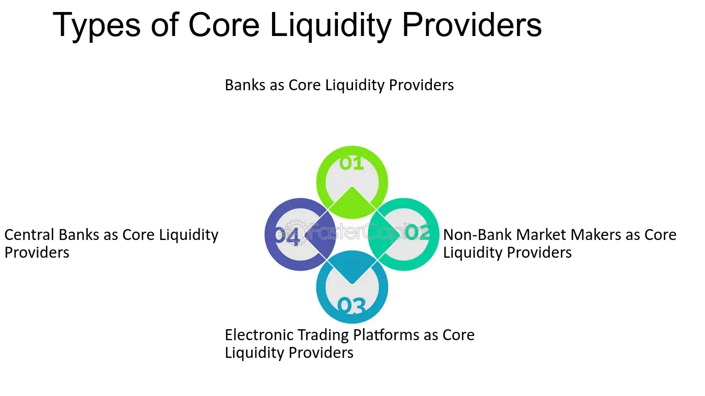

## Table of Contents

## What is a Core Liquidity Provider (CLP)?

A Core Liquidity Provider (CLP) is a system used in some cryptocurrency platforms to help people trade tokens more easily. It works by pooling together different tokens that people want to trade. This pool of tokens is managed by a smart contract, which is like a computer program that runs automatically on the blockchain. When someone wants to trade one token for another, they can do it through this pool, and the smart contract makes sure everything happens fairly.

The CLP system is important because it helps keep trading smooth and efficient. It does this by always having enough tokens available for trading, so people don't have to wait or worry about not being able to make a trade. This is different from traditional trading where you need to find someone else who wants to trade with you. With a CLP, the pool itself acts as the trading partner, making the process quicker and easier for everyone involved.

## How does a Core Liquidity Provider function in financial markets?

In financial markets, a Core Liquidity Provider (CLP) helps make trading easier by keeping a pool of different assets ready for people to trade. Imagine you want to trade one type of money for another. Instead of finding someone who wants to trade with you, you can trade with the pool. The pool is managed by a smart computer program that makes sure everyone gets a fair deal. This means you can trade quickly without waiting for someone else to want to trade with you.

The CLP system is important because it keeps the market running smoothly. It makes sure there are always enough assets in the pool so that people can trade whenever they want. This helps keep prices stable and makes trading more reliable. Without a CLP, trading could be slower and more unpredictable because you'd have to find someone else who wants to trade at the same time you do. With a CLP, the pool is always there, ready to help you trade.

## What are the main benefits of using a Core Liquidity Provider?

Using a Core Liquidity Provider (CLP) makes trading easier and faster. When you want to trade one thing for another, you don't have to wait to find someone who wants to trade with you. Instead, you can trade with the pool of assets that the CLP manages. This means you can make your trade right away, without any delays. It's like having a trading partner ready all the time, which makes the whole process smoother and quicker.

Another big benefit of a CLP is that it helps keep prices stable. Because there's always a pool of assets available for trading, the prices don't jump around as much. This makes the market more predictable and reliable. When people know they can trade easily and the prices won't change suddenly, they feel more confident about trading. This can lead to more people using the market, which is good for everyone involved.

## Can you explain the role of a CLP in forex trading?

In [forex](/wiki/forex-system) trading, a Core Liquidity Provider (CLP) helps make trading different currencies easier and faster. Imagine you want to trade US dollars for euros. Instead of waiting to find someone who wants to trade euros for dollars at the same time, you can trade with a pool of currencies managed by the CLP. This pool is like a big bucket of different currencies that's always ready for trading. The CLP uses a smart computer program to make sure everyone gets a fair deal when they trade.

Using a CLP in forex trading has big benefits. It makes trading quicker because you don't have to wait for another trader. This means you can buy or sell currencies whenever you want, without delays. Also, because there's always a pool of currencies available, the prices stay more stable. This makes the forex market more predictable and reliable. When traders know they can trade easily and the prices won't change suddenly, they feel more confident, which can lead to more trading and a healthier market.

## How do Core Liquidity Providers affect market liquidity?

Core Liquidity Providers (CLPs) help make markets more liquid by always having a pool of assets ready for trading. When you want to trade something, you don't need to wait for someone else who wants to trade with you. Instead, you can trade with the pool that the CLP manages. This means you can buy or sell things quickly and easily, which makes the market more active and lively.

Because CLPs keep a big pool of assets available, they help keep the market stable. When there's always enough of everything to trade, prices don't jump around as much. This makes traders feel more confident because they know they can trade whenever they want without worrying about big price changes. More confident traders mean more trading, which makes the market even more liquid.

## What are the differences between a Core Liquidity Provider and a market maker?

A Core Liquidity Provider (CLP) and a market maker both help make trading easier, but they work in different ways. A CLP uses a pool of assets that people can trade with directly. This pool is managed by a smart computer program that makes sure everyone gets a fair deal. When you want to trade, you don't need to find someone else to trade with; you just trade with the pool. This makes trading quick and smooth because there's always something to trade with.

On the other hand, a market maker is a person or a company that buys and sells assets to help keep the market active. They quote both a buying price and a selling price for an asset, and they make money from the difference between these prices. Market makers help keep the market liquid by being ready to trade with anyone who wants to buy or sell. They don't use a pool like a CLP; instead, they trade directly with other people in the market.

Both CLPs and market makers help make trading easier, but they do it in different ways. A CLP uses a pool to make trading quick and easy, while a market maker trades directly with people to keep the market active. Both are important for keeping the market running smoothly, but they have different methods and roles.

## What criteria should be considered when choosing a Core Liquidity Provider?

When choosing a Core Liquidity Provider (CLP), it's important to look at how reliable they are. You want a CLP that always has a big pool of assets ready for trading. This means you can trade whenever you want without waiting. Also, check if the CLP uses a good smart computer program to manage the pool. This program should be fair and make sure everyone gets a good deal when they trade. A reliable CLP will keep the market stable and make trading easy for you.

Another thing to consider is the fees the CLP charges. Some CLPs might charge more than others, so it's good to compare and find one that's not too expensive. Also, think about how easy it is to use the CLP. A good CLP will have a simple way for you to trade, so you don't get confused. Finally, look at what other people say about the CLP. If lots of people are happy with it, that's a good sign that it's a good choice for you too.

## How do CLPs manage risk and ensure liquidity during volatile market conditions?

Core Liquidity Providers (CLPs) manage risk during volatile market conditions by keeping a big pool of assets. This pool acts like a safety net. When the market gets wild and prices jump around a lot, the CLP's pool helps keep things stable. If lots of people want to trade at the same time, the pool has enough assets to handle it. This means traders can still buy and sell without big delays or price changes, which helps keep the market calm.

To ensure [liquidity](/wiki/liquidity-risk-premium), CLPs use smart computer programs to manage their pool. These programs watch the market all the time and adjust the pool to make sure there are always enough assets for trading. When the market gets really busy, the program might add more assets to the pool or change how trades are done to keep everything smooth. This way, even when the market is going crazy, traders can still trade easily and quickly, which is good for everyone.

## What technologies are typically used by Core Liquidity Providers to enhance their services?

Core Liquidity Providers (CLPs) use smart computer programs called smart contracts to manage their pools of assets. These smart contracts run on blockchains, which are like special computers that keep track of everything in a way that's hard to cheat. The smart contracts make sure that when people trade, everything is fair and nobody can trick the system. They also help the CLP adjust the pool quickly when the market changes, so there's always enough of everything to trade.

Another important technology for CLPs is high-speed trading systems. These systems help CLPs handle lots of trades really fast, even when the market gets busy. They use special computers that can do many trades at once without slowing down. This means traders can buy and sell things quickly, which keeps the market running smoothly. Together, smart contracts and high-speed trading systems help CLPs keep the market stable and make trading easier for everyone.

## How do regulations impact the operations of Core Liquidity Providers?

Regulations can change how Core Liquidity Providers (CLPs) work. Governments and financial watchdogs make rules to make sure trading is fair and safe. These rules can say things like how much money a CLP needs to have, or how they should keep their trading records. CLPs have to follow these rules or they might get in trouble. This can make it harder for them to run their business, but it also helps keep the market honest and safe for everyone.

Sometimes, regulations can also help CLPs. If the rules are clear and fair, it can make people trust the CLP more. This can bring more traders to the market, which is good for the CLP. But, if the rules are too strict or keep changing, it can be hard for CLPs to keep up. They might need to spend a lot of time and money to make sure they are following all the rules. So, while regulations are important for keeping things safe, they can also make running a CLP more complicated.

## What are the latest trends affecting Core Liquidity Providers in the financial industry?

One big trend affecting Core Liquidity Providers (CLPs) is the use of new technology like [artificial intelligence](/wiki/ai-artificial-intelligence) (AI) and [machine learning](/wiki/machine-learning). These technologies help CLPs make better decisions about managing their pools of assets. They can predict when the market might get busy and add more assets to the pool to keep trading smooth. This makes the market more stable and helps traders feel more confident. Another trend is the growing interest in decentralized finance (DeFi). More people are using DeFi platforms, which often use CLPs to help with trading. This means CLPs are becoming more important and need to keep up with the fast-changing world of DeFi.

Another trend is the increasing focus on security and privacy. As more people use CLPs, they want to know their trades are safe and their information is private. CLPs are working on better security measures to protect against hackers and keep user data safe. Regulations are also playing a bigger role. Governments are making more rules about how CLPs should work to keep the market fair and safe. CLPs need to follow these rules, which can sometimes make their job harder but also helps build trust with traders.

## Can you discuss a case study where a Core Liquidity Provider significantly influenced market dynamics?

In 2020, Uniswap, a popular decentralized exchange, used a Core Liquidity Provider (CLP) to change how people traded cryptocurrencies. Uniswap's CLP made it easy for anyone to trade tokens without needing to find someone else to trade with. Instead, traders could swap their tokens directly with a pool of tokens managed by Uniswap's smart contract. This made trading faster and simpler, attracting more users to the platform. As more people started using Uniswap, the market became more active and liquid. This meant that prices didn't jump around as much, and traders felt more confident about trading on the platform.

The impact of Uniswap's CLP was huge. It showed that CLPs could make a big difference in how markets work. Before Uniswap, many people found trading cryptocurrencies hard because they had to wait for someone else to want to trade with them. But with Uniswap's CLP, trading became much easier and quicker. This led to more people using the platform, which made the whole market more stable and reliable. Uniswap's success with its CLP set an example for other platforms, showing that CLPs could be a powerful tool for making markets better for everyone.

## What is the Role and What are the Benefits of Core Liquidity Providers?

Core liquidity providers are essential in promoting stability and efficiency in financial markets. By offering liquidity consistently across varying market conditions, they serve as a cornerstone for maintaining market equilibrium. These entities absorb large orders, thereby mitigating the effects of market [volatility](/wiki/volatility-trading-strategies). This stabilizing effect is critical for preventing sharp fluctuations in asset prices, which can lead to market instability.

One of the primary benefits of core liquidity providers is their contribution to narrowing bid-ask spreads. The bid-ask spread, defined as the difference between the highest price that a buyer is willing to pay for an asset and the lowest price that a seller is willing to accept, is a key determinant of trading costs. When liquidity is abundant, these spreads tend to be narrower, reducing costs for both traders and investors. Narrow bid-ask spreads facilitate more efficient price discovery and enhance the overall functionality of the market.

Moreover, the presence of core liquidity providers ensures markets remain open and efficient, especially during times of market stress. During periods of high volatility or uncertainty, such as economic crises or geopolitical events, these providers play a pivotal role in maintaining liquidity levels. Without their intervention, markets could become illiquid, causing trading activities to halt or slow down significantly. This accessibility to continuous trading allows investors to execute transactions swiftly and at fair prices, even under challenging conditions.

The activity of liquidity providers can also be quantitatively analyzed. For instance, their impact on the bid-ask spread can be expressed with the spread equation:

$$
\text{Spread} = \text{Ask Price} - \text{Bid Price}
$$

The presence of core liquidity providers tends to minimize this spread, reflecting enhanced market efficiency.

In summary, core liquidity providers are integral to ensuring that financial markets operate smoothly and efficiently. Their ability to offer consistent liquidity, narrow bid-ask spreads, and maintain market access during turbulent times significantly benefits all market participants.

## References & Further Reading

[1]: Harris, L. (2003). ["Trading and Exchanges: Market Microstructure for Practitioners."](https://academic.oup.com/book/52292) Oxford University Press.

[2]: Hasbrouck, J. (2007). ["Empirical Market Microstructure: The Institutions, Economics, and Econometrics of Securities Trading."](https://academic.oup.com/book/52241) Oxford University Press.

[3]: Aldridge, I. (2013). ["High-Frequency Trading: A Practical Guide to Algorithmic Strategies and Trading Systems."](https://onlinelibrary.wiley.com/doi/pdf/10.1002/9781119203803.fmatter) Wiley.

[4]: Hendershott, T., Jones, C. M., & Menkveld, A. J. (2011). ["Does Algorithmic Trading Improve Liquidity?"](https://onlinelibrary.wiley.com/doi/full/10.1111/j.1540-6261.2010.01624.x) The Review of Financial Studies, 24(8), 2401-2437.

[5]: Chaboud, A. P., Chiquoine, B., Hjalmarsson, E., & Vega, C. (2014). ["Rise of the Machines: Algorithmic Trading in the Foreign Exchange Market."](https://www.jstor.org/stable/43612951) The Journal of Finance, 69(5), 2045-2084.