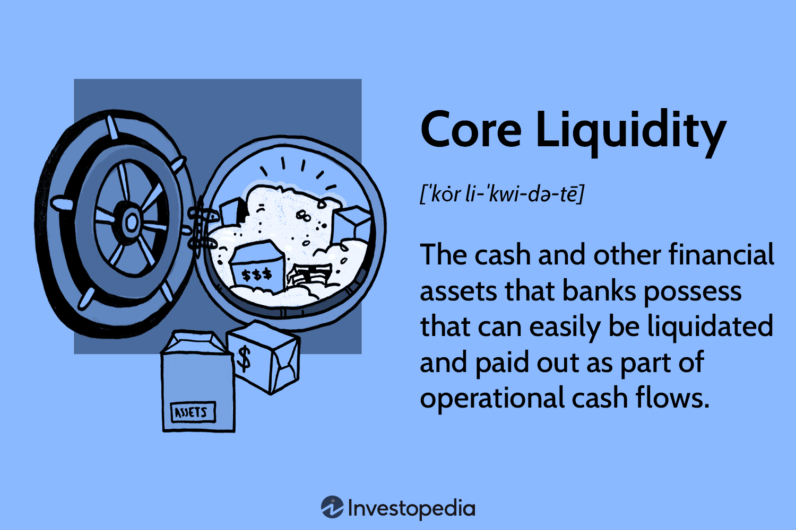

## Table of Contents

## What is core liquidity?

Core liquidity refers to the amount of money or assets that are easily available and can be quickly turned into cash without affecting their market price. This is important for businesses and financial institutions because it helps them meet their short-term financial obligations, like paying bills or salaries, without any trouble. Think of it as having enough loose change in your pocket to buy something you need right away, without having to sell something valuable first.

Having good core liquidity is like having a safety net. It makes sure that a company can keep running smoothly even if there are unexpected expenses or if their income drops for a short time. For example, if a sudden repair is needed for a machine, a company with strong core liquidity can pay for it right away, instead of waiting or borrowing money. This helps the company avoid bigger problems and keeps everyone working without interruptions.

## Why is core liquidity important in financial markets?

Core liquidity is really important in financial markets because it helps keep things running smoothly. Imagine you want to buy or sell something quickly, like a stock or a bond. If there's enough core liquidity, you can do that without causing big changes in the price. This is good because it means the market is stable and people can trust it. Without enough core liquidity, prices might jump around a lot, making it hard for people to trade and causing them to lose trust in the market.

Also, core [liquidity](/wiki/liquidity-risk-premium) is like a safety cushion for the whole financial system. When there's a lot of it, banks and other big players can handle unexpected problems better. For example, if a lot of people suddenly want to take their money out of a bank, the bank can use its core liquidity to give everyone their money without panicking. This helps prevent bigger problems, like a bank run, and keeps the financial system strong and reliable.

## How does core liquidity differ from overall market liquidity?

Core liquidity is about the money or assets that are easy to turn into cash without messing up the price. It's like the emergency cash a business or a bank keeps handy for quick needs. Overall market liquidity, on the other hand, is about how easily you can buy or sell things in the whole market without changing the price too much. It's like how smoothly the entire market can handle lots of people wanting to trade at the same time.

Think of core liquidity as the money in your wallet that you can use right away. It's important for a single business or bank to have enough of this to deal with sudden expenses or to keep running if money gets tight. Overall market liquidity is more like the flow of traffic in a city. If the roads are clear and cars can move easily, it means the city's traffic system is liquid. If everyone can trade easily in the market without causing big price swings, then the market has good overall liquidity.

## What are the primary sources of core liquidity?

The main sources of core liquidity come from cash and things that can quickly be turned into cash. For a business, this might mean the money they have in their bank account, or short-term investments like government bonds that they can sell fast. Banks might count money they have in reserve or money they can borrow from other banks overnight. These are all things that can be used right away to pay for stuff without waiting or losing much value.

Another source of core liquidity is credit lines. This is like having a credit card that a business or bank can use when they need money quickly. They can borrow from this line of credit to cover sudden expenses or to make sure they have enough money to keep going if their income drops for a bit. It's important because it gives them a backup plan, like having a friend who can lend you money when you need it.

## How can core liquidity impact trading strategies?

Core liquidity can really change how people trade in the markets. If there's a lot of core liquidity, traders can buy and sell things quickly without worrying too much about the price changing a lot. This means they can use strategies that involve making a lot of trades in a short time, like [day trading](/wiki/day-trading-spy) or high-frequency trading. These strategies work well when the market is stable and there's enough money moving around to keep things smooth.

On the other hand, if core liquidity is low, traders need to be more careful. They might have to wait longer to buy or sell, or they might see big price swings when they try to trade. This can make them use strategies that are more about waiting for the right moment, like holding onto investments for a longer time or using stop-loss orders to protect against big losses. Knowing the level of core liquidity helps traders pick the right strategy to make the most of their trades and avoid big surprises.

## What are the signs of high core liquidity in a market?

When a market has high core liquidity, you can see it in how easy it is to buy and sell things without the prices changing a lot. Imagine you're at a busy market where everyone can quickly trade their goods without causing a big fuss. In financial markets, this means lots of people are trading, and there's enough money moving around to keep the prices stable. If you want to buy a stock, you can do it fast, and the price doesn't jump up because there's plenty of that stock available.

You can also tell there's high core liquidity when the market stays calm even during busy times. If there's a big news event, and everyone stays cool and keeps trading smoothly, it's a sign of good core liquidity. It's like having enough lifeguards at a pool so that even if a lot of people jump in at once, everything stays safe and fun. This kind of market makes traders feel confident because they know they can get in and out of trades without big surprises.

## How do regulatory changes affect core liquidity?

Regulatory changes can have a big impact on core liquidity. When rules change, they can make it easier or harder for businesses and banks to keep money ready to use. For example, if new rules say that banks need to keep more money in reserve, this can lower the core liquidity because banks have less money to use for quick needs. On the other hand, if rules make it easier for banks to borrow money from each other, this can increase core liquidity because banks can get cash faster when they need it.

These changes can also affect how much people trust the market. If new rules make the market seem safer, more people might want to trade, which can increase the core liquidity. But if the rules make things confusing or seem risky, people might trade less, which can lower the core liquidity. So, when regulators make new rules, they need to think about how it will change the amount of money that's easy to use in the market.

## What role do central banks play in maintaining core liquidity?

Central banks are really important for keeping core liquidity stable. They do this by controlling the amount of money in the economy. For example, they can lend money to banks when they need it, which helps banks have enough cash to deal with sudden needs. They can also buy or sell government bonds to change how much money is available. If they buy bonds, they put more money into the economy, which can increase core liquidity. If they sell bonds, they take money out, which can lower it.

Central banks also set rules about how much money banks need to keep in reserve. If they lower these rules, banks can use more of their money for quick needs, which boosts core liquidity. If they raise these rules, banks have to keep more money locked away, which can make core liquidity go down. By doing these things, central banks help make sure there's enough money moving around so that businesses and banks can keep going smoothly, even when things get tough.

## How can investors measure core liquidity?

Investors can measure core liquidity by looking at how easily they can buy and sell things in the market without changing the price too much. One way to do this is by checking the bid-ask spread, which is the difference between the highest price someone is willing to pay for something and the lowest price someone is willing to sell it for. A small bid-ask spread usually means there's a lot of core liquidity because lots of people are ready to trade. Another way is to look at trading [volume](/wiki/volume-trading-strategy), which is how many trades are happening. High trading volume can show that there's enough money moving around to keep the market stable.

Another thing investors can do is look at how quickly they can turn their investments into cash. This is called market depth, and it shows how many people are ready to buy or sell at different price levels. If there are lots of people ready to trade at prices close to the current price, it's a sign of good core liquidity. Investors can also check financial reports from companies and banks to see how much cash or easy-to-sell assets they have. This gives a good idea of how much core liquidity is available in the market.

## What are the risks associated with low core liquidity?

When there's low core liquidity, it can be really risky for everyone in the market. Imagine you want to sell something quickly, but there aren't many people ready to buy it. You might have to lower the price a lot just to get someone interested. This can cause the price to drop suddenly, which can scare other people and make them want to sell too. If lots of people start selling at the same time, it can turn into a big mess, with prices falling even more and causing panic.

Low core liquidity also makes it hard for businesses and banks to handle unexpected problems. If a company needs money fast to pay for something important, like fixing a broken machine, they might not have enough cash on hand. They might have to borrow money at a high cost or sell something valuable at a bad price. This can make their problems even worse and can even lead to bigger issues, like a company going out of business or a bank not being able to give people their money back.

## How does core liquidity influence asset pricing?

Core liquidity can really change how much things cost in the market. When there's a lot of core liquidity, it's easy for people to buy and sell things without the price changing a lot. Imagine you want to sell your toy, and there are lots of kids ready to buy it at a good price. You can sell it quickly without having to lower the price too much. In the same way, if there's a lot of core liquidity in the market, prices stay pretty stable because there's enough money moving around to keep things smooth.

But when core liquidity is low, it can make prices go crazy. If you want to sell your toy and there aren't many kids wanting to buy it, you might have to lower the price a lot just to get someone to take it. In the market, this means that if there's not enough money moving around, prices can jump around a lot. People might get scared and start selling their things quickly, which can make prices fall even more. So, core liquidity helps keep prices steady and makes the market feel safer for everyone.

## What advanced strategies can traders use to capitalize on fluctuations in core liquidity?

Traders can use a strategy called liquidity provision to make money when core liquidity changes. This means they offer to buy or sell things when not many other people are doing it. If they see that there's not much core liquidity, they can step in and help make the market more stable. By doing this, they can earn money from the difference between the price they buy at and the price they sell at. It's like being a helpful person at a busy market, making sure there's always someone ready to trade, and getting paid for it.

Another strategy is called liquidity [arbitrage](/wiki/arbitrage). This is when traders look for small differences in prices between different markets or times. When core liquidity is low, these price differences can get bigger. Traders can buy something in one place where it's cheaper and sell it in another place where it's more expensive. It's like buying apples at a farm where they're cheap and selling them at a city market where they cost more. By doing this quickly and smartly, traders can make a profit from the changes in core liquidity.

## What is Core Liquidity and Why is it Important?

Core liquidity refers to the essential liquid assets that institutions rely on to meet their immediate financial obligations. These assets typically include cash, government bonds, and other marketable securities that can be quickly converted into cash without a significant loss of value. The importance of core liquidity lies in its role in enabling institutions to manage day-to-day operational cash flows efficiently and respond promptly to unforeseen liquidity shortages.

Institutions maintain a core liquidity position as part of their risk management strategy to ensure financial stability. A robust core liquidity reserve acts as a buffer, allowing institutions to navigate through periods of financial stress without having to liquidate long-term investments or incur high borrowing costs. The quality and composition of these liquid assets are crucial; higher quality assets, such as government securities, are preferred due to their lower risk and higher convertibility.

Accurate assessment of core liquidity needs is essential, as both overestimation and underestimation can have detrimental effects. Overestimating liquidity requirements could lead to excessive idle cash holdings that yield lower returns, thus reducing the institution's revenue potential. Conversely, underestimating liquidity needs can result in a shortage during critical times, forcing the institution to secure funds at unfavorable terms, potentially destabilizing its financial position.

To quantify and manage core liquidity, financial institutions often employ liquidity coverage ratios (LCR). The formula for LCR is typically given by:

$$
\text{LCR} = \frac{\text{High-Quality Liquid Assets (HQLA)}}{\text{Total Net Cash Outflows over a 30-day period}}
$$

Maintaining an LCR above a regulatory minimum is crucial for ensuring that an institution can withstand short-term liquidity disruptions. This method emphasizes a proactive approach in monitoring liquidity risks and aligning the institution's liquidity profile with its risk tolerance and regulatory expectations.

In summary, the strategic management of core liquidity is vital for maintaining financial stability and ensuring that institutions can meet their obligations without jeopardizing their financial health. By carefully evaluating and adjusting core liquidity reserves, institutions not only safeguard against liquidity crises but also optimize their ability to generate revenues.

## References & Further Reading

[1]: Hull, J. C. (2018). ["Options, Futures, and Other Derivatives"](https://www.semanticscholar.org/paper/Options%2C-Futures%2C-and-Other-Derivatives-Hull/89bdee500c8623864fc9eb7a471546aa713acc44). Pearson Education.

[2]: Lopez de Prado, M. (2018). ["Advances in Financial Machine Learning"](https://www.amazon.com/Advances-Financial-Machine-Learning-Marcos/dp/1119482089). Wiley.

[3]: Chan, E. P. (2009). ["Quantitative Trading: How to Build Your Own Algorithmic Trading Business"](https://github.com/ftvision/quant_trading_echan_book). Wiley.

[4]: Jansen, S. (2020). ["Machine Learning for Algorithmic Trading"](https://github.com/stefan-jansen/machine-learning-for-trading). Packt Publishing.

[5]: Basel Committee on Banking Supervision. (2013). ["Basel III: The Liquidity Coverage Ratio and liquidity risk monitoring tools"](https://www.bis.org/publ/bcbs238.htm). Bank for International Settlements.

[6]: Narang, R. K. (2009). ["Inside the Black Box: The Simple Truth About Quantitative Trading"](https://onlinelibrary.wiley.com/doi/book/10.1002/9781118267738). Wiley.