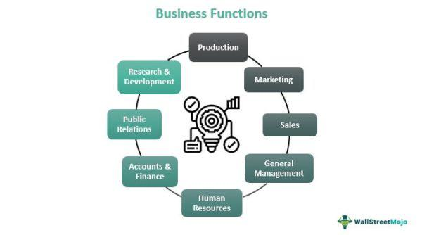

A core plus investment strategy represents a comprehensive approach in financial management that combines traditional core investments with additional, more diversified assets to enhance potential returns. Central to this strategy is the maintenance of core holdings such as large-cap equities or investment-grade bonds, while integrating a portion of the portfolio into higher-risk assets like high-yield bonds, real estate, or emerging markets. This diversification aims to improve overall risk-adjusted returns, providing a steady income stream while also capturing opportunities for capital growth [1].

Algorithmic trading has increasingly become an integral component of core plus strategies, offering enhanced precision, speed, and efficiency in market transactions. By leveraging complex mathematical models and powerful computational tools, algorithmic trading facilitates the execution of trades at optimal times and prices, effectively managing both the core and supplementary elements of a core plus strategy. It enables financial managers to dynamically adjust their portfolios in response to real-time market conditions, ensuring that the strategy adheres closely to its risk and return objectives.



This article aims to explore how algorithmic trading contributes to the successful implementation of core plus strategies. By examining real-world financial examples and highlighting the associated benefits, the discussion seeks to underscore the strategic advantages that arise from combining foundational investment principles with advanced trading technologies.

---

[1] Bogle, J. C. (1999). Common Sense on Mutual Funds: New Imperatives for the Intelligent Investor. John Wiley & Sons.

## Table of Contents

## Understanding Core Plus Investment Strategy

Core plus investment strategies represent a sophisticated approach within investment management, combining the stability of core investments with the potential for higher returns through additional riskier assets. These strategies center around maintaining a core portfolio consisting of stable, low-risk securities, while selectively incorporating higher-risk investments to enhance potential returns. The core portion typically aims to deliver steady and predictable returns, often composed of bonds or high-quality equities. 

The "plus" component allows investors to pursue opportunities in higher-risk sectors or asset types, potentially increasing overall portfolio yield. This aspect accommodates investments in sectors like emerging market securities, high-yield bonds, or alternative assets, depending on the investor's risk tolerance and market outlook.

Core plus strategies are leveraged across various asset classes, adapting the approach to suit different markets and economic conditions. In the fixed-income sphere, core holdings might include government or investment-grade corporate bonds. The plus segment, then, might consist of high-yield or emerging market bonds, aiming to capture superior yield compensation for increased risk.

When applied to equity investments, the core usually involves large-cap stable stocks, which provide consistent growth and often dividends, whereas the plus portion might include small-cap stocks or sector-specific investments that offer higher growth potential but come with increased [volatility](/wiki/volatility-trading-strategies).

A balanced approach in core plus strategies not only aids in achieving diversification but also aligns with the investor's broader financial objectives. The integration of higher-risk assets ideally results in a portfolio that performs well under varying market conditions, thus optimizing for both growth and stability.

## Algorithmic Trading: A Catalyst for Core Plus Strategies

Algorithmic trading, often known as algo trading, employs computer systems to execute trading strategies based on pre-programmed rules. This technology-driven approach allows for the automation of buying and selling activities in financial markets, significantly impacting modern trading practices by enhancing efficiency, accuracy, and speed.

The integration of long-term and short-term strategies within [algorithmic trading](/wiki/algorithmic-trading) provides traders with a comprehensive approach. Long-term strategies typically involve algorithms that analyze macroeconomic indicators and historical data to predict market trends over an extended period. Conversely, short-term strategies might rely on technical analysis, looking for patterns or signals in price, [volume](/wiki/volume-trading-strategy), or market depth to capitalize on short-lived market opportunities.

Algorithmic trading enhances the execution of core plus investment strategies by significantly improving precision and speed. High-frequency trading ([HFT](/wiki/high-frequency-trading-strategies)), a subset of algorithmic trading, enables the completion of numerous transactions within fractions of a second, thus facilitating trading around core positions effectively. The ability to rapidly analyze and react to market data allows traders to exploit fleeting opportunities and manage risk dynamically.

Precision in trade execution is another critical advantage of algorithmic trading. Algorithms can be calibrated to execute orders with minimal market impact, thereby reducing transaction costs and slippage. This capability is particularly valuable in core plus strategies, where trades often involve a mix of high-[liquidity](/wiki/liquidity-risk-premium) core holdings and more volatile peripheral investments.

Moreover, algorithmic trading systems continuously monitor market conditions and adjust their strategies accordingly, which helps in maintaining optimal portfolio allocation. The following Python snippet demonstrates a simple moving average crossover strategy, a fundamental form of algorithmic trading that could be adapted for a core plus strategy:

```python
import pandas as pd
import numpy as np

# Example data
data = {'Price': [100, 102, 101, 103, 107, 110, 115, 113, 117, 120]}
df = pd.DataFrame(data)

# Calculate short and long moving averages
short_window = 3
long_window = 5

df['Short_MA'] = df['Price'].rolling(window=short_window, min_periods=1).mean()
df['Long_MA'] = df['Price'].rolling(window=long_window, min_periods=1).mean()

# Generate signals
df['Signal'] = 0
df['Signal'][short_window:] = np.where(df['Short_MA'][short_window:] > df['Long_MA'][short_window:], 1, -1)

# Buy/sell logic based on signal
df['Position'] = df['Signal'].shift()

print(df)
```

In this example, the signals generated by the moving average crossovers could inform buy or sell actions, executing trades faster and more accurately than traditional manual methods. By leveraging such technology, core plus strategies can be implemented with greater agility and fewer errors, optimizing returns while managing risk effectively.

## Financial Examples of Core Plus Strategies

Core plus investment strategies incorporate a mix of conservative, core holdings and more opportunistic, higher-risk investments. This blend allows investors to navigate varying market conditions while seeking additional returns. Examining specific examples of core plus funds in the fixed-income and equity markets can illuminate how these strategies are applied in practice.

### Fixed-Income Core Plus Funds: JPMorgan Core Plus Bond Fund

The JPMorgan Core Plus Bond Fund exemplifies how core plus strategies are implemented within the fixed-income sector. This fund primarily invests in investment-grade bonds but tactically allocates a portion of its assets to high-yield and emerging market bonds. By doing so, it seeks to enhance yield and return potential beyond what traditional fixed-income strategies might offer. The fund managers utilize macroeconomic analysis and extensive market research to adjust their allocations dynamically, aiming to capitalize on [interest rate](/wiki/interest-rate-trading-strategies) changes and credit spread variations.

For a quantitative evaluation, consider a simple expected return calculation for a core plus bond fund expressed as:

$$
E(R) = w_1 \cdot E(R_1) + w_2 \cdot E(R_2)
$$

where $w_1$ and $w_2$ represent the proportion of the portfolio invested in core and plus components, respectively, and $E(R_1)$ and $E(R_2)$ are their expected returns.

### Equity Core Plus Funds: JPMorgan U.S. Large Cap Core Plus Fund

In the equity domain, the JPMorgan U.S. Large Cap Core Plus Fund offers insight into how core plus strategies can be applied. This fund targets large-cap U.S. equities, forming the core of the portfolio consisting primarily of stable, high-quality companies. To bolster potential returns, the fund also includes tactical investments in mid-cap stocks and other asset classes that may present high growth opportunities. This dual approach allows the fund to maintain a stable foundation while seeking outperformance through calculated risk-taking.

### Real-World Applications and Benefits

These examples reveal the strategic flexibility provided by core plus strategies. By balancing core stability with potential high-reward investments, fund managers can effectively respond to diverse market challenges. For investors, this means enhanced diversification and a refined risk-reward profile.

In practice, these funds leverage algorithmic trading and quantitative models to adjust portfolio components efficiently, mitigating risks, and exploiting short-term market movements. This agility is crucial in today's fast-paced markets, enabling managers to optimize timing and asset selection with precision.

Both the JPMorgan Core Plus Bond Fund and the JPMorgan U.S. Large Cap Core Plus Fund illustrate core plus strategies' capacity to blend predictable returns with the pursuit of additional gains. These approaches show that with prudent management and decisive execution, core plus strategies can provide a robust investment framework adaptable to fluctuating market environments.

## Benefits of Trading Around a Core Position

Trading around a core position is a dynamic investment approach that allows investors to optimize their portfolios by adjusting their exposure to certain assets. This strategy enhances portfolio profitability and diversification by balancing long-term stability with short-term gains. 

### Enhancing Profitability and Diversification

Trading around a core position involves maintaining a core set of stable investments while engaging in shorter-term trades around this base to capitalize on market opportunities. This can enhance profitability because it allows investors to leverage their core holdings for stability while making tactical decisions based on market movements. For example, if an investor holds a core position in a large-cap equity fund, they might trade options or futures on indices or stocks to generate additional returns when they predict short-term market swings.

Diversification is achieved as this strategy permits an expansion beyond the core holdings into various asset classes or sectors, which are not part of the primary portfolio. By strategically selecting instruments that are negatively correlated or have low correlation with the core assets, an investor can reduce overall portfolio risk.

### Risk Management and Volatility Mitigation

Risk management is a vital component of trading around a core position. By maintaining a stable core, investors are better positioned to endure market volatility. Short-term trades can be used to hedge the core position, thus acting as a buffer against potential declines in the core investment's value. 

For instance, an investor might hold a diversified bond portfolio as a core position. During periods of anticipated interest rate increases, the investor could use short-term interest rate swaps to hedge against the risk of bond price declines. This active risk management approach helps in smoothing volatility and protecting the portfolio's long-term value.

### Capitalizing on Short-term Market Swings

This strategy also enables traders to take advantage of short-term market inefficiencies or trends without compromising their long-term investment goals. By doing so, traders can incrementally enhance returns through tactical positioning. 

Consider a trader who predicts a short-term decline in a sector due to an upcoming economic report. They might temporarily reduce their exposure to that sector while increasing allocations to others anticipated to perform well. Once the market stabilizes, the trader can revert to their core allocation, having potentially increased overall returns.

In summary, trading around a core position provides a structured yet flexible framework for investors. It enhances profitability through careful diversification and short-term trading while managing risk and mitigating volatility. This approach ensures that investors can balance immediate opportunities with sustained investment growth, providing a comprehensive strategy for adapting to changing market conditions.

## Challenges and Risks in Core Plus Strategies

Core plus investment strategies, though advantageous in expanding portfolio diversification and enhancing returns, face several inherent challenges and risks. One significant risk is overexposure, where the inclusion of higher-risk assets beyond core investments can lead to excessive concentration in volatile market segments. This exposure can result in potential underperformance, particularly during market downturns, as the non-core components are often less stable.

Moreover, increased market volatility presents another risk. Core plus strategies can magnify the effects of market swings due to their inherent blend of stable and volatile assets. This volatility complicates the predictability of returns and can deter investors with lower risk tolerance. Effective risk assessment and strategic asset allocation are crucial to counter the adverse impacts of volatility.

Implementing algorithmic trading within core plus strategies also brings technological and regulatory challenges. Technological issues include system failures, erroneous trades due to programming bugs, and data integrity problems. Ensuring robust and fault-tolerant trading systems is vital to address these issues. On the regulatory front, algorithmic trading is subject to stringent oversight, necessitating compliance with guidelines such as the European Union's MiFID II or the U.S. SEC's regulations. Non-compliance can result in severe penalties and reputational damage.

To mitigate these challenges, financial managers can employ several strategies. Overexposure and volatility risks may be managed through diversification across asset classes, sectors, and geographies, reducing reliance on any single market segment. Regular portfolio rebalancing aids in maintaining the intended risk-return profile.

Strong risk management frameworks incorporating value-at-risk (VaR) models, stress testing, and scenario analysis help quantify potential losses under adverse conditions. Algorithmic trading-specific challenges require comprehensive testing and validation of trading algorithms before deployment. Rigorous [backtesting](/wiki/backtesting) processes, conducted using historical data, allow traders to assess the algorithm's performance and adjust parameters to optimize strategy execution. Here is a basic Python example for backtesting a trading strategy:

```python
import pandas as pd
import numpy as np

# Load historical price data
data = pd.read_csv('historical_data.csv')
prices = data['Close']

# Simple moving average strategy
def sma_strategy(prices, short_window=40, long_window=100):
    signals = pd.DataFrame(index=prices.index)
    signals['signal'] = 0.0
    signals['short_mavg'] = prices.rolling(window=short_window, min_periods=1).mean()
    signals['long_mavg'] = prices.rolling(window=long_window, min_periods=1).mean()

    # Create signals
    signals['signal'][short_window:] = np.where(signals['short_mavg'][short_window:] > signals['long_mavg'][short_window:], 1.0, 0.0)

    # Calculate daily position
    signals['positions'] = signals['signal'].diff()

    return signals

# Generate signals
signals = sma_strategy(prices)

# Calculate returns
initial_capital = 100000.0
positions = pd.DataFrame(index=signals.index).fillna(0.0)
positions['Security'] = signals['signal'] * 100  # 100 shares
portfolio = positions.multiply(prices, axis=0)
pos_diff = positions.diff()
portfolio['holdings'] = (positions.multiply(prices, axis=0)).sum(axis=1)
portfolio['cash'] = initial_capital - (pos_diff.multiply(prices, axis=0)).sum(axis=1).cumsum()
portfolio['total'] = portfolio['cash'] + portfolio['holdings']

# Calculate and output key metrics
ROI = (portfolio['total'][-1] - initial_capital) / initial_capital
drawdown = (portfolio['total'].max() - portfolio['total']) / portfolio['total'].max()
max_drawdown = drawdown.max()

print(f"ROI: {ROI:.2%}, Max Drawdown: {max_drawdown:.2%}")
```

Using careful planning, continuous monitoring, and stringent risk controls, financial managers can strategically navigate the complexities associated with core plus strategies and algorithmic trading.

## Backtesting: Optimizing Core Plus Strategies

Backtesting plays a critical role in evaluating the performance of core plus strategies by allowing investors to simulate and test their strategic ideas using historical data. This process helps in understanding how a strategy might have performed in the past, which can provide insights into its potential effectiveness.

### Importance of Backtesting

Backtesting enables investors to assess the viability of their core plus strategies before allocating real capital. By using historical market data, investors can judge whether a strategy aligns with their investment goals and risk tolerance. This evaluation helps in identifying the strengths and weaknesses of a strategy, which is crucial for optimization and refinement.

### Key Metrics in Backtesting

Several key metrics are instrumental in evaluating the performance of a backtested strategy:

1. **Return on Investment (ROI):** This metric is used to quantify the profitability of an investment strategy. In mathematical terms, ROI is calculated as:
$$
   \text{ROI} = \frac{\text{Final Portfolio Value} - \text{Initial Portfolio Value}}{\text{Initial Portfolio Value}} \times 100

$$

2. **Drawdown:** Drawdown measures the decline from a peak to a trough during a specific period. It helps in understanding the risk profile of a strategy. A smaller drawdown indicates a less volatile and more stable strategy.

3. **Ulcer Index:** The Ulcer Index is a measure of downside risk that accounts for both the depth and duration of price declines. It is particularly useful for core plus strategies that aim to preserve capital during volatile market conditions. The Ulcer Index is calculated as the square root of the mean of squared percentage drawdowns from the highest equity point over a period.
$$
   \text{Ulcer Index} = \sqrt{\frac{1}{N} \sum_{i=1}^{N} \left( \frac{\text{Price}_{i} - \text{Max Price Prior}_{i}}{\text{Max Price Prior}_{i}} \right)^2 }

$$

### Strategy Refinements and Risk Management

Backtesting provides critical insights that can lead to strategy refinements. By analyzing historical performance, investors can adjust parameters to improve returns while minimizing risks. Effective risk management strategies, such as stop-loss orders and diversification, can be implemented based on backtesting results. 

A well-constructed backtesting framework allows for the continuous development and adjustment of strategies. Using programming languages like Python, investors can automate the backtesting process. Python's powerful libraries, including pandas and numpy, offer robust tools for data analysis and visualization.

The insights gained from backtesting contribute significantly to risk management. By identifying potential pitfalls early on, investors can mitigate risks associated with overexposure and volatile market conditions, thereby enhancing the overall stability of the core plus strategy.

In summary, backtesting is an invaluable tool for optimizing core plus strategies, providing a foundation for informed decision-making and investment precision.

## Conclusion

Combining core plus investment strategies with algorithmic trading presents significant strategic advantages for financial management. Core plus strategies enable investors to maintain stable core holdings while venturing into potentially higher-yield, albeit riskier, asset classes. The infusion of algorithmic trading into this framework enhances the precision, speed, and efficiency of executing these strategies. Algorithms can swiftly analyze vast amounts of data and execute trades within milliseconds, providing a competitive edge in both stable and volatile market conditions.

A well-defined trading plan is essential for the effective integration of algorithmic trading into core plus strategies. This plan should outline clear objectives, risk parameters, and execution protocols. Regular backtesting is crucial in this context. By simulating trading strategies using historical data, financial managers can evaluate the prospective performance and make data-driven adjustments. Backtesting helps in fine-tuning strategies, reducing potential drawdowns, and optimizing returns on investment (ROI). Metrics such as the Ulcer Index—a measure of investment risk related to drawdowns—can be particularly insightful.

Additionally, leveraging technology aids financial managers in adapting core plus strategies across diverse market conditions. In today's fast-paced financial markets, the ability to dynamically respond to market changes is invaluable. By utilizing sophisticated algorithmic tools and software, traders can seamlessly navigate through fluctuating market environments, ensuring the core portfolio remains protected while opportunistically capitalizing on short-term market movements.

In conclusion, the synergy between core plus investment strategies and algorithmic trading offers a robust framework for maximizing portfolio returns while managing risks effectively. Financial managers are encouraged to harness the power of technology, regularly refine their strategies through backtesting, and remain agile to optimize performance in an ever-evolving financial landscape.

## References & Further Reading

1. **Core Plus Investment Strategies**
   - Title: "Core Plus Bond Strategies: The Structure of Core Plus Strategies"
   - Authors: Laurence B. Siegel and Caroline S. Harlow
   - Published in: Journal of Portfolio Management
   - Summary: This paper discusses the structure and characteristics of core plus bond strategies, illustrating how they allocate assets between core, lower-risk investments, and opportunistic, higher-risk options.
   - Link: Available through major financial databases like JSTOR or directly from the Journal of Portfolio Management website.

2. **Algorithmic Trading**
   - Title: "Algorithmic and High-Frequency Trading"
   - Authors: Albert J. Menkveld
   - Published in: Annual Review of Financial Economics
   - Summary: This work provides comprehensive insight into the principles, mechanics, and effects of algorithmic and high-frequency trading in financial markets.
   - Link: Available in the Annual Review of Financial Economics or through university library access points.

3. **Backtesting Methods**
   - Title: "Backtesting Trading Strategies in Financial Markets"
   - Authors: Robert Engle and Sinan Demiralp
   - Published in: Securities, and Exchange Commission working papers
   - Summary: Offers a detailed methodology for backtesting trading strategies, emphasizing statistical models used for performance evaluation under varying conditions.
   - Link: Available on the SEC's website or through research platforms such as SSRN.

4. **Trading Strategy Optimizations**
   - Title: "Advances in Financial Machine Learning"
   - Authors: Marcos López de Prado
   - Publisher: Wiley
   - Summary: This book provides a guide to using machine learning techniques in the optimization and backtesting of trading strategies, offering practical Python code examples.
   - Link: Available through major book retailers and libraries.

5. **Risk Management in Core Plus Strategies**
   - Title: "Risk Management and Financial Institutions"
   - Author: John C. Hull
   - Publisher: Wiley
   - Summary: Outlines comprehensive risk management frameworks applicable to core plus strategies as well as other financial contexts.
   - Link: Available through Wiley or academic libraries.

6. **Further Exploration of Trading Strategies**
   - Title: "Systematic Trading: A unique new method for designing trading and investing systems"
   - Author: Robert Carver
   - Publisher: Harriman House
   - Summary: Provides insights into designing trading systems, including discussions on systematic trading strategies, risk management, and backtesting applications.
   - Link: Available through Harriman House and various booksellers.

These resources form a comprehensive foundation for understanding, implementing, and optimizing core plus investment strategies and algorithmic trading. Academic papers and [books](/wiki/algo-trading-books) listed here are highly recommended for professionals seeking in-depth knowledge in these fields.

