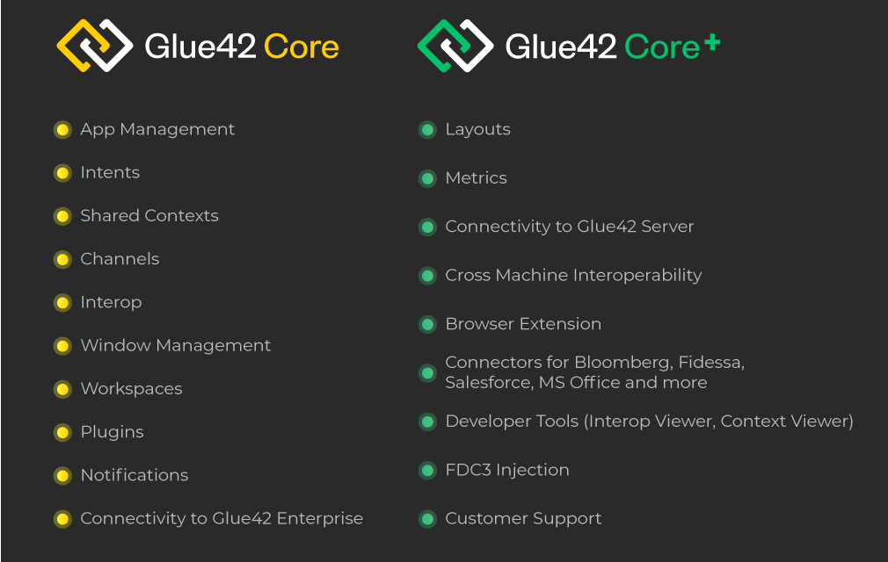

## Table of Contents

## What is Core Plus and what does it aim to achieve?

Core Plus is a type of investment strategy that focuses on building a portfolio with a mix of core and satellite investments. Core investments are usually stable and reliable, like big company stocks or bonds. Satellite investments are riskier but can offer higher returns, like smaller company stocks or new technology funds. The idea is to have a strong base with the core investments and then try to grow the portfolio more with the satellite investments.

The main goal of Core Plus is to balance risk and reward. By having a solid foundation with core investments, the portfolio is protected against big losses. At the same time, the satellite investments give a chance to earn more money. This strategy helps investors to grow their money over time while keeping things safer than if they only invested in risky assets.

## How does Core Plus differ from other similar systems?

Core Plus is different from other investment strategies because it mixes two types of investments: core and satellite. Core investments are safe and steady, like big company stocks or bonds. They form the main part of the portfolio and help keep it stable. Satellite investments are more risky but can grow faster, like small company stocks or new tech funds. They are added to the portfolio to try and make more money. This mix is what makes Core Plus unique compared to strategies that might focus only on safe investments or only on risky ones.

Another way Core Plus differs is in its goal to balance risk and reward. Some strategies might aim for the highest possible returns and take big risks to get there. Others might focus on safety and avoid risk as much as possible. Core Plus tries to find a middle ground. It uses the core investments to protect the portfolio from big losses, while the satellite investments aim to increase the overall growth. This approach can be more appealing to investors who want to grow their money but don't want to take too much risk.

## What are the basic components of Core Plus?

The basic components of Core Plus are core investments and satellite investments. Core investments are the safe and steady part of the portfolio. They include things like big company stocks and bonds. These investments are chosen because they are less likely to lose a lot of value. They form the main part of the portfolio and help keep it stable.

Satellite investments are the riskier part of the portfolio. They include things like small company stocks and new technology funds. These investments can grow faster but they also have a higher chance of losing value. They are added to the portfolio to try and make more money. By balancing these two types of investments, Core Plus aims to grow the portfolio while keeping it safer than if it only had risky investments.

## How can someone get started with using Core Plus?

To get started with Core Plus, you first need to understand what you want from your investments. Think about how much risk you're okay with and what your goals are. Then, you can start building your portfolio. Begin with core investments, which are the safe parts like big company stocks or bonds. These will be the main part of your portfolio and help keep it steady.

Next, add satellite investments to your portfolio. These are riskier but can help your money grow faster, like small company stocks or new technology funds. You don't need to put a lot of money into these, just enough to try and boost your overall returns. Once you have both core and satellite investments, keep an eye on how they're doing. You might need to adjust your mix over time to make sure it still fits your goals and how much risk you're comfortable with.

## What are the key functionalities of Core Plus?

Core Plus is a way to invest money that uses two main parts: core investments and satellite investments. Core investments are safe and steady, like big company stocks or bonds. They make up the main part of your money and help keep it safe. Satellite investments are riskier but can grow faster, like small company stocks or new technology funds. You add these to your money to try and make more.

The key thing about Core Plus is that it tries to balance risk and reward. It uses the safe core investments to protect your money from big losses. At the same time, it uses the riskier satellite investments to try and grow your money more. This mix helps you grow your money over time while keeping it safer than if you only used risky investments.

## Can you explain the user interface of Core Plus?

The user interface of Core Plus is made to be easy to use. When you open the app or website, you see a main screen that shows your whole portfolio. It has a simple design with big buttons and clear labels. You can see how much money you have in core investments and how much in satellite investments. There are also graphs and charts that help you understand how your money is doing over time.

To do things like adding money or changing your investments, you just need to click on the right buttons. The interface guides you through the steps, so it's not hard to figure out. There's also a section where you can learn more about Core Plus and get tips on how to manage your investments. Everything is set up to be clear and simple, so you can focus on growing your money without getting confused.

## How does Core Plus handle data security and privacy?

Core Plus takes data security and privacy very seriously. When you use Core Plus, your personal information and money details are kept safe with strong security measures. They use things like encryption to make sure your data is protected from hackers. Plus, Core Plus follows all the rules about keeping your information private, so you can trust that they won't share your details with others without your okay.

The app or website also has ways to make sure you're the only one who can get into your account. You might need to use a password, or even a special code sent to your phone, to log in. This helps keep your money and information safe. If you ever have questions or worries about your data, Core Plus has a team ready to help you out and make sure everything is okay.

## What are the integration capabilities of Core Plus with other software?

Core Plus is designed to work well with other software. It can connect with popular financial tools and apps, so you can easily move your money data between different programs. For example, if you use a budgeting app, Core Plus can share your investment information with it. This makes it easier to keep track of all your money in one place.

The way Core Plus integrates with other software is simple and user-friendly. You can set up these connections through the settings in the Core Plus app or website. Once you link Core Plus with another app, it keeps your data up to date automatically. This means you don't have to enter the same information over and over, saving you time and making things less confusing.

## What advanced features does Core Plus offer to experienced users?

Core Plus has some special features for people who know a lot about investing. One of these is the ability to make custom investment plans. This means you can set up your own mix of core and satellite investments based on what you think will work best for you. You can also use tools that let you see what might happen to your money in different situations. This helps you make smart choices about where to put your money.

Another cool thing for experienced users is the option to use advanced data analysis. Core Plus can show you detailed reports and charts about how your investments are doing. You can look at trends over time and see how different parts of your portfolio are performing. This helps you make changes to your investments to keep them growing. Plus, there's a feature where you can set up automatic alerts. These alerts let you know if something important happens with your investments, so you can act quickly if you need to.

## How can Core Plus be customized to meet specific user needs?

Core Plus can be customized to fit what you need by letting you choose your own mix of core and satellite investments. If you want to be safer, you can put more money into core investments like big company stocks or bonds. If you want to try and make more money, you can add more satellite investments like small company stocks or new technology funds. You can change this mix anytime to match your goals and how much risk you're okay with.

There are also tools in Core Plus that help you make it work better for you. You can set up alerts to let you know when something important happens with your investments. Plus, you can use reports and charts to see how your money is doing and make changes if you need to. This way, Core Plus can be set up just the way you want it to help you reach your money goals.

## What are the scalability options available in Core Plus?

Core Plus is designed to grow with you as your money goals change. If you start with a small amount of money, you can still use Core Plus to manage it. As you save more or want to invest more, Core Plus lets you add more money to your portfolio easily. This means you can keep using the same system without needing to switch to something else as your investments get bigger.

The system also lets you adjust your mix of core and satellite investments as your needs change. If you want to take on more risk to try and make more money, you can add more satellite investments. If you want to be safer, you can put more money into core investments. This flexibility makes Core Plus a good choice no matter how much your investments grow or how your goals change over time.

## What kind of support and resources are available for troubleshooting Core Plus?

If you run into any problems with Core Plus, there are lots of ways to get help. You can use the help section on the website or app, which has guides and FAQs that answer common questions. If you can't find what you need there, you can reach out to the support team. They are friendly and ready to help you fix any issues you're having. You can contact them by email, phone, or through a live chat feature, so you can choose what's easiest for you.

There are also community forums where you can talk to other people who use Core Plus. You can ask questions and share tips with them. This can be a great way to learn more and solve problems because someone else might have had the same issue and can tell you how they fixed it. Plus, Core Plus often has webinars and workshops that teach you more about how to use the system and get the most out of your investments.

## What are Financial Examples of Core Plus Strategies?

Core plus investment strategies incorporate a mix of conservative, core holdings and more opportunistic, higher-risk investments. This blend allows investors to navigate varying market conditions while seeking additional returns. Examining specific examples of core plus funds in the fixed-income and equity markets can illuminate how these strategies are applied in practice.

### Fixed-Income Core Plus Funds: JPMorgan Core Plus Bond Fund

The JPMorgan Core Plus Bond Fund exemplifies how core plus strategies are implemented within the fixed-income sector. This fund primarily invests in investment-grade bonds but tactically allocates a portion of its assets to high-yield and emerging market bonds. By doing so, it seeks to enhance yield and return potential beyond what traditional fixed-income strategies might offer. The fund managers utilize macroeconomic analysis and extensive market research to adjust their allocations dynamically, aiming to capitalize on [interest rate](/wiki/interest-rate-trading-strategies) changes and credit spread variations.

For a quantitative evaluation, consider a simple expected return calculation for a core plus bond fund expressed as:

$$
E(R) = w_1 \cdot E(R_1) + w_2 \cdot E(R_2)
$$

where $w_1$ and $w_2$ represent the proportion of the portfolio invested in core and plus components, respectively, and $E(R_1)$ and $E(R_2)$ are their expected returns.

### Equity Core Plus Funds: JPMorgan U.S. Large Cap Core Plus Fund

In the equity domain, the JPMorgan U.S. Large Cap Core Plus Fund offers insight into how core plus strategies can be applied. This fund targets large-cap U.S. equities, forming the core of the portfolio consisting primarily of stable, high-quality companies. To bolster potential returns, the fund also includes tactical investments in mid-cap stocks and other asset classes that may present high growth opportunities. This dual approach allows the fund to maintain a stable foundation while seeking outperformance through calculated risk-taking.

### Real-World Applications and Benefits

These examples reveal the strategic flexibility provided by core plus strategies. By balancing core stability with potential high-reward investments, fund managers can effectively respond to diverse market challenges. For investors, this means enhanced diversification and a refined risk-reward profile.

In practice, these funds leverage algorithmic trading and quantitative models to adjust portfolio components efficiently, mitigating risks, and exploiting short-term market movements. This agility is crucial in today's fast-paced markets, enabling managers to optimize timing and asset selection with precision.

Both the JPMorgan Core Plus Bond Fund and the JPMorgan U.S. Large Cap Core Plus Fund illustrate core plus strategies' capacity to blend predictable returns with the pursuit of additional gains. These approaches show that with prudent management and decisive execution, core plus strategies can provide a robust investment framework adaptable to fluctuating market environments.

## What is Backtesting and How Does it Optimize Core Plus Strategies?

Backtesting plays a critical role in evaluating the performance of core plus strategies by allowing investors to simulate and test their strategic ideas using historical data. This process helps in understanding how a strategy might have performed in the past, which can provide insights into its potential effectiveness.

### Importance of Backtesting

Backtesting enables investors to assess the viability of their core plus strategies before allocating real capital. By using historical market data, investors can judge whether a strategy aligns with their investment goals and risk tolerance. This evaluation helps in identifying the strengths and weaknesses of a strategy, which is crucial for optimization and refinement.

### Key Metrics in Backtesting

Several key metrics are instrumental in evaluating the performance of a backtested strategy:

1. **Return on Investment (ROI):** This metric is used to quantify the profitability of an investment strategy. In mathematical terms, ROI is calculated as:
$$
   \text{ROI} = \frac{\text{Final Portfolio Value} - \text{Initial Portfolio Value}}{\text{Initial Portfolio Value}} \times 100

$$

2. **Drawdown:** Drawdown measures the decline from a peak to a trough during a specific period. It helps in understanding the risk profile of a strategy. A smaller drawdown indicates a less volatile and more stable strategy.

3. **Ulcer Index:** The Ulcer Index is a measure of downside risk that accounts for both the depth and duration of price declines. It is particularly useful for core plus strategies that aim to preserve capital during volatile market conditions. The Ulcer Index is calculated as the square root of the mean of squared percentage drawdowns from the highest equity point over a period.
$$
   \text{Ulcer Index} = \sqrt{\frac{1}{N} \sum_{i=1}^{N} \left( \frac{\text{Price}_{i} - \text{Max Price Prior}_{i}}{\text{Max Price Prior}_{i}} \right)^2 }

$$

### Strategy Refinements and Risk Management

Backtesting provides critical insights that can lead to strategy refinements. By analyzing historical performance, investors can adjust parameters to improve returns while minimizing risks. Effective risk management strategies, such as stop-loss orders and diversification, can be implemented based on backtesting results. 

A well-constructed backtesting framework allows for the continuous development and adjustment of strategies. Using programming languages like Python, investors can automate the backtesting process. Python's powerful libraries, including pandas and numpy, offer robust tools for data analysis and visualization.

The insights gained from backtesting contribute significantly to risk management. By identifying potential pitfalls early on, investors can mitigate risks associated with overexposure and volatile market conditions, thereby enhancing the overall stability of the core plus strategy.

In summary, backtesting is an invaluable tool for optimizing core plus strategies, providing a foundation for informed decision-making and investment precision.

## References & Further Reading

1. **Core Plus Investment Strategies**
   - Title: "Core Plus Bond Strategies: The Structure of Core Plus Strategies"
   - Authors: Laurence B. Siegel and Caroline S. Harlow
   - Published in: Journal of Portfolio Management
   - Summary: This paper discusses the structure and characteristics of core plus bond strategies, illustrating how they allocate assets between core, lower-risk investments, and opportunistic, higher-risk options.
   - Link: Available through major financial databases like JSTOR or directly from the Journal of Portfolio Management website.

2. **Algorithmic Trading**
   - Title: "Algorithmic and High-Frequency Trading"
   - Authors: Albert J. Menkveld
   - Published in: Annual Review of Financial Economics
   - Summary: This work provides comprehensive insight into the principles, mechanics, and effects of algorithmic and high-frequency trading in financial markets.
   - Link: Available in the Annual Review of Financial Economics or through university library access points.

3. **Backtesting Methods**
   - Title: "Backtesting Trading Strategies in Financial Markets"
   - Authors: Robert Engle and Sinan Demiralp
   - Published in: Securities, and Exchange Commission working papers
   - Summary: Offers a detailed methodology for backtesting trading strategies, emphasizing statistical models used for performance evaluation under varying conditions.
   - Link: Available on the SEC's website or through research platforms such as SSRN.

4. **Trading Strategy Optimizations**
   - Title: "Advances in Financial Machine Learning"
   - Authors: Marcos López de Prado
   - Publisher: Wiley
   - Summary: This book provides a guide to using machine learning techniques in the optimization and backtesting of trading strategies, offering practical Python code examples.
   - Link: Available through major book retailers and libraries.

5. **Risk Management in Core Plus Strategies**
   - Title: "Risk Management and Financial Institutions"
   - Author: John C. Hull
   - Publisher: Wiley
   - Summary: Outlines comprehensive risk management frameworks applicable to core plus strategies as well as other financial contexts.
   - Link: Available through Wiley or academic libraries.

6. **Further Exploration of Trading Strategies**
   - Title: "Systematic Trading: A unique new method for designing trading and investing systems"
   - Author: Robert Carver
   - Publisher: Harriman House
   - Summary: Provides insights into designing trading systems, including discussions on systematic trading strategies, risk management, and backtesting applications.
   - Link: Available through Harriman House and various booksellers.

These resources form a comprehensive foundation for understanding, implementing, and optimizing core plus investment strategies and algorithmic trading. Academic papers and [books](/wiki/algo-trading-books) listed here are highly recommended for professionals seeking in-depth knowledge in these fields.

