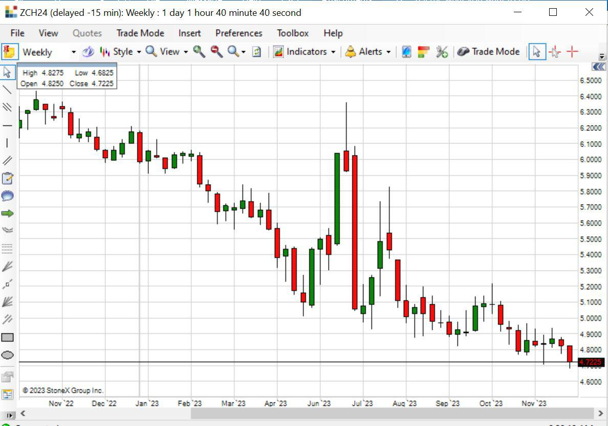

## Table of Contents

## What are corn futures?

Corn futures are contracts that farmers, traders, and investors use to buy or sell corn at a set price for delivery on a specific date in the future. These contracts help people manage the risk of price changes in corn. For example, a farmer might sell corn futures to lock in a price for their crop before it's even harvested. This way, if the price of corn drops later, the farmer is protected because they already agreed on a price.

People who buy corn futures, like food companies, do so to make sure they have corn at a known price, even if the market price goes up. This helps them plan their budgets and manage costs. Trading corn futures happens on exchanges, like the Chicago Board of Trade, where buyers and sellers come together to make these deals. The price of corn futures can go up or down based on things like weather, global demand, and other market conditions.

## How do corn futures work?

Corn futures are like a promise to buy or sell corn at a certain price on a specific date in the future. They are traded on big markets called exchanges, where farmers, food companies, and traders come together. If you're a farmer, you might sell corn futures to make sure you get a good price for your corn even before it's ready to be picked. This way, if the price of corn goes down later, you're safe because you already set a price. On the other hand, if you're a food company, you might buy corn futures to make sure you can get corn at a price you know, even if the market price goes up later.

The price of corn futures can change every day because of things like the weather, how much corn people want around the world, and other stuff happening in the market. When you trade corn futures, you don't actually get the corn right away. Instead, you agree on a price now for corn that will be delivered later. If the price of corn goes up after you buy a future, you can sell it for a profit. But if the price goes down, you might lose money. That's why people use corn futures to manage the risk of price changes, helping them plan better and feel more secure about the future.

## What are the benefits of trading corn futures?

Trading corn futures can help people manage the risk of price changes. For example, a farmer can sell corn futures to lock in a price for their crop before it's even ready. This way, if the price of corn drops later, the farmer doesn't lose money because they already agreed on a good price. On the other hand, a food company can buy corn futures to make sure they have corn at a set price, even if the market price goes up later. This helps them plan their budgets and manage costs better.

Another benefit is that trading corn futures can be a way to make money. If you think the price of corn will go up, you can buy corn futures now and sell them later for a profit. But it's also risky because if the price goes down, you might lose money. Still, for people who know the market well, trading corn futures can be a good way to earn extra income. It's all about understanding the market and making smart guesses about where prices are headed.

## What are the risks involved in corn futures trading?

Trading corn futures can be risky because the price of corn can go up or down a lot. If you buy a corn future and the price goes down before you sell it, you could lose money. For example, if you buy a future expecting the price to rise but it falls instead, you'll have to sell it at a lower price than you paid, which means you lose money. This can happen because of things like bad weather, changes in how much corn people want, or other things happening in the market that you can't control.

Another risk is that trading futures often involves using borrowed money, called margin. This means you can trade with more money than you actually have, which can make your profits bigger if things go well. But if things go badly, your losses can also be a lot bigger. If the price moves against you, you might have to put in more money to keep your trade open, and if you can't, you could lose everything you put in. So, it's really important to understand these risks and be ready for the possibility of losing money when you trade corn futures.

## How can one start trading corn futures?

To start trading corn futures, you first need to open an account with a futures broker. This is a company that helps you buy and sell futures contracts. You'll need to fill out some forms and maybe talk to someone at the broker's office. Once your account is set up, you'll need to put some money into it, called margin. This is like a deposit that lets you trade futures. The amount you need to start can be different depending on the broker and how much you want to trade.

After you have an account and some money in it, you can start trading. You can do this by calling your broker or using their online trading platform. To trade corn futures, you need to decide if you think the price of corn will go up or down. If you think it will go up, you buy a futures contract. If you think it will go down, you sell one. Remember, trading futures can be risky, so it's a good idea to learn as much as you can about the market and maybe practice with a demo account before you start trading with real money.

## What are the key factors that influence corn futures prices?

The price of corn futures can go up or down because of many things. One big thing is the weather. If there's a lot of rain or a drought, it can hurt the corn crops, making less corn available. When there's less corn, the price can go up because people still need it. Another thing is how much corn people want around the world. If more countries need corn for food or to feed animals, the demand goes up and so does the price. Also, if the government changes laws about farming or trade, that can affect corn prices too.

Another factor is what's happening in other markets. For example, if the price of other grains like wheat or soybeans changes, it can affect corn prices because farmers might choose to grow more of one crop over another. The price of oil can also play a part because corn is used to make ethanol, a type of fuel. If oil prices go up, more people might want to use ethanol, which can push corn prices up. Finally, what traders think might happen in the future can move prices too. If they think corn prices will go up, they might buy futures now, which can make the price go up right away.

## What are the major trading platforms for corn futures?

The main place where people trade corn futures is the Chicago Board of Trade (CBOT). This is a big market where farmers, food companies, and traders come together to buy and sell corn futures. The CBOT is part of the CME Group, which is a really big company that runs lots of different markets. When you want to trade corn futures, you usually do it through a broker who is connected to the CBOT.

Another place where corn futures are traded is the Intercontinental Exchange (ICE). This is another big market, but it's not as focused on corn as the CBOT. Still, some people use the ICE to trade corn futures because it's another option. Both the CBOT and the ICE have websites where you can see the prices of corn futures and other information that can help you decide when to buy or sell.

## How do you analyze corn futures markets?

To analyze corn futures markets, you need to look at a lot of different things. One big thing is the weather, because it can really affect how much corn farmers can grow. If there's too much rain or not enough, it can hurt the crops and make less corn available. Another thing to look at is how much people want corn around the world. If more countries need corn for food or to feed animals, the demand goes up and the price might go up too. You also need to keep an eye on what the government is doing, like changing laws about farming or trade, because that can change corn prices.

Another way to analyze corn futures is by looking at what's happening in other markets. For example, if the price of other grains like wheat or soybeans changes, it can affect corn prices because farmers might decide to grow more of one crop over another. The price of oil is important too, because corn is used to make ethanol, a type of fuel. If oil prices go up, more people might want to use ethanol, which can push corn prices up. Finally, you can use charts and numbers to see patterns in corn futures prices. This can help you guess where prices might go in the future, but it's not always easy because a lot of things can change suddenly.

## What are some common trading strategies for corn futures?

One common strategy for trading corn futures is called trend following. This means you watch the price of corn to see if it's going up or down over time. If you see that the price is going up, you might buy a corn future because you think it will keep going up. If the price is going down, you might sell a corn future because you think it will keep going down. This strategy works best if you're good at spotting patterns and if you're patient, because it can take time for trends to play out.

Another strategy is called hedging. This is what farmers and food companies often do to protect themselves from big price changes. If you're a farmer, you might sell corn futures to lock in a good price for your corn before it's even ready to be picked. That way, if the price of corn goes down later, you're safe because you already agreed on a price. If you're a food company, you might buy corn futures to make sure you can get corn at a price you know, even if the market price goes up later. This helps you plan your budget and manage costs better.

A third strategy is called spread trading. This is when you buy and sell different corn futures contracts at the same time. For example, you might buy a corn future for one month and sell a corn future for a different month. The idea is to make money from the difference in prices between the two contracts. This strategy can be less risky than just buying or selling one future, but it still needs a good understanding of how the market works and what might happen in the future.

## How do weather patterns affect corn futures?

Weather patterns have a big impact on corn futures because they affect how much corn farmers can grow. If there's too much rain, it can cause flooding and damage the corn crops. On the other hand, if there's not enough rain, it can lead to a drought, which also hurts the corn. When the weather is bad and less corn is produced, there's less corn available for people to buy. This can make the price of corn futures go up because everyone still needs corn, but there's not as much to go around.

People who trade corn futures watch the weather closely because it helps them guess what might happen to corn prices. If they see that bad weather is coming, they might buy corn futures because they think the price will go up when the corn supply goes down. But if the weather looks good and there's going to be a lot of corn, they might sell corn futures because they think the price will go down. So, the weather is really important for figuring out what to do in the corn futures market.

## What role do government policies play in corn futures trading?

Government policies can really change how corn futures prices move. For example, if the government decides to give money to farmers to grow more corn, there might be more corn around, which can make the price go down. On the other hand, if the government puts new rules on how much corn can be grown or how it can be traded, it might make less corn available, and that can make the price go up. Also, if the government changes laws about using corn for things like ethanol, it can affect how much people want corn, which changes the price too.

People who trade corn futures need to keep an eye on what the government is doing because these policies can make a big difference. If they think a new policy will make corn prices go up, they might buy corn futures to make money later. But if they think a policy will make prices go down, they might sell corn futures to avoid losing money. So, understanding government policies is a big part of trading corn futures and can help traders make better choices.

## How can advanced traders use options in conjunction with corn futures?

Advanced traders can use options along with corn futures to make their trading strategies more flexible and manage their risks better. Options give traders the right, but not the obligation, to buy or sell corn futures at a set price before a certain date. For example, if a trader thinks the price of corn will go up, they might buy a call option, which lets them buy a corn future at a lower price later. If the price does go up, they can make money by buying the future at the lower price and selling it at the higher market price. On the other hand, if they think the price will go down, they might buy a put option, which lets them sell a corn future at a higher price later. This can protect them from losing money if the price falls.

Using options with corn futures can also help traders make money in different ways. For instance, a trader might use a strategy called a straddle, where they buy both a call option and a put option with the same price and date. This can be useful if they think the price of corn will move a lot but aren't sure which way. If the price goes up a lot, the call option will make money. If it goes down a lot, the put option will make money. Another strategy is a spread, where a trader buys and sells different options at the same time. This can help them make money from the difference in prices between the options. By using options smartly, advanced traders can create more chances to make money and protect themselves from big losses in the corn futures market.

## References & Further Reading

[1]: Chicago Board of Trade. ["CBOT Corn Futures Contract Specification."](https://www.cmegroup.com/markets/agriculture/grains/corn.html) CME Group.

[2]: Hull, John C. (2015). ["Options, Futures, and Other Derivatives."](https://www.semanticscholar.org/paper/Options%2C-Futures%2C-and-Other-Derivatives-Hull/89bdee500c8623864fc9eb7a471546aa713acc44) 10th Edition, Pearson.

[3]: Narang, Rishi K. (2013). ["Inside the Black Box: The Simple Truth About Quantitative Trading."](https://onlinelibrary.wiley.com/doi/book/10.1002/9781118267738) Wiley.

[4]: Aldridge, Irene. (2013). ["High-Frequency Trading: A Practical Guide to Algorithmic Strategies and Trading Systems."](https://www.amazon.com/High-Frequency-Trading-Practical-Algorithmic-Strategies/dp/1118343506) Wiley.

[5]: CME Group. ["Globex."](https://www.cmegroup.com/globex.html) CME Group.

[6]: Intercontinental Exchange. ["Agricultural Derivatives."](https://www.ice.com/agriculture) ICE.

[7]: International Monetary Fund. ["Global Commodity Markets."](https://www.imf.org/en/Research/commodity-prices) 

[8]: Dalian Commodity Exchange. ["Corn Futures."](http://www.dce.com.cn/DCE/) Dalian Commodity Exchange.