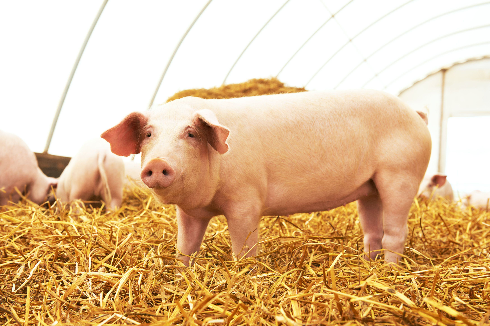

The commodity markets for agricultural products such as corn and hogs are fundamental to the global economy. These markets are integral not only because they supply essential food items but also due to their significant role in international trade and economic stability. A pivotal metric in these markets is the corn-hog ratio. This ratio is a vital analytical tool that helps gauge the profitability of using corn feed for raising livestock, specifically hogs. The corn-hog ratio is calculated by dividing the price of a hog by the cost of the corn required to sustain it, providing farmers with a clear indicator of whether it is more profitable to sell corn directly or to use it as feed for hogs. A higher ratio suggests that raising hogs is more lucrative, whereas a lower ratio could incentivize selling the corn crop.

In recent years, there have been notable advancements in agricultural economics combined with the emergence of algorithmic trading. These developments have fundamentally transformed traditional commodity trading strategies. Algorithmic trading, which uses complex algorithms to automate trading decisions, has enhanced trading efficiency and increased market liquidity. The dawn of such technologies allows traders to optimize their trades, manage risks more effectively, and potentially reduce costs associated with trading activities.



This article undertakes a comprehensive examination of these transformations, focusing on how technological innovations are influencing the future of agricultural markets. By investigating the complexities of current markets and emerging technologies, we aim to understand the new dynamics shaping the agricultural sector. This evolution presents fresh challenges and opportunities for stakeholders, requiring an adaptive approach to engage successfully with these changing environments. As technology continues to evolve, stakeholders must embrace innovation to stay competitive and harness the potential benefits of these advancements.

## Table of Contents

## Understanding the Corn-Hog Ratio

The corn-hog ratio serves as a crucial financial measure for livestock farmers, particularly those involved in raising hogs with corn as a primary feed source. This ratio is calculated by dividing the market price of a hog by the cost of the corn required to sustain it. Mathematically, it can be expressed as:

$$
\text{Corn-Hog Ratio} = \frac{\text{Price of Hog}}{\text{Cost of Corn Feed}}
$$

This calculation helps farmers make informed decisions about their livestock and crop management strategies. When the ratio is high, it indicates that the profitability of raising hogs exceeds the potential earnings from selling the corn directly. Consequently, farmers are more likely to choose to feed their corn to hogs rather than selling the crop. Conversely, a lower corn-hog ratio suggests that selling the corn might be more economically viable than using it as feed.

The corn-hog ratio's significance lies in its ability to reflect current market conditions, allowing farmers to adapt their operations accordingly. Fluctuations in the prices of hogs and corn can substantially impact this ratio. Therefore, farmers closely monitor these changes to better align their practices with the prevailing economic landscape. By doing so, they aim to maximize their profitability and ensure the sustainability of their operations.

This ratio remains an essential tool for farmers, guiding them in determining the most advantageous approach to managing their resources based on the dynamic interplay between corn and hog markets.

## Impact of Corn Prices on Hog Markets

Corn prices are a fundamental determinant in the cost structure of hog farming. This relationship is primarily driven by the feed cost, which constitutes a major portion of the expenses in raising hogs. The corn-hog ratio, calculated by dividing the market price of hogs by the price of corn, reflects this economic interrelationship. As corn prices escalate, the cost of feeding hogs increases, which typically results in a rise in pork prices. This is because producers need to cover the elevated feed costs, often passing them on to consumers in the form of higher pork prices.

The fluctuation in the corn-hog ratio serves as a crucial indicator for farmers and stakeholders in the hog industry. When corn prices rise significantly, the ratio decreases, implying reduced profitability from raising hogs. In such scenarios, farmers might consider adjusting their production strategies, such as managing herd size or altering feed compositions, to mitigate the impact of increased costs.

Monitoring corn market trends is essential for stakeholders in the pork industry due to this interdependence. Price changes in corn can result from various factors, including weather conditions, global supply and demand dynamics, and policy decisions. Effective anticipation and response to these changes can lead to better decision-making and risk management. Employing predictive analytics and market insights can provide farmers and producers with the necessary tools to adapt to volatile corn prices. This adaptation is crucial not only for maintaining profitability but also for sustaining competitive advantage in the agricultural sector.

## Algorithmic Trading in Agricultural Commodity Markets

Algorithmic trading has brought a significant evolution to the trading of agricultural commodities such as corn and hogs, transforming conventional trading strategies into more adaptive and efficient mechanisms. By leveraging advanced computational algorithms, traders can automatically execute trades at speeds and frequencies that are not possible for manual trading. This automation is particularly beneficial in managing the complexities of supply and demand in the agriculture market.

The primary advantage of [algorithmic trading](/wiki/algorithmic-trading) lies in its ability to optimize trades by using complex mathematical models and statistical analyses. These algorithms evaluate market data in real time, allowing traders to adjust their strategies swiftly to mitigate risks and capitalize on market trends. For instance, in the corn market, an algorithm might track weather conditions and predict their impact on corn yields, enabling timely buy or sell orders that align with anticipated market shifts.

Algorithmic trading also contributes to improved market [liquidity](/wiki/liquidity-risk-premium). Intensive algorithmic quoting, which involves frequent and automated placement of bids and offers, enhances price discovery and reduces bid-ask spreads. This results in more efficient pricing and diminishes short-term [volatility](/wiki/volatility-trading-strategies), offering a more stable market environment for participants.

In agricultural markets like corn and soybean, algorithmic trading offers quantifiable advantages but also poses certain challenges. While algorithmic strategies can increase trading [volume](/wiki/volume-trading-strategy) and market depth, they sometimes induce liquidity costs, especially in less liquid markets. In cases of extreme volatility or low trading volume, algorithms may inadvertently exacerbate price swings or create temporary liquidity shortages.

The impact of algorithmic trading on the corn and soybean markets is mixed; while it improves operational efficiency and market quality under normal conditions, it requires careful management to avoid negative externalities during market disturbances. Traders and market regulators continue to adapt algorithmic strategies to better address these complexities, ensuring that the benefits outweigh the potential downsides.

Algorithmic trading's influence on agricultural commodity markets reflects its potential to reshape traditional trading paradigms. By offering advanced tools to navigate these markets, it supports traders in maintaining a competitive edge, adapting to rapid changes, and optimizing resource allocation. As technology and algorithmic techniques evolve, their application in trading agricultural commodities like corn and hogs is likely to expand, further transforming the landscape of agricultural economics.

## Modern Applications of the Corn-Hog Ratio

In modern agricultural practices, the corn-hog ratio remains an essential tool for evaluating pork production's economic viability, yet it has evolved beyond its traditional scope. Leveraging technological advancements, farmers and investors today incorporate a multitude of data inputs, transforming how they assess this critical metric. Real-time data acquisition and the application of predictive analytics have become integral components of decision-making processes, enabling stakeholders to respond swiftly to market fluctuations.

Traditionally, the corn-hog ratio, calculated by dividing the price of a hog by the cost of corn required for its feed, provided a straightforward economic assessment. For instance, if a hog sells for $100 and the corn needed is $25, the ratio is 4:1. Today, however, this calculation is often enhanced with additional variables such as weather forecasts, currency exchange rates, and global market trends, which can all influence both corn supply and hog demand.

Predictive analytics plays a notable role, providing forecasts based on historical data and [machine learning](/wiki/machine-learning) algorithms, allowing producers to anticipate market trends and adjust their strategies accordingly. For example, Python libraries such as pandas and scikit-learn can be utilized to build predictive models that analyze time series data, giving farmers a competitive advantage. Here is a basic example of how predictive analytics might be applied using Python:

```python
import pandas as pd
from sklearn.model_selection import train_test_split
from sklearn.linear_model import LinearRegression

# Sample time series data for corn prices and hog prices
data = pd.DataFrame({
    'corn_price': [3.5, 3.6, 3.8, 3.9, 4.0],
    'hog_price': [70, 72, 74, 75, 77]
})

# Creating lagged features for input into the model
data['lagged_corn_price'] = data['corn_price'].shift(1)
data.dropna(inplace=True)

# Define features and target variable
X = data[['corn_price', 'lagged_corn_price']]
y = data['hog_price']

# Split data into training and testing data
X_train, X_test, y_train, y_test = train_test_split(X, y, test_size=0.2, random_state=0)

# Initialize and fit the model
model = LinearRegression()
model.fit(X_train, y_train)

# Predict future hog prices
predictions = model.predict(X_test)
print(predictions)
```

This code snippet demonstrates how historical data on corn and hog prices can be processed to forecast future price trends, thus refining the corn-hog ratio's relevance in strategic planning.

Despite these technological capabilities, the corn-hog ratio remains a fundamental benchmark for gauging the general profitability of hog farming annually. It provides an accessible metric for producers who may not have the resources to leverage advanced analytical tools but still require a reliable indicator to inform their production and sales decisions.

Therefore, while modern applications have expanded the analytical capabilities surrounding the corn-hog ratio, it continues to serve its traditional purpose, bridging the gap between accessible marker assessments and sophisticated data-driven insights.

## Challenges and Opportunities in Agricultural Economics

Agricultural economics is influenced by a myriad of challenges and opportunities that shape market dynamics. Fluctuating input costs, primarily driven by variability in raw material prices like seeds, fertilizers, and fuel, can lead to significant uncertainty for farmers and traders. The unpredictability in prices necessitates improved risk management strategies. For instance, cost forecasting models can be developed to better predict input cost trends and mitigate financial risks.

Climate change poses another formidable challenge, as it directly impacts crop yields, water availability, and farming practices. Changes in temperature, rainfall patterns, and increased frequency of extreme weather events require adaptive strategies for sustainable agriculture. Innovations in crop management, drought-resistant seeds, and precision agriculture technologies are gaining prominence to address these environmental challenges, enhancing the adaptability and resilience of farming operations.

International trade dynamics further complicate agricultural markets. Tariffs, trade agreements, and geopolitical tensions can disrupt supply chains, affecting both the availability and pricing of agricultural products. Navigating these uncertainties demands robust market analysis and strategic planning. Opportunities lie in diversifying export markets, leveraging global networks, and utilizing trade facilitation technologies to maintain market competitiveness.

Technological advancements offer vast potential to address these challenges and seize emerging opportunities. The integration of big data analytics and machine learning in agricultural models can significantly enhance forecasting accuracy and decision-making processes. For example, farmers can employ machine learning algorithms to predict crop yields based on historical data and climatic conditions, optimizing their planting and harvesting schedules.

Sustainability is a growing focus within agricultural economics. The shift towards environmentally friendly practices, such as regenerative agriculture and sustainable resource management, underscores the necessity for innovations that reduce environmental impact. Improving resource use efficiency, minimizing waste, and adopting circular economy principles can contribute to more sustainable agricultural systems.

In conclusion, while the challenges in agricultural economics are significant, they spur the potential for technological and strategic innovations. By adopting these innovations, the agricultural sector can enhance resilience, sustainability, and profitability amidst evolving market conditions.

## Conclusion

The interplay between corn and hog markets, accentuated by the corn-hog ratio, underscores the intricate dynamics of agricultural economics. This ratio serves as a vital metric for assessing the profitability of pork production by highlighting the relationship between feed costs and livestock value. Its importance is amplified in an era where algorithmic trading is reshaping commodity markets. Algorithmic strategies facilitate increased efficiency by enabling traders to quickly adapt to price fluctuations, thus optimizing trade outcomes. They help mitigate risk, enhance market liquidity, and improve pricing efficiency. For example, by employing predictive algorithms that analyze real-time data on corn prices and hog market trends, traders and farmers can make more informed decisions.

Technological advancements are crucial for stakeholders within the agricultural sector. Embracing innovation allows these stakeholders to efficiently navigate and respond to dynamic market conditions. Advanced data analytics and algorithmic tools provide a means to model complex market scenarios, evaluate risk factors, and forecast future price movements, which in turn facilitate more strategic planning. As technologies in data processing and machine learning continue to develop, the agricultural sector has an opportunity to further optimize resources, enhance sustainability, and bolster economic resilience.

In conclusion, the evolving nature of technology presents both challenges and opportunities. Stakeholders must adapt to leverage technological tools not only for survival but to achieve competitive advantage and sustainability in a fluctuating agricultural landscape. As the nexus between traditional metrics like the corn-hog ratio and contemporary technological innovations continues to evolve, embracing these changes is essential for long-term success in agricultural markets.

## References & Further Reading

[1]: McKann, L., & Joseph, S. (2020). ["Understanding the Corn-Hog Ratio in Agricultural Economics."](https://www.cambridge.org/core/journals/journal-of-agricultural-and-applied-economics/article/abs/statistical-significance-and-stability-of-the-hog-cycle/E0D34A8A64497BC41329AAEC3673FD43) Iowa State University Extension and Outreach.

[2]: Hull, J. C. (2020). ["Options, Futures, and Other Derivatives."](https://www.pearson.com/en-us/subject-catalog/p/options-futures-and-other-derivatives/P200000005938/9780136939917) Pearson Education.

[3]: Lopez de Prado, M. (2018). ["Advances in Financial Machine Learning."](https://www.amazon.com/Advances-Financial-Machine-Learning-Marcos/dp/1119482089) Wiley.

[4]: Shriver, M. D., & Parrott, N. (2017). ["Algorithmic Trading in Commodity Markets."](https://forum.scssoft.com/viewtopic.php?t=312135) CME Group Educational Materials.

[5]: Aronson, D. R. (2011). ["Evidence-Based Technical Analysis: Applying the Scientific Method and Statistical Inference to Trading Signals."](https://onlinelibrary.wiley.com/doi/book/10.1002/9781118268315) Wiley.