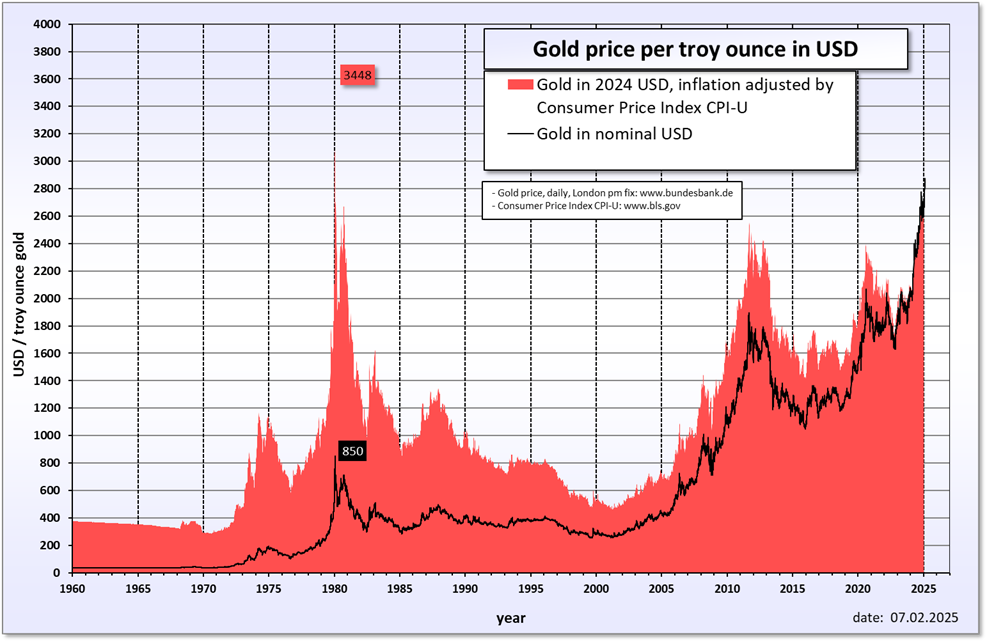

## Table of Contents

## What does 'cornering the market' mean?

Cornering the market means when one person or company gets control of almost all of a product or service. They do this so they can set the prices and control how much of the product is available. This can be done by buying up all the supplies, or by making it hard for others to sell the same thing.

This can be risky because it might be against the law. Many countries have rules to stop one company from having too much control. If a company corners the market, it might get in trouble with the government. But if they can do it without breaking the law, they can make a lot of money.

## Can you provide a simple example of cornering the market?

Imagine there's a small town where everyone loves to eat apples. There's only one farmer, Bob, who grows apples in the town. One day, Bob buys all the apple trees from the other farmers who were planning to start growing apples. Now, Bob is the only one who can sell apples in the town.

Since Bob has all the apple trees, he can decide how many apples to sell and how much to charge for them. If people want apples, they have to buy them from Bob. This is an example of cornering the market. Bob has control over the apple market in the town because he's the only one selling apples.

## What are the historical examples of cornering the market?

One famous example of cornering the market happened in the late 1800s with a man named Jay Gould. He tried to corner the market on gold in the United States. Gould and his partner, Jim Fisk, bought up as much gold as they could. They wanted to make the price of gold go up so they could sell it for a big profit. Their plan worked for a while, but when the government found out, they released more gold into the market. This caused the price of gold to crash, and Gould's plan failed.

Another example is the Hunt brothers, Nelson Bunker Hunt and William Herbert Hunt, who tried to corner the market on silver in the 1970s. They bought a lot of silver, hoping to control the price. At one point, they owned about a third of the world's silver. But when the price of silver started to fall, they couldn't keep buying more. In 1980, the price of silver crashed, and the Hunt brothers lost a lot of money. They had to declare bankruptcy because they couldn't pay back their loans.

These examples show how risky it can be to try to corner the market. It can lead to big profits if it works, but it can also lead to big losses and even legal trouble if it doesn't.

## What are the legal implications of cornering the market?

Cornering the market can get you in trouble with the law. Many countries have rules to stop one person or company from having too much control over a product or service. These rules are meant to keep the market fair for everyone. If someone tries to corner the market, they might be breaking these rules. They could be fined a lot of money or even go to jail. Governments want to make sure that no one can control prices or stop others from selling their products.

In the United States, for example, there are laws like the Sherman Antitrust Act that stop companies from trying to corner the market. If a company is found guilty of trying to control the market, the government can take them to court. The company might have to pay big fines and could be forced to break up into smaller companies. This is to make sure that no single company can have too much power over the market. So, while cornering the market might seem like a way to make a lot of money, it can lead to serious legal problems.

## How does cornering the market affect competition?

Cornering the market makes it hard for other people to compete. When one person or company controls most of a product or service, it's tough for others to sell the same thing. The person who cornered the market can set high prices and decide how much of the product is available. This means other sellers might not be able to make money because they can't sell enough or they have to sell at a lower price.

This can hurt the whole market. When there's no competition, the person who cornered the market doesn't have to worry about other sellers. They can keep prices high and might not care about making their product better. This can be bad for customers because they have to pay more and might not get the best quality. In the end, cornering the market can make the market less fair and less good for everyone.

## What are the economic consequences of cornering the market?

When someone corners the market, it can change how the economy works. They can control how much of a product is available and how much it costs. This can make prices go up a lot because there's not much competition. People who need the product might have to pay more than they want to. This can make life harder for them, especially if the product is something important like food or medicine. The person who cornered the market might make a lot of money, but it can hurt other businesses that can't sell their products anymore.

The economy can also become less stable when someone corners the market. If the price of the product goes up too much, people might stop buying it. This can cause the price to fall suddenly, which can be bad for the whole market. It can also make people lose trust in the market because they see that one person can control everything. Governments might have to step in to fix things, which can cost a lot of money. In the end, cornering the market can cause big problems for the economy and make things unfair for everyone else.

## What strategies can businesses use to attempt to corner the market?

Businesses can try to corner the market by buying up all the supplies of a product. They might buy all the factories that make the product or all the materials needed to make it. This way, no one else can make the product, and the business can control how much is sold and how much it costs. Another way is to make it hard for other businesses to sell the same product. They might do this by making special deals with stores or by using their power to stop others from selling.

Sometimes, businesses use their money to buy up all the shares of other companies that make the same product. This gives them control over those companies and helps them corner the market. They might also try to make laws or rules that help them and hurt other businesses. This can be risky because it might be against the law, but if they can do it without getting caught, they can make a lot of money.

## How can regulators detect attempts to corner the market?

Regulators can detect attempts to corner the market by watching how much of a product one person or company buys. If someone is buying a lot more than usual, it might mean they are trying to control the market. Regulators can also look at the price of the product. If the price goes up a lot suddenly, it could be because someone is trying to corner the market.

Another way regulators can find out if someone is trying to corner the market is by checking the company's records. They can see if the company is making deals that stop other businesses from selling the same product. Regulators can also talk to other businesses and see if they are having a hard time selling their products. If many businesses are having the same problem, it might mean someone is trying to corner the market.

## What are the ethical considerations of cornering the market?

Trying to corner the market can be seen as not fair or right. When one person or company controls everything, it can hurt other businesses and make life harder for people who need the product. It can make prices go up and stop other sellers from making money. This can be bad for the whole community because it makes the market less fair. People might feel like the system is not working for them if one person can control everything.

Also, cornering the market can make people lose trust in the market. When prices go up a lot and suddenly, people might think the market is not honest. They might feel like they are being taken advantage of. This can make people less likely to buy things and can hurt the economy. In the end, trying to corner the market can lead to a lot of problems and make things worse for everyone.

## How have technological advances impacted the ability to corner the market?

Technological advances have made it easier for people to try to corner the market. With computers and the internet, people can buy and sell things very quickly. They can use special computer programs to watch the market and buy a lot of a product in a short time. This can help them control the market faster than before. Also, technology lets people share information fast, so they can work together to buy up a product and control its price.

But technology also makes it harder to corner the market without getting caught. Regulators can use technology to watch the market and see if someone is trying to control it. They can use computer programs to find out if someone is buying too much of a product or if the price is going up too fast. This means that while technology can help people try to corner the market, it also helps regulators stop them from doing it.

## What are the differences between cornering the market and creating a monopoly?

Cornering the market and creating a monopoly are similar because they both involve one person or company trying to control a product or service. But they are different in how they do it. Cornering the market happens when someone buys up all the supplies of a product so they can control the price and how much is sold. It's like trying to own all the apples in a town so you can decide how many apples people can buy and how much they have to pay.

Creating a monopoly is when one company is the only one selling a product or service in a whole area. This can happen because the company is very good at what it does, or because it makes it hard for other companies to sell the same thing. A monopoly can happen without the company trying to corner the market. For example, a company might be the only one that can make a special kind of medicine. They don't need to buy up all the supplies to be the only seller.

Both cornering the market and creating a monopoly can be bad for other businesses and for people who need the product. They can make prices go up and stop other sellers from making money. But cornering the market is often seen as more risky because it's usually done on purpose and can be against the law. Creating a monopoly can happen without trying to control the market, but it can still lead to problems if the company has too much power.

## What case studies illustrate successful and failed attempts at cornering the market?

A successful attempt at cornering the market was made by De Beers, a company that controlled the diamond market for many years. De Beers did this by buying up most of the world's diamonds and deciding how many to sell each year. This let them control the price of diamonds and make a lot of money. They were so good at it that they were able to keep their control for a long time. But in the end, they had to change because other companies started selling diamonds too, and laws made it harder for them to keep their control.

A failed attempt at cornering the market was made by the Hunt brothers, Nelson Bunker Hunt and William Herbert Hunt, in the 1970s. They tried to control the price of silver by buying a lot of it. At one point, they owned about a third of the world's silver. But when the price of silver started to fall, they couldn't keep buying more. In 1980, the price of silver crashed, and the Hunt brothers lost a lot of money. They had to declare bankruptcy because they couldn't pay back their loans. This shows how risky it can be to try to corner the market.

## What is Understanding Market Cornering?

Market cornering refers to the strategic acquisition of sufficient control over a particular asset, commodity, or financial instrument to influence its price direction significantly. This manipulation strategy typically involves gaining a dominant market position to create artificial scarcity, compel buying or selling at manipulated prices, and distort market equilibrium to the advantage of the entity executing the strategy.

Historically, one of the most notable instances of market cornering was the attempt by the Hunt Brothers to corner the silver market during the late 1970s and early 1980s. The Hunt Brothers, wealthy oil tycoons, aggressively purchased large quantities of silver, amassing close to one-third of the world's non-governmental supply. Their accumulation led to a dramatic spike in silver prices, from around $6 per ounce in early 1979 to nearly $50 per ounce by January 1980. This artificial scarcity and the consequent surge in prices epitomize how market cornering can disrupt price stability.

Market cornering affects price and market equilibrium by creating asymmetric market conditions. In a cornered market, the dominant player has the leverage to dictate prices, often leading to significant disparity between the price and the intrinsic value of the commodity or asset. This situation is defined by the formula:

$$
P_{\text{cornered}} = P_{\text{equilibrium}} + \Delta P
$$

where $P_{\text{cornered}}$ denotes the price influenced by the corner, $P_{\text{equilibrium}}$ is the natural market price, and $\Delta P$ represents the artificial inflation or deflation induced by the cornering.

Legal and ethical concerns are integral to the discourse on market cornering. Such practices undermine market fairness and transparency, leading to adverse effects on market efficiency and investor trust. Regulatory bodies view market cornering as a form of market manipulation, prohibiting such activities through various laws and regulations to preserve the integrity of financial markets. The Commodity Exchange Act, leveraged by regulatory agencies, aims to prevent activities that distort market conditions. However, enforcing such laws requires constant vigilance and adaptation to evolving financial tactics.

In sum, while market cornering can yield substantial profits for those who successfully execute such strategies, it poses significant challenges to market fairness and integrity. Its impacts extend beyond immediate financial gain, affecting the broader ecosystem of market participants, regulatory frameworks, and economic stability.

## References & Further Reading

[1]: Hunt, M. (1981). ["Silver Thursday: Anatomy of a Market Corner."](https://en.wikipedia.org/wiki/Silver_Thursday) The Journal of Law & Economics, 24(1), 241-258.

[2]: Lewis, M. (2014). ["Flash Boys: A Wall Street Revolt."](https://en.wikipedia.org/wiki/Flash_Boys) W.W. Norton & Company.

[3]: Goldstein, M. A., & Kavajecz, K. A. (2004). ["Trading Strategies during Circuit Breakers and Extreme Market Movements."](https://www.sciencedirect.com/science/article/pii/S1386418103000442) The Journal of Financial Markets, 7(3), 301-333.

[4]: Hirschey, R. (2011). ["Do High-Frequency Traders Anticipate Buying and Selling Pressure?"](https://pubsonline.informs.org/doi/abs/10.1287/mnsc.2020.3608) Financial Markets, Institutions & Instruments, 20(2), 104-116.

[5]: U.S. Commodity Futures Trading Commission (CFTC). ["Testimony of Chairman Gary Gensler before the Senate Banking, Housing, and Urban Affairs Committee, May 25, 2010."](https://www.cftc.gov/PressRoom/PressReleases/9050-25)

[6]: Securities and Exchange Commission (SEC). (2019). ["Annual Report on Market and Credit Risk for Compliance Activities."](https://www.sec.gov/search-filings)

[7]: De Prado, M. L. (2018). ["Advances in Financial Machine Learning."](https://books.google.com/books/about/Advances_in_Financial_Machine_Learning.html?id=oU9KDwAAQBAJ) John Wiley & Sons.

[8]: Geisst, C. R. (2004). ["Wall Street: A History."](https://www.amazon.com/Wall-Street-Charles-R-Geisst/dp/0195170601) Oxford University Press.

[9]: Pirrong, C. (2011). ["The Economics of Commodity Trading Firms."](https://www.bauer.uh.edu/spirrong/economics-commodity-trading-firms.pdf) Trafigura's Research Series.