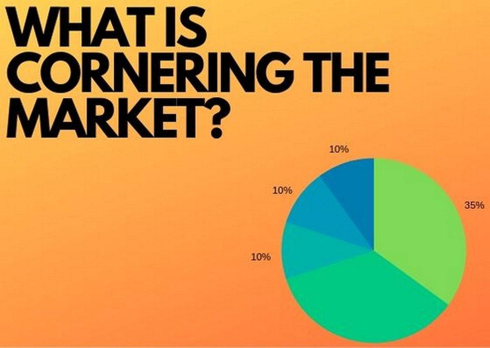

Market cornering is a trading strategy where a single entity gains significant control over a market, effectively manipulating prices to its advantage. In the context of algorithmic trading, this concept takes on new dimensions. By leveraging high-speed algorithms and vast data processing capabilities, traders can implement cornering strategies more efficiently and subtly. Understanding market cornering in today's financial markets is crucial, as it underscores the potential risks inherent in these highly automated trading environments.

The significance of apprehending market cornering lies in its profound impact on financial markets. Market manipulation, exemplified by cornering, can distort prices and mislead investors, ultimately undermining trust and economic stability. Such distortions can lead to misallocation of resources, heightened volatility, and financial crises. For investors, these manipulations can result in substantial financial losses, damage confidence, and create an unequal financial playing field.

The objectives of this article are to explore the definitions and strategies of market cornering, examine its legal implications, and analyze its intersections with algorithmic trading. We will address how regulatory frameworks seek to mitigate these risks and the role of technological innovations in detecting and preventing market manipulation. By understanding these aspects, stakeholders can better navigate the complexities of modern financial markets and promote fairness and transparency.

## Table of Contents

## Understanding Market Cornering

Market cornering refers to the strategic acquisition of sufficient control over a particular asset, commodity, or financial instrument to influence its price direction significantly. This manipulation strategy typically involves gaining a dominant market position to create artificial scarcity, compel buying or selling at manipulated prices, and distort market equilibrium to the advantage of the entity executing the strategy.

Historically, one of the most notable instances of market cornering was the attempt by the Hunt Brothers to corner the silver market during the late 1970s and early 1980s. The Hunt Brothers, wealthy oil tycoons, aggressively purchased large quantities of silver, amassing close to one-third of the world's non-governmental supply. Their accumulation led to a dramatic spike in silver prices, from around $6 per ounce in early 1979 to nearly $50 per ounce by January 1980. This artificial scarcity and the consequent surge in prices epitomize how market cornering can disrupt price stability.

Market cornering affects price and market equilibrium by creating asymmetric market conditions. In a cornered market, the dominant player has the leverage to dictate prices, often leading to significant disparity between the price and the intrinsic value of the commodity or asset. This situation is defined by the formula:

$$
P_{\text{cornered}} = P_{\text{equilibrium}} + \Delta P
$$

where $P_{\text{cornered}}$ denotes the price influenced by the corner, $P_{\text{equilibrium}}$ is the natural market price, and $\Delta P$ represents the artificial inflation or deflation induced by the cornering.

Legal and ethical concerns are integral to the discourse on market cornering. Such practices undermine market fairness and transparency, leading to adverse effects on market efficiency and investor trust. Regulatory bodies view market cornering as a form of market manipulation, prohibiting such activities through various laws and regulations to preserve the integrity of financial markets. The Commodity Exchange Act, leveraged by regulatory agencies, aims to prevent activities that distort market conditions. However, enforcing such laws requires constant vigilance and adaptation to evolving financial tactics.

In sum, while market cornering can yield substantial profits for those who successfully execute such strategies, it poses significant challenges to market fairness and integrity. Its impacts extend beyond immediate financial gain, affecting the broader ecosystem of market participants, regulatory frameworks, and economic stability.

## Commodity Trading and Market Manipulation

Commodity trading involves the buying and selling of raw physical goods, such as oil, natural gas, metals, and agricultural products. This type of trading is fundamental to global trade and economic activities but is prone to manipulation due to various factors such as market size, demand and supply fluctuations, and information asymmetry.

Market manipulation in commodity trading can significantly distort prices and disrupt equilibrium, thereby impacting investors and the broader economy. Two common tactics include 'cornering' and 'pumping and dumping'. 

'Cornering' occurs when an entity acquires a substantial position in a commodity to gain significant control over its supply. By holding a majority of a commodity, a trader can artificially inflate prices, forcing other market participants to buy or settle at elevated prices. A well-known historical example of cornering took place in 1979 and 1980, involving the Hunt Brothers' attempt to dominate the silver market. The brothers accumulated vast amounts of silver to create a squeeze on the market supply, which drove prices to unprecedented heights. However, when the market collapsed, it led to significant financial losses and prompted regulatory changes.

'Pumping and dumping', typically used in stock markets, can also apply to commodities. This strategy involves artificially inflating the price of a commodity through dissemination of misleading information, followed by the rapid selling off once a target price is reached, leaving unsuspecting investors with depreciated asset values.

Regulatory bodies like the Commodity Futures Trading Commission (CFTC) play a crucial role in monitoring and regulating commodity markets to prevent such manipulative practices. The CFTC oversees the futures and options markets in the United States, ensuring transparency and fairness. It enforces regulations to deter abusive practices and protect market integrity. The Dodd-Frank Wall Street Reform and Consumer Protection Act, aimed at reducing financial risk, is one of the legislative measures that enhance the regulatory framework to curb commodity manipulation.

The economic consequences of market manipulation extend beyond investor losses to destabilizing broader economic systems. When commodity prices deviate significantly from intrinsic values, it can lead to misallocation of resources, increased [volatility](/wiki/volatility-trading-strategies), and loss of market confidence. This instability can discourage investment and undermine economic growth, affecting sectors reliant on stable commodity prices. For instance, inflated oil prices can escalate production costs across multiple industries, triggering broader economic inflation.

Ultimately, the manipulation of commodity markets poses substantial risks, necessitating robust regulatory oversight and vigilance to safeguard market dynamics and uphold economic stability.

## Algorithmic Trading: The Invisible Hand

Algorithmic trading, also known as automated trading, involves using computer algorithms to execute trades based on predefined criteria. These algorithms, often capable of processing vast amounts of data far quicker than a human, have become a dominant force in modern financial markets. They enable high-frequency trading ([HFT](/wiki/high-frequency-trading-strategies)), where a large number of orders are executed within seconds, and are used by various market participants, including investment banks, hedge funds, and institutional investors.

Algorithms offer several advantages. They can identify market patterns and exploit [arbitrage](/wiki/arbitrage) opportunities more accurately and consistently than human traders. These systems facilitate increased market [liquidity](/wiki/liquidity-risk-premium) and reduced transaction costs, contributing positively to market efficiency. For instance, arbitrage algorithms can help bring prices in line across different markets, ensuring that financial instruments are fairly priced.

However, [algorithmic trading](/wiki/algorithmic-trading) can also be manipulative. Algorithms can be designed to engage in predatory trading practices like quote stuffing, spoofing, and layering, disrupting market dynamics. For example, quote stuffing involves flooding the market with a high number of orders quickly followed by cancellations, creating confusion and disrupting the operations of other traders. Spoofing entails placing orders with the intention of canceling them before execution, thereby manipulating market perceptions of supply and demand.

Noteworthy cases underscore the potential for failure and instability within algorithmic trading. A prime example is the Flash Crash of May 6, 2010, when the Dow Jones Industrial Average plunged about 1,000 points within minutes, only to recover shortly thereafter. Investigations revealed that algorithmic trades exacerbated the crash's severity by creating a feedback loop of selling pressure. Another example involves the Knight Capital Group incident in 2012, where a faulty algorithm led to unauthorized trades totaling around $7 billion in just 45 minutes, resulting in significant financial losses and hastening the company's downfall.

Recognizing these risks, financial authorities have discussed or implemented new regulations. Future regulatory landscapes may impose stricter requirements on pre-trade risk controls, real-time monitoring, and transparency to ensure that algorithmic trading does not undermine market integrity. Proposals for implementing circuit breakers and kill switches aim to halt trading during unusual market activities, protecting against events like the Flash Crash. Enhanced reporting requirements and audit trails of algorithmic decisions are also explored to improve oversight.

As the regulatory framework evolves, striking a balance between encouraging technological innovation and maintaining market stability will be crucial. Enhanced cooperation between international regulatory bodies could aid in achieving global consistency, minimizing the risk of regulatory arbitrage where firms gravitate towards the least stringent jurisdictions.

## The Intersection of Market Cornering and Algorithmic Trading

Algorithmic trading, the use of computer algorithms to automate trading decisions, has become a dominant force in modern financial markets. Its capabilities extend beyond simply executing trades rapidly; they offer sophisticated strategies for market manipulation, including market cornering. Market cornering in this context involves accumulating a significant share of a particular asset to manipulate its price. Algorithmic trading systems can be programmed to execute such strategies with precision and speed, further complicating the detection and regulation of market manipulation.

### Algorithmic Trading and Market Cornering

With the increasing use of algorithms, entities can efficiently identify arbitrage opportunities and execute a high [volume](/wiki/volume-trading-strategy) of trades across numerous markets. This efficiency enables traders to amass substantial positions in particular assets or derivatives quickly, thereby influencing market prices to their advantage. Algorithms can utilize strategies such as layering, spoofing, and front-running to facilitate market cornering. These strategies involve placing orders that are not intended to be executed but designed to create false impressions of market demand or supply.

For example, an algorithm might be set to rapidly buy up a commodity's futures contracts, creating an artificial shortage and driving up prices. The algorithm can then profit from these elevated prices by selling the contracts back at the peak when followed by planned sell-offs. This strategic coordinated trading behavior enhances the capacity for market cornering, presenting challenges for oversight bodies in monitoring and regulating such complex trading patterns.

### Challenges in Identifying Manipulative Algorithmic Trades

Regulators face significant obstacles in identifying and mitigating manipulation within algorithmic trading due to several factors. The sheer volume and speed of trades conducted by these systems generate large datasets that are difficult to monitor in real time. Detection requires advanced analytical tools and techniques capable of parsing through vast quantities of transaction data to uncover patterns indicative of manipulation. Furthermore, distinguishing between legitimate trading strategies and manipulative tactics remains inherently complex due to the subtlety with which algorithms execute trades across diverse asset classes and markets.

Existing regulatory frameworks may lack the necessary technological infrastructure and real-time surveillance capabilities to effectively differentiate between innocuous and predatory trading behaviors. As algorithmic trading systems evolve, they increasingly employ [machine learning](/wiki/machine-learning) and [artificial intelligence](/wiki/ai-artificial-intelligence), further obfuscating their actions and intentions, thereby requiring regulators to continually adapt their methodologies and technologies.

### Impact of Unchecked Algorithm-Driven Market Cornering

Should algorithm-driven market cornering go unchecked, its implications for market integrity are substantial. Market fairness could be significantly compromised, undermining trust among investors. Artificial price inflation or deflation can mislead investors about the fundamental value of assets, driving them to make ill-informed decisions. This erosion of investor confidence can result in reduced market participation, decreased liquidity, and heightened volatility. 

Moreover, systemic risks may elevate due to interdependencies and interconnectedness of modern financial markets. A failure within one segment, precipitated by manipulative practices, could cascade across multiple markets, exacerbating financial instability. Such occurrences underscore the need for vigilant oversight and the implementation of robust safeguards against market manipulation.

In conclusion, while algorithmic trading offers undeniable efficiencies and advantages in market dynamics, it also presents significant challenges when leveraged for market cornering and manipulation. The evolving sophistication of these algorithms necessitates continual advancements in regulatory frameworks and technological tools to preserve market integrity and equity.

## Legal and Ethical Implications

Market manipulation is prohibited by various legal frameworks designed to maintain integrity and transparency in financial markets. Key legislation includes the Securities Exchange Act of 1934 in the United States, which empowers the Securities and Exchange Commission (SEC) to regulate and enforce against manipulative practices. This act provides a crucial foundation for preventing market manipulation through its anti-fraud provisions and rules against deceptive practices in trading securities. For commodities, the Commodity Futures Trading Commission (CFTC) plays a similar role, guided by the Commodity Exchange Act, which regulates trading in futures and options markets.

Ethical responsibilities are fundamental in deterring market manipulation. Market participants, including traders, brokers, and institutional entities, have a duty to uphold ethical standards that promote fairness and transparency. Public awareness further aids in this effort by fostering an informed community capable of recognizing and reporting suspicious activities. Efforts to educate investors about the signs of manipulation and the mechanisms for reporting violations are critical in cultivating an environment of accountability.

Several cases highlight the enforcement of legal measures against market manipulation. The infamous case of Enron Corporation exposes how deceptive practices and false reporting can devastate investor confidence and market stability. Enron's manipulation of financial statements led to severe legal repercussions and reforms designed to prevent similar occurrences in the future. Another notable instance is the conviction of the trader Navinder Singh Sarao, whose illicit activities contributed to the 2010 "Flash Crash." His use of spoofing tactics — placing large orders with no intention of executing them — exemplified how sophisticated trading methods can be employed to manipulate market perceptions unlawfully.

Together, these legal frameworks and ethical guidelines work towards creating a balanced market environment that promotes trust and stability, essential for long-term economic prosperity.

## The Impact on Investors and Markets

Market manipulation has profound impacts on investors and the broader financial markets, often undermining the financial well-being of individual and institutional investors. Manipulative tactics, such as market cornering, can result in distorted prices, increased volatility, and diminished market trust.

The repercussions for investors can be severe. Manipulative practices may lead to artificial inflation or deflation of asset prices. Consequently, investors might make misguided decisions based on skewed market signals, resulting in significant financial losses. For instance, an investor purchasing a commodity that appears to be in high demand due to market cornering might face a sharp price collapse once the manipulation ceases.

Moreover, market manipulation undermines confidence in financial markets. When investors perceive that markets are not transparent or fair, they may withdraw their investments, seeking safer alternatives. This withdrawal can reduce market liquidity, further exacerbating price volatility and discouraging future participation.

To safeguard themselves from manipulation, investors can adopt several strategies. Diversification remains a fundamental approach to mitigate risk, spreading investments across various asset classes to reduce potential losses from any single manipulative episode. Conducting thorough research and staying informed about market trends and potential manipulative practices can also empower investors to make more informed decisions. Utilizing stop-loss orders can help manage risk, automatically selling off positions if the market moves against them beyond a pre-set threshold.

Historical instances of market cornering have shown long-term impacts on markets and investor confidence. The Hunt Brothers' attempt to corner the silver market in the late 1970s serves as a cautionary tale. Their actions led to a dramatic rise and fall in silver prices, resulting in substantial financial losses for numerous investors and contributing to tighter market regulations. Such events underscore the potential for market cornering to lead to widespread economic repercussions, influencing regulatory reforms aimed at enhancing market stability and investor protection.

In conclusion, understanding and addressing the impacts of market manipulation is crucial for both investors and market stability. Employing strategic protective measures and historical lessons can aid investors in navigating and mitigating the risks associated with market manipulation.

## Preventative Measures and Market Safeguards

Current regulatory strategies and technological tools play critical roles in combating market manipulation and ensuring fair trading environments. Regulatory bodies, such as the U.S. Securities and Exchange Commission (SEC) and the Commodity Futures Trading Commission (CFTC), have established robust frameworks to monitor trading activities and prevent manipulation. These frameworks include stringent reporting requirements, surveillance programs, and market analysis technologies designed to detect suspicious trading patterns.

One of the primary strategies involves the implementation of advanced data analytics and machine learning algorithms to monitor trading activities. These tools help in identifying anomalies and patterns indicative of manipulative behavior. For example, regulators utilize algorithms capable of analyzing vast amounts of market data in real-time to detect unusual price movements or trading volumes that could signal market cornering attempts.

Corporate governance and internal controls are equally important in preventing market manipulation. Firms are encouraged to establish comprehensive internal policies that promote transparency and accountability in trading practices. This includes setting up independent compliance departments responsible for continuously monitoring and reviewing trading activities to ensure adherence to legal and ethical standards. Strong governance frameworks also involve educating employees about the consequences of regulatory breaches and the importance of ethical trading practices.

Improving market transparency is essential for fostering fair trading environments. One recommendation is the utilization of blockchain technology for trade settlements. Blockchain's decentralized ledger system offers high levels of transparency and security, reducing the likelihood of data manipulation and enhancing trust among market participants. Additionally, enhancing the transparency of financial derivatives and over-the-counter (OTC) products through standardized reporting and clearing requirements can further mitigate the risks of manipulation.

Technological advancements, such as the use of artificial intelligence and big data, offer promising avenues for enhancing market integrity. These technologies can facilitate better detection and prevention of manipulative strategies by analyzing market behavior and predicting potential threats based on historical data. Introducing regulatory sandboxes where firms can test new technologies under regulatory guidance may also foster innovation while ensuring compliance with existing market standards.

In conclusion, combating market manipulation requires a multifaceted approach that combines regulatory oversight, technological innovation, and strong corporate governance. By adopting these measures, markets can enhance their fairness and transparency, ultimately protecting investors and maintaining economic stability.

## The Future of Market Fairness and Transparency

As global financial markets continue to evolve, maintaining fairness and transparency is paramount. Emerging trends in regulatory measures and technological innovations are poised to play a crucial role in safeguarding market integrity. 

Forecasting trends in regulations suggests a shift towards more comprehensive oversight mechanisms. Regulators are increasingly utilizing advanced data analytics to detect and combat market manipulation. Machine learning algorithms, for example, can identify suspicious trading patterns in real-time, potentially curbing manipulative behavior before it impacts the market. Moreover, cross-border regulatory cooperation is expected to become more pronounced, as financial markets are inherently global. Collaborative frameworks among regulatory bodies can enhance information sharing and harmonize enforcement actions, thereby bolstering market integrity.

Technological advancements are also set to transform how transparency is achieved in markets. Blockchain technology holds promise in enhancing transparency through its decentralized and immutable ledger system. Each transaction recorded on a blockchain is visible to all participants, making it difficult for any single entity to manipulate data without detection. Smart contracts, facilitated by blockchain, can automate and enforce compliance with regulatory standards, reducing the likelihood of malpractice.

Furthermore, other technologies such as artificial intelligence (AI) and big data analytics offer tools to analyze vast amounts of trading data quickly and accurately. These technologies can provide insights into market trends and anomalies, enabling regulators to act swiftly against potential abuses.

International cooperation remains essential in addressing market manipulation effectively. Markets do not adhere to national boundaries, and neither should the efforts to regulate them. Organizations such as the International Organization of Securities Commissions (IOSCO) are pivotal in promoting global regulatory standards. By fostering uniformity in regulations and practices, international cooperation can minimize regulatory arbitrage, where entities exploit differences in national regulations to engage in manipulative practices.

In conclusion, the future of market fairness and transparency is being shaped by a combination of forward-thinking regulatory strategies and cutting-edge technological solutions. As these elements converge, they promise to create a trading environment where market manipulation is significantly curtailed, and integrity is upheld, benefitting investors and the global economy alike.

## Conclusion

Market cornering, manipulation, and algorithmic trading represent critical aspects of modern financial markets, each contributing uniquely to market dynamics and posing distinct challenges for market integrity. Market cornering involves gaining substantial control over a particular commodity or security to manipulate its price. This practice distorts market equilibrium, leading to artificial inflation or deflation of prices. The historical context, such as the Hunt Brothers' attempt to corner the silver market, underscores the significant impact of these manipulative strategies on markets and economic stability.

Algorithmic trading, on the other hand, has become prevalent due to advancements in technology. While algorithms can enhance trading efficiency and liquidity, they can also facilitate manipulative activities when employed unethically. Instances like the 'Flash Crash' highlight the potential for systemic disruptions caused by algorithmic glitches or exploitative strategies. Therefore, maintaining vigilance and adhering to ethical practices are pivotal in sustaining market integrity.

Regulatory frameworks play a vital role in curbing these manipulative practices. By enforcing rules and implementing preventive measures, regulatory bodies aim to foster transparent and fair trading environments. However, isolated efforts are insufficient. The complex and interconnected nature of global markets necessitates cooperation among all stakeholders, including regulators, market participants, and technology developers, to effectively address these challenges.

In conclusion, a collaborative approach is essential to ensure fairness and transparency in markets. By prioritizing ethical trading practices and leveraging technological advancements responsibly, stakeholders can contribute to a healthier financial ecosystem, thereby safeguarding the interests of investors and preserving market stability.

## References & Further Reading

[1]: Hunt, M. (1981). ["Silver Thursday: Anatomy of a Market Corner."](https://en.wikipedia.org/wiki/Silver_Thursday) The Journal of Law & Economics, 24(1), 241-258.

[2]: Lewis, M. (2014). ["Flash Boys: A Wall Street Revolt."](https://en.wikipedia.org/wiki/Flash_Boys) W.W. Norton & Company.

[3]: Goldstein, M. A., & Kavajecz, K. A. (2004). ["Trading Strategies during Circuit Breakers and Extreme Market Movements."](https://www.sciencedirect.com/science/article/pii/S1386418103000442) The Journal of Financial Markets, 7(3), 301-333.

[4]: Hirschey, R. (2011). ["Do High-Frequency Traders Anticipate Buying and Selling Pressure?"](https://pubsonline.informs.org/doi/abs/10.1287/mnsc.2020.3608) Financial Markets, Institutions & Instruments, 20(2), 104-116.

[5]: U.S. Commodity Futures Trading Commission (CFTC). ["Testimony of Chairman Gary Gensler before the Senate Banking, Housing, and Urban Affairs Committee, May 25, 2010."](https://www.cftc.gov/PressRoom/PressReleases/9050-25)

[6]: Securities and Exchange Commission (SEC). (2019). ["Annual Report on Market and Credit Risk for Compliance Activities."](https://www.sec.gov/search-filings)

[7]: De Prado, M. L. (2018). ["Advances in Financial Machine Learning."](https://books.google.com/books/about/Advances_in_Financial_Machine_Learning.html?id=oU9KDwAAQBAJ) John Wiley & Sons.

[8]: Geisst, C. R. (2004). ["Wall Street: A History."](https://www.amazon.com/Wall-Street-Charles-R-Geisst/dp/0195170601) Oxford University Press.

[9]: Pirrong, C. (2011). ["The Economics of Commodity Trading Firms."](https://www.bauer.uh.edu/spirrong/economics-commodity-trading-firms.pdf) Trafigura's Research Series.