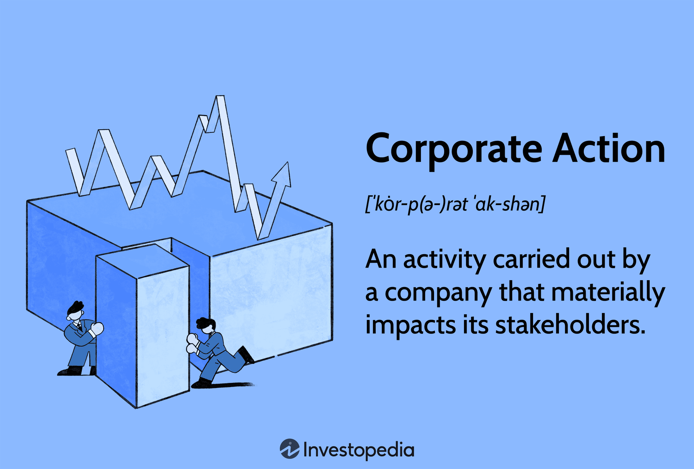

The financial market is a dynamic ecosystem shaped by various factors, among which corporate actions and algorithmic trading play significant roles. Corporate actions refer to strategic decisions made by a company that impact its financial structure and the interests of its shareholders. These actions, such as dividends and mergers, hold the power to significantly alter stock prices, thereby affecting investor portfolios. For instance, the announcement of a dividend may boost a stock's attractiveness, leading to increased demand and potentially higher stock prices. Similarly, mergers and acquisitions can create synergies that enhance shareholder value, often reflected in upward stock price movements.

Simultaneously, algorithmic trading has revolutionized financial markets by introducing data-driven strategies and automated decision-making processes. This form of trading employs advanced algorithms to analyze vast amounts of market data rapidly, allowing traders to execute trades with precision and speed that surpasses traditional methods. By leveraging strategies such as arbitrage, trend-following, and mean reversion, algorithmic trading exploits market inefficiencies and minimizes human errors arising from emotional biases.



Understanding these components is crucial for navigating the modern financial landscape, where the interplay between corporate actions and algorithmic trading can create complex market dynamics. This article explores the intersection of corporate actions, business finance, stock markets, and algorithmic trading, providing insights into how these factors influence market behavior and investor strategies. As technology and financial strategies continue to evolve, grasping these elements becomes increasingly essential for maintaining a competitive edge in the financial markets.

## Table of Contents

## Understanding Corporate Actions

Corporate actions represent significant decisions made by a company that critically impact its financial structure and the interests of its shareholders. These decisions can take various forms, such as stock splits, dividends, mergers, and acquisitions, each carrying different implications for shareholders and the overall market. 

Stock splits involve dividing existing shares into smaller units. While this action increases the number of shares available, it does not affect the company's market capitalization. For example, in a 2-for-1 stock split, each share is divided into two, effectively halving its market price, but doubling the share quantity held by investors. This can enhance liquidity by making shares more affordable to a wider range of investors, potentially increasing trading activity and altering the shareholder base.

Dividends are periodic payments made to shareholders, typically from a company's profits. They serve as a direct reward for investor support and often make a stock more attractive, as they offer a tangible return on investment beyond capital appreciation. Announcements of dividend issuance or changes can lead to stock price fluctuations, influenced by investor sentiment regarding the company's financial health and future prospects.

Mergers and acquisitions involve the consolidation of companies or assets. A merger occurs when two companies combine to form a new entity, while an acquisition involves one company purchasing another. These actions can create synergies by combining resources and expertise, frequently resulting in enhanced market power and improved operational efficiency. Consequently, they often lead to appreciation in stock value and might trigger shifts in the competitive landscape.

Corporate actions require meticulous planning and legal approval. They must receive consent from the company's board of directors, and in certain cases, shareholder approval is necessary, particularly for major actions like mergers and significant acquisitions. This necessitates a high degree of transparency and communication from the company to ensure stakeholders are adequately informed and involved in key decisions.

Furthermore, corporate actions can be categorized based on the level of shareholder involvement required. Mandatory corporate actions, such as automatic dividend payouts, don't necessitate any action from shareholders; they are implemented automatically. Voluntary corporate actions, such as rights issues, require shareholders to make a decision—typically whether to participate or not.

The impacts of corporate actions are diverse, influencing company valuation and altering investor sentiment. For instance, while a dividend might be seen as a positive indication of stability, a merger announcement might introduce uncertainty regarding integration processes. Accordingly, corporate actions are vital considerations for investors, as they can have profound effects on portfolio performance and risk management strategies. Understanding these actions and their implications is crucial in today's financial landscape for shareholders and analysts alike.

## Corporate Actions and Stock Market Impacts

Corporate actions can significantly affect stock prices and market perceptions in various ways. Understanding these impacts allows investors to make more informed decisions and anticipate market movements.

Dividends are a common corporate action where a company distributes a portion of its earnings to shareholders. This often results in increased stock attractiveness as it provides a direct financial benefit to investors. When a dividend is declared, it signals a company's robust financial health and profitability, often leading to an increase in stock demand. This heightened demand usually drives the stock price up, rewarding existing shareholders with higher capital appreciation potential. However, when a stock goes ex-dividend, its price typically decreases by the amount of the dividend distributed, reflecting the payout.

Stock splits involve dividing existing shares into multiple new shares, making them more accessible to retail investors by reducing the per-share price. Although stock splits do not affect a company's overall market capitalization, they enhance market [liquidity](/wiki/liquidity-risk-premium) by increasing the number of shares available for trading. For example, in a 2-for-1 split, a shareholder holding 100 shares priced at $100 each will end up with 200 shares worth $50 each. This move can attract additional small investors and potentially lead to an upward [momentum](/wiki/momentum) in stock price due to perceived affordability and subsequent increased demand.

Mergers and acquisitions are strategic corporate actions aimed at creating synergies that enhance business performance and shareholder value. By merging or acquiring another company, the entity seeks to expand its market reach, product lines, or operational efficiencies. This perceived potential for growth often results in an increase in stockholder value and a subsequent rise in stock price. The market responds positively to successful mergers and acquisitions when they promise cost savings, increased revenue streams, or competitive advantages. However, unsuccessful or hostile takeovers can lead to market [volatility](/wiki/volatility-trading-strategies) and investor skepticism.

Each corporate action presents specific implications for market dynamics and investor strategies. Investors might respond to these changes by rebalancing their portfolios to maximize gains or minimize losses. For instance, a dividend announcement might prompt income-seeking investors to increase their holdings in the stock, while a stock split might attract new investors looking for capital appreciation. In the case of mergers and acquisitions, astute investors analyze the potential for operational synergies and value creation before making investment decisions.

In conclusion, corporate actions significantly shape stock market behavior and investor sentiment. By influencing stock prices and market perception, these actions alter the economic landscape that investors must navigate. Understanding the mechanics and outcomes of corporate actions is crucial for developing effective investment strategies and optimizing portfolio returns.

## Business Finance: Strategic Implications

Corporate actions play a pivotal role in shaping a company's business strategy and financial planning. These actions, such as issuing dividends, executing stock splits, engaging in mergers or acquisitions, and conducting rights issues, can substantially impact a company's capital structure, liquidity, and market perception.

**Capital Structure and Liquidity Impacts**: Corporate actions directly influence a company’s capital structure—that is, the mix of debt and equity that a company uses to finance its operations. For example, issuing additional shares in a rights offering can dilute existing shareholdings but may also reduce leverage by increasing equity capital. Conversely, a share buyback reduces outstanding shares, potentially increasing earnings per share (EPS) but also increasing leverage if financed through debt. The impact on liquidity also needs consideration; actions like dividends provide immediate liquidity to shareholders, while mergers may require large cash outflows, impacting the company’s cash reserves.

**Strategic Finance Management**: The timing and structuring of corporate actions are critical to optimizing shareholder value. Financial managers must evaluate the cost-benefit scenarios of each action. The decision to issue dividends, for example, might be influenced by the company's current profitability and future investment opportunities. A well-timed acquisition could enhance a company’s market position, though it requires thorough due diligence to ensure it results in synergies rather than overpayment.

**Portfolio Reassessment**: Corporate actions necessitate reevaluation of investment portfolios. Investors might need to adjust their positions to maintain desired exposure levels or to capitalize on potential value creation. For instance, a stock split may increase stock liquidity and lead to a reevaluation of the stock’s potential upside in an investor’s portfolio. Similarly, following a merger or acquisition, investors may need to reassess the financial health and strategic direction of the newly formed entity.

**Analytical Evaluation**: Financial experts rigorously analyze potential outcomes of corporate actions. This involves assessing the impact on company performance metrics such as EPS, return on equity (ROE), and leverage ratios. They also consider qualitative factors, such as the strategic fit of an acquisition and its alignment with the company's long-term goals. Analysts often use financial models to project future performance under different corporate action scenarios.

Overall, corporate actions are not only tools for immediate financial adjustments but also pivotal for long-term strategic planning. The ability of a company to effectively manage such actions can determine its competitive standing and its attractiveness to current and potential investors.

## Algorithmic Trading: A Modern Approach

Algorithmic trading utilizes complex algorithms to make rapid and data-driven trading decisions within financial markets. These algorithms, developed by financial engineers and quantitative analysts, are designed to analyze vast amounts of market data, identify trends, and execute trades with precision, often within milliseconds. This technological advancement in trading strategies has transformed the landscape of financial markets, providing significant advantages over manual trading methods.

One of the key strategies employed in [algorithmic trading](/wiki/algorithmic-trading) is [arbitrage](/wiki/arbitrage). Arbitrage exploits price discrepancies across different markets or financial instruments. For example, if a stock is priced lower on one exchange than on another, an algorithm can quickly buy shares on the cheaper exchange and sell them on the more expensive one, generating a profit. The speed and efficiency of algorithms make such opportunities feasible, far beyond human capabilities.

Trend-following is another popular strategy, where algorithms are programmed to identify and follow market trends. These algorithms use indicators like moving averages to determine the optimal buying or selling points. The fundamental concept here is to capitalize on upward or downward trends, buying securities in rising markets and selling them in declining ones, thereby optimizing execution and returns.

Mean reversion is yet another strategic approach. This strategy is based on the assumption that asset prices will revert to their historical averages. Algorithms programmed for mean reversion analyze current price levels against historical data, detecting deviations and executing trades that anticipate a return to the mean. This approach requires precise mathematical modeling and historical analysis.

High-frequency trading ([HFT](/wiki/high-frequency-trading-strategies)) is a specialized subset of algorithmic trading characterized by executing a large number of orders very quickly. HFT strategies often involve fine-tuning algorithms to capture small price differentials at high speeds, usually within fractions of a second. The focus here is not just on strategy but on the infrastructure that supports such rapid-fire trading.

The automation inherent in algorithmic trading brings several benefits to traders and financial institutions. Firstly, it eliminates the emotional biases that often affect human traders, leading to more disciplined and consistent decision-making. Secondly, automation enhances execution efficiency, reducing the time between decision-making and trade execution. This efficiency is crucial in volatile markets, where prices can change rapidly.

The integration of [machine learning](/wiki/machine-learning) and [artificial intelligence](/wiki/ai-artificial-intelligence) into algorithmic trading systems has further enhanced their ability to process and interpret large datasets. These technologies enable algorithms to adapt to new patterns and evolving market conditions, improving their predictive accuracy and profitability over time.

Python, known for its robust libraries and versatility, is frequently used in developing and implementing algorithmic trading strategies. Libraries such as NumPy and pandas provide powerful tools for data manipulation and analysis, while machine learning libraries like scikit-learn facilitate the development of advanced predictive models. Here's a simple Python example illustrating a moving average crossover strategy:

```python
import pandas as pd

# Load market data
data = pd.read_csv('market_data.csv')
data['SMA_50'] = data['Close'].rolling(window=50).mean()
data['SMA_200'] = data['Close'].rolling(window=200).mean()

# Generate buy/sell signals
data['Signal'] = 0
data.loc[data['SMA_50'] > data['SMA_200'], 'Signal'] = 1  # Buy signal
data.loc[data['SMA_50'] < data['SMA_200'], 'Signal'] = -1 # Sell signal

# Execute trades based on signals
for i in range(1, len(data)):
    if data['Signal'][i] == 1 and data['Signal'][i-1] != 1:
        print(f"Buy on {data['Date'][i]}")
    elif data['Signal'][i] == -1 and data['Signal'][i-1] != -1:
        print(f"Sell on {data['Date'][i]}")
```

In conclusion, algorithmic trading has fundamentally altered how trading is conducted across global markets. By leveraging data-driven strategies and automation, it provides enhanced execution, robust risk management, and improved market efficiency, shaping the future of trading in significant and enduring ways.

## The Intersection of Corporate Actions and Algo Trading

Algorithmic traders actively monitor corporate actions, such as mergers, acquisitions, and dividend announcements, to exploit the resulting market reactions in search of profit opportunities. Given the rapid influx of information in financial markets, algorithmic trading systems excel in processing such data efficiently and responding swiftly, offering a significant edge in terms of timing and execution.

Corporate actions tend to introduce volatility to the market—price fluctuations that result from shifts in perceived company value or market sentiment. This volatility is typically beneficial for algorithmic trading strategies designed to capitalize on short-term price movements. For instance, when a company announces a merger, traders anticipate potential synergies that might drive up stock prices and adjust their algorithms to capture these price changes quickly.

To effectively harness these opportunities, algorithms can be programmed to incorporate historical data, analyzing past corporate action outcomes to predict future market behavior. For instance, algorithms may use past merger announcements and resultant stock price patterns to adjust current trading strategies. The ability to ingest and analyze vast datasets enables algorithms to derive patterns and signals that human traders might overlook, providing a decisive advantage.

Python, a popular language for developing trading algorithms, can be used to set up these strategies. Below is a basic example of a Python script that reacts to market announcements:

```python
import yfinance as yf  # For more datasets, visit: https://paperswithbacktest.com/datasets
import pandas as pd

# Function to fetch stock data
def fetch_stock_data(ticker):
    stock = yf.Ticker(ticker)
    return stock.history(period='1y')

# Simplistic strategy based on price jumps
def trading_strategy(stock_data):
    signals = pd.DataFrame(index=stock_data.index)
    signals['price'] = stock_data['Close']
    signals['signal'] = 0

    # Setting buy and sell signals based on price changes
    signals['signal'][1:] = np.where(signals['price'][1:] > signals['price'][:-1], 1, 0)

    return signals

# Example usage
ticker = "AAPL"
data = fetch_stock_data(ticker)
signals = trading_strategy(data)
print(signals.head())
```

This pattern of merging corporate actions with algorithmic strategies underscores the increasing reliance on advanced technology and data analytics in trading practices. The combination of computational power, algorithmic precision, and historical data provides a potent toolset for modern traders. As the financial landscape continues to evolve, the synergy between corporate actions and algorithmic trading will likely grow, enhancing both market liquidity and the effectiveness of trading strategies.

## Conclusion

Corporate actions and algorithmic trading are key elements influencing today's financial markets. Corporate actions, such as dividends, mergers, and acquisitions, directly affect stock valuations and investor sentiment. Algorithmic trading, on the other hand, utilizes automated, high-speed trading strategies to capitalize on these market shifts efficiently. Together, these elements form a pivotal part of modern financial dynamics.

Understanding the impact of corporate actions and algorithmic trading is crucial for investors seeking to make informed decisions. Recognizing how corporate events can alter market conditions allows investors to adjust their strategies accordingly, optimizing portfolio performance. Algorithmic trading offers a sophisticated toolset for navigating market complexities introduced by corporate actions. By deploying algorithms that can react swiftly to market changes, traders gain an edge in executing timely trades that can capitalize on corporate developments.

To maintain a competitive advantage, investors and financial professionals must stay informed about the interplay between corporate actions and algorithmic trading. This involves continual monitoring of corporate announcements and leveraging data analytics to anticipate potential market reactions. As technology continues to evolve, the synergy between corporate strategies and trading algorithms will become increasingly significant. Advanced technologies, such as machine learning and AI, will further enhance the predictive capabilities of trading systems, allowing for more precise anticipations of market responses to corporate actions.

In conclusion, the integration of corporate actions and algorithmic trading within financial markets underscores the importance of technological acumen and strategic insight. As these factors continue to shape financial landscapes, the ability to adapt and employ technologically advanced trading solutions will be instrumental in maintaining and enhancing investor performance.

## References & Further Reading

[1]: Bergstra, J., Bardenet, R., Bengio, Y., & Kégl, B. (2011). ["Algorithms for Hyper-Parameter Optimization."](https://dl.acm.org/doi/10.5555/2986459.2986743) Advances in Neural Information Processing Systems 24.

[2]: ["Advances in Financial Machine Learning"](https://www.amazon.com/Advances-Financial-Machine-Learning-Marcos/dp/1119482089) by Marcos Lopez de Prado

[3]: ["Evidence-Based Technical Analysis: Applying the Scientific Method and Statistical Inference to Trading Signals"](https://www.amazon.com/Evidence-Based-Technical-Analysis-Scientific-Statistical/dp/0470008741) by David Aronson

[4]: ["Machine Learning for Algorithmic Trading"](https://github.com/stefan-jansen/machine-learning-for-trading) by Stefan Jansen

[5]: ["Quantitative Trading: How to Build Your Own Algorithmic Trading Business"](https://www.amazon.com/Quantitative-Trading-Build-Algorithmic-Business/dp/1119800064) by Ernest P. Chan