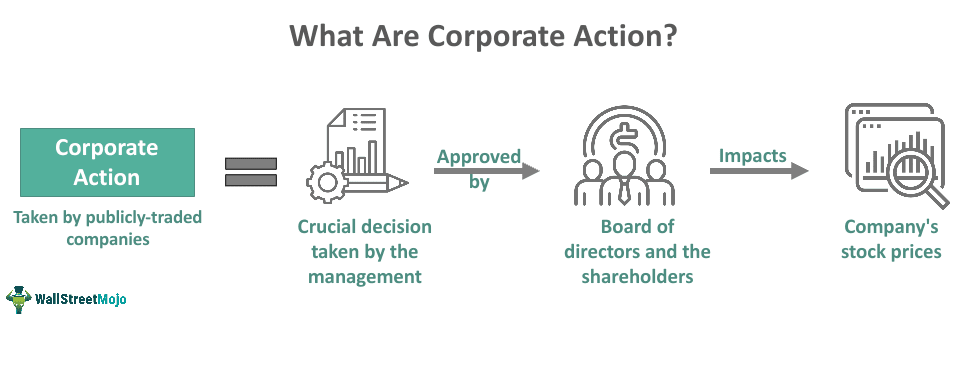

Corporate actions are pivotal occurrences within the financial sector, prompted by companies and bearing significant consequences for shareholders. These events are essential for investors to grasp, as they have the potential to affect a company's stock price, public perception, and overall financial stability. Understanding corporate actions is not only vital for retaining shareholder value but also for anticipating strategic opportunities and risks in securities trading.

Investors must be aware of how these corporate decisions could lead to variations in the market environment. For instance, a stock split can suddenly alter the number of shares, affecting both liquidity and investor sentiment. Likewise, dividends as a form of profit sharing can sway stock prices based on changes in investor outlook. Structural corporate changes through mergers or acquisitions can redefine company value and influence industry landscapes, impacting shareholder wealth in the process.

In today’s digitally transformed markets, algorithmic trading plays an increasingly significant role in how corporate actions manifest in real-time trading scenarios. These automated trading systems rapidly respond to data, encapsulating corporate events into strategic decisions to either capitalize on or protect against market fluctuations. The integration of technology into financial markets reshapes how investors interact with corporate actions, broadening the scope of analysis and response mechanisms.

This article aims to explore the types of corporate actions, examine their implications on shareholder rights, and consider the evolving role of algorithmic trading in an ever-complex financial terrain. Understanding these elements thoroughly equips investors to make informed decisions, leveraging opportunities presented by the interplay of corporate strategies and market forces.

## Table of Contents

## Understanding Corporate Actions

Corporate actions represent pivotal events that have significant effects on a company and its stakeholders. These events require the approval of the company's board of directors and can be broadly categorized into voluntary and mandatory actions. Voluntary corporate actions are those initiated by shareholders or the company, where shareholders have the option to respond. In contrast, mandatory actions are executed irrespective of shareholder approval, although shareholders are informed of the outcome.

Common examples of corporate actions include stock splits, dividends, mergers and acquisitions, rights issues, and liquidation. Each of these actions plays a specific role in altering the company’s capital structure, financial standing, or shareholder value.

**Stock Splits:** This involves dividing existing shares into multiple new shares to boost the liquidity of the stock. A two-for-one stock split means each existing share is split into two, doubling the number of shares while halving the price. Mathematically, if a company with 1 million shares at $100 performs a two-for-one split, it results in 2 million shares priced at $50 each.

**Dividends:** Dividends are a distribution of a portion of a company's earnings to its shareholders. They can be issued as cash payments, additional shares, or other forms. Dividends signal the company's profitability and stability, often influencing the stock price as investors react to dividend announcements. Cash dividends reduce company equity and may result in a proportionate decrease in share price to account for the dividend paid.

**Mergers and Acquisitions (M&A):** These actions involve the consolidation of companies or assets, often aiming to achieve economies of scale, expand market reach, or acquire new technology or talent. M&A can dramatically alter shareholder value and involve complex negotiations and regulatory approvals.

**Rights Issues:** This involves offering additional shares to existing shareholders at a discounted price, typically to raise capital for expansion or debt repayment. Shareholders have the right, but not the obligation, to purchase additional shares in proportion to their existing holdings. This can lead to dilution of share value if the existing shareholders choose not to exercise their rights.

**Liquidation:** This is the process of dissolving a company by selling its assets to pay off creditors. Any remaining funds are distributed to shareholders. Liquidation is usually seen as a last resort when a company is insolvent or unable to continue operations.

Understanding these various corporate actions is essential for stakeholders, as they significantly influence a company's strategic direction and its financial health. Investors and market participants must be aware of these actions to adequately assess the implications for shareholder value and make informed investment decisions.

## Types of Corporate Actions and Their Impacts

Corporate actions are events that result in significant impacts on a company's capital structure and market perception, usually requiring approval from a company's board of directors. Understanding these actions is critical for investors, as they can lead to shifts in stock prices and alter shareholder value. Here, we explore four types of corporate actions—stock splits, dividends, mergers and acquisitions (M&A), and rights issues—and their respective impacts.

### Stock Splits

A stock split increases the number of shares available by issuing more shares to existing shareholders without changing the company's market capitalization. For instance, a two-for-one stock split means each shareholder now holds twice the number of shares as before, while the price of each share is halved. This action can make the stock more attractive to smaller investors due to the perceived affordability, potentially increasing market [liquidity](/wiki/liquidity-risk-premium) and interest. Mathematically, the share price is divided by the split ratio, $P_{\text{new}} = \frac{P_{\text{old}}}{\text{Split Ratio}}$.

### Dividends

Dividends represent a distribution of a portion of a company’s earnings to shareholders, often in the form of cash or additional shares (stock dividends). The issuance of dividends can lead to a change in the company's stock price, as investors adjust to the reduced amount of equity in the company, since funds are diverted as shareholder payouts. The dividend yield, calculated as $\text{Dividend Yield} = \frac{\text{Annual Dividends per Share}}{\text{Price per Share}} \times 100\%$, helps investors assess the return received on the stock’s purchase price. Regular dividends may signal company strength and profitability, while the absence or reduction could stem from financial difficulties.

### Mergers and Acquisitions

Mergers and acquisitions occur when companies combine (merger) or one purchases another (acquisition), leading to consolidation within industries or expansion of company capabilities. These actions can significantly affect shareholder value, as they influence strategic direction, market positioning, and company financials. The impact can result in synergy benefits such as cost savings, increased market share, and enhanced competitive advantages. Shareholders of the acquired firm often receive a premium on their shares, while those in the acquiring firm may experience different outcomes depending on the success of the integration process.

### Rights Issues

Rights issues refer to the offering of additional shares to existing shareholders, typically at a discount, allowing companies to raise capital. Shareholders can either buy the new shares, often at a lower price than the current market rate, or sell their rights on the market. This action can lead to a dilution of share value if shareholders choose not to participate. The theoretical ex-rights price (TERP) can be calculated to estimate the new share price post-issue, $\text{TERP} = \frac{(\text{Market Value of Existing Shares} + \text{Funds Raised})}{\text{Total Shares Post-Issue}}$.

Each of these corporate actions carries specific implications for market behavior and shareholder value, making careful analysis and understanding essential for informed decision-making by investors.

## Shareholder Rights in Corporate Actions

Shareholders play a pivotal role in influencing and approving significant corporate actions such as mergers and substantial capital raises. These major corporate decisions often require shareholders’ approval, typically through voting processes at shareholder meetings. Shareholders possess critical rights, including the right to vote on changes that can markedly impact the future of the company, be it through mergers, acquisitions, or amendments to corporate governance.

Certain corporate actions can notably affect the intrinsic value and rights associated with shares. For instance, during a rights issue, shareholders have the privilege to purchase additional shares, often at a discounted rate, which can dilute their equity if not exercised. Similarly, mergers and acquisitions can lead to a reevaluation of a company’s stock value, potentially altering the market’s perception of share worth and impacting long-term shareholder wealth. Additionally, dividend announcements can directly affect shareholder returns, influencing investment decisions and overall financial strategy.

Understanding shareholder rights is paramount for investors aiming to safeguard their interests during substantial corporate transformations. Shareholders must be well-versed in the implications of different corporate actions to make informed decisions. For example, a merger that seems beneficial in the short term might pose long-term challenges, or a capital raise intended for expansion could dilute value but provide growth opportunities. Hence, astute shareholders engage critically with the details and rationales provided by the company, considering both immediate and future impacts, enabling them to vote wisely and protect their investments.

In summary, the knowledge of shareholder rights and the inherent implications of corporate actions empower investors. By grasping these elements, shareholders can better navigate their influence in corporate governance and adapt to changes that could significantly impact their holdings.

## Algorithmic Trading and Corporate Actions

Algorithmic trading employs sophisticated computer algorithms to automate trading decisions, allowing market participants to respond rapidly to corporate actions. Such actions can include stock splits, dividend announcements, and mergers and acquisitions, which can significantly affect a company's share price and market perception. By leveraging [algorithmic trading](/wiki/algorithmic-trading), firms can efficiently process large volumes of financial data and execute trades based on predefined criteria, aiming to capitalize on or mitigate risks associated with these corporate events.

These trading algorithms typically utilize a combination of market data analysis, statistical models, and historical information to predict and react to price movements. For instance, when a company announces a stock split, algorithmic systems can promptly adjust trading strategies to take advantage of potential shifts in shareholder interest and stock liquidity. Similarly, dividend declarations can prompt algorithms to reevaluate the stock's value, adjusting portfolios accordingly.

Algorithmic trading offers the advantage of speed and precision in decision-making, often outperforming manual trading processes. This rapid response is particularly crucial during corporate actions that may lead to volatile market conditions. Algorithms can be programmed to execute trades within milliseconds, exploiting transient market inefficiencies that may arise before the broader market adjusts to new information.

Moreover, algorithms can implement complex strategies to hedge against risks associated with corporate actions. For example, in mergers and acquisitions, algorithms can use event-driven strategies to anticipate the movement of stock prices based on the likelihood of the merger's success or failure.

As markets become more dynamic and corporate actions more frequent, the relevance of algorithmic trading continues to grow. Traders relying on these automated systems are better equipped to manage the rapid pace of modern financial markets, maintaining a competitive edge in executing trades driven by corporate actions. This fusion of technology and finance continuously reshapes market dynamics, emphasizing the importance of speed, accuracy, and strategic decision-making in contemporary trading environments.

## Conclusion

Corporate actions are significant occurrences in the financial landscape that demand close attention from investors. These events, such as dividends, stock splits, mergers, and acquisitions, can markedly influence stock value and alter shareholder rights. For investors, understanding corporate actions is crucial. This knowledge allows them to make strategic decisions, minimize risks, and take advantage of market movements. 

Strategically navigating corporate actions requires appreciating their potential impact on a company's share price and market position. For instance, a stock split may increase liquidity and make shares more attractive to investors, while mergers and acquisitions could redefine shareholder value by altering company structure and growth prospects. Dividends directly affect company equity, offering shareholders a share of the profits but also influencing the overall market perception.

With the rapid advancement of technology, algorithmic trading has introduced a transformative dimension to how corporate actions affect market dynamics. These automated systems can react instantaneously to corporate announcements, analyzing vast amounts of data to execute trades that capitalize on the resulting market shifts. By employing sophisticated algorithms, traders can either bet on the expected price movements post-corporate action or hedge exposure to potential adverse impacts.

As the role of technology in financial markets continues to grow, the ability to swiftly adapt to corporate actions through algorithmic trading becomes a critical asset. Thus, staying informed about company happenings, understanding their implications, and leveraging modern trading technologies are essential strategies for modern investors aiming to optimize their portfolio performance.

## References & Further Reading

[1]: ["Corporate Actions: A Guide to Securities Event Management"](https://books.google.com/books/about/Corporate_Actions.html?id=OMqdAR7av_EC) by Michael Simmons and Elaine Dalgleish

[2]: ["Algorithmic Trading: Winning Strategies and Their Rationale"](https://books.google.com/books/about/Algorithmic_Trading.html?id=WAlFDwAAQBAJ) by Ernest P. Chan

[3]: Agarwal, V., & Naik, N. Y. (2004). ["Risks and Portfolio Decisions Involving Hedge Funds."](https://academic.oup.com/rfs/article-abstract/17/1/63/1564388) The Review of Financial Studies, 17(1), 63-98.

[4]: Narang, R. K. (2009). ["Inside the Black Box: The Simple Truth About Quantitative Trading."](https://www.amazon.com/Inside-Black-Box-Quantitative-Trading/dp/0470432063) John Wiley & Sons.

[5]: ["Market Microstructure In Practice"](https://www.amazon.com/Market-Microstructure-Practice-Charles-Albert-Lehalle/dp/9813231122) by Jean-Philippe Bouchaud and Marc Potters