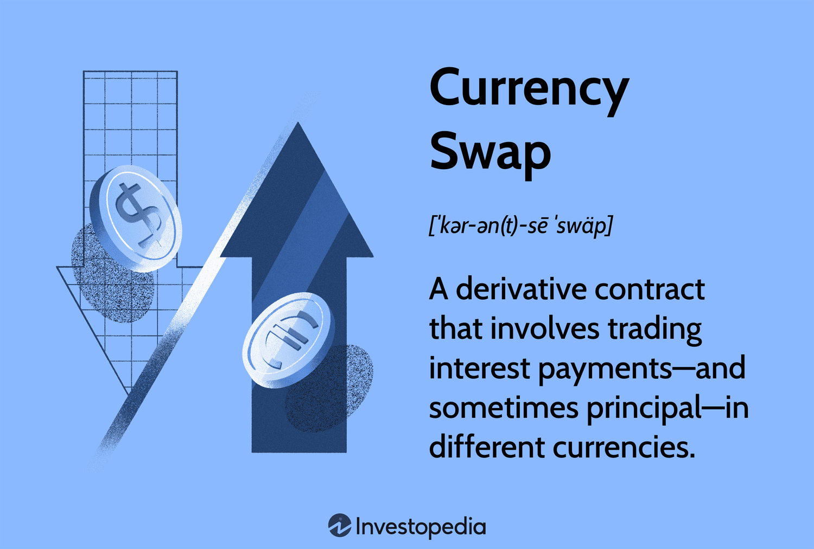

## Table of Contents

## What are interest rate swaps and currency swaps?

Interest rate swaps are financial agreements between two parties to exchange interest payments. One party agrees to pay a fixed interest rate, while the other pays a floating interest rate, which can change over time. This helps both parties manage their exposure to interest rate fluctuations. For example, a company with a loan that has a floating interest rate might use an interest rate swap to switch to a fixed rate, giving them more predictable payments.

Currency swaps are similar, but they involve exchanging principal and interest payments in different currencies. Two parties agree to swap cash flows in one currency for cash flows in another currency. This can be useful for companies that do business in multiple countries and want to manage their foreign exchange risk. For instance, a company might use a currency swap to convert a loan in one currency into another currency, helping them match their income and expenses in different countries.

## How do interest rate swaps work?

Interest rate swaps are agreements between two parties where they exchange interest payments. One party pays a fixed interest rate, and the other pays a floating interest rate. The fixed rate stays the same throughout the swap, but the floating rate can change based on market conditions. This helps both parties manage their interest rate risk. For example, a company might have a loan with a floating rate and wants to switch to a fixed rate for more predictable payments. They can enter into an interest rate swap to achieve this.

Here's how it works in practice: Let's say Company A has a $1 million loan with a floating interest rate, and Company B has a $1 million loan with a fixed interest rate. They agree to swap their interest payments. Company A will now pay Company B the fixed rate, and Company B will pay Company A the floating rate. The actual loan balances stay with each company, but the interest payments are exchanged. This way, Company A gets the predictability of fixed payments, while Company B might benefit if the floating rate goes down.

## How do currency swaps work?

Currency swaps are agreements between two parties to exchange both principal and interest payments in different currencies. Imagine Company A in the United States has a loan in US dollars, but they need to pay expenses in euros. They can enter into a currency swap with Company B in Europe, who has a loan in euros but needs US dollars. They agree to swap their loan payments, so Company A pays euros to Company B, and Company B pays US dollars to Company A. This helps both companies manage their foreign currency needs without having to convert their loans.

At the start of the swap, the two companies exchange the principal amounts in their respective currencies. For example, if the swap is for $1 million and €850,000, Company A gives $1 million to Company B, and Company B gives €850,000 to Company A. During the life of the swap, they exchange interest payments based on the agreed-upon rates. At the end of the swap, they exchange the principal amounts back, so Company A gets its $1 million back, and Company B gets its €850,000 back. This way, both companies can benefit from more stable cash flows in the currencies they need.

## Why would a corporation use interest rate swaps?

A corporation might use interest rate swaps to manage the risk of changing interest rates. Imagine a company has a loan with a floating interest rate, which means their payments can go up or down. If they want more predictable payments, they can use an interest rate swap to switch to a fixed rate. This means they know exactly how much they'll pay each month, which helps them plan their budget better.

Interest rate swaps can also help a corporation take advantage of better interest rates. For example, if a company has a loan with a high fixed interest rate, but they think floating rates will be lower, they can swap to a floating rate. This way, they might end up paying less interest overall. By using interest rate swaps, corporations can protect themselves from interest rate changes and possibly save money.

## Why would a corporation use currency swaps?

A corporation might use currency swaps to manage its money in different countries. Imagine a company in the United States needs to pay for things in Europe, but their loan is in US dollars. They can use a currency swap to exchange their US dollar payments for euro payments. This helps them match their income and expenses in different currencies, making it easier to manage their money without having to change their loans.

Currency swaps also help a corporation reduce the risk of currency changes. If the value of the US dollar goes down compared to the euro, it could cost the company more to buy euros. By using a currency swap, they can lock in a rate for exchanging dollars to euros, so they know exactly how much they'll need. This makes their financial planning easier and helps them avoid surprises from currency fluctuations.

## What are the risks associated with interest rate swaps?

Using interest rate swaps can be helpful, but they also come with some risks. One risk is that the interest rates might not go the way you expect. If you swap to a fixed rate thinking that floating rates will go up, but they actually go down, you'll end up paying more than if you had kept your original loan. This is called interest rate risk. Another risk is that the other party in the swap might not be able to make their payments. This is called counterparty risk. If they can't pay, you're still on the hook for your loan payments.

There's also the risk of the swap not matching your needs perfectly. For example, if your loan has a different schedule or amount than the swap, you might end up with some payments that don't cancel out. This is called basis risk. Lastly, using swaps can make your financial situation more complex. If you don't fully understand how they work, you might make a mistake that costs you money. It's important to carefully consider these risks before deciding to use an interest rate swap.

## What are the risks associated with currency swaps?

Using currency swaps can be helpful, but there are some risks to think about. One risk is that the exchange rate between the two currencies might change in a way you didn't expect. If the currency you're swapping into loses value compared to your original currency, you might end up paying more than you planned. This is called currency risk. Another risk is that the other party in the swap might not be able to make their payments. This is called counterparty risk. If they can't pay, you'll still need to make your payments in the other currency, which could be a problem.

There's also the risk that the swap might not match your needs perfectly. For example, if the amounts or timing of the swap payments don't line up with your loan payments, you might end up with some payments that don't cancel out. This is called basis risk. Finally, using currency swaps can make your financial situation more complex. If you don't fully understand how they work, you might make a mistake that costs you money. It's important to carefully consider these risks before deciding to use a currency swap.

## How can interest rate swaps improve a company's financial strategy?

Interest rate swaps can help a company's financial strategy by giving them more control over their loan payments. If a company has a loan with a floating interest rate, their payments can change and make it hard to plan their budget. By using an interest rate swap, they can switch to a fixed interest rate. This means they know exactly how much they'll pay each month, which makes their financial planning easier and more predictable.

Also, interest rate swaps can help a company save money. If a company thinks that floating interest rates will be lower than their fixed rate loan, they can swap to a floating rate. This way, they might pay less interest over time. By using interest rate swaps, a company can protect itself from interest rate changes and possibly save money, making their financial strategy stronger and more flexible.

## How can currency swaps be used to manage foreign exchange risk?

Currency swaps can help a company manage foreign exchange risk by allowing them to exchange payments in different currencies. Imagine a company in the United States that needs to pay for things in Europe, but their loan is in US dollars. They can use a currency swap to switch their US dollar payments to euro payments. This way, they can match their income and expenses in different currencies without having to change their loans. By doing this, the company can avoid the risk of the US dollar losing value compared to the euro, which could make their payments more expensive.

Using a currency swap also helps a company plan better because they can lock in a rate for exchanging dollars to euros. This means they know exactly how much they'll need in euros, even if the exchange rate changes. This makes their financial planning easier and helps them avoid surprises from currency fluctuations. By using currency swaps, a company can manage their foreign exchange risk and keep their finances more stable.

## What are the accounting implications of using interest rate and currency swaps?

When a company uses interest rate or currency swaps, it has to follow certain accounting rules to record these swaps on its financial statements. For interest rate swaps, the company needs to track the fair value of the swap over time. If the swap is used to hedge against interest rate changes, the company can use hedge accounting, which means they can match the gains or losses from the swap with the changes in the value of the loan they're hedging. This helps keep their financial statements more stable. If the swap isn't used for hedging, the company has to record any changes in the swap's value as gains or losses on their income statement right away, which can make their profits look more up and down.

For currency swaps, the accounting is a bit more complex because it involves different currencies. At the start of the swap, the company records the exchange of principal amounts at the current exchange rate. During the life of the swap, they record the interest payments in the different currencies, using the exchange rate on the date of each payment. If the swap is used to hedge against currency changes, the company can use hedge accounting to match the gains or losses from the swap with the changes in the value of the foreign currency payments they're hedging. If it's not used for hedging, any changes in the swap's value due to exchange rate changes have to be recorded as gains or losses on the income statement, which can affect the company's reported profits.

## How do regulatory requirements affect the use of interest rate and currency swaps?

Regulatory requirements can have a big impact on how companies use interest rate and currency swaps. After the 2008 financial crisis, governments and financial regulators made new rules to make these swaps safer. One big change is that many swaps now have to be traded on public exchanges instead of privately. This makes it easier for regulators to keep an eye on what's happening. Also, companies often have to report more details about their swaps, which means more paperwork and costs.

Another important rule is that companies might need to put up more money, called collateral, when they do swaps. This is to make sure they can pay if something goes wrong. These rules can make swaps more expensive and harder to use, but they also make the financial system safer. So, when a company is thinking about using swaps, they have to think about these rules and how they might affect their plans.

## What advanced strategies can corporations employ with interest rate and currency swaps?

Corporations can use interest rate and currency swaps in smart ways to make their money work better. For interest rate swaps, a company might use a strategy called a "basis swap," where they swap one type of floating rate for another. This can help them take advantage of differences between different floating rates, like the difference between the LIBOR and the prime rate. Another strategy is called a "swaption," which is like an option to do a swap later. This can be useful if a company thinks interest rates might change a lot in the future, and they want to be ready.

For currency swaps, a company might use a "cross-currency basis swap" to swap payments in one currency for payments in another, but with different interest rates. This can help them take advantage of better interest rates in different countries. Another advanced strategy is to use multiple swaps at the same time, called a "swap network." This can help a company manage payments in many different currencies and hedge against changes in exchange rates in a more complex way. By using these advanced strategies, companies can manage their money more effectively and protect themselves from big changes in interest rates and exchange rates.

## What is the understanding of Interest Rate and Currency Swaps?

Interest rate swaps are financial derivatives in which two parties exchange cash flows based on interest payments for a specified principal amount. Typically, one party pays a fixed interest rate, while the other pays a floating rate, such as LIBOR (London Interbank Offered Rate) plus a spread. This exchange allows entities to manage interest rate exposure by converting a fixed-rate obligation into a floating-rate one or vice versa. The primary goal is to capitalize on anticipated movements in interest rates to achieve more favorable financing conditions.

In a typical interest rate swap, the fixed and floating rates are predefined, and payments are exchanged at regular intervals. The net effect of an interest rate swap can be mathematically represented as follows:

$$
\text{Net Payment} = (\text{Fixed Rate} - \text{Floating Rate}) \times \text{Notional Principal} \times \frac{\text{Days in Period}}{360}
$$

Currency swaps, on the other hand, involve the exchange of principal and interest payments in different currencies. These swaps are instrumental in hedging currency risk or accessing more favorable borrowing conditions available in foreign markets. A standard currency swap consists of a series of cash flow exchanges where the initial principal amount in one currency is swapped for an equivalent amount in another currency. Over the life of the swap, each party pays interest on the principal received in the counterparty's currency. At maturity, the principal amounts are re-swapped at the original rate.

Currency swaps provide distinct advantages, such as stabilizing cash flows affected by currency fluctuations and potentially reducing borrowing costs by taking advantage of lower interest rates in another currency. Additionally, they can be used to refashion the currency profile of a firm's liabilities without altering its balance sheet structure.

Both [interest rate](/wiki/interest-rate-trading-strategies) and currency swaps are vital in hedging financial risks and restructuring debt portfolios to diminish uncertainties in corporate finance. By leveraging these swaps, organizations can efficiently adapt to varying economic conditions and improve their overall financial strategies.

## How can swaps be leveraged in corporate finance?

Interest rate and currency swaps are integral tools in corporate finance, enabling firms to efficiently manage their financial risks and enhance their strategic financial planning. Through these financial derivatives, corporations can adeptly navigate the complexities of debt obligations, cash flow stabilization, and exchange rate hedging. The strategic use of swaps allows organizations to optimize their capital structures and align their financial strategies with prevailing market conditions.

Interest rate swaps enable companies to exchange variable interest rate cash flows for fixed interest rate cash flows or vice versa. This exchange provides the advantage of stabilizing a company’s interest expenses and shielding it from rate fluctuations. For instance, a corporation might have a variable rate loan that exposes it to interest rate [volatility](/wiki/volatility-trading-strategies). By entering into an interest rate swap, the company can convert its variable interest payments into fixed ones, ensuring predictable financial outlays. The mathematical representation of a basic interest rate swap can be depicted as follows:

$$
\text{Net Swap Payment} = (\text{Fixed Rate} - \text{Floating Rate}) \times \text{Notional Principal}
$$

Currency swaps, on the other hand, allow companies to trade cash flows in different currencies, effectively hedging against exchange rate volatility and accessing preferable borrowing rates internationally. For example, a U.S. corporation with euro-denominated incoming cash flows might engage in a currency swap to convert these to U.S. dollars, thereby mitigating currency risk while leveraging potential interest rate differentials. 

Swaps also provide corporations with the capability to secure more attractive borrowing conditions in international markets. For corporations operating in multiple geographies, this is particularly beneficial. By utilizing currency swaps, these companies can achieve lower interest rates than those prevailing in their domestic markets or manage their exposure to fluctuating exchange rates more effectively. This strategic use of currency swaps is essential for entities that require funding across different currencies but wish to manage the risk associated with exchange rate movements.

Moreover, these swaps are pivotal in aligning financial strategies with market trends. Firms can adjust their asset-liability profiles in response to shifts in interest rates or foreign exchange markets, ensuring that their financial strategies are attuned to current and anticipated conditions. This flexibility is invaluable in sustaining competitive advantage and achieving long-term financial goals.

In conclusion, the employment of interest rate and currency swaps serves as a robust mechanism for corporations to fine-tune their financial strategies, enhance operational efficiency, and secure favorable borrowing conditions across global markets. Through the strategic deployment of these derivatives, firms are better equipped to withstand financial uncertainties and capitalize on opportunities presented by dynamic market environments.

## References & Further Reading

[1]: ["Interest Rate Swaps and Other Derivatives"](http://students.aiu.edu/submissions/profiles/resources/onlineBook/N2D3C5_Interest_Rate_Swaps_and_Their_Derivatives.pdf) by Howard Corb

[2]: ["Currency Swaps"](https://www.investopedia.com/terms/c/currencyswap.asp) by Paul Davidson

[3]: ["Algorithmic Trading: Winning Strategies and Their Rationale"](https://www.amazon.com/Algorithmic-Trading-Winning-Strategies-Rationale-ebook/dp/B00CY5HC0U) by Ernie Chan

[4]: Sundaram, R. K., & Das, S. R. (2016). "Derivative Securities: Principles and Practice" (2nd Edition). McGraw-Hill Education.

[5]: McDonald, R. L. (2013). ["Derivatives Markets"](https://www.amazon.com/Derivatives-Markets-3rd-Pearson-Finance/dp/0321543084) (3rd Edition). Pearson Education.

[6]: ["Swap Execution Facilities: SEF Rules Under Dodd-Frank and the Future of Swaps Trading"](https://www.cftc.gov/IndustryOversight/TradingOrganizations/SEF2/index.htm) by Gabriel D. Rosenberg. Notre Dame Law Review.

[7]: Hull, J. C. (2018). ["Options, Futures and Other Derivatives"](https://www.semanticscholar.org/paper/Options%2C-Futures%2C-and-Other-Derivatives-Hull/89bdee500c8623864fc9eb7a471546aa713acc44) (9th Edition). Pearson.

[8]: "Algorithmic Trading and High-Frequency Trading." Commodity Futures Trading Commission. https://www.cftc.gov/IndustryOversight/Technology/AlgorithmicTrading/index.htm