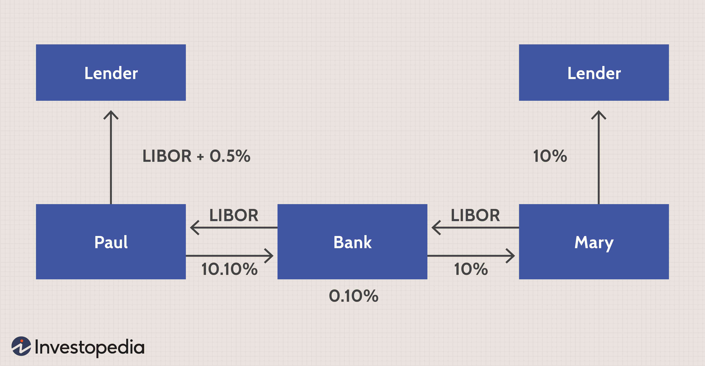

Interest rate swaps and currency swaps are integral instruments within corporate finance designed to mitigate the financial risks arising from interest rate variability and currency exchange rate shifts. These swaps serve as fundamental tools for corporations, governments, and financial institutions, aiding them in effectively maneuvering through the complexities of global markets.

Interest rate swaps involve the exchange of cash flows between two parties based on varying interest payment arrangements, often converting fixed interest obligations to floating rates or vice versa. This technique is particularly beneficial for organizations aiming to hedge against interest rate volatility. Similarly, currency swaps facilitate the exchange of principal and interest payments across different currencies, thus helping entities manage currency exposure and access more advantageous borrowing environments internationally.



In recent years, advancements in technology have significantly transformed the execution of swap transactions. The advent of algorithmic trading has ushered in new levels of efficiency and opportunity within the swap markets. By utilizing sophisticated computer algorithms, market participants can execute trades with enhanced speed and precision, reducing transaction costs while improving liquidity. This technological integration not only optimizes trading processes but also enhances the ability to manage risks effectively in an ever-fluctuating market landscape.

This article examines the convergence of interest rate swaps, currency swaps, corporate finance, and algorithmic trading, highlighting their collective significance and the opportunities they present. From risk management and cost optimization to strategic financial planning, these financial instruments and technological advancements together shape the contemporary approach to managing financial challenges in an interconnected global economy.

## Table of Contents

## Understanding Interest Rate and Currency Swaps

Interest rate swaps are financial derivatives in which two parties exchange cash flows based on interest payments for a specified principal amount. Typically, one party pays a fixed interest rate, while the other pays a floating rate, such as LIBOR (London Interbank Offered Rate) plus a spread. This exchange allows entities to manage interest rate exposure by converting a fixed-rate obligation into a floating-rate one or vice versa. The primary goal is to capitalize on anticipated movements in interest rates to achieve more favorable financing conditions.

In a typical interest rate swap, the fixed and floating rates are predefined, and payments are exchanged at regular intervals. The net effect of an interest rate swap can be mathematically represented as follows:

$$
\text{Net Payment} = (\text{Fixed Rate} - \text{Floating Rate}) \times \text{Notional Principal} \times \frac{\text{Days in Period}}{360}
$$

Currency swaps, on the other hand, involve the exchange of principal and interest payments in different currencies. These swaps are instrumental in hedging currency risk or accessing more favorable borrowing conditions available in foreign markets. A standard currency swap consists of a series of cash flow exchanges where the initial principal amount in one currency is swapped for an equivalent amount in another currency. Over the life of the swap, each party pays interest on the principal received in the counterparty's currency. At maturity, the principal amounts are re-swapped at the original rate.

Currency swaps provide distinct advantages, such as stabilizing cash flows affected by currency fluctuations and potentially reducing borrowing costs by taking advantage of lower interest rates in another currency. Additionally, they can be used to refashion the currency profile of a firm's liabilities without altering its balance sheet structure.

Both [interest rate](/wiki/interest-rate-trading-strategies) and currency swaps are vital in hedging financial risks and restructuring debt portfolios to diminish uncertainties in corporate finance. By leveraging these swaps, organizations can efficiently adapt to varying economic conditions and improve their overall financial strategies.

## Leveraging Swaps in Corporate Finance

Interest rate and currency swaps are integral tools in corporate finance, enabling firms to efficiently manage their financial risks and enhance their strategic financial planning. Through these financial derivatives, corporations can adeptly navigate the complexities of debt obligations, cash flow stabilization, and exchange rate hedging. The strategic use of swaps allows organizations to optimize their capital structures and align their financial strategies with prevailing market conditions.

Interest rate swaps enable companies to exchange variable interest rate cash flows for fixed interest rate cash flows or vice versa. This exchange provides the advantage of stabilizing a company’s interest expenses and shielding it from rate fluctuations. For instance, a corporation might have a variable rate loan that exposes it to interest rate [volatility](/wiki/volatility-trading-strategies). By entering into an interest rate swap, the company can convert its variable interest payments into fixed ones, ensuring predictable financial outlays. The mathematical representation of a basic interest rate swap can be depicted as follows:

$$
\text{Net Swap Payment} = (\text{Fixed Rate} - \text{Floating Rate}) \times \text{Notional Principal}
$$

Currency swaps, on the other hand, allow companies to trade cash flows in different currencies, effectively hedging against exchange rate volatility and accessing preferable borrowing rates internationally. For example, a U.S. corporation with euro-denominated incoming cash flows might engage in a currency swap to convert these to U.S. dollars, thereby mitigating currency risk while leveraging potential interest rate differentials. 

Swaps also provide corporations with the capability to secure more attractive borrowing conditions in international markets. For corporations operating in multiple geographies, this is particularly beneficial. By utilizing currency swaps, these companies can achieve lower interest rates than those prevailing in their domestic markets or manage their exposure to fluctuating exchange rates more effectively. This strategic use of currency swaps is essential for entities that require funding across different currencies but wish to manage the risk associated with exchange rate movements.

Moreover, these swaps are pivotal in aligning financial strategies with market trends. Firms can adjust their asset-liability profiles in response to shifts in interest rates or foreign exchange markets, ensuring that their financial strategies are attuned to current and anticipated conditions. This flexibility is invaluable in sustaining competitive advantage and achieving long-term financial goals.

In conclusion, the employment of interest rate and currency swaps serves as a robust mechanism for corporations to fine-tune their financial strategies, enhance operational efficiency, and secure favorable borrowing conditions across global markets. Through the strategic deployment of these derivatives, firms are better equipped to withstand financial uncertainties and capitalize on opportunities presented by dynamic market environments.

## The Role of Algorithmic Trading in Swap Markets

Algorithmic trading, also known as algo trading, uses advanced algorithms to enhance the execution of swap trades, significantly impacting market dynamics, particularly in terms of [liquidity](/wiki/liquidity-risk-premium) and cost efficiency. The integration of computational algorithms enables traders to process vast amounts of data rapidly, executing complex swap transactions with precision and speed. This technological advancement streamlines operations, minimizes human errors, and enables significant reductions in transaction costs by automating traditional trading processes.

Algo trading systems can dynamically adjust trading strategies based on real-time data inputs, such as interest rate movements, currency price fluctuations, and macroeconomic indicators. This capacity for adaptability is crucial in volatile markets where conditions can change rapidly, impacting swap valuations. For instance, an algorithm might deploy statistical [arbitrage](/wiki/arbitrage) techniques, identifying pricing discrepancies across different market segments to capitalize on fleeting arbitrage opportunities.

One of the primary advantages of [algorithmic trading](/wiki/algorithmic-trading) in swap markets is the enhancement of risk management capabilities. By continuously analyzing market data, algorithms can identify potential risks and implement pre-programmed strategies to mitigate these risks effectively. This real-time risk management allows market participants to maintain financial stability even amidst unpredictable market conditions.

Moreover, the speed at which algorithmic trading operates facilitates rapid execution of swap transactions. This swift execution is particularly critical in efficiently exploiting arbitrage opportunities that might arise from temporary market inefficiencies. These opportunities typically involve the simultaneous purchase and sale of similar assets across different markets, taking advantage of price differentials. Algorithms can automate this process, ensuring transactions are executed within milliseconds, faster than any human trader could achieve.

The use of algorithms in swap trading also encourages greater market participation by providing increased transparency and consistency in trade execution. This transparency is further enhanced by digital platforms that allow participants to access real-time swap pricing and market depth. By providing a more level playing field, algorithmic trading democratizes access to swap markets, thereby fostering competition and market growth. 

In conclusion, the role of algorithmic trading in swap markets is pivotal in optimizing trading efficiency, enhancing liquidity, reducing transaction costs, and effectively managing risks. As swap markets continue to evolve, the integration of sophisticated algorithmic techniques will likely become even more crucial, offering new strategic opportunities for market participants to capitalize on emerging trends in financial markets.

## Risk Management and Regulatory Considerations

Swaps, encompassing both interest rate and currency swaps, are financial derivatives that present several inherent risks for participants. Effective management of these risks is essential to preserve financial stability.

One prominent risk in swap transactions is counterparty risk, which refers to the possibility that one party to the swap could default on their contractual obligations. This default risk necessitates robust risk assessment procedures prior to entering swap agreements. To mitigate counterparty risk, participants often rely on collateralization, netting arrangements, and the involvement of central counterparties, which guarantee swap transactions and decrease the exposure to counterparty risk.

Market risk constitutes another significant concern. It arises from fluctuations in interest rates and exchange rates that could unfavorably affect the expected cash flows of swaps. For instance, an unexpected rise in interest rates could result in higher payments for the party paying a floating rate in an interest rate swap. Participants employ risk management strategies such as scenario analysis and value-at-risk models to anticipate adverse market movements and protect against potential losses.

Liquidity risk, which is the risk of not being able to enter or [exit](/wiki/exit-strategy) swap positions at favorable terms, due to a lack of market participants, is another critical [factor](/wiki/factor-investing). This risk is particularly relevant in turbulent market conditions where liquidity may dry up, making it challenging to unwind swap positions without incurring significant costs. Maintaining sufficient capital reserves and access to diverse funding sources are strategies generally employed to manage liquidity risk.

Regulatory considerations play a pivotal role in addressing these risks. Key regulatory frameworks such as the Dodd-Frank Act in the United States and the European Market Infrastructure Regulation (EMIR) in Europe, have established stringent rules for reporting and managing swap transactions. The Dodd-Frank Act mandates central clearing for most swaps and requires trade reporting to increase transparency in the derivatives market. EMIR similarly obligates counterparties to clear standardized over-the-counter (OTC) derivative contracts through central counterparties and report all derivative contracts to trade repositories.

Compliance with these regulatory frameworks helps in mitigating systemic risks and enhancing market integrity. Participants in swap markets must implement effective compliance programs and reporting practices to align with these regulations. This ensures that swaps are executed within a stable and transparent environment, ultimately contributing to a well-functioning financial system.

## Future Trends in Swaps and Algo Trading

The transition from the London Interbank Offered Rate (LIBOR) to alternative benchmark rates is substantially affecting swap pricing and liquidity. This shift necessitates adaptation within the financial markets. LIBOR, historically used in various financial instruments, is being replaced by rates like the Secured Overnight Financing Rate (SOFR) in the United States, Sterling Overnight Index Average (SONIA) in the United Kingdom, and other regional alternatives. These rates reflect overnight borrowing costs, leading to potentially lower volatility compared to LIBOR, but they also bring challenges in pricing longer-term instruments like swaps. The market's transition to these new benchmarks will require updated pricing models and risk management strategies to accommodate changes in liquidity and valuation adjustments.

Technological progress, particularly in [machine learning](/wiki/machine-learning) and blockchain, is poised to transform swap markets by enhancing transparency and efficiency. Machine learning algorithms can process vast amounts of market data, enabling better predictive analytics and risk assessment, thus facilitating more accurate pricing and hedging strategies in swaps. For instance, machine learning models could predict interest rate movements or credit spreads with greater precision, allowing traders to make informed decisions.

Here is an example in Python using a simple machine learning model to predict interest rates:

```python
from sklearn.model_selection import train_test_split
from sklearn.linear_model import LinearRegression
import pandas as pd

# Assuming 'data' is a Pandas DataFrame with historical interest rate data
data = pd.read_csv('interest_rate_data.csv')
X = data[['feature1', 'feature2', 'feature3']]  # Specify appropriate features
y = data['interest_rate']

X_train, X_test, y_train, y_test = train_test_split(X, y, test_size=0.2, random_state=42)

model = LinearRegression()
model.fit(X_train, y_train)

predictions = model.predict(X_test)
```

Blockchain technology can further enhance transparency and efficiency by securing transaction records and facilitating real-time settlement and clearing processes. This would reduce counterparty risk and increase auditability, thus bolstering trust among market participants.

As interest rate and currency swaps continue to evolve, their integration with algorithmic trading systems is expected to rise. Algorithmic trading enables rapid trade execution and can identify arbitrage opportunities through real-time data analysis. This integration will offer new strategic opportunities, such as executing complex cross-currency swaps with minimal execution risk and improved cost efficiency.

In summary, the future of swaps and algo trading is characterized by adaptation to new benchmark rates, the incorporation of cutting-edge technologies like machine learning and blockchain, and increasingly sophisticated algorithmic trading strategies. Market participants who can leverage these trends effectively will likely find new avenues for growth and efficiency.

## Conclusion

Interest rate and currency swaps continue to be crucial instruments for managing financial risks, including interest rate fluctuations and currency exchange exposures. They serve as powerful tools for optimizing corporate finance strategies by providing firms with mechanisms to hedge against potential market volatilities. The strategic application of these swaps allows for a more predictable financial terrain, enabling corporations to focus on operational efficiencies and long-term growth.

Algorithmic trading plays a significant role in swap markets by improving trade execution and liquidity. These computational methods leverage vast amounts of data to identify optimal trading opportunities, reduce transaction costs, and increase market efficiency. However, the implementation of algorithmic trading introduces complexities in risk management, necessitating a robust framework to address issues such as counterparty risk, operational risk, and market volatility. Effective risk management practices are essential to exploit the benefits of automated trading technologies fully.

The swap markets are dynamically evolving, spurred by technological advancements and regulatory changes. The shift from the London Interbank Offered Rate (LIBOR) to alternative benchmark rates is one such change that demands market participants to reassess pricing models and liquidity strategies. Innovations in technology, such as machine learning and blockchain, present new possibilities for enhancing transparency, efficiency, and risk management. As financial landscapes transform, continuous adaptation and a thorough understanding of these instruments' nuances are imperative for leveraging swaps effectively in contemporary finance. This ongoing evolution promises new strategic opportunities, making it crucial for corporations, financial institutions, and regulators to stay informed and agile in an ever-changing environment.

## References & Further Reading

[1]: ["Interest Rate Swaps and Other Derivatives"](http://students.aiu.edu/submissions/profiles/resources/onlineBook/N2D3C5_Interest_Rate_Swaps_and_Their_Derivatives.pdf) by Howard Corb

[2]: ["Currency Swaps"](https://www.investopedia.com/terms/c/currencyswap.asp) by Paul Davidson

[3]: ["Algorithmic Trading: Winning Strategies and Their Rationale"](https://www.amazon.com/Algorithmic-Trading-Winning-Strategies-Rationale-ebook/dp/B00CY5HC0U) by Ernie Chan

[4]: Sundaram, R. K., & Das, S. R. (2016). "Derivative Securities: Principles and Practice" (2nd Edition). McGraw-Hill Education.

[5]: McDonald, R. L. (2013). ["Derivatives Markets"](https://www.amazon.com/Derivatives-Markets-3rd-Pearson-Finance/dp/0321543084) (3rd Edition). Pearson Education.

[6]: ["Swap Execution Facilities: SEF Rules Under Dodd-Frank and the Future of Swaps Trading"](https://www.cftc.gov/IndustryOversight/TradingOrganizations/SEF2/index.htm) by Gabriel D. Rosenberg. Notre Dame Law Review.

[7]: Hull, J. C. (2018). ["Options, Futures and Other Derivatives"](https://www.semanticscholar.org/paper/Options%2C-Futures%2C-and-Other-Derivatives-Hull/89bdee500c8623864fc9eb7a471546aa713acc44) (9th Edition). Pearson.

[8]: "Algorithmic Trading and High-Frequency Trading." Commodity Futures Trading Commission. https://www.cftc.gov/IndustryOversight/Technology/AlgorithmicTrading/index.htm