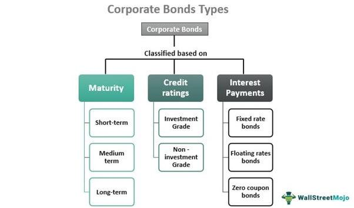

The landscape of corporate finance is dynamic and complex, with bonds serving as a foundational element in debt issuance and financing. Corporate bonds, as debt securities, allow companies to raise significant capital, facilitating various strategic initiatives such as expansion, acquisitions, and refinancing. By issuing bonds, corporations can access the financial markets to secure funds that might otherwise be unavailable or too costly through traditional bank loans.

Corporate bonds are instrumental in broadening financial markets, providing both issuers and investors with diverse opportunities for engagement. They act as a vital tool for companies seeking to balance their capital structures, offering an alternative to equity that ensures existing ownership stakes remain intact. This creates a symbiotic relationship between corporations needing capital and investors seeking relatively stable, fixed-income returns.



In recent years, the advancement of technology has significantly impacted financial markets, notably through the advent of algorithmic trading. This innovation has transformed the trading of corporate bonds, ushering in enhanced efficiency, accuracy, and speed. Algorithmic trading systems are adept at handling large volumes of trades, optimizing pricing, and improving market liquidity, which are crucial for a robust and resilient financial ecosystem.

As we explore these interconnected elements, we consider their contributions to corporate growth and stability. Understanding how corporations utilize bonds for financing and how algorithmic trading reshapes bond markets provides insight into the current state and future direction of finance. These trends also signal shifts in market dynamics, influenced by technological integration and evolving investor strategies, which are pivotal for participating entities to navigate a competitive financial landscape effectively.

## Table of Contents

## Understanding Corporate Bonds

Corporate bonds are a fundamental component of corporate finance, serving as a mechanism for companies to secure funds necessary for growth, operational needs, and strategic initiatives. These bonds are debt securities, representing a company's commitment to repay borrowed capital with a predetermined interest rate over a specified period. This financing method offers companies an alternative to issuing equity, which involves sharing ownership and future profits with investors.

### Characteristics of Corporate Bonds

1. **Fixed Income Returns**: Corporate bonds typically offer a fixed return, making them a popular choice for risk-averse investors seeking predictable income. Unlike equities, bonds do not fluctuate with a company's profits or losses, providing a stable investment avenue. 

2. **Term Structure**: The maturity of corporate bonds can range from short-term (less than five years) to long-term (up to 30 years or more). The term impacts the interest rate (coupon rate), with longer-term bonds generally offering higher rates to compensate for increased risks, including interest rate changes and market volatility.

3. **Credit Risk and Ratings**: Creditworthiness is a critical aspect influencing a corporate bond's attractiveness. Independent rating agencies such as Moody's, Standard & Poor's (S&P), and Fitch assess the issuer's financial health, assigning ratings that reflect the default risk. Ratings range from high-quality investment grades (e.g., AAA, AA) to lower-quality, higher-yielding speculative grades (e.g., BB, B).

4. **Callable and Convertible Bonds**: Corporate bonds may have special features, such as being callable or convertible. Callable bonds allow the issuer to repay the debt before maturity, often used when interest rates decline. Convertible bonds provide the bondholder an option to convert bonds into a predetermined number of the issuer's shares, blending debt with equity benefits.

### Bond Structuring and Issuance

Corporate bonds are structured through agreements known as indentures, detailing terms of the bond issue, including the [interest rate](/wiki/interest-rate-trading-strategies), payment schedules, maturity date, and any covenants or clauses. Companies may issue bonds in various forms, including unsecured or secured bonds—secured bonds being backed by specific assets as collateral.

The issuance process involves underwriting arrangements with financial institutions, which help set the initial price and manage the selling process to investors. The underwritten bonds are then marketed either publicly or through private placements, depending on the company's strategic financial objectives.

### Role in Investment Strategies

In fixed-income investment strategies, corporate bonds provide diversification, balancing portfolios with a mix of risk-adjusted returns. They are often juxtaposed with government bonds, offering higher yield potentials due to the increased risk associated with corporate default. Investors manage their bond holdings through laddering strategies—the staggering of bonds over various maturities—or focusing on ratings to align with risk appetite and investment horizon.

By understanding these elements, investors can better navigate the corporate bond market, leveraging fixed returns for portfolio stability while companies capitalize on this financing avenue to bolster operational and strategic initiatives.

## Bond Issuance and Debt Financing

Issuing bonds is a strategic tool that companies can utilize to achieve capital funding without the constraints typically associated with bank loans. This form of debt financing allows companies the flexibility to pursue diverse projects and expansions without the adverse effect of equity dilution. Unlike issuing new stock, which can dilute ownership and control, bonds offer companies the capital they need while maintaining existing ownership structures.

Bonds are generally structured as fixed-income securities, providing holders with periodic interest payments, known as coupons, and the return of principal at maturity. The terms of these bonds, including the interest rate, maturity date, and covenants, are tailored to both the issuer's and the investor's requirements. Companies can issue bonds of varying durations, from short-term notes to long-term bonds extending over decades, to match their strategic financing timelines.

The dynamics of bond issuance are significantly influenced by current market conditions and interest rates. In a low-interest-rate environment, companies might be more inclined to issue bonds since the cost of borrowing is lower. Conversely, when interest rates rise, the cost of borrowing through bonds increases, impacting a company's decision to issue debt. Market sentiment and investor demand for bonds also influence the rates and terms achievable by the issuing corporation.

A crucial aspect of bond issuance is the relationship between the company and its investors. Building strong investor relations involves transparent communication regarding the company’s financial health, growth prospects, and the risks associated with the bond issue. Companies often work with investment banks to underwrite and distribute bonds, leveraging their expertise in reaching suitable investors and ensuring successful issuance.

The creditworthiness of a company heavily dictates the terms and success of bond issuance. Ratings agencies assess and assign credit ratings, which signal to investors the level of risk associated with a particular bond. A higher credit rating usually allows a company to issue bonds at lower interest rates, benefiting both the company and the investors who prefer lower-risk investments. Therefore, maintaining a strong credit rating is a key consideration for companies planning to issue bonds.

In summary, bond issuance serves as a versatile and sometimes preferable option for corporate debt financing, offering benefits in terms of flexibility and cost. Companies must navigate market conditions, investor expectations, and regulatory environments to successfully leverage bonds in their capital strategies.

## The Rise of Algorithmic Trading in Debt Markets

Algorithmic trading has significantly transformed the landscape of debt markets, leveraging cutting-edge technology to increase trading efficiency in bond markets. At its core, [algorithmic trading](/wiki/algorithmic-trading) involves using complex mathematical models and software tools to execute trades at optimal times and prices, often at speeds beyond human capability. This shift has had profound implications for the pricing and [liquidity](/wiki/liquidity-risk-premium) of corporate bonds, benefiting both issuers and investors.

Historically, bond trading was characterized by manual processes, broker dependency, and limited transparency. Algorithms utilize vast datasets to enhance market analyses and decision-making processes, thus improving the pricing accuracy of corporate bonds. By integrating historical price data, real-time market information, and predictive models, algorithms dynamically adjust to market conditions, providing more accurate pricing models.

Liquidity in bond markets, traditionally more fragmented compared to equities, is notably enhanced through algorithmic trading. Automated systems can handle large volumes of trades, matching buy and sell orders efficiently across multiple platforms, thus reducing the liquidity premium typically associated with corporate bonds. The continuous bid-ask spread tightening facilitated by these algorithms makes it easier for investors to enter and [exit](/wiki/exit-strategy) positions without causing significant price disruptions.

Numerous algorithmic strategies are employed in bond markets to maximize trading efficiency:

1. **Arbitrage Strategies**: Algorithms exploit price differentials across different markets or instruments, enabling traders to buy bonds in one market where prices are relatively lower and simultaneously sell in another market where prices are higher, thus pocketing the difference.

2. **Trend-Following Strategies**: By analyzing historical price movements and using statistical methods to identify patterns, algorithms predict future price trends, allowing for strategic buying or selling of bonds to capitalize on these anticipated movements.

3. **Machine Learning Models**: Advanced machine learning techniques, including neural networks and reinforcement learning, are increasingly applied to forecast bond price movements based on complex, non-linear relationships in financial data.

4. **Liquidity Provision Algorithms**: These are designed to provide continuous liquidity by quoting buy and sell prices, profiting from the spread and mitigating market risk through hedging strategies.

The integration of algorithmic trading in debt markets is not without challenges. The complexity of these systems can lead to heightened [volatility](/wiki/volatility-trading-strategies), especially in times of market stress, as automated strategies may react to market movements in unanticipated ways. Additionally, the reliance on technological infrastructure necessitates robust system reliability to prevent failures and ensure uninterrupted market operations.

Despite these challenges, the continued advancement and refinement of algorithmic trading strategies are expected to further revolutionize bond markets, aligning them more closely with the efficiencies seen in equity markets. As technology progresses, the role of [artificial intelligence](/wiki/ai-artificial-intelligence) and [machine learning](/wiki/machine-learning) in developing even more sophisticated predictive models will likely increase, further enhancing the efficiency and accessibility of corporate bond markets for all participants.

## Benefits and Challenges of Algo Trading

Algorithmic trading, often abbreviated as algo trading, has transformed debt markets through its ability to execute trades at unprecedented speed and with remarkable precision. This form of trading leverages mathematical models and algorithms to automate the process of buying and selling securities, including corporate bonds, thereby enhancing market efficiency.

One of the primary benefits of algorithmic trading is its ability to significantly improve market liquidity. Liquidity refers to the ease with which an asset can be bought or sold in the market without affecting its price. By automating the trading process, algorithms facilitate a higher frequency of transactions, thus providing more opportunities for traders and investors to enter and exit the market. An example of improved liquidity through algo trading is evident in the U.S. corporate bond market, where automated systems account for an increasing proportion of daily trading volumes, thereby narrowing the bid-ask spreads and stabilizing prices.

In addition to liquidity, algorithmic trading enhances cost efficiency. By automating processes that were traditionally manual, firms can reduce transaction costs and minimize the risk of human error. The precision of algorithmic models also allows for better pricing strategies, as they can incorporate vast data sets and complex analytics to determine optimal entry and exit points.

However, despite its advantages, algorithmic trading introduces several challenges. One significant challenge is the potential for increased market volatility. Since algorithmic systems can react to market conditions in milliseconds, they may inadvertently contribute to rapid and large price swings, especially during periods of market stress. This was famously illustrated during the 2010 Flash Crash, where high-frequency trading algorithms contributed to a sudden and severe drop in market value, only to rebound shortly after.

Another concern is system reliability. The reliance on technology for executing trades means that a system failure or malfunction can have severe consequences, potentially leading to significant financial losses. To mitigate these risks, firms must implement robust risk management and oversight mechanisms. Balancing human oversight with automated processes is crucial to ensuring that algorithms operate within intended parameters and do not exacerbate market instability.

Code for Backtesting Algo Trading Strategy in Python:

```python
import numpy as np
import pandas as pd
import matplotlib.pyplot as plt

def backtest_algo_strategy(prices, signal, capital=10000):
    positions = capital / prices[0] * signal
    portfolio = positions * prices
    return portfolio[-1] - capital

# Mock daily price data and trading signal
prices = np.random.normal(100, 1.5, 252)  # 252 trading days, mean=100, std=1.5
signal = np.random.choice([0, 1], 252)  # 0 = no trade, 1 = buy

final_gain = backtest_algo_strategy(prices, signal)
print(f"Final Portfolio Gain: ${final_gain:.2f}")

plt.plot(prices, label='Daily Prices')
plt.plot(signal * max(prices) * 0.9, label='Trade Signal', linestyle='--', alpha=0.5)
plt.legend()
plt.title('Backtest of Simple Algo Trading Strategy')
plt.show()
```

In conclusion, while algorithmic trading presents significant benefits such as speed, efficiency, and liquidity to debt markets, the associated risks like volatility and system failures require careful management. Balancing these challenges with the advantages ensures that both investors and companies can harness the potential of algorithmic trading in a continuously evolving financial landscape.

## Future Trends in Bond Markets

Emerging technologies are poised to significantly transform the landscape of bond markets. Artificial intelligence (AI) and machine learning are at the forefront of this transformation, enabling the development of sophisticated trading models that can process large volumes of data to identify trading opportunities with greater precision. These technologies provide tools for predictive analytics and risk assessment, potentially improving the efficiency with which bond portfolios are managed.

AI and machine learning algorithms can analyze historical bond data, assess market sentiment from a variety of sources, and continuously learn from new data inputs to refine trading strategies. For instance, machine learning models can be implemented in Python using libraries such as TensorFlow or PyTorch to predict bond price movements based on historical trends and real-time market indicators. Such algorithms can be utilized to perform tasks like clustering similar bonds together or classifying bonds based on credit risk levels, enhancing the decisiveness of trading strategies.

In addition to AI, blockchain technology is emerging as a crucial component, offering the promise of increased transparency and efficiency in bond transactions. By leveraging blockchain, bond issuance and trading can be streamlined to facilitate quicker settlements and reduce operational risks. Smart contracts, which execute transactions automatically when pre-defined conditions are met, could replace much of the manual processing associated with bond trading, thereby reducing the likelihood of errors and fraud. This could lead to a reduction in transaction costs and foster greater market participation.

The integration of these technologies is not without its challenges, primarily in terms of regulatory considerations and the potential alteration of market structures. Regulators may need to devise new frameworks to oversee the increased use of AI and blockchain, ensuring that transparency and fairness are maintained. Issues such as data privacy, the robustness of AI models, and the security of blockchain systems will be central to regulatory discussions. Furthermore, these technological advancements could lead to market transformations, where traditional roles within bond markets may evolve or become obsolete, necessitating a shift in skills and job functions.

Overall, as AI, machine learning, and blockchain continue to mature, they are expected to usher in a new era of efficiency and transparency in bond markets. Stakeholders, including issuers, investors, and regulators, must prepare for these changes by understanding the implications of these technologies and adapting their strategies and policies accordingly.

## Conclusion

Corporate bonds and algorithmic trading stand at the forefront of innovation in the financial sector, reflecting the complex interplay between traditional financial instruments and cutting-edge technology. These elements are emblematic of how the financial landscape is transforming, driven by both historical precedents and technological advancements. 

Corporate bonds have long been a pillar of debt financing, offering companies a means to secure capital without directly impacting shareholders' equity. These instruments provide a reliable source of fixed income for investors, while enabling corporates to undertake significant growth initiatives. The bond markets, however, are not static. They are increasingly influenced by sophisticated trading methodologies that leverage technology to optimize execution and efficiency.

Algorithmic trading, in particular, exemplifies how technology can be harnessed to enhance market efficiency. Through the use of complex algorithms and high-frequency trading systems, market participants can achieve unprecedented levels of precision and speed. This not only reduces transaction costs but simultaneously improves liquidity, making the markets more accessible and attractive to a broader range of investors. Nevertheless, while offering substantial benefits, algorithmic trading poses challenges such as potential increased volatility and the need for robust system reliability.

Understanding the intricate dynamics between corporate bonds and algo trading is crucial for stakeholders who aim to maintain a competitive edge in the evolving financial landscape. Investors and companies alike must remain agile, adapting to these advancements to seize new opportunities for growth and enhanced efficiency. As financial markets continue to integrate artificial intelligence, machine learning, and blockchain technologies, the potential for innovation and evolution remains substantial. The future of bond markets will likely be characterized by increased sophistication, necessitating a continued commitment to adapting strategies and frameworks in response to these transformative trends. By embracing these changes, market participants can better position themselves to capitalize on the evolving opportunities within the global financial marketplace.

## References & Further Reading

1. **Fabozzi, F. J. (2000).** *Bond Markets, Analysis, and Strategies*. This book provides an in-depth understanding of the structure and dynamics of bond markets, including corporate bonds and their role in financial strategies.

2. **Mishkin, F. S. (2018).** *The Economics of Money, Banking, and Financial Markets*. This text offers insights into the fundamentals of financial markets, exploring the function and impact of bonds in corporate financing.

3. **Hull, J. C. (2017).** *Options, Futures, and Other Derivatives*. A comprehensive guide to financial derivatives, including discussions on bonds and interest rate derivatives crucial for managing credit risk.

4. **Christensen, P. O., & Feltham, G. A. (2009).** "Equity Valuation and Analysis", Journal of Accounting Research. This paper provides valuable methodologies for assessing the creditworthiness and valuation of various debt securities.

5. **Chlistalla, M., & Henke, C. (2010).** “Algorithmic Trading in Global Financial Markets: How to harness the power of algo trading in the financial market’s largest playing field”, Deutsche Bank Research. This industry report offers an overview of algorithmic trading trends, strategies, and their impact on bond markets.

6. **Narang, R. K. (2013).** *Inside the Black Box: A Simple Guide to Quantitative and High-Frequency Trading*. An accessible introduction to the strategies and technologies used in quantitative trading, with applications in bond market liquidity.

7. **IOSCO (International Organization of Securities Commissions) (2010).** *Regulatory Issues Raised by the Impact of Technological Changes on Market Integrity and Efficiency*. A report on the implications of technological advances in trading, including algorithmic trading.

8. **Brigo, D., & Mercurio, F. (2006).** *Interest Rate Models – Theory and Practice: With Smile, Inflation and Credit*. This book investigates into mathematical models used to price interest rate derivatives and bonds.

9. **Li, B., & Hu, Y. (2017).** “Machine Learning in Bond Trading: A Case Study”, Journal of Financial Markets. A study on how machine learning techniques are being applied to assess bond pricing and enhance trading strategies.

10. **European Commission (2021).** *Blockchain and Digital Identity: An Overview of the European Landscape*. This report examines the role of blockchain technologies in financial markets, assessing implications for future bond trading infrastructures.

11. **CITI GPS (2016).** *Digital Disruption: How FinTech is Forcing Banking to a Tipping Point*. Industry insights on how fintech innovations, including blockchain and AI, are transforming traditional banking and finance practices, pertinent to debt issuance.

12. **Biais, B., Foucault, T., & Moinas, S. (2015).** “Equilibrium High Frequency Trading”, Econometrica. This paper discusses the equilibrium impacts of high-frequency trading on market stability, relevant to bond and equity markets alike.